# EstateWise Architecture

This document describes the comprehensive end-to-end architecture for EstateWise, spanning frontend UI, backend services, API protocols (REST, tRPC, gRPC), data and graph pipelines, AI/ML systems, MCP tooling, agentic orchestration, IDE extensions, and CI/CD infrastructure.

## System Overview

EstateWise is a full-stack, monorepo AI/ML chatbot and data analytics platform built for real estate in Chapel Hill, NC and surrounding areas. The architecture employs a microservices-oriented design with multiple API protocols, distributed data stores, and sophisticated AI orchestration.

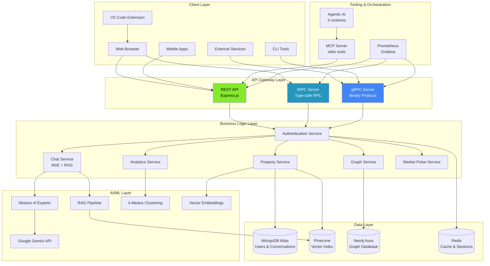

## Repository Structure

```
EstateWise-Chapel-Hill-Chatbot/
├── backend/                    # Express + TypeScript API server
│   ├── src/
│   │   ├── controllers/       # Request handlers
│   │   ├── models/           # MongoDB schemas
│   │   ├── routes/           # API routes
│   │   ├── services/         # Business logic
│   │   ├── middleware/       # Auth, logging, errors
│   │   ├── trpc/            # tRPC implementation
│   │   │   ├── routers/     # tRPC routers
│   │   │   └── trpc.ts      # Context & procedures
│   │   └── server.ts         # Main entry point
├── frontend/                  # Next.js + React application
│   ├── app/                  # Next.js 13+ app directory
│   ├── components/           # React components
│   ├── lib/                  # Utilities & API clients
│   └── public/               # Static assets
├── grpc/                      # gRPC service implementation
│   ├── proto/                # Protocol buffer definitions
│   │   └── market_pulse.proto
│   ├── src/
│   │   ├── server.ts         # gRPC server
│   │   └── services/         # Service implementations
├── mcp/                       # Model Context Protocol server
│   ├── src/
│   │   ├── server.ts         # MCP stdio server
│   │   └── tools/            # Tool implementations
├── agentic-ai/                # Multi-agent orchestration
│   ├── src/
│   │   ├── agents/           # Agent implementations
│   │   ├── orchestrator/     # Default runtime
│   │   ├── lang/             # LangGraph runtime
│   │   └── index.ts          # CLI entry
│   └── crewai/               # Python CrewAI runtime
├── extension/                 # VS Code extension
├── terraform/                 # Infrastructure as Code
├── aws/                      # AWS deployment configs
├── azure/                    # Azure deployment configs
├── gcp/                      # GCP deployment configs
├── kubernetes/               # K8s manifests
└── hashicorp/                # Consul/Nomad configs
```

## API Protocols

EstateWise implements three complementary API protocols to serve different use cases:

### REST API (Primary)
- **Protocol**: JSON over HTTP/1.1
- **Use Cases**: Public API, mobile apps, third-party integrations
- **Documentation**: OpenAPI/Swagger at `/api-docs`
- **Authentication**: JWT tokens in Authorization header

### tRPC (TypeScript-first)
- **Protocol**: JSON over HTTP with type inference
- **Use Cases**: Web frontend, internal TypeScript services
- **Benefits**: End-to-end type safety, auto-completion, no code generation
- **Endpoint**: `/trpc/*`

### gRPC (High-performance)
- **Protocol**: Protocol Buffers over HTTP/2
- **Use Cases**: Service-to-service, streaming, cross-language clients
- **Port**: 50051
- **Services**: MarketPulseService with unary and streaming RPCs

## Core Services Architecture

### Authentication Service

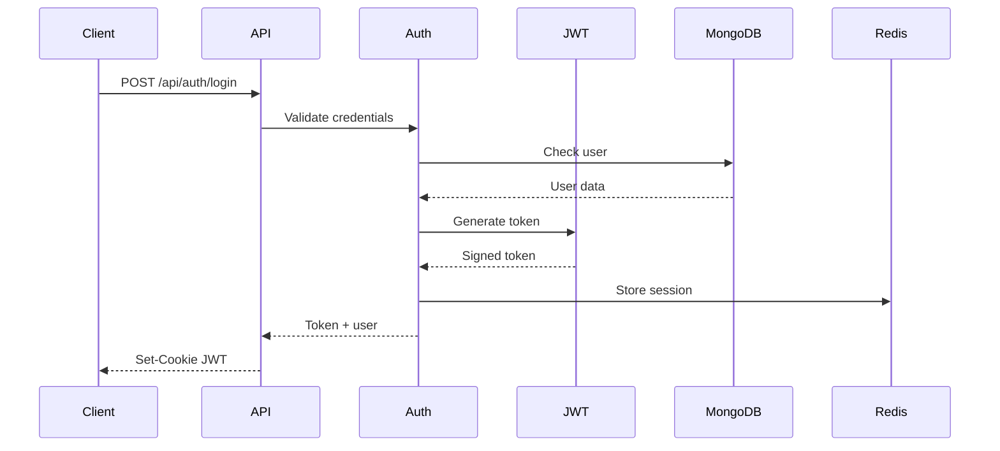

### Chat Service (AI Pipeline)

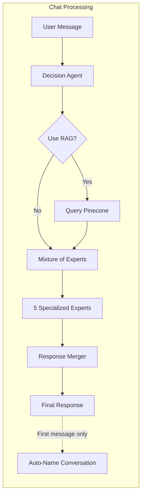

Expert models include:
- **Data Analyst**: Statistical analysis, trends
- **Lifestyle Concierge**: Neighborhood, amenities
- **Financial Advisor**: Mortgage, investment analysis
- **Neighborhood Expert**: Local insights, schools
- **Cluster Analyst**: Property grouping, similarities

**Auto-Generated Titles**: For authenticated users, the first message in a new conversation automatically triggers AI-powered title generation (3-6 words) via Gemini API, replacing "New Conversation" within seconds.

### Property Service

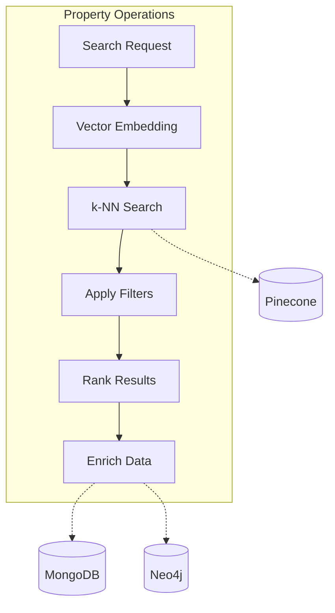

### Graph Service (Neo4j)

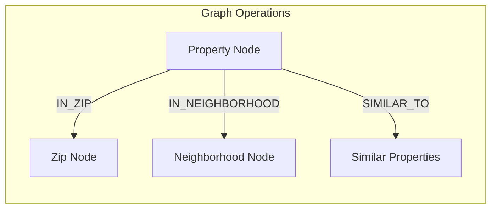

## Data Flow Architecture

### Real-time Data Pipeline

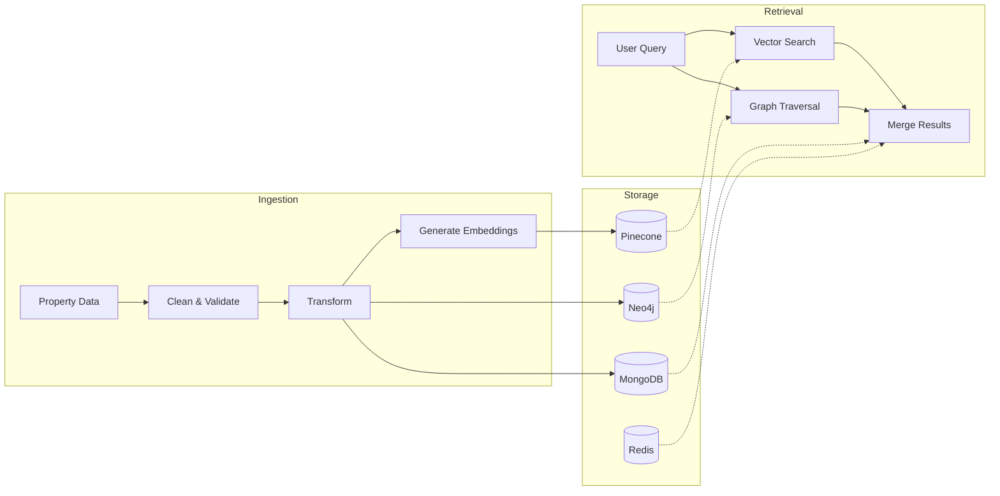

### RAG Pipeline

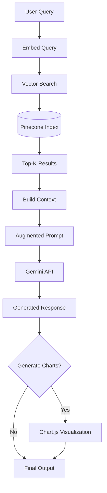

## AI/ML Architecture

### Mixture of Experts (MoE)

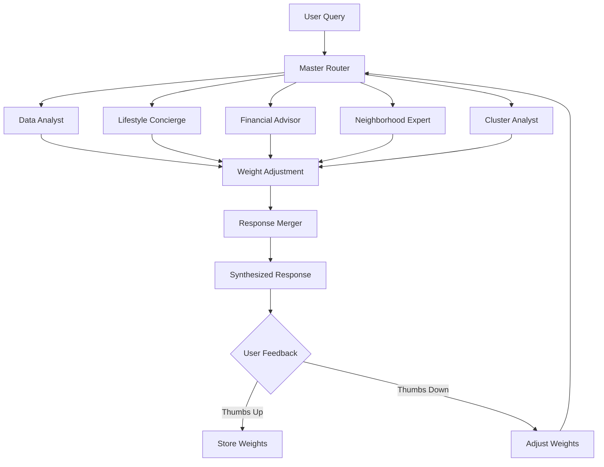

### Chain-of-Thought (CoT) Processing

Each expert uses CoT to break down complex queries:

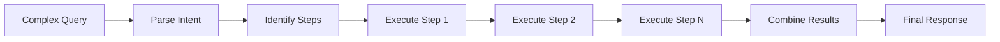

## Model Context Protocol (MCP) Architecture

The MCP server exposes tools via stdio to any MCP-compatible client:

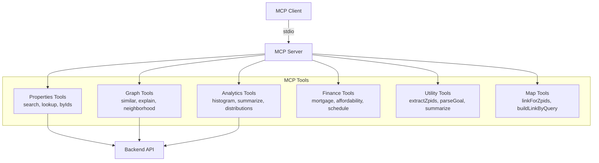

## Agentic AI Architecture

### Multi-Runtime Support

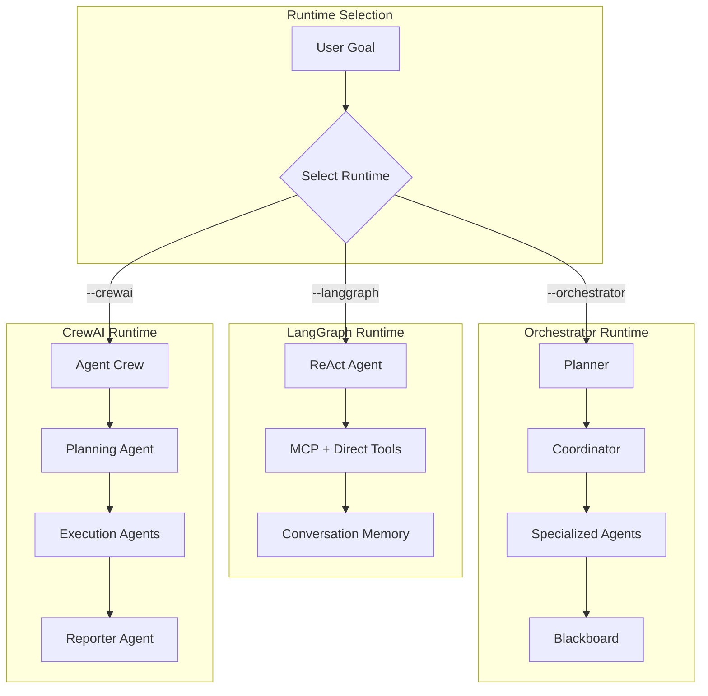

### Orchestrator Agent Pipeline

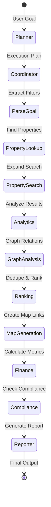

## Frontend Architecture

### Component Hierarchy

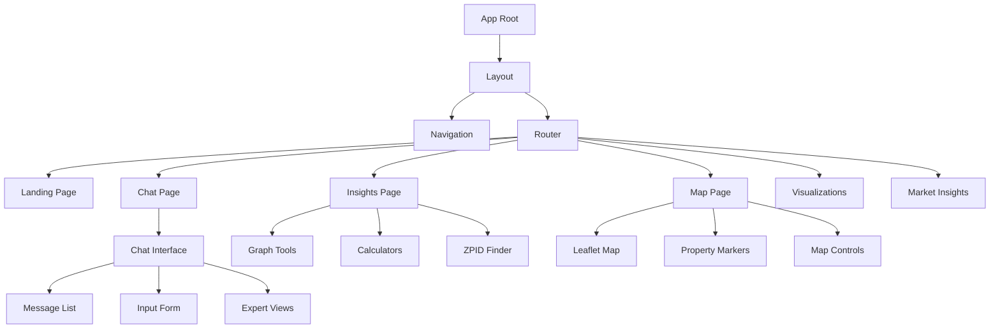

### State Management

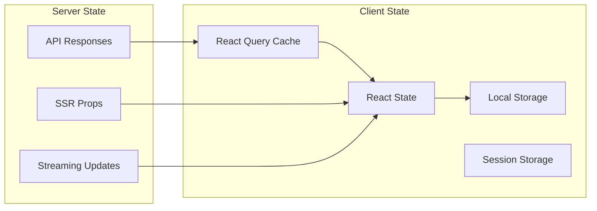

## Infrastructure & Deployment

> **Production-Ready Infrastructure**: EstateWise features enterprise-grade DevOps with advanced deployment strategies, comprehensive monitoring, and multi-cloud support. See [DEVOPS.md](DEVOPS.md) for complete operational documentation.

### Multi-Cloud Architecture

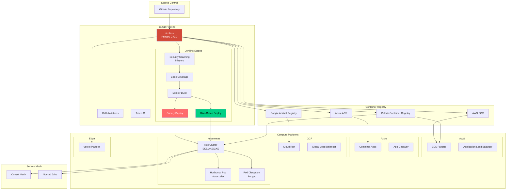

### Advanced Deployment Strategies

EstateWise supports three zero-downtime deployment strategies:

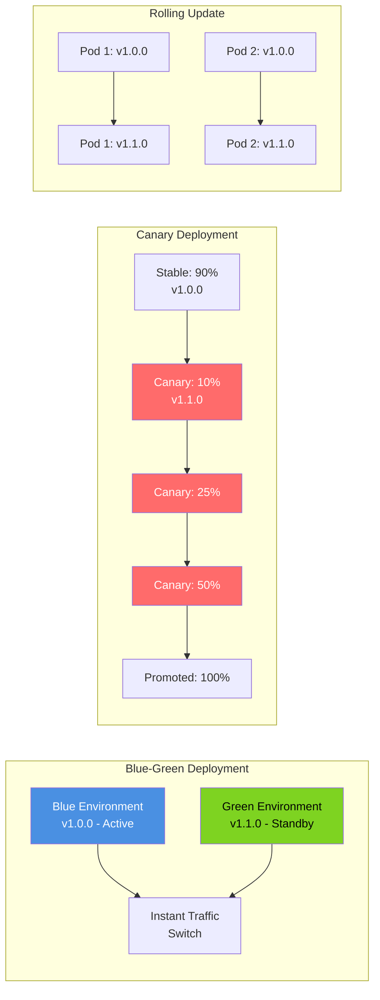

**Deployment Strategy Comparison:**

| Strategy | Rollback Speed | Resource Usage | Risk Level | Best For |
|----------|---------------|----------------|------------|----------|
| **Blue-Green** | Instant (< 1s) | 2x during switch | Low | Major releases |
| **Canary** | Gradual | 1.1-1.5x | Very Low | New features |
| **Rolling** | Re-deploy | 1x | Moderate | Regular updates |

### Infrastructure as Code

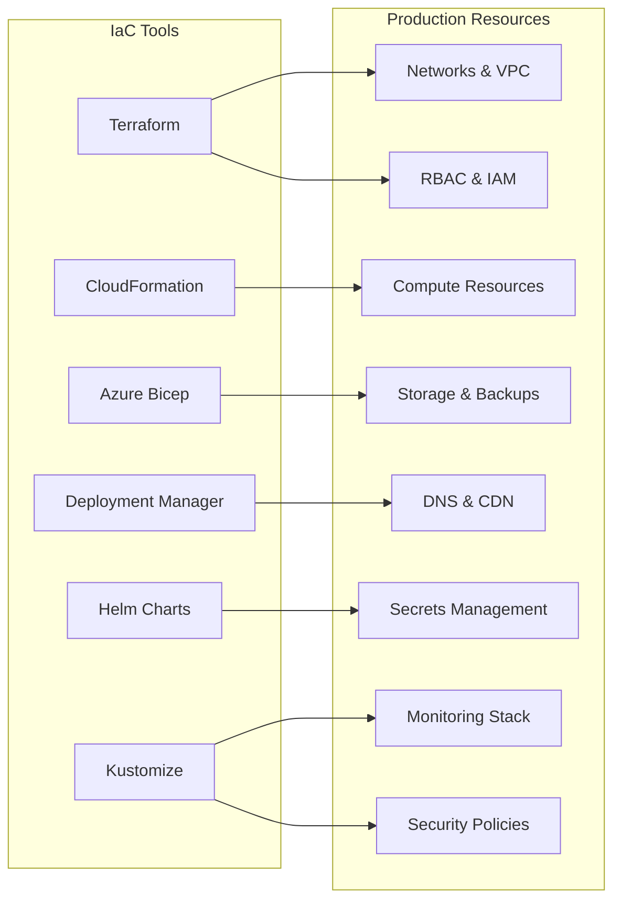

### Production Kubernetes Architecture

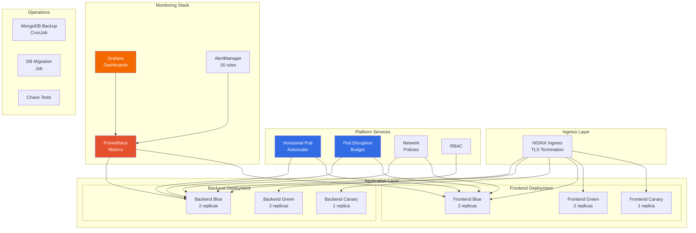

## Security Architecture

### Defense in Depth

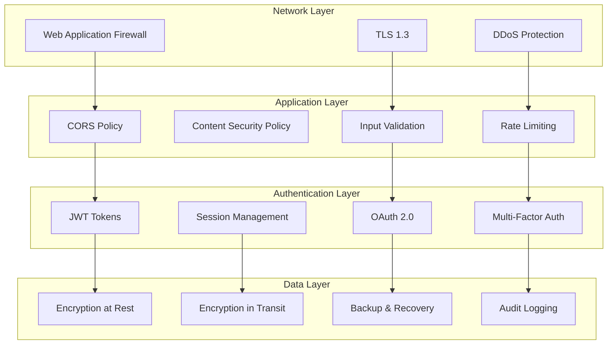

### Secret Management

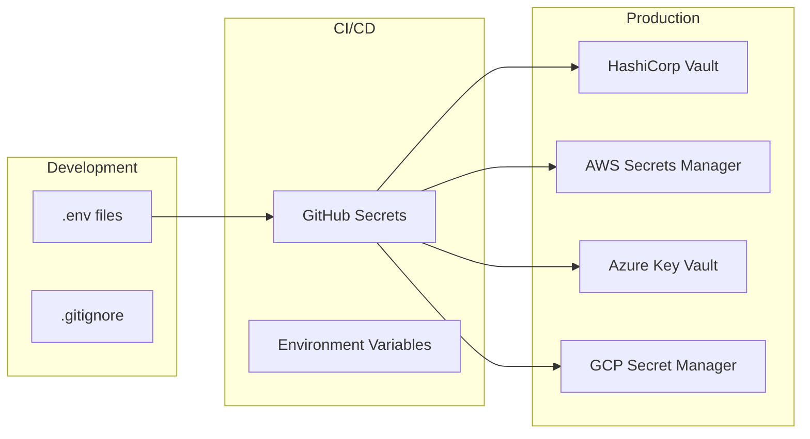

## Monitoring & Observability

### Metrics Collection

```mermaid
flowchart LR
  subgraph "Application Metrics"
    Express[Express Middleware]
    Custom[Custom Metrics]
    Business[Business KPIs]
  end

  subgraph "System Metrics"
    CPU[CPU Usage]
    Memory[Memory Usage]
    Disk[Disk I/O]
    Network[Network I/O]
  end

  subgraph "Collectors"
    Prometheus[Prometheus]
    CloudWatch[CloudWatch]
    AppInsights[Application Insights]
  end

  subgraph "Visualization"
    Grafana[Grafana]
    Dashboards[Custom Dashboards]
    Alerts[Alert Manager]
  end

  Express --> Prometheus
  Custom --> Prometheus
  Business --> Prometheus

  CPU --> CloudWatch
  Memory --> CloudWatch
  Disk --> AppInsights
  Network --> AppInsights

  Prometheus --> Grafana
  CloudWatch --> Dashboards
  AppInsights --> Alerts
```

### Distributed Tracing

```mermaid
sequenceDiagram
  participant Client
  participant API
  participant Auth
  participant Property
  participant Pinecone
  participant MongoDB

  Client->>API: Request [trace-id: abc123]
  API->>Auth: Validate [parent: abc123]
  Auth->>MongoDB: Query User [parent: abc123]
  MongoDB-->>Auth: User Data
  Auth-->>API: Authorized
  API->>Property: Search [parent: abc123]
  Property->>Pinecone: Vector Query [parent: abc123]
  Pinecone-->>Property: Results
  Property-->>API: Properties
  API-->>Client: Response [trace-id: abc123]
```

## Performance Optimization

### Caching Strategy

```mermaid
flowchart TB
  subgraph "Cache Layers"
    Browser[Browser Cache]
    CDN[CDN Cache]
    Redis[Redis Cache]
    App[Application Cache]
    DB[Database Cache]
  end

  subgraph "Cache Policies"
    TTL[TTL Settings]
    Invalidation[Cache Invalidation]
    Warming[Cache Warming]
  end

  Browser --> CDN
  CDN --> Redis
  Redis --> App
  App --> DB

  TTL --> Browser
  TTL --> CDN
  TTL --> Redis

  Invalidation --> Redis
  Invalidation --> App

  Warming --> Redis
  Warming --> DB
```

### Load Balancing

```mermaid
flowchart LR
  subgraph "Load Distribution"
    Client[Clients]
    LB[Load Balancer]

    subgraph "Backend Instances"
      API1[API Server 1]
      API2[API Server 2]
      API3[API Server 3]
    end

    subgraph "gRPC Services"
      GRPC1[gRPC Server 1]
      GRPC2[gRPC Server 2]
    end
  end

  Client --> LB
  LB -->|Round Robin| API1
  LB -->|Health Check| API2
  LB -->|Least Connections| API3

  API1 --> GRPC1
  API2 --> GRPC2
  API3 --> GRPC1
```

## Testing Strategy

### Test Pyramid

```mermaid
graph TD
  subgraph "Test Types"
    E2E[E2E Tests<br/>Cypress, Selenium]
    Integration[Integration Tests<br/>API, Database]
    Unit[Unit Tests<br/>Jest, Vitest]
    Static[Static Analysis<br/>ESLint, TypeScript]
  end

  subgraph "Coverage"
    UI[UI: 70%]
    API[API: 85%]
    Business[Business Logic: 90%]
    Utils[Utilities: 95%]
  end

  E2E --> UI
  Integration --> API
  Unit --> Business
  Static --> Utils
```

### CI/CD Pipeline

```mermaid
flowchart LR
  subgraph "Pipeline Stages"
    Trigger[Git Push]
    Lint[Lint & Format]
    Types[Type Check]
    Test[Run Tests]
    Build[Build Images]
    Scan[Security Scan]
    Deploy[Deploy]
    Verify[Smoke Tests]
  end

  Trigger --> Lint
  Lint --> Types
  Types --> Test
  Test --> Build
  Build --> Scan
  Scan --> Deploy
  Deploy --> Verify
```

## Data Models

### Core Entities

```mermaid
erDiagram
  USER ||--o{ CONVERSATION : "owns"
  USER ||--o{ SAVED_PROPERTY : "saves"
  CONVERSATION ||--o{ MESSAGE : "contains"
  MESSAGE ||--o{ RATING : "has"
  PROPERTY ||--o{ LISTING : "has"
  PROPERTY }o--|| ZIP : "in"
  PROPERTY }o--|| NEIGHBORHOOD : "in"
  PROPERTY ||--o{ PROPERTY : "similar_to"

  USER {
    string id PK
    string email UK
    string password_hash
    string name
    datetime created_at
    datetime updated_at
  }

  CONVERSATION {
    string id PK
    string user_id FK
    string title
    datetime created_at
    datetime updated_at
  }

  MESSAGE {
    string id PK
    string conversation_id FK
    string role
    string content
    json metadata
    datetime created_at
  }

  PROPERTY {
    string zpid PK
    float price
    int bedrooms
    int bathrooms
    float living_area
    int year_built
    string address
    float latitude
    float longitude
    json features
  }

  ZIP {
    string code PK
    string city
    string state
    json demographics
  }

  NEIGHBORHOOD {
    string id PK
    string name
    json stats
    json amenities
  }
```

### Graph Schema (Neo4j)

```cypher
// Node types
(:Property {zpid, address, city, state, zipcode, price, bedrooms, bathrooms})
(:Zip {code})
(:Neighborhood {name})

// Relationships
(:Property)-[:IN_ZIP]->(:Zip)
(:Property)-[:IN_NEIGHBORHOOD]->(:Neighborhood)
(:Property)-[:SIMILAR_TO {score}]->(:Property)
```

## Environment Configuration

### Environment Variables Matrix

| Service | Required Variables | Optional Variables |
|---------|-------------------|-------------------|
| **Backend** | `MONGO_URI`<br>`JWT_SECRET`<br>`PINECONE_API_KEY`<br>`PINECONE_INDEX`<br>`GOOGLE_AI_API_KEY` | `NEO4J_URI`<br>`NEO4J_USERNAME`<br>`NEO4J_PASSWORD`<br>`REDIS_URL`<br>`SENTRY_DSN` |
| **Frontend** | `NEXT_PUBLIC_API_BASE_URL` | `NEXT_PUBLIC_GOOGLE_ANALYTICS`<br>`NEXT_PUBLIC_SENTRY_DSN` |
| **gRPC** | `GRPC_SERVER_PORT`<br>`GRPC_SERVER_HOST` | `GRPC_USE_TLS`<br>`GRPC_CERT_PATH`<br>`GRPC_KEY_PATH` |
| **MCP** | `API_BASE_URL` | `FRONTEND_BASE_URL`<br>`LOG_LEVEL` |
| **Agentic** | `OPENAI_API_KEY` (for CrewAI) | `LANGCHAIN_API_KEY`<br>`AGENT_RUNTIME` |

## Performance Targets & SLOs

### Service Level Objectives

| Metric | Target | Critical Threshold |
|--------|--------|-------------------|
| **API Latency (P50)** | < 200ms | < 500ms |
| **API Latency (P95)** | < 800ms | < 2000ms |
| **API Latency (P99)** | < 1500ms | < 5000ms |
| **Availability** | 99.9% | 99.5% |
| **Error Rate** | < 0.1% | < 1% |
| **Chat Response Time** | < 3s | < 10s |
| **Map Load Time** | < 2s | < 5s |
| **Graph Query Time** | < 1.5s | < 3s |
| **Vector Search Time** | < 500ms | < 1500ms |

### Scalability Targets

- **Concurrent Users**: 10,000+
- **Requests per Second**: 1,000+
- **Database Connections**: 100 pooled
- **Message Queue Throughput**: 10,000 msg/s
- **Vector Index Size**: 1M+ embeddings
- **Graph Nodes**: 100K+ properties

## Disaster Recovery

### Backup Strategy

```mermaid
flowchart TB
  subgraph "Backup Types"
    Continuous[Continuous Replication]
    Daily[Daily Snapshots]
    Weekly[Weekly Archives]
    Monthly[Monthly Archives]
  end

  subgraph "Storage Locations"
    Primary[Primary Region]
    Secondary[Secondary Region]
    Cold[Cold Storage]
  end

  subgraph "Recovery"
    RTO[RTO: 4 hours]
    RPO[RPO: 1 hour]
    Test[Monthly DR Tests]
  end

  Continuous --> Primary
  Daily --> Primary
  Weekly --> Secondary
  Monthly --> Cold

  Primary --> RTO
  Secondary --> RPO
  Cold --> Test
```

### Failover Process

1. **Detection**: Health checks detect primary failure
2. **Validation**: Confirm failure isn't transient
3. **DNS Update**: Update DNS to point to secondary
4. **Cache Warm**: Warm caches in secondary region
5. **Verification**: Run smoke tests
6. **Communication**: Notify stakeholders

## Development Workflow

### Git Flow

```mermaid
gitGraph
  commit id: "main"
  branch develop
  checkout develop
  commit id: "feature-start"
  branch feature/new-feature
  checkout feature/new-feature
  commit id: "feature-work"
  commit id: "feature-done"
  checkout develop
  merge feature/new-feature
  branch release/v1.0
  checkout release/v1.0
  commit id: "release-prep"
  checkout main
  merge release/v1.0 tag: "v1.0.0"
  checkout develop
  merge main
```

### Code Review Process

1. **Branch Creation**: Feature branch from develop
2. **Development**: Implement feature with tests
3. **Pre-commit**: Lint, format, type-check
4. **Pull Request**: Open PR with description
5. **CI Checks**: Automated tests and scans
6. **Review**: Code review by 1+ developers
7. **Approval**: Required approvals obtained
8. **Merge**: Squash and merge to develop

## Future Roadmap

### Planned Enhancements

- **GraphQL API**: Add GraphQL endpoint for flexible queries
- **WebSocket Support**: Real-time property updates
- **Mobile Apps**: Native iOS and Android applications
- **AI Improvements**:
  - Fine-tuned property valuation models
  - Computer vision for property images
  - Natural language property search
- **Blockchain Integration**: Property ownership verification
- **AR/VR Features**: Virtual property tours
- **International Expansion**: Multi-region support

### Technical Debt

- Migrate from Express to Fastify for better performance
- Implement event sourcing for audit trail
- Add distributed tracing (OpenTelemetry)
- Improve test coverage to 90%+
- Optimize bundle sizes
- Implement progressive web app (PWA) features

## Appendix

### Glossary

- **RAG**: Retrieval-Augmented Generation
- **MoE**: Mixture of Experts
- **CoT**: Chain-of-Thought
- **MCP**: Model Context Protocol
- **ZPID**: Zillow Property ID
- **kNN**: k-Nearest Neighbors
- **TTL**: Time To Live
- **RTO**: Recovery Time Objective
- **RPO**: Recovery Point Objective
- **SLO**: Service Level Objective

### References

- [EstateWise API Documentation](https://estatewise-backend.vercel.app/api-docs)
- [Frontend Repository](https://github.com/hoangsonww/EstateWise-Chapel-Hill-Chatbot)
- [Technical Documentation](TECH_DOCS.md)
- [Deployment Guide](DEPLOYMENTS.md)
- [gRPC & tRPC Documentation](GRPC_TRPC_DOCUMENTATION.md)

---

*This architecture document is maintained alongside the codebase. Last updated: January 2025*
