# EstateWise Architecture

This document describes the end‑to‑end architecture for EstateWise, spanning frontend UI, backend services, data and graph pipelines, MCP tooling, the agentic orchestration CLI, IDE extension, and CI/CD.

## System Overview

The high-level architecture is as follows:

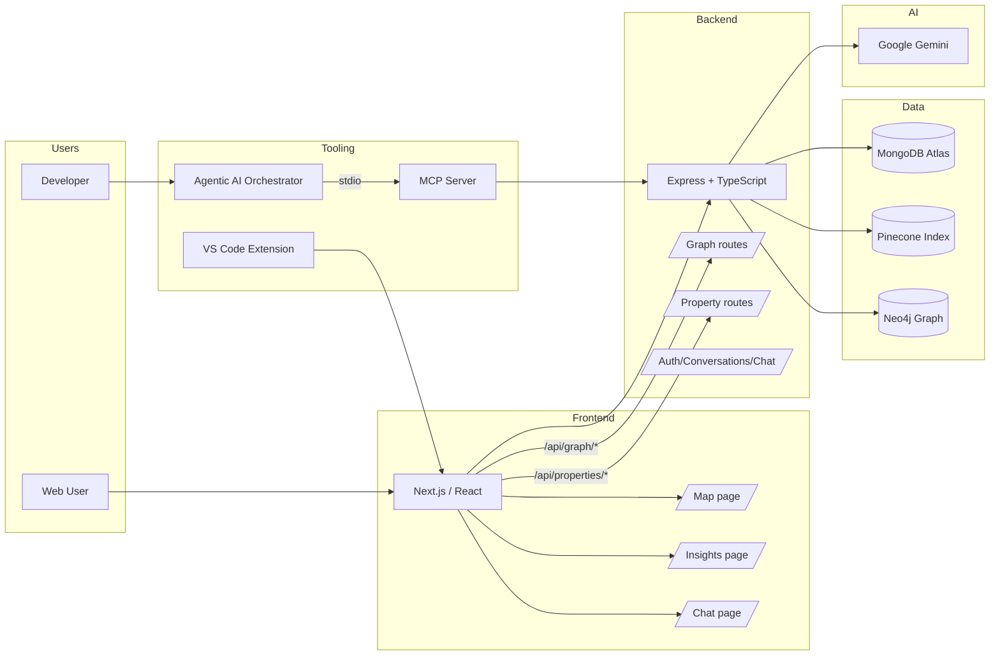

## Repository Topology

```
backend/       # Express + TypeScript API, graph + property endpoints
frontend/      # Next.js + React app (chat, insights, map)
mcp/           # Model Context Protocol server exposing project tools over stdio
agentic-ai/    # Multi-agent CLI orchestrator using MCP
extension/     # VS Code extension embedding chat
docs-backend/  # TypeDoc output for backend
terraform/, aws/, gcp/  # Infra-as-code and cloud configs
```

## Frontend

- Pages
  - `pages/chat.tsx`: conversational UI integrated with backend chat API and conversation management.
  - `pages/insights.tsx`: graph tools, comparators, calculators; includes Find ZPID dialog with address/city/state/ZIP and bed/bath filters.
  - `pages/map.tsx`: Leaflet map rendering; accepts deep links `?zpids=...` or `?q=...` and caps markers for performance (~200 by default).
- UI
  - TailwindCSS + shadcn UI components; Chart.js for visualizations.
- API Client
  - `frontend/lib/api.ts`: REST wrappers for conversations, chat, properties, and graph.

### ZPID Lookup UX

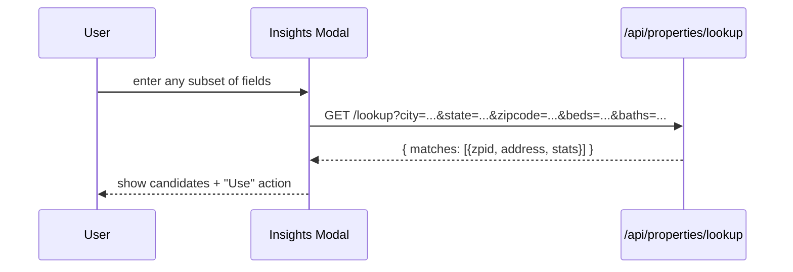

## Backend (Express + TypeScript)

- Routes
  - Properties: `/api/properties` (query), `/api/properties/by-ids`, `/api/properties/lookup`.
  - Graph: `/api/graph/similar/:zpid`, `/api/graph/explain?from&to`, `/api/graph/neighborhood/:name`.
  - Auth/Conversations/Chat: login/signup, chat completion, and conversation storage.
- Integrations
  - MongoDB Atlas for persistence.
  - Pinecone for semantic search (kNN) and metadata fetch.
  - Neo4j for property‑ZIP‑neighborhood relationships and explanations.
  - Google Gemini for LLM‑assisted analysis (agents and chat).
- Observability
  - `express-status-monitor` on `/status`.
  - Prometheus metrics (latency, error rates) and structured logs.

### Property Search Flow

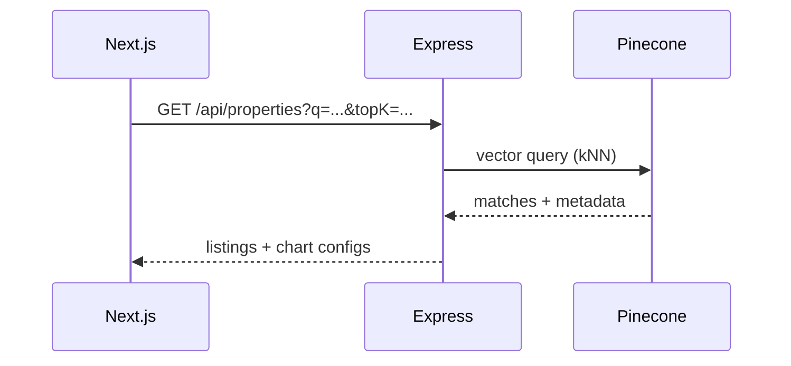

### Graph API Flow

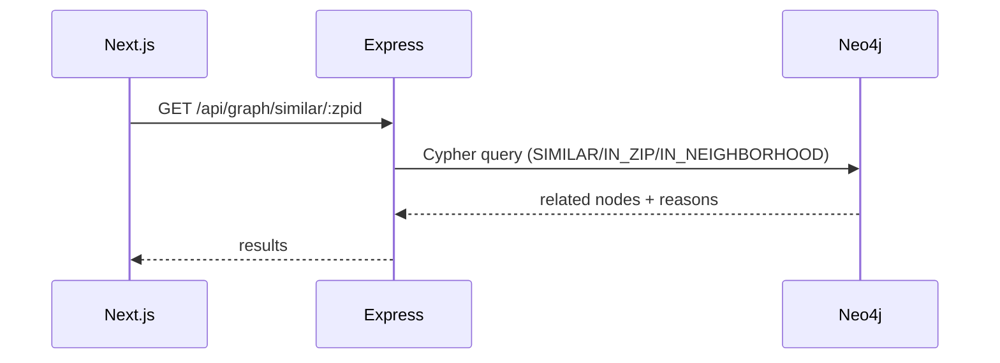

## Data & Graph Pipelines

### Embedding & Upsert (Pinecone)

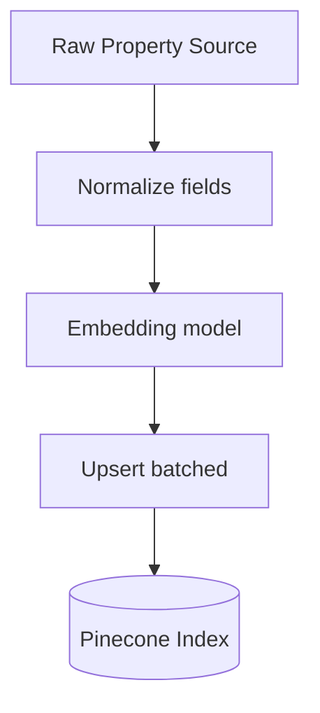

### Neo4j Ingest (from Pinecone)

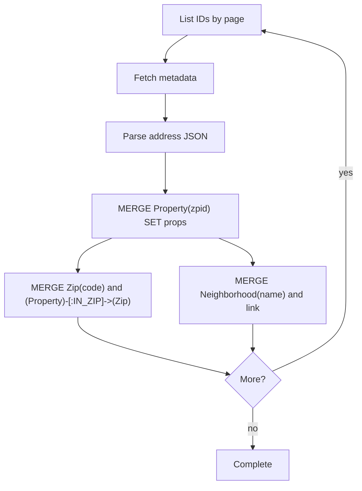

## Model Context Protocol (MCP) Server

The `mcp/` package exposes graph, property, analytics, finance, and utility tools to any MCP‑compatible client over stdio.

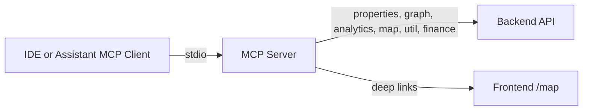

- Tool categories
  - Properties: `search`, `searchAdvanced`, `lookup`, `byIds`, `sample`
  - Graph: `similar`, `explain`, `neighborhood`, `similarityBatch`, `comparePairs`, `pathMatrix`
  - Analytics: `priceHistogram`, `summarizeSearch`, `groupByZip`, `distributions`
  - Map: `linkForZpids`, `buildLinkByQuery`
  - Utilities: `extractZpids`, `zillowLink`, `summarize`, `parseGoal`
  - Finance: `mortgage`, `affordability`, `schedule`

## Agentic AI Orchestrator

The `agentic-ai/` CLI runs a multi‑agent pipeline that spawns the local MCP server and coordinates steps with a shared blackboard and a Coordinator agent.

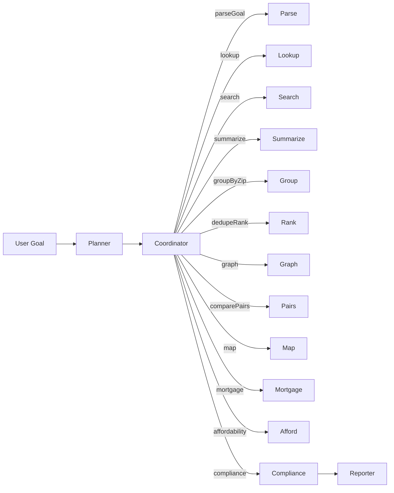

- Agents
  - Planner, Coordinator, ZpidFinder, PropertyAnalyst, AnalyticsAnalyst, GraphAnalyst, DedupeRanking, MapAnalyst, FinanceAnalyst, Compliance, Reporter.
- Blackboard
  - Aggregates ZPIDs, parsed filters, analytics summaries, map links, finance results, and step state.
- Orchestrator
  - Executes tool calls via MCP, retries transient failures once, and normalizes JSON results.

### Agentic Runtimes (Pipeline Overview)

The project supports three agentic runtimes: the default round‑based Orchestrator, a LangChain + LangGraph ReAct agent, and a CrewAI (Python) sequential crew.

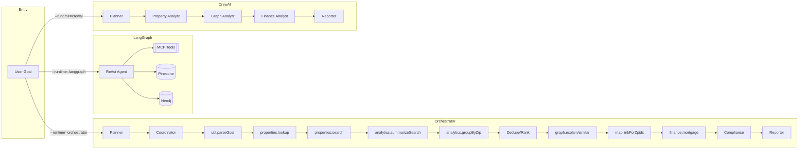

### Integration with Overall System

The agentic runtimes integrate with the rest of EstateWise via the MCP server and backend API. The diagram shows an end‑to‑end view (agent → tools → API/data) and UI entry points.

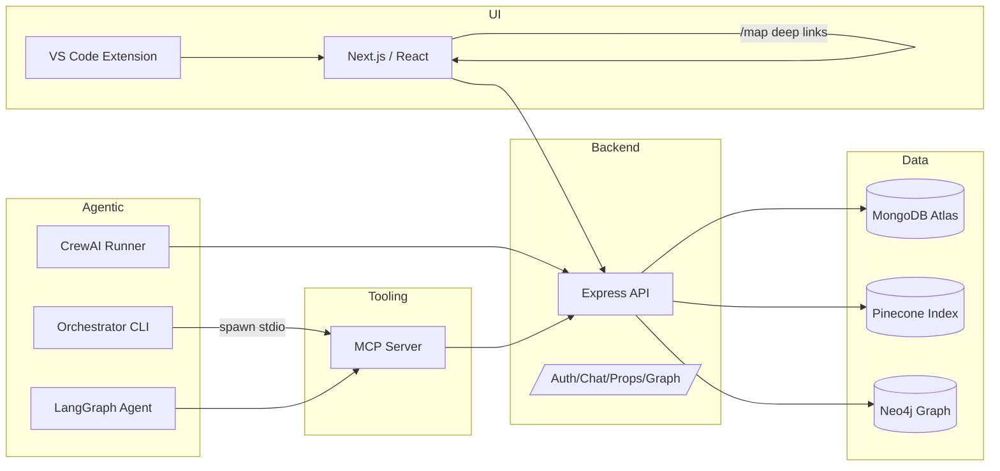

## VS Code Extension

Simple WebView wrapper that loads `https://estatewise.vercel.app/chat` inside VS Code. No additional secrets are required; it leverages the hosted frontend.

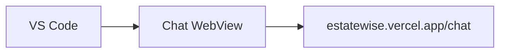

## Security & Config

- Secrets are never committed. Copy `.env.example` → `.env` per package.
- Required keys by area
  - Backend: `MONGO_URI`, Pinecone, Google AI key, optional Neo4j (`NEO4J_URI`, `NEO4J_USERNAME`, `NEO4J_PASSWORD`).
  - MCP: `API_BASE_URL`, `FRONTEND_BASE_URL`.
- Rate limits and error handling middleware on the API; JWT cookies for auth; CORS configured.

## Testing Strategy

- Backend: `backend/tests/` with Jest unit/integration tests.
- Frontend: `frontend/__tests__/` with Jest; Cypress + Selenium for E2E/UI.
- MCP/Agentic: CLI flows are testable via scripted goals; tools return text(JSON) for easy parsing.

## CI/CD & Infrastructure

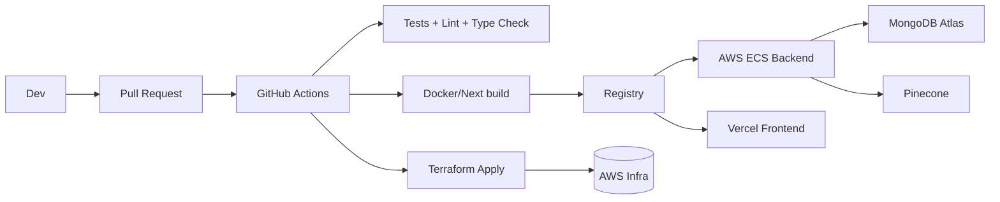

## Scalability & Resilience

- Horizontal scale on ECS for stateless API.
- MongoDB Atlas replica sets and auto‑failover; Pinecone replication; Neo4j constraints.
- Guardrails: marker caps on map, basic circuit‑breakers, and compliance checks in agentic pipeline.

## Core Data Models

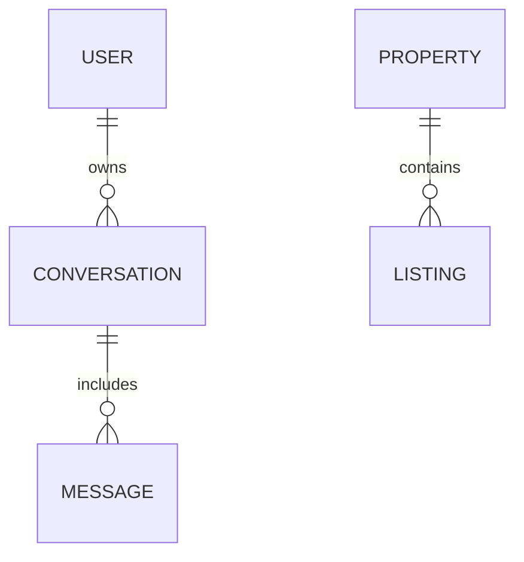

Graph (Neo4j) high‑level entities and relationships:

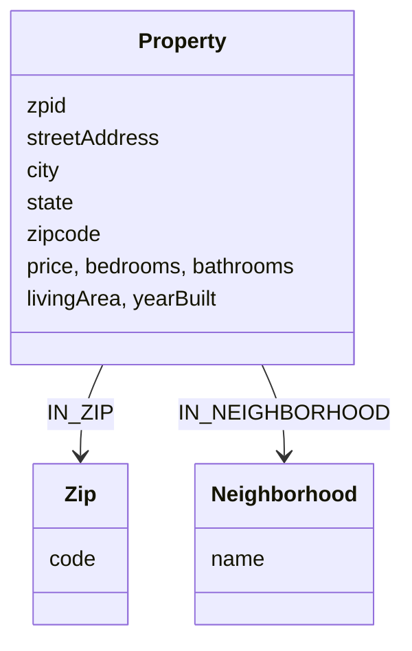

## Authentication

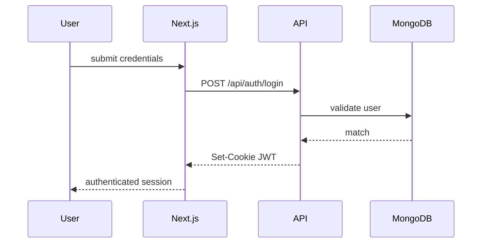

Key aspects: bcrypt salted hashes, HttpOnly JWT cookies, and CSRF‑resistant flows via cookie + header patterns.

---

This document reflects the current codebase, data flows, and pipelines. Update it alongside major feature changes (graph tools, MCP tools, agent roles, or infra topology).

## Request Lifecycle (End‑to‑End)

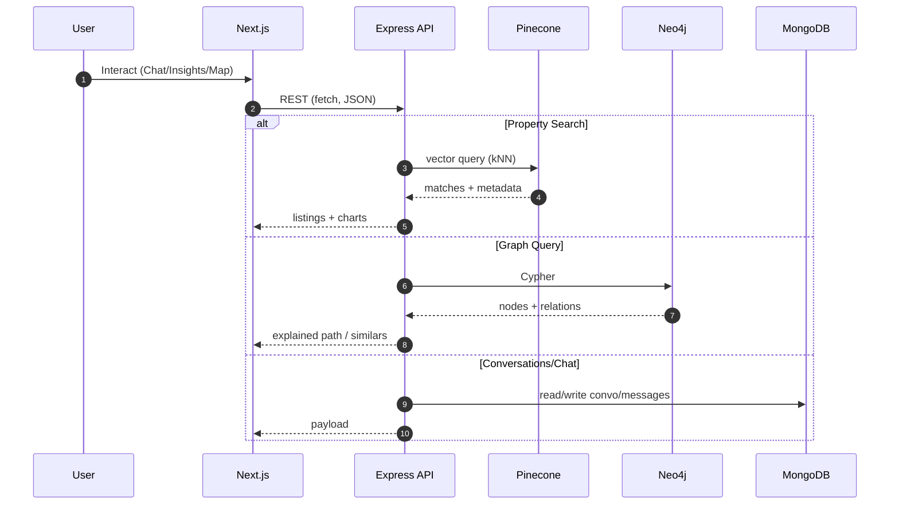

## Backend Modules (Detailed View)

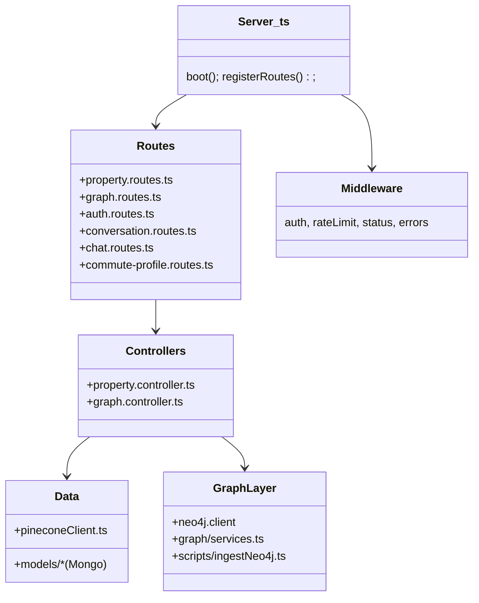

### HTTP Surface (Selected)

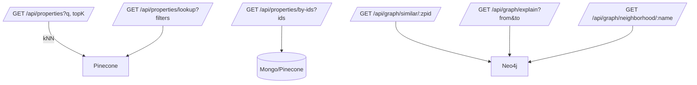

## Agentic Blackboard Updates (Lifecycle)

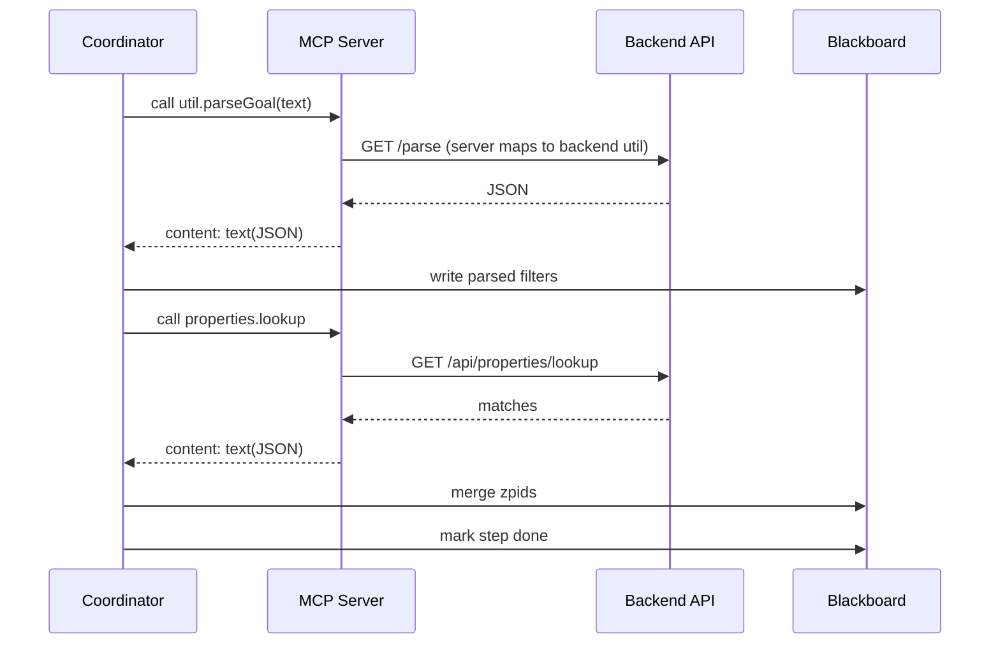

## Failure Modes & Fallbacks

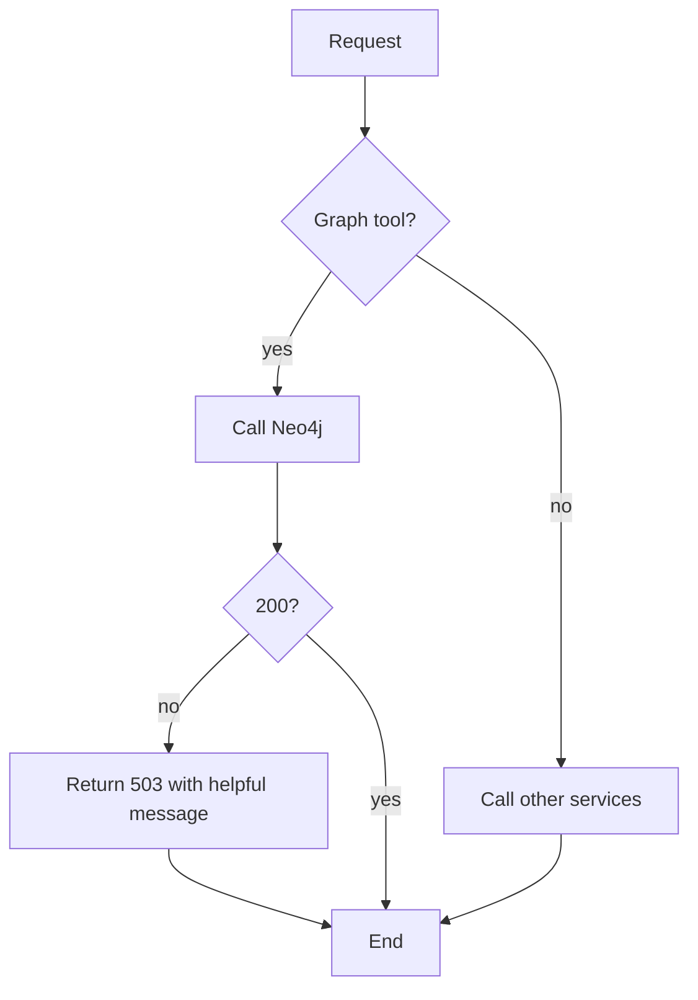

Guidance:
- If Neo4j is down: APIs return 503 with a clear error; UI surfaces a tip to run `npm run graph:ingest` or try later.
- If Pinecone is unavailable: property search endpoints return a 5xx; client side suggests retrying or narrowing filters.
- MCP tools propagate backend errors as text blocks; orchestrator retries once.

## Observability & Telemetry

```mermaid
flowchart LR
  API[Express] --> Metrics[Prometheus]
  API --> Status[/status monitor/]
  API --> Logs[Structured logs]
  Metrics --> Dash[Grafana/Alerts]
```

Key metrics (examples):
- http_request_duration_seconds (by route)
- mongo_connections, pinecone_latency_ms, neo4j_latency_ms
- cache_hits (if applicable), error_rate

## Security Model

- AuthN: JWT cookies (HttpOnly, Secure in prod). Passwords hashed with bcrypt.
- AuthZ: route middleware for protected endpoints (conversations, chat).
- Input validation: route params/query validated server-side.
- CORS: restricted origins (frontend + extension).
- Secrets: `.env` per package; never committed.
- Rate limiting and well-formed error responses.

## Environment & Config Matrix

```mermaid
classDiagram
  class Frontend_env {
    NEXT_PUBLIC_API_BASE_URL
  }
  class Backend_env {
    MONGO_URI
    GOOGLE_AI_API_KEY
    PINECONE_API_KEY, PINECONE_INDEX, PINECONE_NAMESPACE
    NEO4J_URI, NEO4J_USERNAME, NEO4J_PASSWORD, NEO4J_DATABASE
  }
  class MCP_env {
    API_BASE_URL
    FRONTEND_BASE_URL
  }
```

## Performance & SLOs (Targets)

- P50 API latency: < 200ms for property search (warm path); P95 < 800ms.
- Graph similar/explain: P95 < 1.5s (depends on Neo4j workload).
- Map load: < 2s with ≤200 markers.
- Agentic CLI (marketResearch): end-to-end < 15s for typical goals.

## Data Contracts (Examples)

Property listing (excerpt):

```json
{
  "id": "1234567",
  "zpid": 1234567,
  "price": 625000,
  "bedrooms": 3,
  "bathrooms": 2,
  "livingArea": 1850,
  "yearBuilt": 1996,
  "city": "Chapel Hill",
  "zipcode": "27514"
}
```

Graph similar (excerpt):

```json
{
  "zpid": 1234567,
  "results": [
    { "zpid": 2345678, "reason": "Same zip" }
  ]
}
```

## Environments

- Local: `npm start` (backend), `npm run dev` (frontend), MCP via `npm run dev` in `mcp/`.
- Dev/Preview: Vercel previews for frontend; ECS test cluster for backend.
- Prod: Vercel + AWS ECS; MongoDB Atlas; Pinecone; optional Neo4j managed service.

## Deployment Strategies

- Frontend: Vercel immutable deploys.
- Backend: ECS rolling updates; health checks; blue/green optional.
- Infra: Terraform for AWS resources; GH Actions for CI.

## Change Management

- Keep `ARCHITECTURE.md`, `README.md`, and package READMEs in sync with feature additions (routes, tools, agents).
- Document new env vars and update `.env.example` files.
