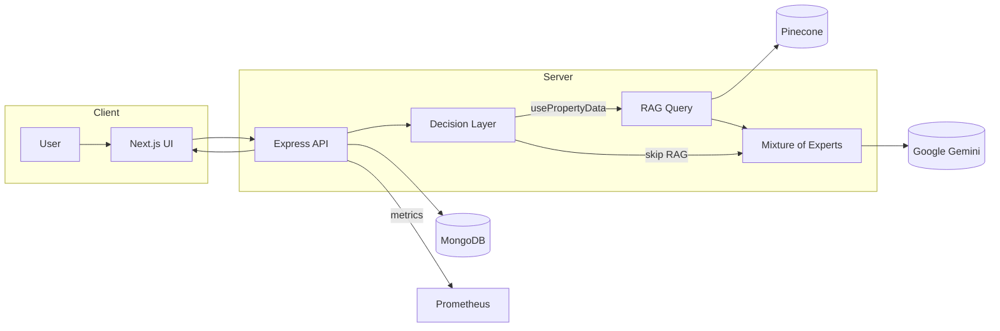
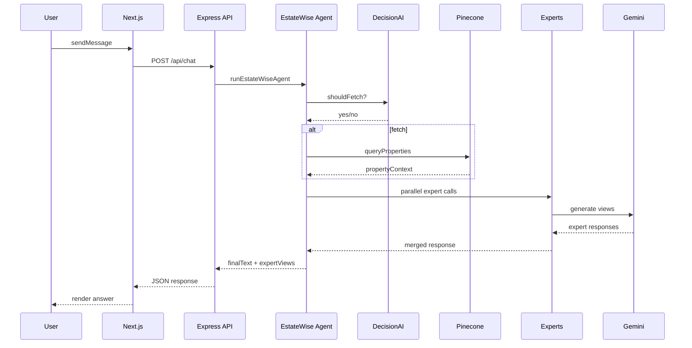
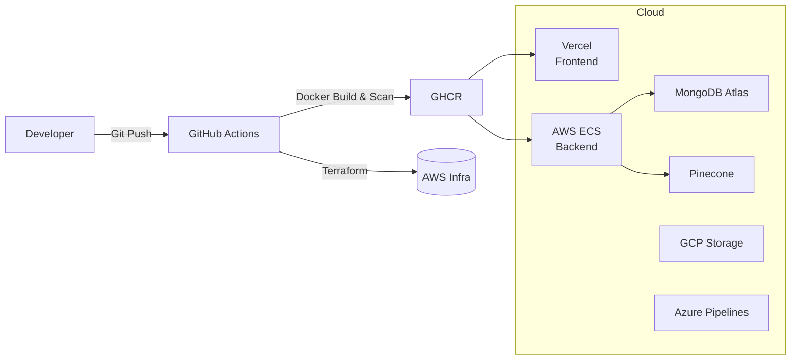
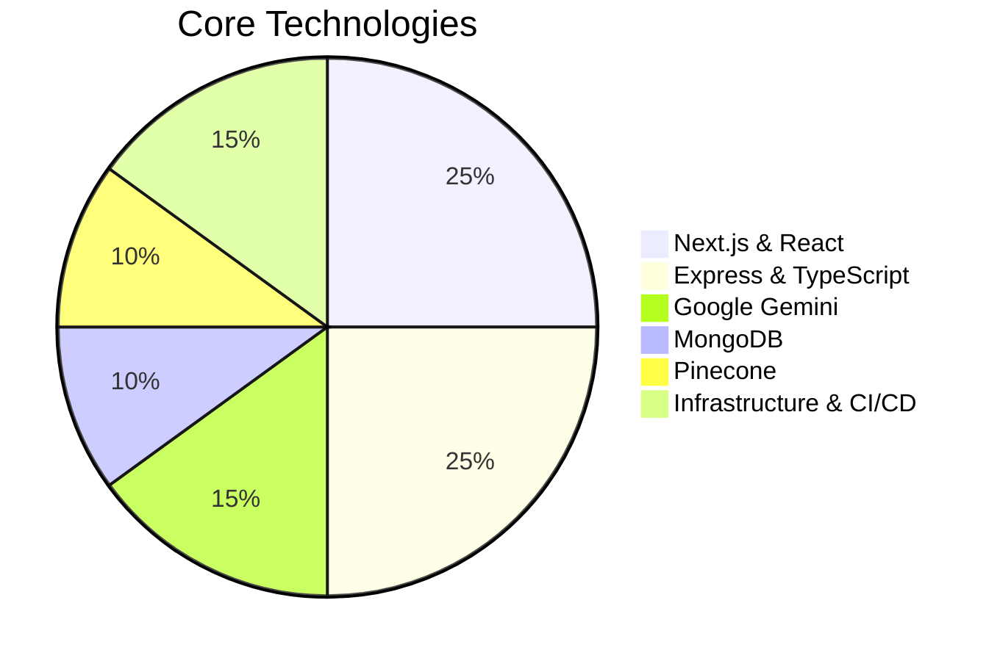
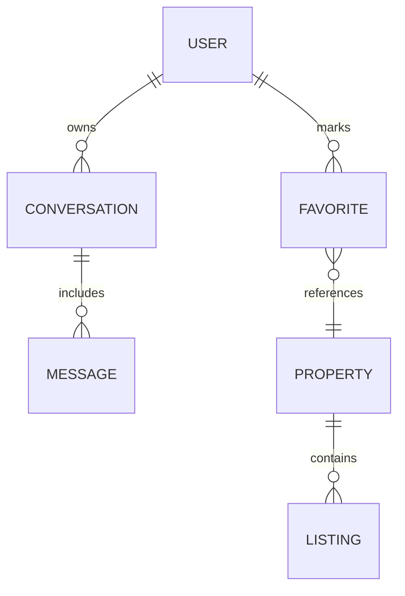
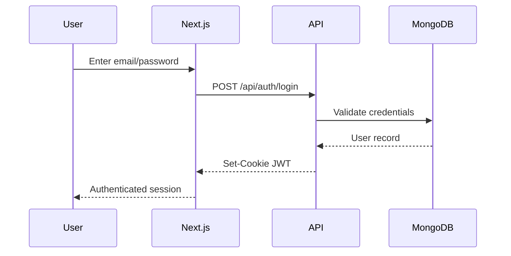
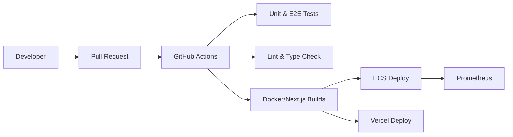

# EstateWise Architecture

## Overview
EstateWise is a full‑stack, AI‑powered real estate assistant focused on Chapel Hill, NC.  It pairs a modern **Next.js** front‑end with an **Express/TypeScript** API and a rich Retrieval‑Augmented Generation (RAG) pipeline backed by **Google Gemini**, **Pinecone**, and **MongoDB**.  The project also includes infrastructure as code for multi‑cloud deployment, monitoring, and a VS Code extension for in‑editor chat.

## High‑Level Components


### Frontend (Next.js)
- Renders the chat interface, property visualizations, and account management.
- Communicates with the backend via REST APIs.
- Uses Tailwind CSS, Framer Motion, and Chart.js for responsive and animated UI.

### Backend (Express + TypeScript)
- Serves RESTful endpoints for authentication, conversations, chat, and property data.
- Integrates Prometheus metrics, status monitoring, and structured logging.
- Connects to MongoDB for persistence and Pinecone for vector search.

### AI/RAG Pipeline
- Property data is embedded using Google's `text-embedding-004` model and stored in Pinecone.
- A decision model determines whether property retrieval is needed.
- A Mixture‑of‑Experts system (Data Analyst, Lifestyle Concierge, Financial Advisor, Neighborhood Expert, Cluster Analyst) generates responses and merges them into a final answer.

## Chat Sequence


## Data Ingestion & Embedding Pipeline
```mermaid
flowchart TD
    CSV[Raw Property CSV] --> Clean[Data Cleaning & Normalization]
    Clean --> Embed[Generate 1536-dim Embeddings]
    Embed --> Upsert[Batch Upsert (size=50)]
    Upsert --> PineconeStore[(Pinecone Index)]
    PineconeStore -->|KNN| Query
```

## Deployment & Infrastructure


## Monitoring & Observability
- `express-status-monitor` provides a `/status` dashboard.
- Prometheus collects request latency, MongoDB connection health, and other metrics.
- Logs are emitted via Winston for structured analysis.

## Security
- JWT‑based authentication with cookies.
- CORS configured for public access.
- Rate limiting and error‑handling middleware.

## Testing
- **Backend:** Jest unit tests for controllers and middleware.
- **Frontend:** Jest tests for API utilities; Cypress and Selenium for E2E and UI testing.

## VS Code Extension
The `extension` directory contains a VS Code WebView extension that embeds the live chat at `https://estatewise.vercel.app/chat` directly inside the editor, enabling in‑IDE conversations.

## Technology Stack Overview


## Core Data Models

The models mirror the MongoDB collections:
- **USER** documents store credentials and profile info.
- **CONVERSATION** threads group chat **MESSAGE** documents.
- **PROPERTY** data powers listings and user **FAVORITE** relationships.

## Authentication Flow

Key aspects:
- Passwords are salted and hashed with bcrypt before storage.
- JWT tokens are HttpOnly cookies to mitigate XSS.

## CI/CD Workflow


## Scalability & Resilience
- Stateless backend containers on **AWS ECS** allow horizontal scaling.
- **MongoDB Atlas** provides replica sets and automated failover.
- **Pinecone** handles vector index sharding and replication.
- Rate limiting and circuit breakers protect against API abuse and downstream failures.

## Developer Workflow
- Local services are orchestrated via `docker-compose` for parity with production.
- `make` targets wrap common tasks like linting, testing, and building images.
- TypeDoc and JSDoc generate API documentation for backend and frontend respectively.

## Future Enhancements
- Incorporate real-time WebSocket updates for collaborative search.
- Add multi-region deployment with traffic steering.
- Expand expert models for mortgage and school district analysis.

---
This document serves as a top‑to‑bottom reference for EstateWise’s architecture, from data ingestion to deployment.
