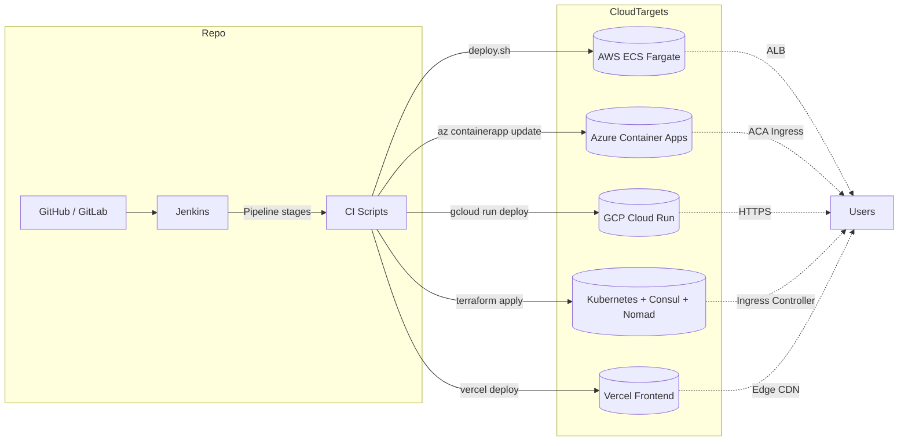
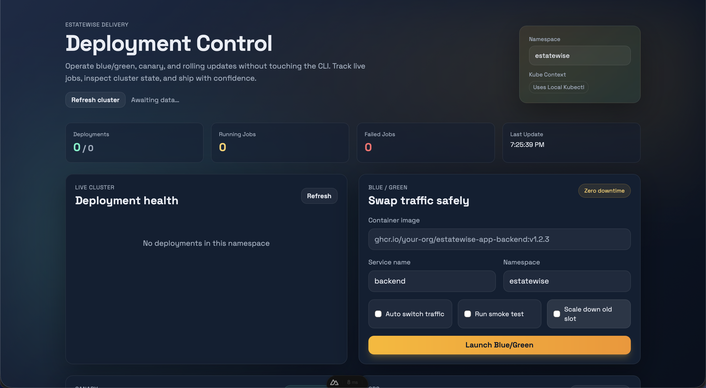
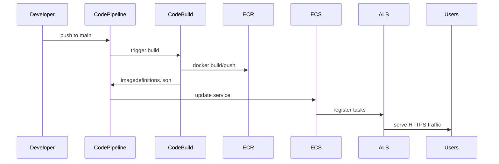
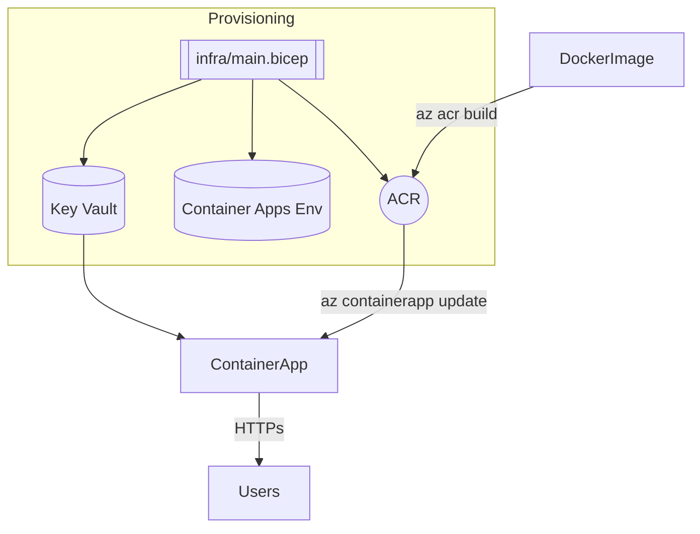
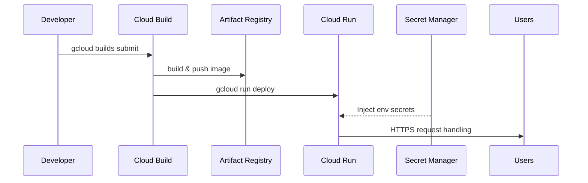
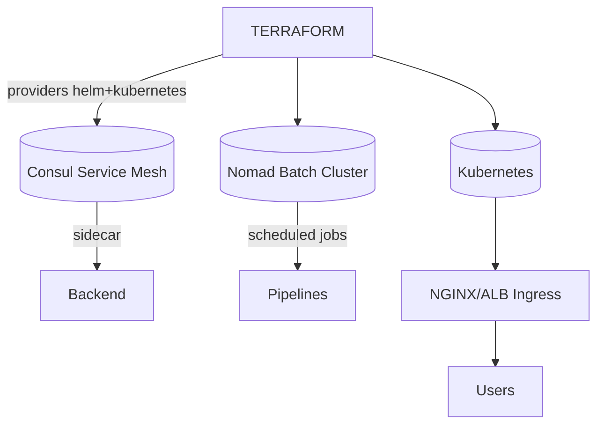

# EstateWise Deployment Reference

<p align="center">
  
  
  
  
  
  
  
</p>

EstateWise ships with four production-grade deployment tracks so you can choose the cloud that best fits your stack:

1. **AWS** – ECS on Fargate behind an ALB with CodePipeline / CodeBuild CI/CD.
2. **Azure** – Azure Container Apps + Key Vault, driven by Bicep modules and Azure DevOps.
3. **Google Cloud** – Cloud Run with Cloud Build, Artifact Registry, and VPC Access.
4. **HashiCorp Platform** – Terraform-orchestrated Kubernetes (EKS/AKS/GKE or self-managed) with Consul service mesh and Nomad batch runners.

In addition, the monorepo already supports **Vercel** deployments for the frontend (and optional backend edge functions) for teams that prefer Vercel’s serverless workflow.

> [!TIP]
> ℹ️  Mixed deployments are fully supported: for example run the backend on AWS while exposing the frontend on Vercel, or use the HashiCorp stack for internal tooling while shipping the public experience via Cloud Run.

It also supports advanced deployment strategies like **Blue-Green** and **Canary** deployments for zero-downtime releases and safe progressive delivery.

> [!NEW]
> GitLab CI/CD is now supported out of the box via `.gitlab-ci.yml`, mirroring the Jenkins flow and wiring directly into the Kubernetes blue/green and canary scripts through `gitlab/deploy.sh`.

---

## Table of Contents

- [High-Level Architecture](#high-level-architecture)
- [Advanced Deployment Strategies](#advanced-deployment-strategies)
- [AWS Deployment](#aws-deployment)
- [Azure Deployment](#azure-deployment)
- [Google Cloud Deployment](#google-cloud-deployment)
- [HashiCorp + Kubernetes Stack](#hashicorp--kubernetes-stack)
- [Agentic AI Orchestrator](#agentic-ai-orchestrator)
- [MCP Server](#mcp-server)
- [Vercel Frontend/Backend](#vercel-frontendbackend)
- [CI/CD Integration](#cicd-integration)
- [Choosing the Right Path](#choosing-the-right-path)
- [Reference Commands](#reference-commands)

---

## High-Level Architecture



Each target shares the same containers and environment variables – only the infrastructure wrapper changes.

---

## Advanced Deployment Strategies

EstateWise now supports enterprise-grade deployment strategies for zero-downtime deployments and safe progressive delivery.

### Available Strategies

| Strategy | Use Case | Risk Level | Rollback Speed |
|----------|----------|------------|----------------|
| **Blue-Green** | Major releases, complete environment swap | Low | Instant |
| **Canary** | Progressive rollout with real user testing | Very Low | Gradual |
| **Rolling Update** | Standard updates, patches | Moderate | Re-deploy |

### Blue-Green Deployments

Blue-Green deployment maintains two identical production environments. Deploy to the inactive environment, test thoroughly, then instantly switch traffic.

**Quick Start:**

```bash
# Via Jenkins - set environment variables:
DEPLOY_BLUE_GREEN=1
BLUE_GREEN_SERVICE=backend
AUTO_SWITCH_BLUE_GREEN=false

# Manual execution:
./kubernetes/scripts/blue-green-deploy.sh backend \
  ghcr.io/your-org/estatewise-app-backend:v1.2.3
```

**Key Features:**
- ✅ Instant rollback capability
- ✅ Full environment testing before traffic switch
- ✅ Zero-downtime deployments
- ⚠️ Requires 2x resources during transition

### Canary Deployments

Canary deployment gradually shifts traffic from stable to new version, starting with a small percentage of users and progressively increasing.

**Quick Start:**

```bash
# Via Jenkins - set environment variables:
DEPLOY_CANARY=1
CANARY_SERVICE=backend
CANARY_STAGES=10,25,50,75,100
CANARY_STAGE_DURATION=120

# Manual execution:
./kubernetes/scripts/canary-deploy.sh backend \
  ghcr.io/your-org/estatewise-app-backend:v1.2.3
```

**Canary Stages:**
1. **10%** - Initial canary with 1 replica (Very Low Risk)
2. **25%** - Expanded testing (Low Risk)
3. **50%** - Half traffic to new version (Moderate Risk)
4. **75%** - Majority traffic (Moderate-High Risk)
5. **100%** - Full rollout (Promoted to Stable)

**Key Features:**
- ✅ Real production testing with minimal user impact
- ✅ Automated health checks and metrics validation
- ✅ Progressive rollout with manual approval gates
- ✅ Automatic rollback on health check failures

### Documentation

For comprehensive guides on deployment strategies, CI/CD pipelines, monitoring, and troubleshooting, see:

📘 **[DEVOPS.md](DEVOPS.md)** - Complete DevOps and deployment strategy guide

---

## Deployment Control UI

The `deployment-control/` directory contains a full-featured dashboard for managing deployments across all supported targets and strategies.

- **Web UI** – Vue 3 + Nuxt 3 frontend with Pinia state management.
- **API Server** – Express + TypeScript backend handling deployment requests and job tracking.
- **Features**:
  - Real-time deployment status and logs
  - Blue-Green and Canary deployment workflows
  - Cluster snapshot and health metrics
  - User notifications and alerts
  - TypeScript type safety and accessibility support
  - Hot Module Replacement for rapid development
  - Extensible architecture for future enhancements

To get started, see [deployment-control/README.md](deployment-control/README.md).

<p align="center">
  
</p>

---

## AWS Deployment

Path: [`aws/`](aws/README.md)

**Stack highlights**
- `cloudformation/vpc.yaml`: opinionated VPC (public/private subnets, NAT, optional flow logs).
- `cloudformation/ecs-service.yaml`: Fargate service with Secrets Manager wiring, CloudWatch logs, autoscaling.
- `codepipeline.yaml`: secure S3 artifact store, CodeBuild image pipeline, ECS blue/green deploy.
- `deploy.sh`: end-to-end helper that also provisions DocumentDB.

**Quick start**
```bash
cd aws
make deploy-vpc
dgn=$(aws cloudformation describe-stacks --stack-name estatewise-vpc --query 'Stacks[0].Outputs')
make deploy-iam
make deploy-alb VpcId=<vpc-id> PublicSubnetIds=<subnet-a,subnet-b>
make deploy-ecs-cluster
make deploy-ecs-service \
  CLUSTER_NAME=estatewise-ecs-cluster \
  EXECUTION_ROLE_ARN=<role-arn> \
  CONTAINER_IMAGE=<account>.dkr.ecr.us-east-1.amazonaws.com/estatewise-backend:latest \
  SUBNET_IDS=<private-a,private-b> \
  SECURITY_GROUP_IDS=<sg-id> \
  TARGET_GROUP_ARN=<tg-arn> \
  MONGO_SECRET_ARN=<secret-arn> \
  JWT_SECRET_ARN=<secret-arn> \
  GOOGLE_SECRET_ARN=<secret-arn> \
  PINECONE_SECRET_ARN=<secret-arn>
```

**Mermaid – AWS flow**


---

## Azure Deployment

Path: [`azure/`](azure/README.md)

**Stack highlights**
- Modular Bicep: network, Log Analytics/App Insights, data tier (ACR + Cosmos + Storage), Key Vault, Container Apps environment.
- `azure/deploy.sh`: orchestrates Bicep deployment, builds/pushes to ACR, updates Container App revision.
- Azure DevOps pipeline (`azure/azure-pipelines.yml`) for automated builds.

**Quick start**
```bash
az login
./azure/deploy.sh \
  --resource-group estatewise-rg \
  --location eastus \
  --env estatewise \
  --image-tag $(git rev-parse --short HEAD) \
  --jwt-secret <jwt> \
  --google-ai-api-key <gemini> \
  --pinecone-api-key <pinecone>
```

**Mermaid – Azure flow**


---

## Google Cloud Deployment

Path: [`gcp/`](gcp/README.md)

**Stack highlights**
- Deployment Manager configs for VPC + NAT + Serverless VPC connector, Cloud Run service, service account roles, storage bucket.
- `cloudbuild.yaml` pipeline: npm ci + tests → docker build/push → Cloud Run deploy using secrets.
- `gcp/deploy.sh`: optional helper to run Deployment Manager + Cloud Build from a workstation or CI node.

**Quick start**
```bash
./gcp/deploy.sh \
  --project <PROJECT_ID> \
  --region us-east1 \
  --service-account estatewise-run@<PROJECT_ID>.iam.gserviceaccount.com
```

**Mermaid – GCP flow**


---

## HashiCorp + Kubernetes Stack

Path: [`hashicorp/`](hashicorp/README.md) and [`kubernetes/`](kubernetes/README.md)

**Stack highlights**
- Terraform modules that install Consul and Nomad via Helm charts on any Kubernetes cluster (EKS, AKS, GKE, or self-managed).
- Consul provides service discovery / mesh; Nomad runs scheduled jobs (market ingest, analytics pipelines).
- Kubernetes manifests (`kubernetes/estates/`) deploy backend + frontend workloads with optional Consul sidecars.
- `hashicorp/deploy.sh` automates `terraform init/plan/apply`, wiring kubeconfig + Helm providers.

**Quick start**
```bash
cd hashicorp
./deploy.sh \
  --kubeconfig ~/.kube/config \
  --context estatewise-eks \
  --do-apply
kubectl apply -f ../kubernetes/estates/backend.yaml
kubectl apply -f ../kubernetes/estates/frontend.yaml
```

**Mermaid – HashiCorp flow**


---

## Agentic AI Orchestrator

- **Container Image** – See `agentic-ai/Dockerfile`; build with `docker build -f agentic-ai/Dockerfile .` and push to your registry.
- **Docker Compose** – `agentic-ai/docker-compose.yaml` starts the orchestrator with all dependencies (LLM/Pinecone/Neo4j) supplied via `.env`.
- **Kubernetes** – Apply `agentic-ai/k8s/` manifests (ConfigMap, Secret, Deployment) to run the CLI in a cluster with tty/stdin enabled.
- **Cloud providers** – Fargate template (`agentic-ai/aws/ecs-service.yaml`), Azure Container Apps Bicep (`agentic-ai/azure/containerapp.bicep`), and Cloud Run config (`agentic-ai/gcp/cloudrun.yaml`).

Full instructions live in [agentic-ai/DEPLOYMENT.md](agentic-ai/DEPLOYMENT.md).

---

## MCP Server

- **Container Image** – `mcp/Dockerfile` packages the MCP stdio server for sidecar usage; build/push to `ghcr.io/your-org/estatewise-mcp`.
- **Docker Compose** – `mcp/docker-compose.yaml` runs the server with caches tuned via env vars.
- **Kubernetes Sidecar** – `mcp/k8s/sidecar-example.yaml` demonstrates pairing the MCP container with the Agentic AI deployment in the same pod.
- **Cloud providers** – Fargate template (`mcp/aws/ecs-service.yaml`), Azure Container Apps Bicep (`mcp/azure/containerapp.bicep`), and Cloud Run config (`mcp/gcp/cloudrun.yaml`).

Refer to [mcp/DEPLOYMENT.md](mcp/DEPLOYMENT.md) for operational guidance.

---

## Vercel Frontend/Backend

The frontend (`frontend/`) ships with a `vercel.json` and can be deployed directly via `vercel deploy` or the Jenkins stage. The backend can run as an Edge Function or proxy to the primary API.

- Configure project once (`vercel link`).
- Set required env vars (`vercel env add ...`).
- Jenkins stage `Vercel Deploy` prints the production URL and commit metadata.

---

## CI/CD Integration

### Jenkins

`jenkins/workflow.Jenkinsfile` now supports multi-target deployments and advanced deployment strategies via environment toggles:

#### Multi-Cloud Deployment Toggles

| Env Var | Effect |
|---------|--------|
| `DEPLOY_AWS=1` | Runs `aws/deploy.sh` with provided parameter bundle. |
| `DEPLOY_AZURE=1` | Invokes `azure/deploy.sh`. |
| `DEPLOY_GCP=1` | Executes `gcp/deploy.sh`. |
| `DEPLOY_HASHICORP=1` | Runs Terraform (`hashicorp/deploy.sh`). |
| `DEPLOY_K8S_MANIFESTS=1` | Applies manifests under `kubernetes/`. |

#### Advanced Deployment Strategy Toggles

| Env Var | Default | Effect |
|---------|---------|--------|
| `DEPLOY_BLUE_GREEN=1` | `0` | Execute Blue-Green deployment strategy. |
| `DEPLOY_CANARY=1` | `0` | Execute Canary deployment strategy. |
| `BLUE_GREEN_SERVICE` | `backend` | Service to deploy (backend/frontend). |
| `CANARY_SERVICE` | `backend` | Service to deploy (backend/frontend). |
| `CANARY_STAGES` | `10,25,50,75,100` | Traffic percentage stages for canary. |
| `CANARY_STAGE_DURATION` | `120` | Seconds between canary stages. |
| `AUTO_SWITCH_BLUE_GREEN` | `false` | Auto-switch traffic without approval. |
| `AUTO_PROMOTE_CANARY` | `false` | Auto-promote canary without approval. |
| `SCALE_DOWN_OLD_DEPLOYMENT` | `false` | Scale down old deployment after switch. |
| `K8S_NAMESPACE` | `estatewise` | Kubernetes namespace for deployments. |

**Example: Production Blue-Green Deployment**

```groovy
pipeline {
  environment {
    DEPLOY_BLUE_GREEN = '1'
    BLUE_GREEN_SERVICE = 'backend'
    AUTO_SWITCH_BLUE_GREEN = 'false'      // require manual approval
    SCALE_DOWN_OLD_DEPLOYMENT = 'true'
    K8S_NAMESPACE = 'estatewise-prod'
  }
}
```

**Example: Staging Canary Deployment**

```groovy
pipeline {
  environment {
    DEPLOY_CANARY = '1'
    CANARY_SERVICE = 'backend'
    CANARY_STAGES = '20,50,100'
    AUTO_PROMOTE_CANARY = 'true'          // automatic progression
    K8S_NAMESPACE = 'estatewise-staging'
  }
}
```

Secrets / parameters are passed as Base64 payloads (`*_B64`) to avoid accidental logging. Example configuration is documented in `jenkins/README.md` and comprehensive deployment guides in `DEVOPS.md`.

### Other CI

- **GitHub Actions** – reuse `aws/codepipeline.yaml`, `azure/azure-pipelines.yml`, or `gcp/cloudbuild.yaml` directly.
- **Azure DevOps** – use the included pipeline for Container Apps.
- **GitLab CI** – call the same scripts (`aws/deploy.sh`, `hashicorp/deploy.sh`) in custom jobs.

---

## Choosing the Right Path

| Requirement | Recommended Target |
|-------------|--------------------|
| Fully managed container runtime, minimal ops | GCP Cloud Run or Azure Container Apps |
| Deep AWS ecosystem integration | AWS ECS Fargate stack |
| Hybrid cloud / service mesh / batch jobs | HashiCorp Terraform + Consul + Nomad |
| Static-first UI with edge caching | Vercel |
| Need Kubernetes primitives (HPA, custom CRDs) | HashiCorp + Kubernetes stack |

---

## Reference Commands

```bash
# Validate CloudFormation
make -C aws validate

# Terraform plan for HashiCorp stack
cd hashicorp/terraform
terraform init
terraform plan -var='kubeconfig_path=~/.kube/config' -var='context=estatewise'

# Azure DevOps pipeline run
az pipelines run --name estatewise-container-apps --variables IMAGE_TAG=$(git rev-parse --short HEAD)

# Trigger Cloud Build manually
gcloud builds submit --config gcp/cloudbuild.yaml --substitutions=_REGION=us-east1

# Build Agentic AI container image
docker build -f agentic-ai/Dockerfile -t ghcr.io/your-org/estatewise-agentic:latest .

# Build MCP server image
docker build -t ghcr.io/your-org/estatewise-mcp:latest mcp/

# Apply Kubernetes overlays
kubectl apply -k kubernetes/overlays/prod
```

For deeper dives, follow the platform-specific READMEs inside each directory.

- [AWS Deployment](aws/README.md)
- [Azure Deployment](azure/README.md)
- [Google Cloud Deployment](gcp/README.md)
- [HashiCorp + Kubernetes Stack](hashicorp/README.md) and [Kubernetes Manifests](kubernetes/README.md)
- [Agentic AI Orchestrator](agentic-ai/README.md)
- [MCP Server](mcp/README.md)
- [Jenkins CI/CD](jenkins/README.md)
