# EstateWise RPC APIs Documentation

## Overview

EstateWise implements a sophisticated multi-protocol API architecture using REST, tRPC, and gRPC to serve diverse client requirements. This polyglot approach ensures optimal performance, developer experience, and compatibility across different use cases. Each protocol operates independently while sharing common backend services, data stores, and business logic.

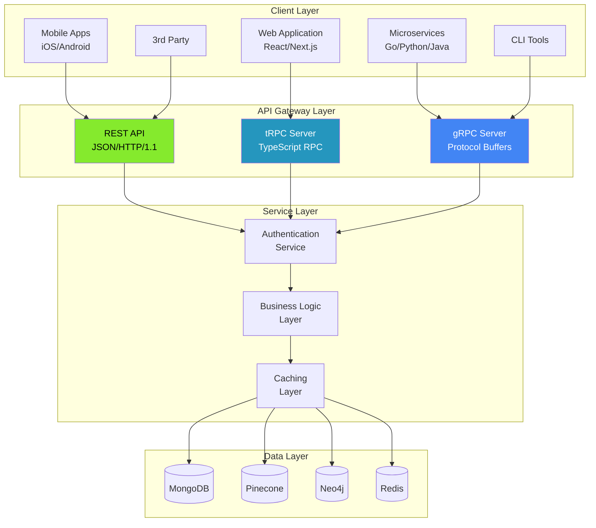
```mermaid
flowchart TB
    subgraph "Client Layer"
        Web[Web Application<br/>React/Next.js]
        Mobile[Mobile Apps<br/>iOS/Android]
        Services[Microservices<br/>Go/Python/Java]
        CLI[CLI Tools]
        External[3rd Party]
    end

    subgraph "API Gateway Layer"
        REST[REST API<br/>JSON/HTTP/1.1]
        TRPC[tRPC Server<br/>TypeScript RPC]
        GRPC[gRPC Server<br/>Protocol Buffers]
    end

    subgraph "Service Layer"
        Auth[Authentication<br/>Service]
        BL[Business Logic<br/>Layer]
        Cache[Caching<br/>Layer]
    end

    subgraph "Data Layer"
        MongoDB[(MongoDB)]
        Pinecone[(Pinecone)]
        Neo4j[(Neo4j)]
        Redis[(Redis)]
    end

    Web --> TRPC
    Mobile --> REST
    Services --> GRPC
    CLI --> GRPC
    External --> REST

    REST --> Auth
    TRPC --> Auth
    GRPC --> Auth

    Auth --> BL
    BL --> Cache
    Cache --> MongoDB
    Cache --> Pinecone
    Cache --> Neo4j
    Cache --> Redis

    style TRPC fill:#2596BE,color:#fff
    style GRPC fill:#4285F4,color:#fff
    style REST fill:#85EA2D,color:#000
```

The architecture follows key design principles:
- **Protocol Independence**: Business logic remains agnostic to transport protocols
- **Shared Services**: All protocols access the same backend services and data stores
- **Optimal Path Selection**: Each client type uses the most appropriate protocol
- **Consistency**: Uniform behavior across protocols through shared implementation

## gRPC Implementation

### Understanding gRPC in Depth

gRPC (Google Remote Procedure Call) is a modern, open-source, high-performance RPC framework that can run in any environment. It enables client and server applications to communicate transparently and simplifies the building of connected systems. EstateWise leverages gRPC for its superior performance characteristics, native streaming capabilities, and robust cross-language support.

The framework uses HTTP/2 as its transport protocol, providing multiplexing, flow control, header compression, and bidirectional streaming. Protocol Buffers serve as both the Interface Definition Language (IDL) and the message interchange format, offering a platform-neutral, extensible mechanism for serializing structured data.

### Architecture & Components

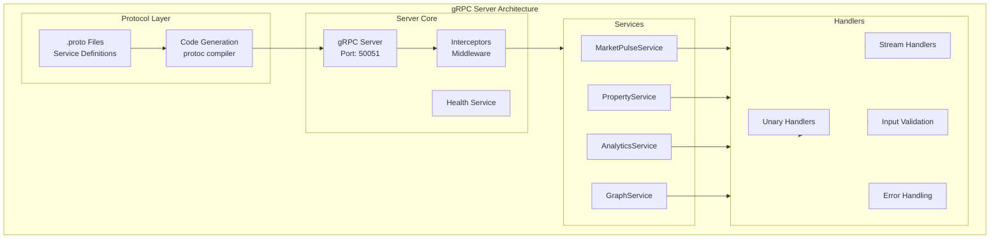
```mermaid
flowchart TB
    subgraph "gRPC Server Architecture"
        subgraph "Protocol Layer"
            Proto[.proto Files<br/>Service Definitions]
            Codegen[Code Generation<br/>protoc compiler]
        end

        subgraph "Server Core"
            Server[gRPC Server<br/>Port: 50051]
            Interceptors[Interceptors<br/>Middleware]
            Health[Health Service]
        end

        subgraph "Services"
            Market[MarketPulseService]
            Property[PropertyService]
            Analytics[AnalyticsService]
            Graph[GraphService]
        end

        subgraph "Handlers"
            Unary[Unary Handlers]
            Stream[Stream Handlers]
            Validator[Input Validation]
            Error[Error Handling]
        end
    end

    Proto --> Codegen
    Codegen --> Server
    Server --> Interceptors
    Interceptors --> Services

    Market --> Handlers
    Property --> Handlers
    Analytics --> Handlers
    Graph --> Handlers

    Handlers --> Unary
    Handlers --> Stream
    Handlers --> Validator
    Handlers --> Error
```

### Protocol Buffers Deep Dive

Protocol Buffers provide several advantages over JSON:
- **Compact Binary Format**: 20-30% smaller payloads than equivalent JSON
- **Strong Typing**: Type safety enforced at compile time
- **Backward Compatibility**: Field numbering enables schema evolution
- **Language Agnostic**: Code generation for 10+ programming languages
- **Performance**: Faster serialization/deserialization than JSON

Message definition follows structured patterns with field types, numbers, and rules:
- **Scalar Types**: int32, int64, float, double, bool, string, bytes
- **Composite Types**: Messages, enums, oneofs, maps, repeated fields
- **Well-Known Types**: Timestamp, Duration, Any, Struct, Value
- **Field Rules**: Required (deprecated), optional, repeated
- **Extensions**: Reserve fields for future use without breaking compatibility

### Streaming Patterns Explained

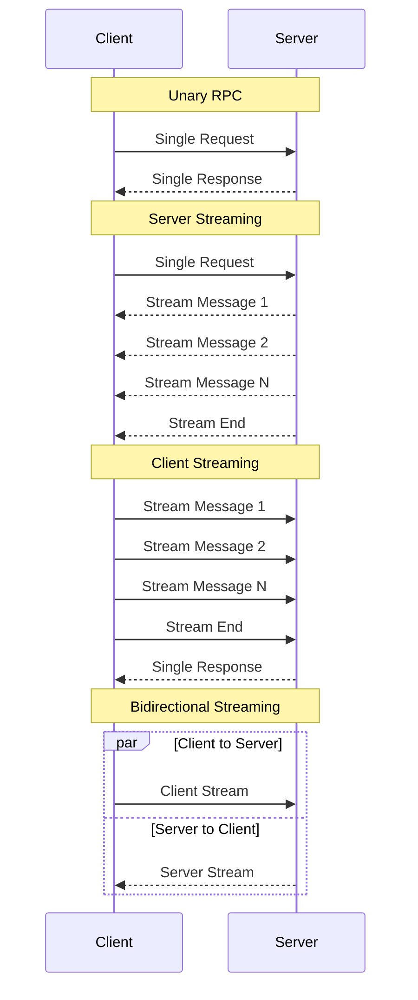
```mermaid
sequenceDiagram
    participant C as Client
    participant S as Server

    Note over C,S: Unary RPC
    C->>S: Single Request
    S-->>C: Single Response

    Note over C,S: Server Streaming
    C->>S: Single Request
    S-->>C: Stream Message 1
    S-->>C: Stream Message 2
    S-->>C: Stream Message N
    S-->>C: Stream End

    Note over C,S: Client Streaming
    C->>S: Stream Message 1
    C->>S: Stream Message 2
    C->>S: Stream Message N
    C->>S: Stream End
    S-->>C: Single Response

    Note over C,S: Bidirectional Streaming
    par Client to Server
        C->>S: Client Stream
    and Server to Client
        S-->>C: Server Stream
    end
```

**Unary RPC** suits traditional request-response operations:
- Property lookups by ID
- User authentication
- Simple CRUD operations
- Synchronous calculations

**Server Streaming** enables progressive data delivery:
- Real-time market updates
- Large dataset pagination
- Search results as they're found
- Log streaming

**Client Streaming** aggregates multiple client inputs:
- Batch property uploads
- Telemetry collection
- File uploads in chunks
- Event aggregation

**Bidirectional Streaming** powers real-time interactions:
- Chat applications
- Collaborative editing
- Live bidding systems
- Video conferencing

### Service Implementation Details

EstateWise implements four core gRPC services, each handling specific domain responsibilities:

**MarketPulseService** provides real-time market analytics:
- GetSnapshot: Returns current market conditions for a location
- StreamHotZips: Continuously streams trending zip codes
- ListMarkets: Returns available market datasets
- GetTrends: Analyzes historical market patterns

**PropertyService** manages property data operations:
- GetProperty: Retrieves single property by ID
- ListProperties: Returns filtered property lists
- SearchProperties: Performs vector similarity search
- StreamUpdates: Real-time property change notifications
- BatchGet: Efficiently retrieves multiple properties

**AnalyticsService** delivers complex calculations:
- PredictPrice: ML-based property valuation
- CalculateROI: Investment return analysis
- GetComparables: Find similar properties
- StreamMetrics: Real-time performance indicators

**GraphService** handles relationship queries:
- GetSimilar: Find related properties via graph
- ExplainPath: Describe relationship between properties
- GetNeighborhood: Aggregate neighborhood statistics
- TraverseRelations: Complex graph queries

### Performance Optimization Techniques

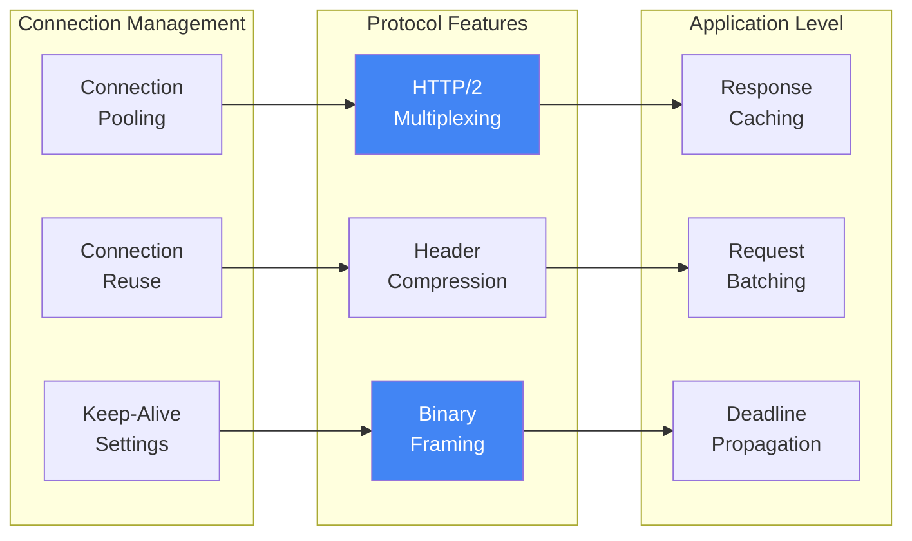
```mermaid
flowchart LR
    subgraph "Connection Management"
        Pool[Connection<br/>Pooling]
        Reuse[Connection<br/>Reuse]
        Keep[Keep-Alive<br/>Settings]
    end

    subgraph "Protocol Features"
        Multi[HTTP/2<br/>Multiplexing]
        Compress[Header<br/>Compression]
        Binary[Binary<br/>Framing]
    end

    subgraph "Application Level"
        Cache[Response<br/>Caching]
        Batch[Request<br/>Batching]
        Deadline[Deadline<br/>Propagation]
    end

    Pool --> Multi
    Reuse --> Compress
    Keep --> Binary

    Multi --> Cache
    Compress --> Batch
    Binary --> Deadline

    style Multi fill:#4285F4,color:#fff
    style Binary fill:#4285F4,color:#fff
```

**Connection Optimization**:
- Persistent HTTP/2 connections reduce handshake overhead
- Connection pooling distributes load across multiple connections
- Keep-alive pings maintain connections through proxies
- Automatic reconnection with exponential backoff

**Message Optimization**:
- Streaming compression (gzip, snappy) reduces bandwidth
- Message batching amortizes protocol overhead
- Field-level lazy deserialization improves memory usage
- Protobuf arena allocation reduces memory fragmentation

**Flow Control**:
- Window-based flow control prevents overwhelming receivers
- Backpressure propagation manages system load
- Deadline propagation ensures timely request cancellation
- Circuit breakers prevent cascade failures

### Error Handling & Status Codes

gRPC provides rich error semantics through status codes and metadata:

**Standard Status Codes**:
- OK (0): Successful completion
- CANCELLED (1): Operation cancelled by client
- UNKNOWN (2): Unknown error
- INVALID_ARGUMENT (3): Client specified invalid argument
- DEADLINE_EXCEEDED (4): Deadline expired
- NOT_FOUND (5): Resource not found
- ALREADY_EXISTS (6): Resource already exists
- PERMISSION_DENIED (7): Insufficient permissions
- RESOURCE_EXHAUSTED (8): Rate limiting or quota exceeded
- FAILED_PRECONDITION (9): System not in required state
- ABORTED (10): Operation aborted due to conflict
- OUT_OF_RANGE (11): Operation outside valid range
- UNIMPLEMENTED (12): Operation not implemented
- INTERNAL (13): Internal server error
- UNAVAILABLE (14): Service unavailable
- DATA_LOSS (15): Unrecoverable data loss

**Error Metadata**: Additional context through trailing metadata including detailed error messages, retry information, debug traces, and resource identifiers.

### Load Balancing Strategies

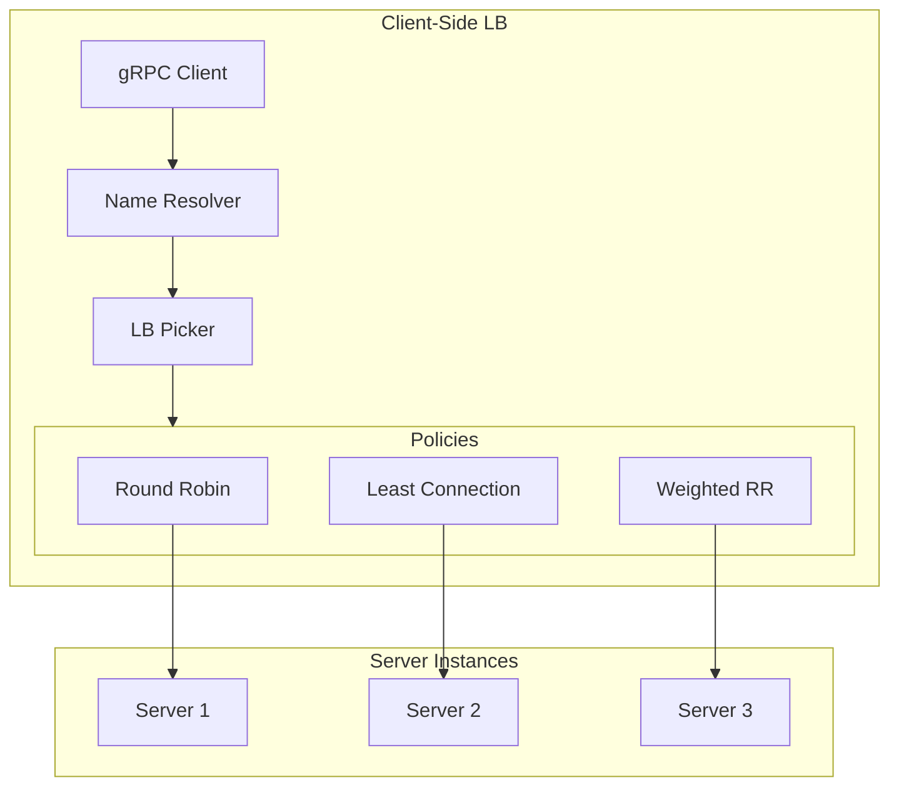
```mermaid
flowchart TB
    subgraph "Client-Side LB"
        Client[gRPC Client]
        Resolver[Name Resolver]
        Picker[LB Picker]
        subgraph "Policies"
            RR[Round Robin]
            LC[Least Connection]
            WRR[Weighted RR]
        end
    end

    subgraph "Server Instances"
        S1[Server 1]
        S2[Server 2]
        S3[Server 3]
    end

    Client --> Resolver
    Resolver --> Picker
    Picker --> Policies

    RR --> S1
    LC --> S2
    WRR --> S3
```

gRPC supports sophisticated load balancing:
- **Pick First**: Tries addresses sequentially until one succeeds
- **Round Robin**: Distributes requests evenly across backends
- **Weighted Round Robin**: Distributes based on server capacity
- **Least Request**: Routes to server with fewest active requests
- **Random**: Randomly selects backend
- **Consistent Hash**: Routes based on request parameters

## tRPC Implementation

### Understanding tRPC Philosophy

tRPC (TypeScript Remote Procedure Call) revolutionizes API development for TypeScript applications by providing end-to-end type safety without code generation, schema definitions, or runtime overhead. The framework leverages TypeScript's powerful type system to create a seamless development experience where API contracts are automatically enforced at compile time.

The core innovation of tRPC is its ability to share types directly between frontend and backend without intermediate steps. This eliminates the traditional impedance mismatch between client and server development, reducing bugs, improving developer velocity, and ensuring API consistency.

### Type Safety Architecture

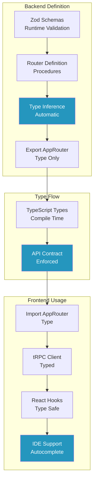
```mermaid
flowchart TB
    subgraph "Backend Definition"
        Zod[Zod Schemas<br/>Runtime Validation]
        Router[Router Definition<br/>Procedures]
        Infer[Type Inference<br/>Automatic]
        Export[Export AppRouter<br/>Type Only]
    end

    subgraph "Type Flow"
        Types[TypeScript Types<br/>Compile Time]
        Contract[API Contract<br/>Enforced]
    end

    subgraph "Frontend Usage"
        Import[Import AppRouter<br/>Type]
        Client[tRPC Client<br/>Typed]
        Hooks[React Hooks<br/>Type Safe]
        IDE[IDE Support<br/>Autocomplete]
    end

    Zod --> Router
    Router --> Infer
    Infer --> Export

    Export --> Types
    Types --> Contract

    Contract --> Import
    Import --> Client
    Client --> Hooks
    Hooks --> IDE

    style Infer fill:#2596BE,color:#fff
    style Contract fill:#2596BE,color:#fff
    style IDE fill:#2596BE,color:#fff
```

### Router Organization & Structure

EstateWise's tRPC implementation follows a hierarchical router structure that mirrors the application's domain model:

**Root Router (appRouter)**: Entry point aggregating all feature routers, provides type definition for entire API, and enables modular development.

**Feature Routers**:

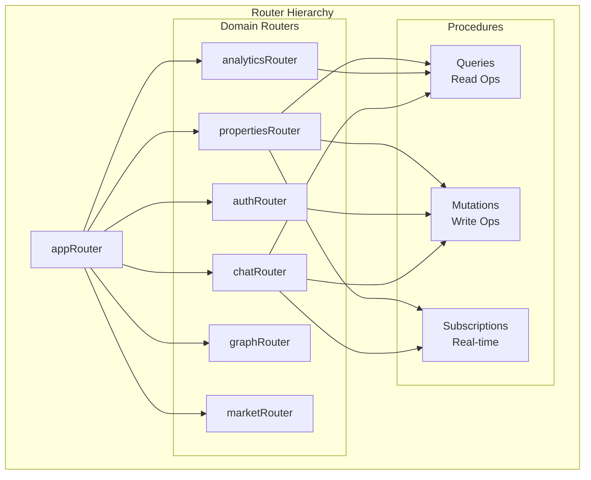
```mermaid
graph TD
    subgraph "Router Hierarchy"
        App[appRouter]

        subgraph "Domain Routers"
            Props[propertiesRouter]
            Auth[authRouter]
            Analytics[analyticsRouter]
            Chat[chatRouter]
            Graph[graphRouter]
            Market[marketRouter]
        end

        subgraph "Procedures"
            Q[Queries<br/>Read Ops]
            M[Mutations<br/>Write Ops]
            S[Subscriptions<br/>Real-time]
        end
    end

    App --> Props
    App --> Auth
    App --> Analytics
    App --> Chat
    App --> Graph
    App --> Market

    Props --> Q
    Props --> M
    Props --> S

    Auth --> M
    Analytics --> Q
    Chat --> Q
    Chat --> M
    Chat --> S
```

**Properties Router** handles all property-related operations:
- list: Paginated property listings with filters
- byId: Single property retrieval
- search: Vector similarity search
- create: New property listing
- update: Modify existing property
- delete: Remove property
- batchGet: Retrieve multiple properties
- similar: Find comparable properties
- subscribe: Real-time property updates

**Analytics Router** provides complex calculations:
- marketTrends: Historical trend analysis
- pricePrediction: ML-based valuation
- neighborhoodStats: Area demographics
- investmentMetrics: ROI calculations
- heatmap: Geographic data visualization
- comparativeAnalysis: Multi-property comparison
- portfolioPerformance: Investment tracking

**Authentication Router** manages user sessions:
- login: User authentication
- signup: Account creation
- logout: Session termination
- refresh: Token renewal
- verify: Email verification
- resetPassword: Password recovery
- updateProfile: Profile management
- permissions: Role-based access

### Context System Deep Dive

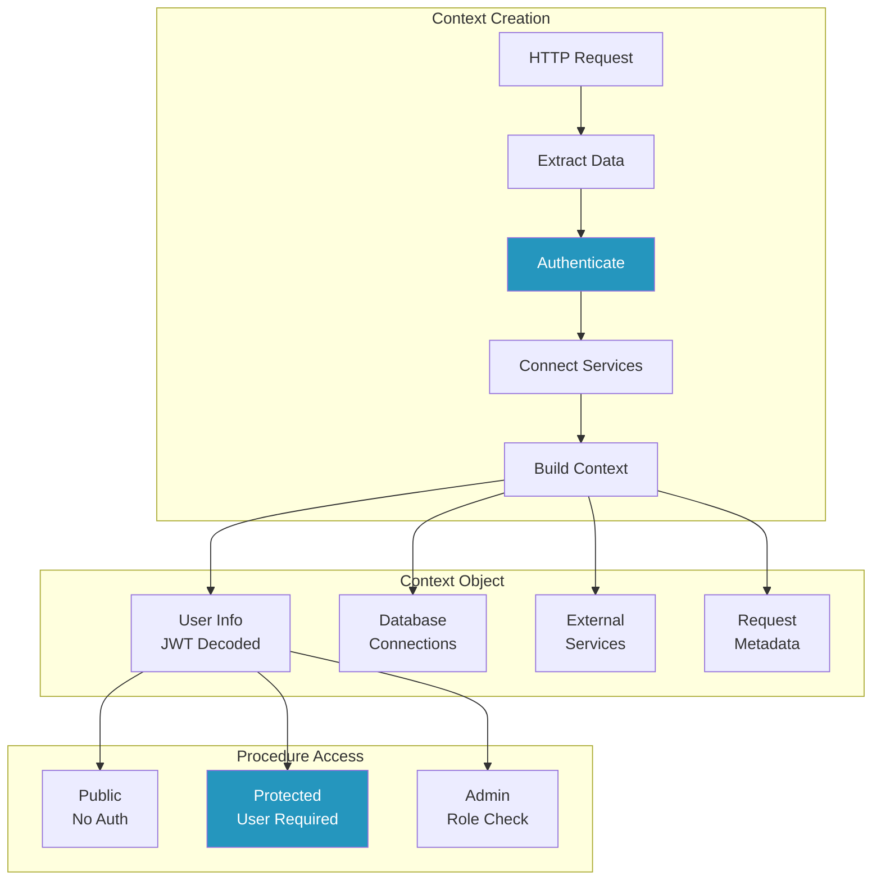
```mermaid
flowchart TD
    subgraph "Context Creation"
        HTTP[HTTP Request]
        Extract[Extract Data]
        Auth[Authenticate]
        Connect[Connect Services]
        Build[Build Context]
    end

    subgraph "Context Object"
        User[User Info<br/>JWT Decoded]
        DB[Database<br/>Connections]
        Services[External<br/>Services]
        Meta[Request<br/>Metadata]
    end

    subgraph "Procedure Access"
        Public[Public<br/>No Auth]
        Protected[Protected<br/>User Required]
        Admin[Admin<br/>Role Check]
    end

    HTTP --> Extract
    Extract --> Auth
    Auth --> Connect
    Connect --> Build

    Build --> User
    Build --> DB
    Build --> Services
    Build --> Meta

    User --> Public
    User --> Protected
    User --> Admin

    style Auth fill:#2596BE,color:#fff
    style Protected fill:#2596BE,color:#fff
```

The context system provides request-scoped resources:

**Context Creation Process**:
1. Extract request information (headers, cookies, IP)
2. Parse and validate JWT tokens
3. Establish database connections from pool
4. Initialize service clients with credentials
5. Set up request-scoped logging with correlation IDs
6. Create performance monitoring spans

**Context Contents**:
- User object with permissions and preferences
- Database clients (MongoDB, Pinecone, Neo4j, Redis)
- External service clients (Gemini AI, email, SMS)
- Request metadata (IP, user agent, correlation ID)
- Performance tracking (start time, deadlines)
- Feature flags and configuration

### Middleware System

tRPC's middleware system enables cross-cutting concerns through composable functions:

**Authentication Middleware**: Validates JWT tokens, refreshes expired tokens, populates user context, and enforces access control.

**Logging Middleware**: Records request details, tracks performance metrics, correlates distributed traces, and captures errors with context.

**Rate Limiting Middleware**: Implements token bucket algorithm, tracks per-user and per-IP limits, provides rate limit headers, and handles quota exceeded scenarios.

**Validation Middleware**: Extends Zod validation, enforces business rules, sanitizes inputs, and normalizes data formats.

**Caching Middleware**: Implements response caching, manages cache invalidation, provides ETags support, and handles conditional requests.

### Procedure Types & Patterns

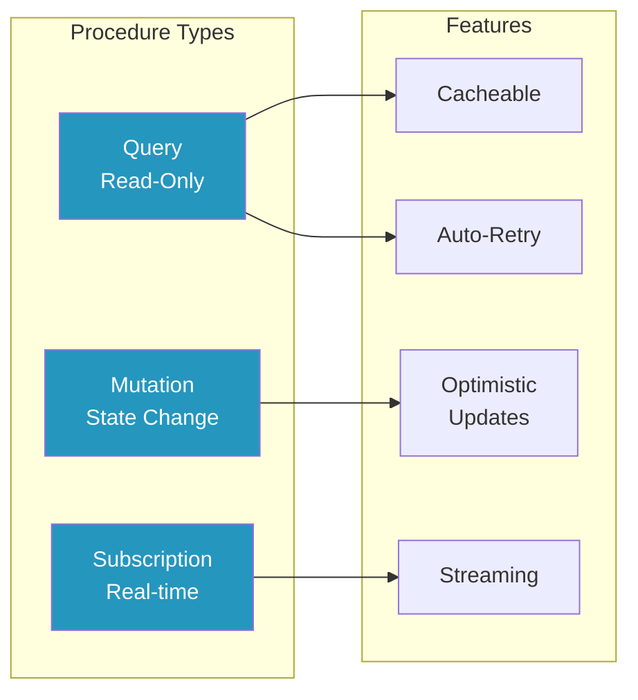
```mermaid
flowchart LR
    subgraph "Procedure Types"
        Query[Query<br/>Read-Only]
        Mutation[Mutation<br/>State Change]
        Subscription[Subscription<br/>Real-time]
    end

    subgraph "Features"
        Cache[Cacheable]
        Retry[Auto-Retry]
        Optimistic[Optimistic<br/>Updates]
        Stream[Streaming]
    end

    Query --> Cache
    Query --> Retry
    Mutation --> Optimistic
    Subscription --> Stream

    style Query fill:#2596BE,color:#fff
    style Mutation fill:#2596BE,color:#fff
    style Subscription fill:#2596BE,color:#fff
```

**Query Procedures** for read operations:
- Automatically cached by React Query
- Safe to retry on failure
- Can be prefetched during SSR
- Support parallel execution
- Examples: getProperty, listProperties, searchProperties

**Mutation Procedures** for state changes:
- Not automatically retried
- Support optimistic updates
- Can invalidate related queries
- Provide success/error callbacks
- Examples: createProperty, updateProperty, deleteProperty

**Subscription Procedures** for real-time updates:
- Use WebSocket transport
- Maintain persistent connections
- Support reconnection logic
- Handle backpressure
- Examples: propertyUpdates, priceChanges, chatMessages

### Frontend Integration Details

tRPC's frontend integration provides seamless TypeScript experience:

**Client Creation** with configuration for batching, caching, and error handling. The client knows all available procedures and their types.

**React Hooks Integration** provides useQuery for data fetching, useMutation for state changes, useSubscription for real-time data, and useInfiniteQuery for pagination.

**Type Safety Benefits**:
- Autocomplete for all procedure names
- Type checking for input parameters
- Inferred response types
- Compile-time validation
- Refactoring safety across stack

**Developer Experience Features**:
- Hot reload preserves types
- No code generation step
- Instant feedback on API changes
- IDE navigation between client and server
- Detailed error messages with type hints

### Error Handling & Validation

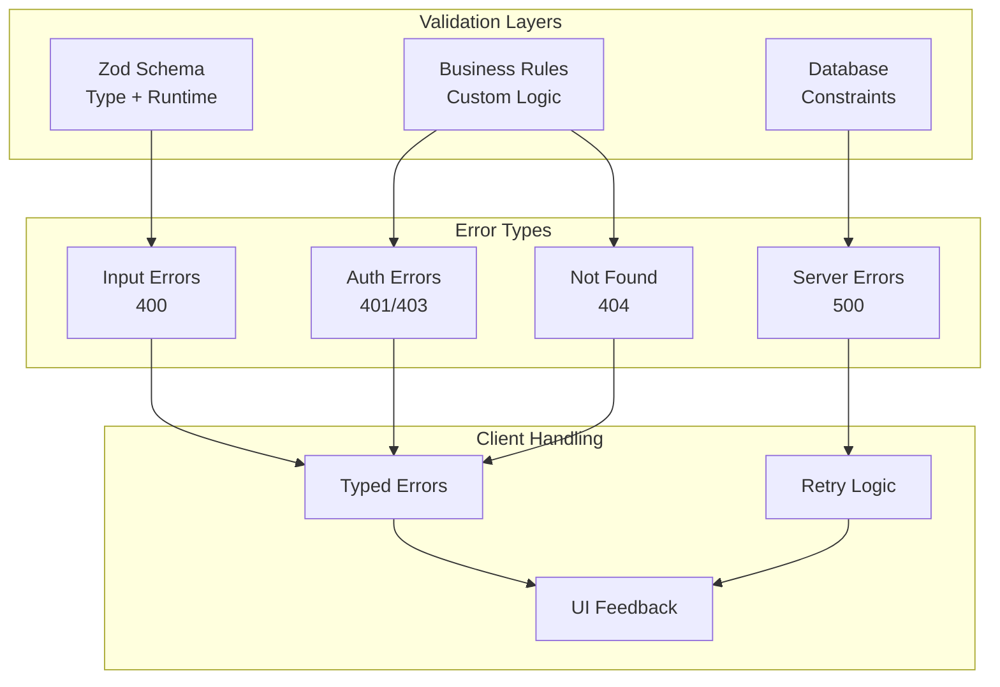
```mermaid
flowchart TB
    subgraph "Validation Layers"
        Zod[Zod Schema<br/>Type + Runtime]
        Business[Business Rules<br/>Custom Logic]
        Database[Database<br/>Constraints]
    end

    subgraph "Error Types"
        Input[Input Errors<br/>400]
        Auth[Auth Errors<br/>401/403]
        NotFound[Not Found<br/>404]
        Server[Server Errors<br/>500]
    end

    subgraph "Client Handling"
        Typed[Typed Errors]
        Retry[Retry Logic]
        UI[UI Feedback]
    end

    Zod --> Input
    Business --> Auth
    Business --> NotFound
    Database --> Server

    Input --> Typed
    Auth --> Typed
    NotFound --> Typed
    Server --> Retry

    Typed --> UI
    Retry --> UI
```

tRPC provides sophisticated error handling:
- Zod validation errors with field-level details
- Custom business logic errors with context
- Network errors with retry strategies
- Type-safe error discrimination
- Graceful degradation patterns

## Protocol Comparison & Selection

### Comprehensive Feature Matrix

| Category | Feature | REST | tRPC | gRPC |
|----------|---------|------|------|------|
| **Type Safety** | Compile-time checking | ❌ Manual | ✅ Automatic | ✅ Generated |
| | Runtime validation | ✅ Libraries | ✅ Zod | ✅ Protobuf |
| | Refactoring safety | ❌ | ✅ | ⚠️ Regenerate |
| **Performance** | Payload size | Baseline | Same as REST | -30% |
| | Latency | Baseline | Same as REST | -25% |
| | Throughput | 1x | 1x | 1.5x |
| | Connection reuse | ⚠️ HTTP/1.1 | ⚠️ HTTP/1.1 | ✅ HTTP/2 |
| **Streaming** | Server push | ❌ SSE/WS | ⚠️ Subscriptions | ✅ Native |
| | Bidirectional | ❌ | ❌ | ✅ |
| | Backpressure | ❌ | ❌ | ✅ |
| **Developer Experience** | Learning curve | Low | Medium | High |
| | Documentation | OpenAPI | Types as docs | Proto files |
| | Tooling | Extensive | TypeScript | Multi-language |
| | Debugging | Easy | Easy | Complex |
| **Compatibility** | Browser support | ✅ Universal | ✅ Universal | ⚠️ Proxy needed |
| | Language support | ✅ Any | ❌ TypeScript | ✅ 10+ langs |
| | Legacy systems | ✅ | ❌ | ⚠️ |
| **Features** | Caching | ✅ HTTP | ✅ React Query | ❌ Custom |
| | File upload | ✅ Multipart | ⚠️ Base64 | ✅ Streaming |
| | Auth standards | ✅ OAuth/JWT | ✅ JWT | ⚠️ Custom |

### Performance Benchmarks

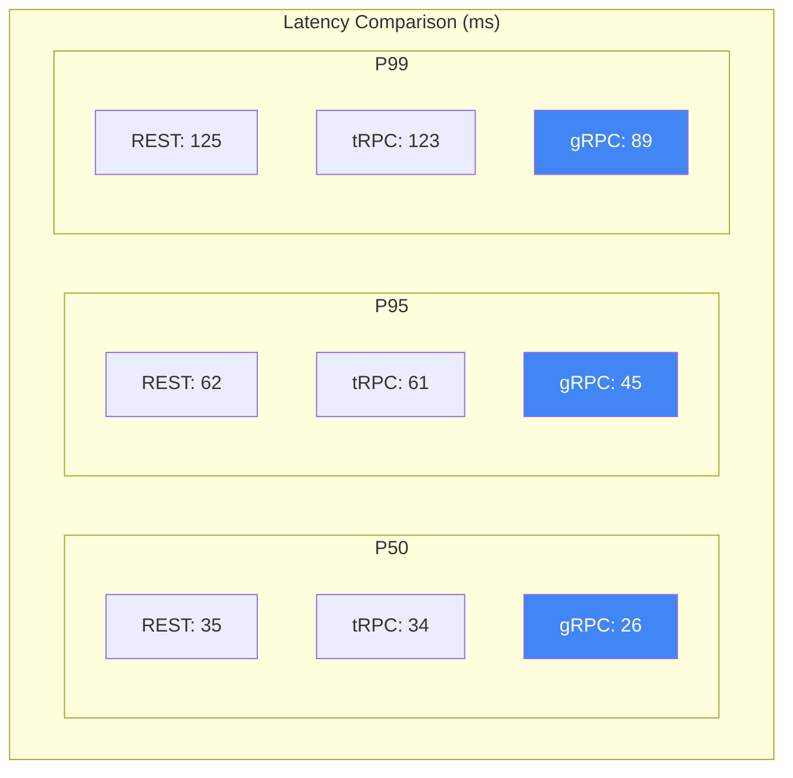
```mermaid
graph TB
    subgraph "Latency Comparison (ms)"
        subgraph "P50"
            REST_50[REST: 35]
            TRPC_50[tRPC: 34]
            GRPC_50[gRPC: 26]
        end
        subgraph "P95"
            REST_95[REST: 62]
            TRPC_95[tRPC: 61]
            GRPC_95[gRPC: 45]
        end
        subgraph "P99"
            REST_99[REST: 125]
            TRPC_99[tRPC: 123]
            GRPC_99[gRPC: 89]
        end
    end

    style GRPC_50 fill:#4285F4,color:#fff
    style GRPC_95 fill:#4285F4,color:#fff
    style GRPC_99 fill:#4285F4,color:#fff
```

### Decision Framework

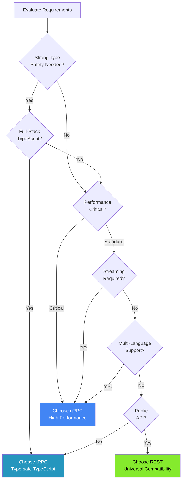
```mermaid
flowchart TD
    Start[Evaluate Requirements]

    TypeSafe{Strong Type<br/>Safety Needed?}
    FullStack{Full-Stack<br/>TypeScript?}
    Performance{Performance<br/>Critical?}
    Streaming{Streaming<br/>Required?}
    MultiLang{Multi-Language<br/>Support?}
    Public{Public<br/>API?}

    UseTRPC[Choose tRPC<br/>Type-safe TypeScript]
    UseGRPC[Choose gRPC<br/>High Performance]
    UseREST[Choose REST<br/>Universal Compatibility]

    Start --> TypeSafe
    TypeSafe -->|Yes| FullStack
    TypeSafe -->|No| Performance

    FullStack -->|Yes| UseTRPC
    FullStack -->|No| Performance

    Performance -->|Critical| UseGRPC
    Performance -->|Standard| Streaming

    Streaming -->|Yes| UseGRPC
    Streaming -->|No| MultiLang

    MultiLang -->|Yes| UseGRPC
    MultiLang -->|No| Public

    Public -->|Yes| UseREST
    Public -->|No| UseTRPC

    style UseTRPC fill:#2596BE,color:#fff
    style UseGRPC fill:#4285F4,color:#fff
    style UseREST fill:#85EA2D,color:#000
```

## Integration Patterns

### Service Mesh Integration

Both RPC protocols integrate seamlessly with modern service mesh architectures:

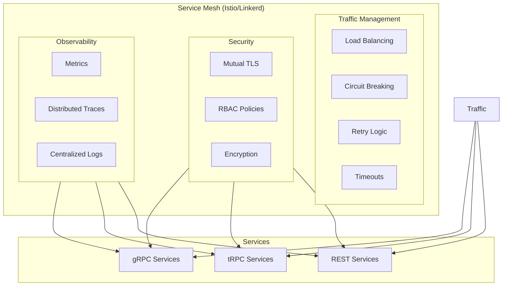
```mermaid
flowchart TB
    subgraph "Service Mesh (Istio/Linkerd)"
        subgraph "Traffic Management"
            LB[Load Balancing]
            CB[Circuit Breaking]
            Retry[Retry Logic]
            Timeout[Timeouts]
        end

        subgraph "Security"
            mTLS[Mutual TLS]
            RBAC[RBAC Policies]
            Encryption[Encryption]
        end

        subgraph "Observability"
            Metrics[Metrics]
            Traces[Distributed Traces]
            Logs[Centralized Logs]
        end
    end

    subgraph "Services"
        GRPC[gRPC Services]
        TRPC[tRPC Services]
        REST[REST Services]
    end

    Traffic --> GRPC
    Traffic --> TRPC
    Traffic --> REST

    Security --> GRPC
    Security --> TRPC
    Security --> REST

    Observability --> GRPC
    Observability --> TRPC
    Observability --> REST
```

**gRPC Mesh Integration**:
- Native support for Envoy proxy
- Automatic protocol detection
- Built-in load balancing policies
- Metadata propagation for tracing
- Health check protocol support

**tRPC Mesh Integration**:
- Standard HTTP routing
- Header-based routing rules
- Cookie-based session affinity
- Request/response transformation
- Rate limiting at mesh level

### Cross-Protocol Communication

EstateWise implements several patterns for protocol interoperability:

**Protocol Translation Gateway**: Converts between protocols at the API gateway, maintains semantic equivalence, handles error mapping, and preserves security context.

**Event-Driven Architecture**: Services publish protocol-agnostic events, consumers choose their preferred protocol, maintains loose coupling, and enables polyglot architecture.

**Shared Service Layer**: Business logic remains protocol-agnostic, protocol handlers act as adapters, ensures consistent behavior, and simplifies testing.

**Hybrid Clients**: Clients can use multiple protocols, REST for public endpoints, tRPC for type-safe operations, and gRPC for streaming.

## Security Architecture

### Authentication & Authorization

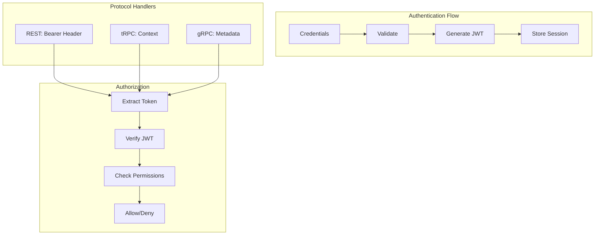
```mermaid
flowchart TB
    subgraph "Authentication Flow"
        Creds[Credentials]
        Validate[Validate]
        Generate[Generate JWT]
        Store[Store Session]
    end

    subgraph "Protocol Handlers"
        REST_Auth[REST: Bearer Header]
        TRPC_Auth[tRPC: Context]
        GRPC_Auth[gRPC: Metadata]
    end

    subgraph "Authorization"
        Extract[Extract Token]
        Verify[Verify JWT]
        Check[Check Permissions]
        Allow[Allow/Deny]
    end

    Creds --> Validate
    Validate --> Generate
    Generate --> Store

    REST_Auth --> Extract
    TRPC_Auth --> Extract
    GRPC_Auth --> Extract

    Extract --> Verify
    Verify --> Check
    Check --> Allow
```

**Common Security Infrastructure**:
- Shared JWT validation service
- Unified permission system
- Centralized audit logging
- Common rate limiting
- Shared session store

**Protocol-Specific Implementation**:

REST Security:
- Standard Authorization headers
- OAuth 2.0 support
- API key authentication
- CORS configuration

tRPC Security:
- Context-based auth
- Procedure-level permissions
- Type-safe user objects
- Automatic token refresh

gRPC Security:
- Metadata-based auth
- mTLS support
- Channel credentials
- Call credentials

### Threat Mitigation Strategies

**Input Validation**: Multi-layer validation approach with protocol-level type checking, application-level business rules, and database-level constraints.

**Rate Limiting**: Hierarchical limits with global system protection, per-user quotas, per-endpoint limits, and geographic restrictions.

**Encryption**: Comprehensive encryption strategy with TLS 1.3 for transport, field-level encryption for PII, encrypted session storage, and secure key management.

**Audit & Monitoring**: Complete audit trail with request/response logging, security event tracking, anomaly detection, and compliance reporting.

## Deployment & Operations

### Container Architecture

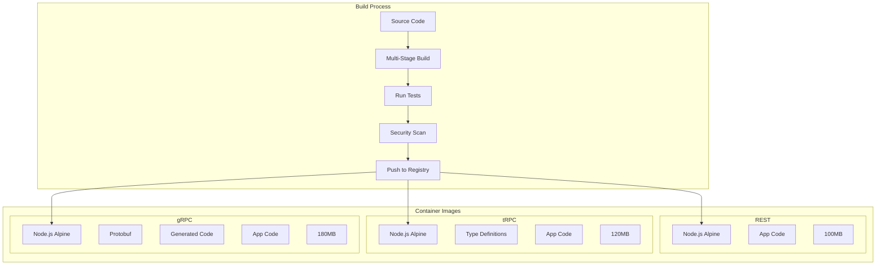
```mermaid
flowchart TB
    subgraph "Build Process"
        Source[Source Code]
        Build[Multi-Stage Build]
        Test[Run Tests]
        Scan[Security Scan]
        Push[Push to Registry]
    end

    subgraph "Container Images"
        subgraph "REST"
            REST_Base[Node.js Alpine]
            REST_App[App Code]
            REST_Size[100MB]
        end

        subgraph "tRPC"
            TRPC_Base[Node.js Alpine]
            TRPC_Types[Type Definitions]
            TRPC_App[App Code]
            TRPC_Size[120MB]
        end

        subgraph "gRPC"
            GRPC_Base[Node.js Alpine]
            GRPC_Proto[Protobuf]
            GRPC_Gen[Generated Code]
            GRPC_App[App Code]
            GRPC_Size[180MB]
        end
    end

    Source --> Build
    Build --> Test
    Test --> Scan
    Scan --> Push

    Push --> REST_Base
    Push --> TRPC_Base
    Push --> GRPC_Base
```

### Kubernetes Deployment

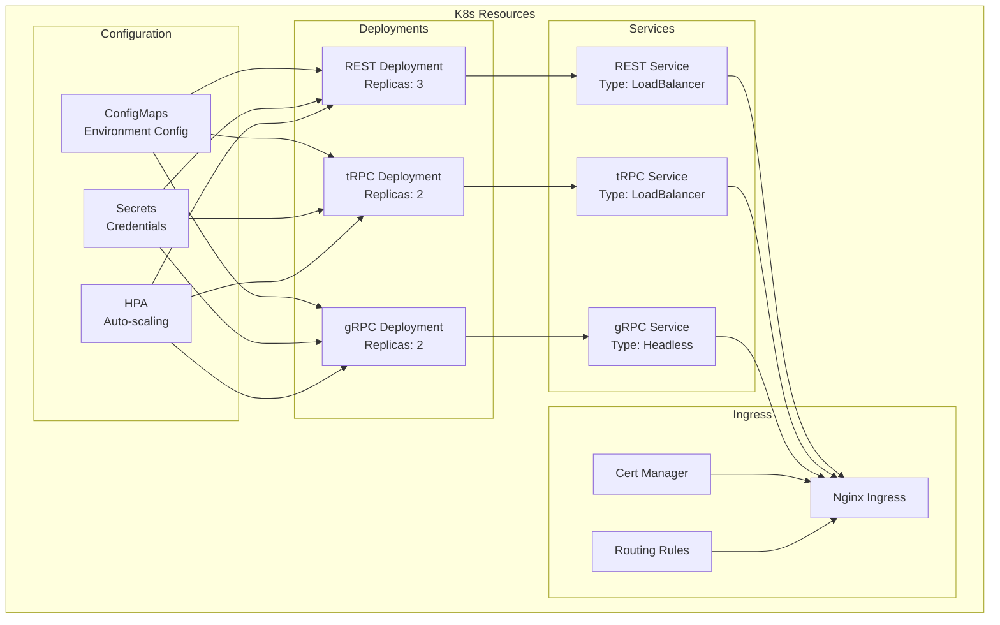
```mermaid
flowchart TB
    subgraph "K8s Resources"
        subgraph "Deployments"
            REST_Deploy[REST Deployment<br/>Replicas: 3]
            TRPC_Deploy[tRPC Deployment<br/>Replicas: 2]
            GRPC_Deploy[gRPC Deployment<br/>Replicas: 2]
        end

        subgraph "Services"
            REST_Svc[REST Service<br/>Type: LoadBalancer]
            TRPC_Svc[tRPC Service<br/>Type: LoadBalancer]
            GRPC_Svc[gRPC Service<br/>Type: Headless]
        end

        subgraph "Configuration"
            ConfigMap[ConfigMaps<br/>Environment Config]
            Secrets[Secrets<br/>Credentials]
            HPA[HPA<br/>Auto-scaling]
        end

        subgraph "Ingress"
            Nginx[Nginx Ingress]
            Cert[Cert Manager]
            Rules[Routing Rules]
        end
    end

    REST_Deploy --> REST_Svc
    TRPC_Deploy --> TRPC_Svc
    GRPC_Deploy --> GRPC_Svc

    ConfigMap --> REST_Deploy
    ConfigMap --> TRPC_Deploy
    ConfigMap --> GRPC_Deploy

    Secrets --> REST_Deploy
    Secrets --> TRPC_Deploy
    Secrets --> GRPC_Deploy

    HPA --> REST_Deploy
    HPA --> TRPC_Deploy
    HPA --> GRPC_Deploy

    REST_Svc --> Nginx
    TRPC_Svc --> Nginx
    GRPC_Svc --> Nginx

    Cert --> Nginx
    Rules --> Nginx
```

### Scaling Strategies

**Horizontal Scaling**: Protocol-specific considerations for scaling out:
- REST/tRPC: Standard round-robin load balancing
- gRPC: Client-side load balancing for better connection distribution
- All: Pod anti-affinity for high availability

**Vertical Scaling**: Resource optimization per protocol:
- gRPC: More memory for connection pools (512MB)
- tRPC: Standard Node.js requirements (256MB)
- REST: Minimal overhead (256MB)

**Auto-scaling Policies**: Metrics-based scaling triggers:
- CPU utilization > 70%
- Memory usage > 80%
- Request rate thresholds
- Custom business metrics

### Health Monitoring

Each protocol implements health checks for reliable operations:

**gRPC Health Checking**: Standard health checking protocol with service-specific health status, graceful degradation support, and dependency health aggregation.

**tRPC Health Checking**: Custom health procedure with database connectivity checks, external service validation, and performance metrics.

**REST Health Checking**: Traditional health endpoints with liveness probe at /health/live, readiness probe at /health/ready, and detailed status at /health/detail.

## Performance Optimization

### Caching Strategies

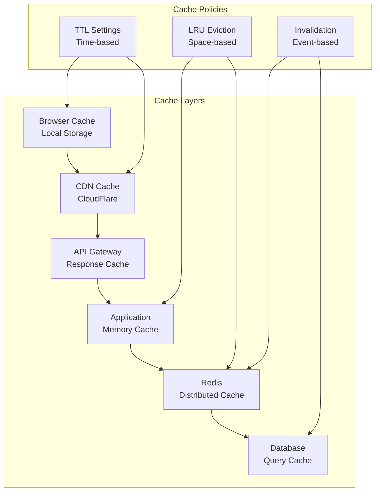
```mermaid
flowchart TB
    subgraph "Cache Layers"
        Browser[Browser Cache<br/>Local Storage]
        CDN[CDN Cache<br/>CloudFlare]
        Gateway[API Gateway<br/>Response Cache]
        App[Application<br/>Memory Cache]
        Redis[Redis<br/>Distributed Cache]
        DB[Database<br/>Query Cache]
    end

    subgraph "Cache Policies"
        TTL[TTL Settings<br/>Time-based]
        LRU[LRU Eviction<br/>Space-based]
        Invalidate[Invalidation<br/>Event-based]
    end

    Browser --> CDN
    CDN --> Gateway
    Gateway --> App
    App --> Redis
    Redis --> DB

    TTL --> Browser
    TTL --> CDN
    LRU --> App
    LRU --> Redis
    Invalidate --> Redis
    Invalidate --> DB
```

**REST Caching**: Leverages HTTP caching headers, ETag for conditional requests, CDN integration, and browser caching.

**tRPC Caching**: React Query integration with stale-while-revalidate, automatic background updates, optimistic updates, and query invalidation.

**gRPC Caching**: Application-level caching with Redis integration, response memoization, and custom cache keys.

### Connection Optimization

**gRPC Connection Management**:
- Persistent HTTP/2 connections
- Connection pooling with size limits
- Keep-alive with configurable intervals
- Automatic reconnection with backoff
- Connection state monitoring

**tRPC/REST Connection Optimization**:
- HTTP/1.1 keep-alive
- Connection reuse
- Request pipelining
- Compression (gzip, brotli)
- TCP nodelay

### Batching & Aggregation

**Request Batching**: Combining multiple operations for efficiency:
- tRPC: Automatic HTTP request batching
- gRPC: Manual batching in service methods
- REST: Explicit batch endpoints

**Data Aggregation**: Reducing round trips through smart queries:
- GraphQL-like field selection
- Included related resources
- Projection queries
- Aggregate computations

## Monitoring & Observability

### Metrics Collection Architecture

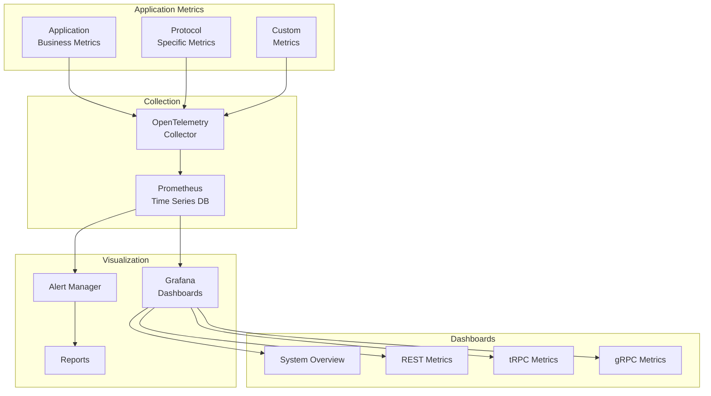
```mermaid
flowchart TB
    subgraph "Application Metrics"
        App[Application<br/>Business Metrics]
        Protocol[Protocol<br/>Specific Metrics]
        Custom[Custom<br/>Metrics]
    end

    subgraph "Collection"
        Prometheus[Prometheus<br/>Time Series DB]
        OTel[OpenTelemetry<br/>Collector]
    end

    subgraph "Visualization"
        Grafana[Grafana<br/>Dashboards]
        Alert[Alert Manager]
        Reports[Reports]
    end

    subgraph "Dashboards"
        Overview[System Overview]
        REST_Dash[REST Metrics]
        TRPC_Dash[tRPC Metrics]
        GRPC_Dash[gRPC Metrics]
    end

    App --> OTel
    Protocol --> OTel
    Custom --> OTel

    OTel --> Prometheus
    Prometheus --> Grafana
    Prometheus --> Alert

    Grafana --> Overview
    Grafana --> REST_Dash
    Grafana --> TRPC_Dash
    Grafana --> GRPC_Dash

    Alert --> Reports
```

### Key Performance Indicators

**System Metrics**:
- Request rate (req/s)
- Error rate (4xx, 5xx)
- Latency (P50, P95, P99)
- Saturation (CPU, memory, connections)

**Protocol-Specific Metrics**:

gRPC Metrics:
- Active streams count
- Stream duration
- Message send/receive rate
- Connection pool statistics
- Status code distribution

tRPC Metrics:
- Procedure call rate
- Batch size distribution
- Type validation failures
- Cache hit rate
- Subscription count

REST Metrics:
- HTTP method distribution
- Response size
- Cache effectiveness
- API version usage
- Client distribution

### Distributed Tracing

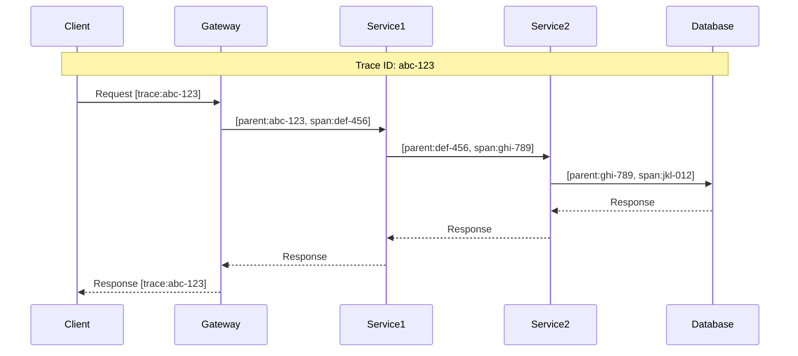
```mermaid
sequenceDiagram
    participant Client
    participant Gateway
    participant Service1
    participant Service2
    participant Database

    Note over Client,Database: Trace ID: abc-123

    Client->>Gateway: Request [trace:abc-123]
    Gateway->>Service1: [parent:abc-123, span:def-456]
    Service1->>Service2: [parent:def-456, span:ghi-789]
    Service2->>Database: [parent:ghi-789, span:jkl-012]
    Database-->>Service2: Response
    Service2-->>Service1: Response
    Service1-->>Gateway: Response
    Gateway-->>Client: Response [trace:abc-123]
```

**Trace Propagation**:
- gRPC: Automatic via metadata
- tRPC: Manual via headers
- REST: Standard headers (W3C Trace Context)

**Trace Analysis**:
- Request flow visualization
- Latency breakdown
- Error attribution
- Performance bottlenecks
- Service dependencies

## Best Practices

### API Design Guidelines

**Consistency Across Protocols**:
- Uniform resource naming
- Consistent error formats
- Shared validation rules
- Common pagination patterns
- Standardized filtering

**Version Management**:
- Semantic versioning
- Backward compatibility
- Deprecation notices
- Migration guides
- Feature flags

**Documentation Standards**:
- API reference documentation
- Integration guides
- Code examples
- Change logs
- Migration paths

### Testing Strategies

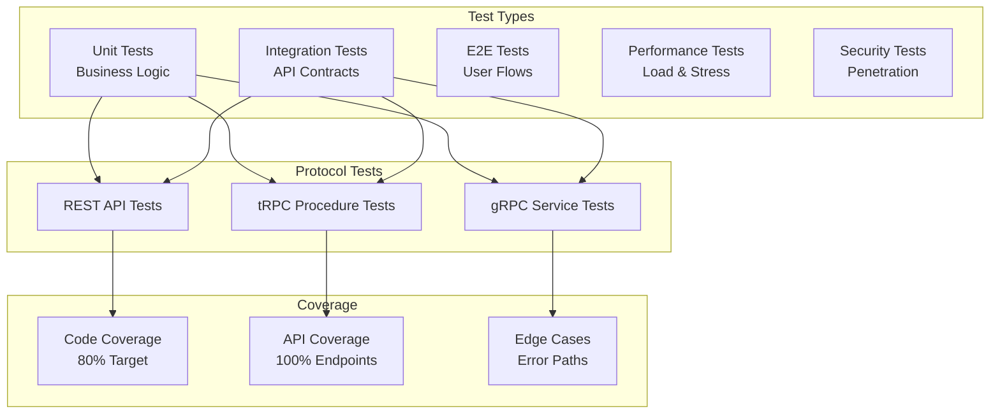
```mermaid
flowchart TB
    subgraph "Test Types"
        Unit[Unit Tests<br/>Business Logic]
        Integration[Integration Tests<br/>API Contracts]
        E2E[E2E Tests<br/>User Flows]
        Performance[Performance Tests<br/>Load & Stress]
        Security[Security Tests<br/>Penetration]
    end

    subgraph "Protocol Tests"
        REST_Test[REST API Tests]
        TRPC_Test[tRPC Procedure Tests]
        GRPC_Test[gRPC Service Tests]
    end

    subgraph "Coverage"
        Code[Code Coverage<br/>80% Target]
        API[API Coverage<br/>100% Endpoints]
        Edge[Edge Cases<br/>Error Paths]
    end

    Unit --> REST_Test
    Unit --> TRPC_Test
    Unit --> GRPC_Test

    Integration --> REST_Test
    Integration --> TRPC_Test
    Integration --> GRPC_Test

    REST_Test --> Code
    TRPC_Test --> API
    GRPC_Test --> Edge
```

**Test Implementation**:
- Unit tests for pure business logic
- Integration tests for API contracts
- Contract tests for protocol compatibility
- Load tests for performance baselines
- Chaos tests for resilience

### Operational Excellence

**Deployment Best Practices**:
- Blue-green deployments for zero downtime
- Canary releases for gradual rollout
- Feature flags for controlled activation
- Rollback procedures for quick recovery
- Health checks before traffic routing

**Monitoring & Alerting**:
- SLI/SLO definition and tracking
- Alert fatigue prevention
- Runbook automation
- Incident response procedures
- Post-mortem culture

**Capacity Planning**:
- Load testing regular intervals
- Growth projection models
- Resource utilization tracking
- Cost optimization
- Performance budgets

### Migration Patterns

```mermaid
flowchart LR
    subgraph "Migration Strategies"
        Parallel[Parallel Operation<br/>Multiple Protocols]
        Gradual[Gradual Migration<br/>Feature by Feature]
        Adapter[Adapter Pattern<br/>Protocol Translation]
    end

    subgraph "Stages"
        Stage1[Stage 1<br/>Add New Protocol]
        Stage2[Stage 2<br/>Migrate Features]
        Stage3[Stage 3<br/>Deprecate Old]
        Stage4[Stage 4<br/>Remove Legacy]
    end

    Parallel --> Stage1
    Gradual --> Stage2
    Adapter --> Stage2

    Stage1 --> Stage2
    Stage2 --> Stage3
    Stage3 --> Stage4
```

**Incremental Migration Steps**:
1. Deploy new protocol alongside existing
2. Route new features to new protocol
3. Gradually migrate existing features
4. Monitor metrics and performance
5. Deprecate old protocol with notice
6. Remove legacy code after transition period

**Risk Mitigation**:
- Maintain backward compatibility
- Provide protocol translation layer
- Implement comprehensive testing
- Monitor adoption metrics
- Gather user feedback
- Document migration guides

---

*This comprehensive documentation covers all aspects of EstateWise's RPC implementations. For specific implementation details and code examples, refer to the respective service repositories.*