# EstateWise RAG System Architecture

## Table of Contents
- [Overview](#overview)
- [System Architecture](#system-architecture)
- [Data Pipeline](#data-pipeline)
- [RAG Query Flow](#rag-query-flow)
- [How Graph DB Enhances RAG](#how-graph-db-enhances-rag)
- [Example User Journey](#example-user-journey)
- [Performance & Optimizations](#performance--optimizations)
- [Monitoring & Analytics](#monitoring--analytics)
- [Running the Pipeline](#running-the-pipeline)
- [Configuration](#configuration)
- [Getting Started](#getting-started)
- [System Comparison](#system-comparison)
- [Key Takeaways](#key-takeaways)
- [Frequently-Asked Questions](#frequently-asked-questions)
- [Learn More](#learn-more)

---

## Overview

EstateWise uses a **Hybrid RAG (Retrieval-Augmented Generation)** architecture that combines:

🔍 **Vector Database (Pinecone)** - Semantic similarity search using embeddings  
🕸️ **Knowledge Graph (Neo4j Aura)** - Relationship-based reasoning and explainability  
🤖 **Multi-Expert AI System** - Specialized agents for different analysis domains  
📊 **K-Means Clustering** - Property grouping for pattern recognition  

### Why Hybrid RAG?

Traditional RAG systems rely solely on vector similarity, which can miss important structural relationships. Our hybrid approach provides:

- ✅ **Semantic Understanding** (Vector DB): "Find homes matching this description"
- ✅ **Structural Context** (Knowledge Graph - Graph RAG): "These homes are in the same neighborhood"
- ✅ **Explainability**: "Recommended because: same zip code, similar price, nearby schools"
- ✅ **Richer Context**: Combines text similarity with geographic/demographic relationships

---

## System Architecture


### Component Breakdown

| Component | Technology | Purpose |
|-----------|-----------|---------|
| **Vector Store** | Pinecone | Fast semantic similarity search via embeddings |
| **Knowledge Graph** | Neo4j | Store property relationships (neighborhoods, zips) |
| **Embedding Model** | Google text-embedding-004 | Convert text queries to 768-dim vectors |
| **LLM** | Google Gemini 2.0 Flash | Multi-expert reasoning and synthesis |
| **Clustering** | K-Means (k=4) | Group properties by features for pattern analysis |
| **Frontend** | Next.js + Chart.js | Render responses with interactive visualizations |

---

## Data Pipeline

### Stage 1: Initial Ingestion (MongoDB → Pinecone)


**What Gets Embedded:**
- Property descriptions (full text)
- Metadata: price, beds, baths, area, year built, home type, location

**Storage Format:**
```
Vector ID: zpid_12345
Vector: [0.023, -0.145, 0.678, ...] (768 dimensions)
Metadata: {
  zpid: 12345,
  price: 450000,
  bedrooms: 3,
  bathrooms: 2,
  livingArea: 1800,
  address: {...},
  description: "Beautiful 3-bedroom..."
}
```

### Stage 2: Graph Ingestion (Pinecone → Neo4j)


**Graph Schema:**


**Key Relationships:**
- `(Property)-[:IN_ZIP]->(Zip)` - Geographic grouping by postal code
- `(Property)-[:IN_NEIGHBORHOOD]->(Neighborhood)` - Community clustering

**Indexes & Constraints:**
- ✅ Unique constraint on `Property.zpid`
- ✅ Index on `Zip.code` for fast lookups
- ✅ Index on `Neighborhood.name` for fast lookups

---

## RAG Query Flow

### Complete Pipeline (User Query → AI Response)


### Detailed Step Breakdown

#### **Step 1: Vector Retrieval**


**Query Process:**
1. User text → Google text-embedding-004 → 768-dimensional vector
2. Pinecone searches 10K+ property vectors via cosine similarity
3. Returns top 50 most semantically similar properties
4. Each result includes: similarity score (0-1) + full metadata

**Why Top 50?**
- Balances context richness with API limits (8K token budget)
- Provides diverse options across price/location ranges
- Enough data for meaningful clustering analysis

#### **Step 2: Graph Enrichment**


**Similarity Scoring Formula:**
```
score = 0.5 × |price_diff| / base_price
      + 0.3 × |area_diff| / base_area
      + 0.1 × |bed_diff|
      + 0.1 × |bath_diff|
```

**Output Example:**
```json
{
  "property": {
    "zpid": 67890,
    "streetAddress": "456 Oak Ave",
    "price": 475000,
    "bedrooms": 3
  },
  "score": 0.15,
  "reasons": ["same neighborhood", "same zip code"]
}
```

#### **Step 3: K-Means Clustering**


**Cluster Interpretation:**
- **Cluster 0**: Luxury homes (high price, large area)
- **Cluster 1**: Mid-range family homes (3-4 beds, suburban)
- **Cluster 2**: Budget-friendly (lower price, smaller area)
- **Cluster 3**: Historic homes (older year built, varied prices)

**Why Clustering?**
- Helps AI identify property market segments
- Enables comparative analysis ("Cluster 1 averages $470K")
- Provides context for outliers ("This home is priced below its cluster average")

#### **Step 4: Multi-Expert Analysis**


**Expert Specialization:**

| Expert | Focus | Example Insight |
|--------|-------|-----------------|
| 💹 **Data Analyst** | Numbers & trends | "Average price in this cluster: $470K, range: $420K-$520K" |
| 🏘️ **Lifestyle Concierge** | Daily living | "Southern Village: top-rated schools (9/10), 2 parks within 0.5mi" |
| 💰 **Financial Advisor** | Money matters | "At $465K with 20% down: $2,487/mo mortgage (estimated)" |
| 🗺️ **Neighborhood Expert** | Community | "Low crime area, walkability score: 78, new shopping center opening 2026" |
| 📊 **Cluster Analyst** | Pattern recognition | "This property is in Cluster 1 (mid-range family homes), priced 5% below cluster avg" |

**Why Multiple Experts?**
- Different users care about different aspects
- Comprehensive coverage reduces follow-up questions
- Parallel execution keeps latency low (~3-5 seconds total)

#### **Step 5: Response Synthesis**


**Weight System:**
- Default: All experts weighted at 1.0
- User feedback adjusts weights:
  - 👍 Thumbs up: No change (all experts contributed well)
  - 👎 Thumbs down: Randomly adjust 2 non-cluster experts ±0.2
- Cluster Analyst always fixed at 1.0 (essential baseline)

**Response Format:**
```markdown
Here are 3 excellent options under $500K:

1. **123 Main St, Southern Village** - $465K
   - 3 beds, 2 baths, 1800 sqft, built 2015
   - Same neighborhood as several similar homes
   - Top-rated schools nearby (9/10 rating)
   - Estimated monthly: $2,487 (20% down, 7% APR)
   [More details](https://zillow.com/...)

[Chart: Bar chart showing price distribution]
[Chart: Scatter plot - Living Area vs Price (clusters highlighted)]

💡 *These 3 properties are in Cluster 1 (mid-range family homes) 
   in the same neighborhood, offering consistent community vibes.*
```

---

## How Graph DB Enhances RAG

### Comparison: Vector-Only vs. Hybrid RAG

```mermaid
flowchart TB
    subgraph "Vector-Only RAG ❌"
        A1[User Query] --> B1[Embedding]
        B1 --> C1[Pinecone Search]
        C1 --> D1[Top 50 Results]
        D1 --> E1[AI Response]
        E1 --> F1["'These homes match your query'<br/>(No reasoning)"]
    end
    
    subgraph "Hybrid RAG ✅"
        A2[User Query] --> B2[Embedding]
        B2 --> C2[Pinecone Search]
        C2 --> D2[Top 50 Results]
        D2 --> E2[Neo4j Enrichment]
        E2 --> F2[Clustering]
        F2 --> G2[Multi-Expert AI]
        G2 --> H2["'These homes match because:<br/>same neighborhood, similar price,<br/>in mid-range cluster'<br/>(Explainable + Context-Rich)"]
    end
    
    style F1 fill:#ffcccc,color:#000
    style H2 fill:#ccffcc,color:#000
```



### Key Enhancements

#### 1. **Explainability & Trust**

| Aspect | Vector-Only | Hybrid RAG |
|--------|-------------|------------|
| **Recommendation** | "Property A is similar" | "Property A is similar because: same neighborhood, same zip, 15% price difference" |
| **User Trust** | Black box 🤔 | Transparent reasoning ✅ |
| **Follow-up Questions** | "Why is it similar?" | Self-explanatory |

#### 2. **Neighborhood Coherence**

**Problem with Vector-Only:**
- May return homes from 5 different neighborhoods (scattered)
- User has to research each area separately
- No geographic context provided

**Solution with Graph:**
- Identifies clusters of homes in the same neighborhood
- Provides area-level statistics (avg price, home count)
- Natural grouping: "All 3 recommendations are in Southern Village"


#### 3. **Multi-Hop Reasoning**

Graph database enables path-based queries:


**Use Cases:**
- "Why are Property A and Property C related?" → Path: A→Neighborhood→B→Zip→C
- "Show me all homes within 2 relationship hops" → Graph traversal
- "Are these homes in the same school district?" → Future: Add school nodes

#### 4. **Neighborhood Analytics**

Graph aggregations provide instant insights:

| Query | Result |
|-------|--------|
| "How many homes in Southern Village?" | `COUNT(properties) = 47` |
| "Average price in this neighborhood?" | `AVG(price) = $485K` |
| "Typical home size?" | `AVG(livingArea) = 1850 sqft` |

**Visualization Example:**


#### 5. **Hybrid Scoring System**

Combining vector similarity with graph relationships:

```mermaid
flowchart LR
    A[Property Candidate] --> B{Scoring}
    
    B -->|Vector| C[Semantic Similarity<br/>Score: 0.92]
    B -->|Graph| D[Structural Similarity]
    
    D --> D1[Same Neighborhood? +0.15]
    D --> D2[Same Zip? +0.10]
    D --> D3[Price Diff < 10%? +0.05]
    D --> D4[Similar Beds/Baths? +0.03]
    
    C --> E[Weighted Score:<br/>0.92 × 0.6 + 0.33 × 0.4<br/>= 0.684]
    D1 --> E
    D2 --> E
    D3 --> E
    D4 --> E
    
    E --> F[Final Ranking]
    
    style C fill:#e1f5ff,color:#000
    style D fill:#fff4e1,color:#000
    style F fill:#ccffcc,color:#000
```



**Benefit:** Properties with both semantic AND structural similarity rank higher

---

## Example User Journey

### Scenario: First-Time Homebuyer


### Detailed Example

**User Query:** "Show me 3-bedroom homes under $500K near good schools"

#### Phase 1: Vector Retrieval


**Results:**
- 50 properties semantically matching the query
- Descriptions mention "schools", "family-friendly", "3 bedrooms"
- Price range: $350K-$495K
- Spread across 8 different neighborhoods

#### Phase 2: Graph Enrichment


**Graph Results:**
- 5 similar properties via neighborhood/zip relationships
- **Reasons provided:**
  - 456 Oak Ave: ["same neighborhood", "same zip code"]
  - 789 Elm St: ["same neighborhood", "same zip code"]
  - 321 Pine Dr: ["same zip code"]

#### Phase 3: Context Assembly

```
📊 COMBINED CONTEXT FOR AI:

Vector Search Results (Top 50):
1. 123 Main St, Southern Village - $465K, 3bed/2bath, 1800sqft
2. 456 Oak Ave, Southern Village - $475K, 3bed/2.5bath, 1900sqft
3. 789 Elm St, Southern Village - $485K, 3bed/2bath, 1850sqft
...

🏘️ Graph Relationships:
- Properties 1, 2, 3 → Same neighborhood (Southern Village)
- Properties 1, 2, 3, 4, 5 → Same zip (27514)

📈 Cluster Analysis:
- Cluster 0 (Luxury): 8 properties, avg $620K, 4+ beds
- Cluster 1 (Mid-range): 23 properties, avg $470K, 3 beds ← Most results here
- Cluster 2 (Budget): 14 properties, avg $380K, 2-3 beds
- Cluster 3 (Historic): 5 properties, avg $520K, varied

🎯 Top 3 properties are in Cluster 1 AND Southern Village
```

#### Phase 4: Expert Analysis (Parallel)

```mermaid
graph TB
    CTX[Combined Context] --> E1[💹 Data Analyst]
    CTX --> E2[🏘️ Lifestyle Concierge]
    CTX --> E3[💰 Financial Advisor]
    CTX --> E4[🗺️ Neighborhood Expert]
    CTX --> E5[📊 Cluster Analyst]
    
    E1 --> O1["Cluster 1 avg: $470K<br/>Range: $420K-$520K<br/>3-bed median: 1825 sqft"]
    E2 --> O2["Southern Village:<br/>Schools rated 9/10<br/>2 parks within 0.5mi<br/>Walkability: 78"]
    E3 --> O3["$465K @ 20% down:<br/>$2,487/mo (7% APR)<br/>Property tax: ~$465/mo<br/>Total: ~$3,200/mo"]
    E4 --> O4["Low crime rate<br/>Family-friendly area<br/>New shopping center 2026<br/>15min to UNC"]
    E5 --> O5["Cluster 1 = mid-range homes<br/>This property 5% below avg<br/>Good value opportunity"]
    
    style CTX fill:#f0e1ff,color:#000
```



**Expert Outputs:**

| Expert | Key Insights |
|--------|-------------|
| 💹 **Data Analyst** | "Cluster 1 average: $470K, your budget fits perfectly. 3-bed median is 1825 sqft." |
| 🏘️ **Lifestyle** | "Southern Village has top-rated schools (9/10), 2 parks within 0.5mi, walkability score 78" |
| 💰 **Financial** | "At $465K with 20% down: $2,487/mo mortgage + $465 property tax = ~$3,200 total" |
| 🗺️ **Neighborhood** | "Low crime, family-friendly, new shopping center opening 2026, 15min to UNC campus" |
| 📊 **Cluster** | "These are mid-range family homes. The first property is 5% below cluster average—good value!" |

#### Phase 5: Master Synthesis


**Final Response to User:**

---

### 🏠 **Top 3 Homes Under $500K with Excellent Schools**

#### **1. 123 Main St, Southern Village, Chapel Hill, NC 27514** - **$465K**
   - **Details:** 3 beds | 2 baths | 1,800 sqft | Built 2015
   - **Why this home?**
     - ✅ Same neighborhood as 5 other similar properties
     - ✅ In mid-range cluster (5% below average—great value!)
     - ✅ Top-rated schools nearby (9/10 rating)
   - **Estimated Monthly:** $2,487 mortgage + $465 tax = ~$3,200 total
   - [View on Zillow →](https://www.zillow.com/homedetails/12345_zpid/)

#### **2. 456 Oak Ave, Southern Village, Chapel Hill, NC 27514** - **$475K**
   - **Details:** 3 beds | 2.5 baths | 1,900 sqft | Built 2017
   - **Why this home?**
     - ✅ Same neighborhood and zip as #1
     - ✅ Slightly larger with half-bath addition
     - ✅ Walking distance to community parks
   - **Estimated Monthly:** $2,548 total
   - [View on Zillow →](https://www.zillow.com/homedetails/67890_zpid/)

#### **3. 789 Elm St, Southern Village, Chapel Hill, NC 27514** - **$485K**
   - **Details:** 3 beds | 2 baths | 1,850 sqft | Built 2016
   - **Why this home?**
     - ✅ Same neighborhood cluster
     - ✅ Newer construction
     - ✅ Quiet cul-de-sac location
   - **Estimated Monthly:** $2,603 total
   - [View on Zillow →](https://www.zillow.com/homedetails/22222_zpid/)

---

### 📊 **Market Analysis**

**Price Distribution (Top 50 Results)**
```
[Bar Chart: Shows 23 homes in $450-490K range, 14 in $350-420K, 8 in $500K+, 5 historic]
```

**Living Area vs. Price (Cluster View)**
```
[Scatter Plot: X-axis: sqft, Y-axis: price. Cluster 1 (mid-range) highlighted. Your 3 picks marked with stars]
```

---

💡 **Why These 3?** All three properties are in Cluster 1 (mid-range family homes) within the **same neighborhood** (Southern Village), offering:
- Consistent community vibes
- Top-rated schools in the same district
- Similar property values (stable investment)
- Walkable amenities

🎓 **School Info:** Southern Village Elementary (9/10), McDougle Middle (8/10), East Chapel Hill High (9/10)

---

**Note:** This analysis is based on the top 50 properties matching your query. For more options, try refining your search (e.g., "3-bed homes in Carrboro" or "homes with pools").

---

## Performance & Optimizations

**Total Latency:** ~5-6 seconds (avg)

### Optimization Strategies

#### 1. **Parallel Execution**

```mermaid
flowchart LR
    A[User Query] --> B[Embedding]
    B --> C{Fork}
    
    C -->|Parallel| D1[Vector Search]
    C -->|Parallel| D2[Graph Query]
    C -->|Parallel| D3[Clustering]
    
    D1 --> E[Join]
    D2 --> E
    D3 --> E
    
    E --> F[5 Experts<br/>Parallel]
    F --> G[Master Agent]
    
    style C fill:#fff4e1,color:#000
    style F fill:#f0e1ff,color:#000
```

- **Vector + Graph + Clustering**: Parallelized where possible
- **5 Experts**: All execute simultaneously (not sequential)
- **Reduces latency:** ~40% faster than sequential execution

#### 2. **Graceful Degradation**

```mermaid
flowchart TB
    A[User Query] --> B{Neo4j Available?}
    B -->|Yes| C[Full Hybrid RAG]
    B -->|No| D[Vector-Only RAG]
    
    C --> E[Enhanced Response]
    D --> F[Standard Response]
    
    E --> G[User gets explainability]
    F --> H[User still gets good results]
    
    style C fill:#ccffcc,color:#000
    style D fill:#ffffcc,color:#000
```

- System works even if Neo4j is down
- Falls back to vector-only mode
- No hard dependency on graph DB

#### 3. **Context Window Management**

| Component | Token Budget | Strategy |
|-----------|--------------|----------|
| Vector Results | ~4K tokens | Top 50 properties (truncate descriptions to 100 chars) |
| Graph Context | ~500 tokens | 5 neighbors only, reasons summary |
| Cluster Info | ~300 tokens | 4 clusters, brief stats |
| Conversation History | ~1.5K tokens | Last 20 messages only |
| Expert Responses | ~2K tokens each | Parallel, not cumulative |
| **Total Input** | **~8K tokens** | Within Gemini 2.0 limits |

#### 4. **Caching Opportunities** (Future)

```mermaid
flowchart LR
    A[User Query] --> B{Cache Hit?}
    B -->|Yes| C[Return Cached<br/>Embedding]
    B -->|No| D[Generate Embedding]
    D --> E[Cache for 1hr]
    
    F[Graph Query] --> G{Cache Hit?}
    G -->|Yes| H[Return Cached<br/>Neighbors]
    G -->|No| I[Query Neo4j]
    I --> J[Cache for 30min]
    
    style C fill:#ccffcc,color:#000
    style H fill:#ccffcc,color:#000
```

#### 5. **Index Efficiency**

**Current Indexes:**
```
✅ Neo4j: Property.zpid (unique constraint)
✅ Neo4j: Zip.code (index)
✅ Neo4j: Neighborhood.name (index)
✅ Pinecone: HNSW vector index (automatic)
```

**Query Performance:**
- Vector search: ~400-800ms (10K+ vectors)
- Graph query: ~200-400ms (indexed lookups)
- Clustering: ~100ms (client-side, 50 properties)

### Scalability Considerations

```mermaid
graph TB
    subgraph "Current Scale (Working Well)"
        A1[10K Properties<br/>Pinecone]
        A2[10K Nodes<br/>Neo4j]
        A3[50 Results/Query]
    end
    
    subgraph "Expected Growth"
        B1[100K Properties<br/>within 1 year]
        B2[500K Properties<br/>within 3 years]
    end
    
    subgraph "Scaling Strategy"
        C1[Pinecone: 1M+ vectors<br/>no issue]
        C2[Neo4j: Shard by region<br/>or use Aura Enterprise]
        C3[Consider: Pre-compute<br/>SIMILAR_TO edges]
    end
    
    A1 --> B1
    A2 --> B1
    B1 --> B2
    B2 --> C1
    B2 --> C2
    B2 --> C3
```

**Current Capacity:**
- ✅ Pinecone: Handles 1M+ vectors easily
- ⚠️ Neo4j: Free tier limit = 50K nodes, 175K relationships
- ✅ Gemini API: 15 RPM (rate limited by API key tier)

**When to Scale:**
- **Neo4j:** Upgrade to Aura Professional at 40K+ properties
- **Pinecone:** Current plan supports 100K+ vectors
- **API Rate Limits:** Implement request queuing at 100+ concurrent users

---

## Monitoring & Analytics

### Key Metrics to Track

```mermaid
graph TB
    subgraph "Performance Metrics"
        M1[Vector Query Latency<br/>Target: <1s]
        M2[Graph Query Latency<br/>Target: <500ms]
        M3[Total Response Time<br/>Target: <6s]
    end
    
    subgraph "Quality Metrics"
        Q1[User Feedback<br/>Thumbs Up %]
        Q2[Follow-up Questions<br/>Lower = Better]
        Q3[Session Duration<br/>Higher = Engaged]
    end
    
    subgraph "Usage Metrics"
        U1[Graph Enhancement Rate<br/>% queries using Neo4j]
        U2[Cluster Distribution<br/>Are all 4 used?]
        U3[Expert Weight Changes<br/>Track adjustments]
    end
    
    style M1 fill:#e1f5ff,color:#000
    style Q1 fill:#ccffcc,color:#000
    style U1 fill:#fff4e1,color:#000
```

### A/B Testing Opportunities

| Test | Variant A | Variant B | Metric |
|------|-----------|-----------|--------|
| **RAG Type** | Vector-only | Vector + Graph | User feedback score |
| **Graph Depth** | 5 neighbors | 10 neighbors | Response quality vs. latency |
| **Expert Count** | 5 experts | 3 experts | Response time vs. completeness |
| **Clustering** | k=4 | k=6 | Cluster interpretation accuracy |

### User Feedback Loop

```mermaid
flowchart LR
    A[User Gives Feedback<br/>👍 or 👎] --> B{Thumbs Down?}
    B -->|Yes| C[Adjust Expert Weights]
    B -->|No| D[Keep Current Weights]
    
    C --> E[Track Which Expert Views<br/>Were Shown]
    E --> F[Analyze Patterns<br/>e.g., Financial Advisor<br/>weight decreased 3x]
    
    F --> G[System Learning:<br/>This user prefers<br/>lifestyle over finance info]
    
    G --> H[Future Queries<br/>Personalized Weighting]
    
    style G fill:#f0e1ff,color:#000
    style H fill:#ccffcc,color:#000
```

---

## Running the Pipeline

### 1. Ingest Properties to Neo4j
```bash
cd backend
npm run graph:ingest  # Runs ingestNeo4j.ts

# Options:
NEO4J_RESET=all npm run graph:ingest  # Clear existing data first
INGEST_LIMIT=100 npm run graph:ingest  # Ingest first 100 only
INGEST_RESUME=true npm run graph:ingest  # Resume from checkpoint
```

### 2. Verify Graph Data
```bash
# Open Neo4j Browser (usually http://localhost:7474)
# Run queries:

MATCH (p:Property) RETURN count(p)  # Total properties
MATCH (n:Neighborhood) RETURN n.name, count{(n)<-[:IN_NEIGHBORHOOD]-()} AS homes
ORDER BY homes DESC  # Top neighborhoods

MATCH path=(p1:Property)-[:IN_NEIGHBORHOOD|IN_ZIP*..2]-(p2:Property)
WHERE p1.zpid = 12345
RETURN path LIMIT 10  # Visualize relationships
```

### 3. Test Hybrid RAG
```bash
# Query chatbot (via API or frontend)
curl -X POST http://localhost:3001/api/chat \
  -H "Content-Type: application/json" \
  -d '{"message": "Show me homes in Southern Village under $500K"}'

# Response includes:
# - Vector results (top 50 from Pinecone)
# - Graph context (neighbors, reasons)
# - Cluster analysis
# - Expert recommendations
```

---

## Configuration

### Environment Variables
```bash
# Vector DB (required)
PINECONE_API_KEY=xxx
PINECONE_INDEX=estatewise-properties

# Graph DB (optional - graceful degradation if not set)
NEO4J_URI=bolt://localhost:7687
NEO4J_USERNAME=neo4j
NEO4J_PASSWORD=xxx
NEO4J_DATABASE=neo4j
NEO4J_ENABLE=true

# Ingestion
INGEST_LIMIT=1000  # or "all"
INGEST_RESUME=true  # Resume from checkpoint
NEO4J_RESET=all  # Clear before ingest
```

---

## Getting Started

### Prerequisites

```mermaid
graph LR
    A[MongoDB] --> B[Property Data]
    B --> C[Pinecone Index]
    B --> D[Neo4j Graph]
    
    E[Google AI API Key] --> F[Embeddings + LLM]
    
    C --> G[RAG System Ready]
    D --> G
    F --> G
    
    style G fill:#ccffcc,color:#000
```

**Required Services:**
- ✅ MongoDB (property data storage)
- ✅ Pinecone (vector database)
- ✅ Neo4j (knowledge graph) - *optional, system works without it*
- ✅ Google AI API key (embeddings + Gemini LLM)

### Setup Flow

```mermaid
sequenceDiagram
    participant D as Developer
    participant M as MongoDB
    participant P as Pinecone
    participant N as Neo4j
    participant S as System
    
    D->>M: Load property data
    D->>D: npm run upsert (backend)
    D->>P: Upload embeddings + metadata
    
    D->>D: npm run graph:ingest
    D->>N: Create graph schema
    D->>N: Ingest relationships
    
    D->>S: npm run dev
    Note over S: RAG system ready!
```

### Configuration

**Environment Variables** (`.env` file):
```bash
# MongoDB
MONGO_URI=mongodb://localhost:27017/estatewise

# Vector Database
PINECONE_API_KEY=your_pinecone_key
PINECONE_INDEX=estatewise-properties

# Knowledge Graph (optional)
NEO4J_URI=bolt://localhost:7687
NEO4J_USERNAME=neo4j
NEO4J_PASSWORD=your_password
NEO4J_ENABLE=true

# AI Models
GOOGLE_AI_API_KEY=your_google_ai_key
```

### Running the System

**Step 1: Ingest to Pinecone**
```bash
cd backend
npm run upsert
```

**Step 2: Ingest to Neo4j** (optional but recommended)
```bash
npm run graph:ingest

# Options:
NEO4J_RESET=all npm run graph:ingest  # Clear existing data
INGEST_LIMIT=100 npm run graph:ingest  # Test with 100 properties
```

**Step 3: Start Backend**
```bash
npm run dev  # Starts on port 3001
```

**Step 4: Start Frontend**
```bash
cd ../frontend
npm run dev  # Starts on port 3000
```

### Verification

**Check Neo4j Graph:**
```cypher
// Open Neo4j Browser (http://localhost:7474)

// Count properties
MATCH (p:Property) RETURN count(p)

// View sample relationships
MATCH (p:Property)-[r]->(n)
RETURN p, r, n LIMIT 25

// Top neighborhoods
MATCH (n:Neighborhood)<-[:IN_NEIGHBORHOOD]-(p:Property)
RETURN n.name, count(p) AS homes
ORDER BY homes DESC
LIMIT 10
```

**Test RAG Query:**
```bash
# Via API
curl -X POST http://localhost:3001/api/chat \
  -H "Content-Type: application/json" \
  -d '{
    "message": "Show me 3-bedroom homes under $500K",
    "stream": "true"
  }'

# Or use the frontend chat interface at http://localhost:3000/chat
```

---

## System Comparison

### Vector-Only vs. Hybrid RAG

| Feature | Vector-Only RAG | Hybrid RAG (EstateWise) |
|---------|----------------|-------------------------|
| **Search Method** | Semantic similarity only | Semantic + structural relationships |
| **Explainability** | ❌ "These homes match" | ✅ "Match because: same neighborhood, same zip, similar price" |
| **Context Richness** | Single dimension (text similarity) | Multi-dimensional (text + graph + clusters) |
| **Neighborhood Awareness** | ❌ May scatter results across areas | ✅ Clusters by geographic/community groups |
| **Performance** | Faster (~3-4s) | Slightly slower (~5-6s) but richer |
| **Setup Complexity** | Low (just Pinecone) | Medium (Pinecone + Neo4j) |
| **Maintenance** | Low | Medium (sync graph with vector DB) |
| **User Trust** | Lower (black box) | Higher (transparent reasoning) |
| **Scalability** | High | High (with proper indexing) |

### When to Use Hybrid RAG?

```mermaid
flowchart TB
    A{Do relationships matter<br/>in your domain?}
    A -->|Yes| B{Do users need<br/>explainability?}
    A -->|No| C[Use Vector-Only RAG]
    
    B -->|Yes| D[Use Hybrid RAG ✅]
    B -->|No| E{Is context richness<br/>important?}
    
    E -->|Yes| D
    E -->|No| C
    
    style D fill:#ccffcc,color:#000
    style C fill:#ffffcc,color:#000
```

**Use Hybrid RAG if:**
- ✅ Domain has natural relationships (real estate neighborhoods, product categories, social networks)
- ✅ Users need to understand *why* recommendations are made
- ✅ Context richness improves user experience
- ✅ You can maintain a knowledge graph (extra infra)

**Use Vector-Only RAG if:**
- ✅ Relationships are not important in your domain
- ✅ Pure semantic matching is sufficient
- ✅ You need simplest possible setup
- ✅ Latency is critical (<3s requirement)

---

## Key Takeaways

### What Makes EstateWise's RAG Unique?

```mermaid
mindmap
  root((EstateWise<br/>Hybrid RAG))
    Vector DB
      Semantic similarity
      Fast retrieval
      10K+ properties
    Knowledge Graph
      Relationship reasoning
      Explainability
      Neighborhood context
    Multi-Expert AI
      5 specialized agents
      Parallel analysis
      Diverse perspectives
    Clustering
      Pattern recognition
      Market segmentation
      Comparative analysis
    Response Quality
      Chart generation
      Explainable recommendations
      Context-rich answers
```

### Core Advantages

| Advantage | Impact | Example |
|-----------|--------|---------|
| **🔍 Explainability** | Builds user trust | "Same neighborhood, same zip code" vs. "Property matches" |
| **🏘️ Coherence** | Better UX | 3 homes in same area vs. scattered across city |
| **📊 Rich Context** | Fewer follow-ups | Price trends + schools + payments in one response |
| **🤖 Multi-Expert** | Comprehensive | Financial + lifestyle + market analysis together |
| **📈 Clustering** | Pattern insights | "You're looking at mid-range family homes" |

### Real-World Benefits

**For Users:**
- 🎯 More relevant recommendations (vector + graph filtering)
- 💡 Understand *why* homes are suggested (transparency)
- 🏘️ Discover neighborhood patterns (community vibes)
- 📊 Visual insights (charts auto-generated)
- 💬 Natural conversation (multi-expert perspectives)

**For Business:**
- 📈 Higher engagement (richer responses keep users on site)
- 👍 Better feedback scores (explainability builds trust)
- 🔄 Lower bounce rate (comprehensive answers reduce searches)
- 💰 Better conversions (informed users make decisions faster)

---

## Frequently Asked Questions

### Q: Do I need Neo4j to use EstateWise?
**A:** No, Neo4j is optional. The system gracefully degrades to vector-only RAG if Neo4j is unavailable. However, you'll miss out on explainability and relationship-based recommendations.

### Q: How often should I re-ingest to Neo4j?
**A:** Depends on your data update frequency. Recommendations:
- **Daily**: If property data changes frequently
- **Weekly**: For most use cases
- **Manual**: After bulk data updates

### Q: Can I use a different vector database?
**A:** Yes, but you'll need to adapt the embedding/query logic. Pinecone-compatible alternatives: Weaviate, Qdrant, Milvus.

### Q: What's the cost of running this system?
**A:** Approximate monthly costs (low-scale):
- Pinecone: $70-100 (Starter plan)
- Neo4j Aura: $0-65 (Free tier → Professional)
- Google AI API: $10-50 (depends on query volume)
- Hosting (Vercel): $20-100
- **Total: ~$100-300/month**

### Q: How do I improve response quality?
**A:** Several approaches:
1. Refine expert instructions in chat service
2. Adjust expert weights based on user feedback
3. Expand graph schema (add schools, amenities)
4. Fine-tune clustering parameters (try k=6 instead of k=4)
5. Cache frequently-asked queries for consistency

### Q: What about data privacy?
**A:** All property data is public (sourced from Zillow). User conversations are stored in MongoDB with proper authentication. Consider:
- GDPR compliance for EU users (data deletion requests)
- Anonymize user queries in logs
- Encrypt sensitive data at rest

---

## Learn More

### Related Documentation
- **[AGENTS.md](./AGENTS.md)** - Multi-expert AI system details
- **[ARCHITECTURE.md](./ARCHITECTURE.md)** - Overall system architecture
- **[TECH_DOCS.md](./TECH_DOCS.md)** - Technical implementation guide

### External Resources
- [Pinecone Documentation](https://docs.pinecone.io/)
- [Neo4j Graph Database](https://neo4j.com/docs/)
- [Google Gemini API](https://ai.google.dev/docs)
- [RAG Pattern Guide](https://www.pinecone.io/learn/retrieval-augmented-generation/)
- [Knowledge Graph in AI](https://neo4j.com/developer/graph-data-science/)

### Community & Support
- **GitHub Issues**: Report bugs or request features
- **Discussions**: Share your RAG implementation experiences
- **Contributing**: See project contribution guidelines

---

**Document Version:** 2.0  
**Last Updated:** December 2025
**Maintained By:** EstateWise Team  
