# EstateWise - Your Intelligent Estate Assistant 🏡

**EstateWise** is a **full‑stack, monorepo AI/ML** **chatbot & data analytics project** built for real estates in _Chapel Hill, NC_ and the surrounding areas,
featuring a sleek, responsive UI with smart, agentic AI capabilities powered by comprehensive data analysis and advanced machine learning techniques to help you find your dream home! 🏠✨

Under the hood, it leverages **agentic AI, Retrieval‑Augmented Generation (RAG) with Pinecone (kNN & cosine similarity), k‑Means clustering, Chain-of-Thought (CoT),
Large Language Models (LLMs), a Mixture‑of‑Experts ensemble, and many more** to deliver _fast,_ _hyper‑personalized_ property recommendations based on your preferences! 📲🧠

<p align="center">
  <a href="https://estatewise.vercel.app/">
    
  </a>
</p>

## Table of Contents

- [Live App](#live-app)
  - [Key Technologies](#key-technologies-used)
  - [AI Techniques](#ai-techniques)
- [Features](#features)
- [Architecture](#architecture)
  - [Detailed Diagram](#detailed-diagram)
  - [Backend](#backend)
  - [Frontend](#frontend)
  - [High-Level Architecture Flow Diagrams](#high-level-architecture-flow-diagrams)
    - [AI Architecture Flow Diagram](#ai-architecture-flow-diagram)
    - [Mermaid UML Diagram](#mermaid-diagram)
    - [Overall App Architecture Flow Diagram](#overall-app-architecture-flow-diagram)
    - [Neo4j Graph Integration](#neo4j-graph-integration)
- [Setup & Installation](#setup--installation)
  - [Backend Setup](#backend-setup)
  - [Frontend Setup](#frontend-setup)
- [Deployment](#deployment)
- [Usage](#usage)
- [User Interface](#user-interface)
- [API Endpoints](#api-endpoints)
  - [Authentication](#authentication)
  - [Conversations](#conversations)
  - [Chat](#chat)
  - [Swagger API Documentation](#swagger-api-documentation)
- [Project Structure](#project-structure)
- [Dockerization](#dockerization)
- [Prometheus Monitoring & Visualizations](#prometheus-monitoring--visualizations)
- [GitHub Actions CI/CD](#github-actions)
- [MCP Server](#mcp-server)
- [Agentic AI Pipeline](#agentic-ai-pipeline)
- [tRPC API](#trpc-api)
  - [Features](#trpc-features)
  - [Router Structure](#trpc-router-structure)
  - [Type Safety](#trpc-type-safety)
- [gRPC Services](#grpc-services)
  - [Protocol Buffers](#protocol-buffers)
  - [Service Definitions](#service-definitions)
  - [Performance Benefits](#grpc-performance-benefits)
- [Travis CI](#travis-ci)
- [Testing](#testing)
- [OpenAPI Specification](#openapi-specification)
- [JSDoc & TypeDoc](#jsdoc--typedoc)
- [Containerization](#containerization)
- [VS Code Extension](#vs-code-extension)
- [Contributing](#contributing)
- [License](#license)
- [Contact](#contact)

## Live App

Visit the live app on **Vercel** at **[https://estatewise.vercel.app](https://estatewise.vercel.app/)** and explore the intelligent estate assistant! 🚀

The backend API & its documentation are also available **[here](https://estatewise-backend.vercel.app/).** ✨

_Feel free to use the app as a guest or sign up for an account to save your conversations!_

### Key Technologies Used


 


For a more detailed technical overview, check out the [Technical Documentation](TECH_DOCS.md) file. It includes more information on how the app was built, how it works, how the data was processed, and more.

> [!TIP]
> Feel free to go to this [Colaboratory Notebook](https://colab.research.google.com/drive/1-Z3h0LUHl0v-e0RaZgwruL8q180Uk4Z-?usp=sharing) to directly view and run the code in this notebook & see the results in real time.

For a CLI version of the chatbot, as well as the initial EDA (Exploratory Data Analysis) of the properties data and interactive geospatial visualizations, check out the Jupyter notebooks in the root directory: [EDA-CLI-Chatbot.ipynb](EDA-CLI-Chatbot.ipynb).

### AI Techniques

**EstateWise** combines a modern API, real‑time chat, and a responsive UI with a powerful AI stack to deliver hyper‑personalized property recommendations:

- **Retrieval‑Augmented Generation (RAG):** Uses Pinecone for kNN‑based vector retrieval, then fuses retrieved data into generated responses.
- **k‑Means Clustering:** Automatically groups similar listings and finds closest matches to refine recommendations.
  - All features are also normalized to a range of 0-1 for better clustering and kNN performance.
- **Decision AI Agent:** Decides whether to fetch RAG data (via `queryProperties`); if yes, it pulls in the Pinecone results, otherwise it skips straight to the Mixture‑of‑Experts pipeline.
- **Mixture of Experts (MoE):** Dynamically routes each query through a master model to select specialized sub‑models (Data Analyst, Lifestyle Concierge, Financial Advisor, Neighborhood Expert, Cluster Analyst) for maximal relevance.
- **Chain-of-Thought (CoT):** Each expert uses a CoT approach to break down complex queries into manageable steps, ensuring accurate and relevant responses.
- **Feedback Loop & Reinforcement Learning:** Users rate responses; thumbs‑up/down adjust expert weights per conversation, and the system continuously learns to improve accuracy.
- **Prompt Engineering:** Each expert has a unique prompt template, ensuring tailored responses based on user input.
  - All experts, agents, and merger have a detailed and ultra-specific prompt template to ensure the best possible responses.
- **kNN & Cosine Similarity:** Uses Pinecone for fast, real‑time property retrieval based on user queries.

## Features

EstateWise is packed with both UI and AI features to enhance your home-finding experience:

- **Intelligent Property Recommendations**  
  Get tailored property suggestions powered by AI and Retrieval‑Augmented Generation (RAG).

- **Secure User Authentication**  
  Sign up, log in, and log out with JWT‑based security.

- **Conversation History**

  - **Authenticated users** can view, rename, and delete past chats.
  - **Guest users** still have their conversation history saved locally in the browser.

- **Full‑Text Search**  
  Quickly search your conversation history for keywords, topics, or specific properties.

- **Rating System & Feedback Loop**  
  Rate each AI response (thumbs up/down) to adjust expert weights and continuously improve recommendations.

- **Mixture‑of‑Experts (MoE) & Manual Expert View**

  - The AI dynamically routes queries through specialized experts (Data Analyst, Lifestyle Concierge, Financial Advisor, Neighborhood Expert, Cluster Analyst).
  - There is a master merger model that synthesizes the responses from all experts.
  - Optionally switch to any single expert’s view to see their raw recommendation.

- **Chain-of-Thought (CoT)**  
  Each expert uses a CoT approach to break down complex queries into manageable steps, ensuring accurate and relevant responses.

- **Interactive Visualizations**

  - In‑chat, the AI generates live Chart.js graphs from Pinecone data so you can instantly see trends and distributions.
  - A dedicated Visualizations page offers aggregate charts and insights for all Chapel Hill properties.

- **Clustering & Similarity Search**

  - k‑Means clustering groups similar properties for more focused suggestions.
  - kNN & Cosine Similarity (via Pinecone) finds the closest matches to your query in real time.
  - Graph traversal (via Neo4j) adds explainable relationships like same neighborhood/zip and vector‑similar links, enabling statements like “Recommended because it’s in the same neighborhood and similar in price/size to a liked home.”

- **Insights & Tools Page**  
  A dedicated page at `/insights` with:
  - Explain Relationship: shortest graph path between two homes (ZIP/Neighborhood/Similarity edges) with a mini node‑edge diagram.
  - Graph Similar Properties: reasoned similarities (same neighborhood/zip/similar‑to) with a radial node graph.
  - Neighborhood Stats: counts and averages for a named neighborhood.
  - Mortgage & Affordability tools: interactive breakdown + quick utilities.

- **Map Page**  
  A map view at `/map` that displays properties with markers:
  - Accepts `?zpids=123,456` to show specific homes only.
  - If no `zpids`, accepts `?q=` to search and caps to a safe max (200) for performance.
  - Chat replies auto‑include a “View on Map” link when Zillow property links are present.

- **Smooth Animations**  
  Engaging transitions and micro‑interactions powered by Framer Motion.

- **Interactive Chat Interface**  
  Enjoy a fully animated chat experience with Markdown‑formatted responses, collapsible expert views, inline charts, and **real-time streaming responses** powered by Server-Sent Events (SSE).
  - **Streaming AI Responses:** Words appear in real-time as the AI generates them, providing an engaging and responsive user experience.
  - **Automatic Retries:** Built-in retry logic with exponential backoff ensures reliable message delivery even with unstable connections.
  - **Visual Feedback:** Loading indicators, animated cursors, and connection status updates keep users informed throughout the conversation.

- **Responsive, Themeable UI**

  - Optimized for desktop, tablet, and mobile.
  - Dark and light modes with your preference saved locally.

- **Guest Mode**  
  Use the app without creating an account—history is stored only in your browser.

- **Comprehensive Property Data**
  - **Over 50,000** Chapel Hill area listings, complete with prices, beds, baths, living area, year built, and more.
  - For security, this data isn’t included in the repo—please plug in your own.
  - Peek at our sample dataset here:  
    [Google Drive CSV (50k+ records)](https://drive.google.com/file/d/1vJCSlQgnQyVxoINosfWJWl6Jg1f0ltyo/view?usp=sharing)

- **Production-Ready DevOps & Multi-Cloud Delivery**  
  - Turn-key deployments for **AWS (ECS Fargate)**, **Azure (Container Apps)**, **GCP (Cloud Run)**, and **HashiCorp Terraform + Kubernetes (Consul/Nomad mesh)**.  
  - Built-in support for **Vercel** (frontend + optional backend edge) and **kustomize/Helm** manifests for any Kubernetes cluster.  
  - CI/CD ready with **Jenkins**, **GitHub Actions**, **Azure Pipelines**, and **Cloud Build**.  
  - See [DEPLOYMENTS.md](DEPLOYMENTS.md) for diagrams, step-by-step guides, and environment toggles.
  - After cleaning, approx. **30,772 properties** remain in the database, available for the chatbot to use.
  - Explore `Initial-Data-Analysis.ipynb` in the repo root for an initial, quick Jupyter‑powered dive into the data.
  - Explore `EDA-CLI-Chatbot.ipynb` in the repo root for a more detailed and comprehensive analysis of the data, as well as a CLI version of our chatbot.

> [!IMPORTANT]
> Please note that the deployed version of the app is subject to our infrastructure limitations, which may affect the performance and availability of the app. You are encouraged to run the app locally for the best experience.

## Architecture

### Detailed Diagram

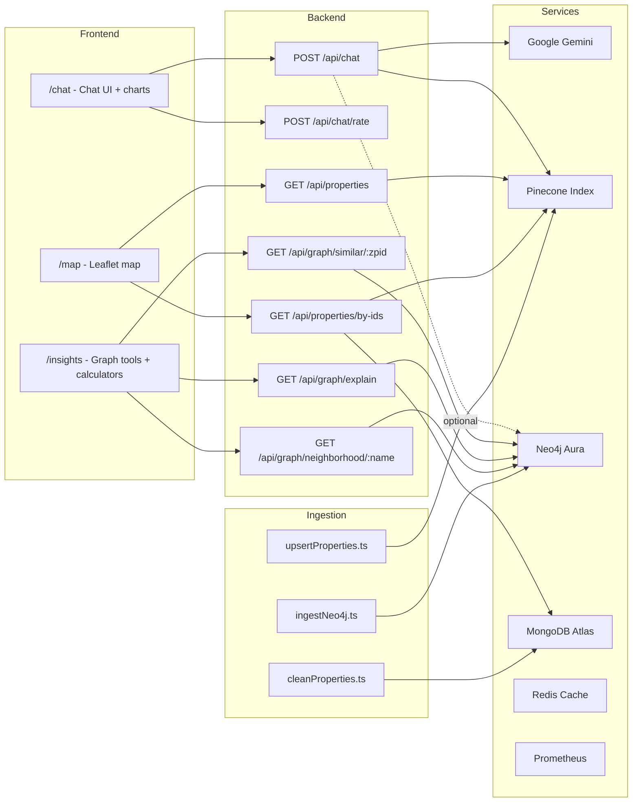
```mermaid
graph LR
  %% Frontend
  subgraph Frontend
    Chat["/chat - Chat UI + charts"]
    Insights["/insights - Graph tools + calculators"]
    Map["/map - Leaflet map"]
  end

  %% Backend
  subgraph Backend
    ChatAPI["POST /api/chat"]
    RateAPI["POST /api/chat/rate"]
    PropsAPI["GET /api/properties"]
    ByIdsAPI["GET /api/properties/by-ids"]
    SimAPI["GET /api/graph/similar/:zpid"]
    ExplAPI["GET /api/graph/explain"]
    HoodAPI["GET /api/graph/neighborhood/:name"]
  end

  %% Services
  subgraph Services
    Gemini["Google Gemini"]
    Pinecone["Pinecone Index"]
    Neo4j["Neo4j Aura"]
    Mongo["MongoDB Atlas"]
    Redis["Redis Cache"]
    Prom["Prometheus"]
  end

  %% Ingestion
  subgraph Ingestion
    Clean["cleanProperties.ts"]
    Upsert["upsertProperties.ts"]
    IngestGraph["ingestNeo4j.ts"]
  end

  %% Frontend → Backend
  Chat --> ChatAPI
  Chat --> RateAPI
  Insights --> SimAPI
  Insights --> ExplAPI
  Insights --> HoodAPI
  Map --> PropsAPI
  Map --> ByIdsAPI

  %% Backend → Services
  ChatAPI --> Gemini
  ChatAPI --> Pinecone
  ChatAPI -. optional .-> Neo4j
  PropsAPI --> Pinecone
  ByIdsAPI --> Pinecone
  ByIdsAPI --> Mongo
  SimAPI --> Neo4j
  ExplAPI --> Neo4j
  HoodAPI --> Neo4j

  %% Ingestion → Stores
  Clean --> Mongo
  Upsert --> Pinecone
  IngestGraph --> Neo4j
```

**EstateWise** is built with a modern, full-stack architecture consisting of two major parts:

### Backend

- **Express.js & TypeScript:** A robust backend API that handles authentication, conversation management, and AI chat processing.
- **MongoDB:** Database for storing user data, conversation histories, and more.
- **Pinecone:** A managed vector database for fast, real‑time property retrieval using kNN and cosine similarity.
- **Neo4j (Graph DB):** Models explicit relationships (neighborhoods, zip codes, property‑to‑property similarities). New endpoints under `/api/graph` power explainable recommendations and path explanations.
- **Redis:** Caching layer for quick access to frequently used data and to improve performance.
- **JWT Authentication:** Secure user sessions using JSON Web Tokens.
- **Integration with AI & RAG:** Communicates with AI APIs and uses **Google Gemini API & Pinecone** for advanced property recommendation logic.
- **Swagger API Documentation:** Automatically generated API documentation for easy reference and testing.
- **Docker:** Containerization for easy deployment and scalability.
- **OpenAPI Specification:** An OpenAPI specification file (`openapi.yaml`) is included in the root directory. You can use Swagger UI or Postman to explore and test the API endpoints.
- **Prometheus Monitoring:** Collects and visualizes metrics for performance monitoring.
- **GitHub Actions:** CI/CD pipeline for automated testing and deployment.
- and more...

### Frontend

- **Next.js & React:** A responsive, animation-rich web application.
- **Shadcn UI Components:** For a consistent design system across the app.
- **Framer Motion:** Provides smooth animations and transitions throughout the user experience.
- **Dark Mode/Light Mode:** Users can toggle themes with seamless background color transitions.
- **Chart.js:** For interactive data visualizations and graphs.
- **Tailwind CSS:** Utility-first CSS framework for rapid UI development.
- **Responsive Design:** Optimized for desktop, tablet, and mobile devices.
- **API Integration:** Communicates with the backend API for chat functionality, user authentication, and conversation management.
- and more...

### High-Level Architecture Flow Diagrams

#### AI Architecture Flow Diagram

Here's a high-level architecture flow diagram that shows the AI processing and expert selection process:

<p align="center">
  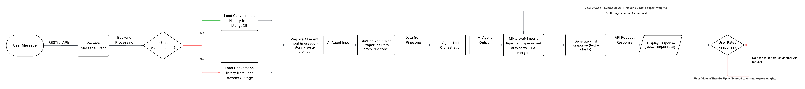
</p>

#### Mermaid Diagram

This diagram illustrates the flow of user messages through the backend processing, including authentication, loading conversation history, preparing AI agent input, and generating responses using a mixture of experts:

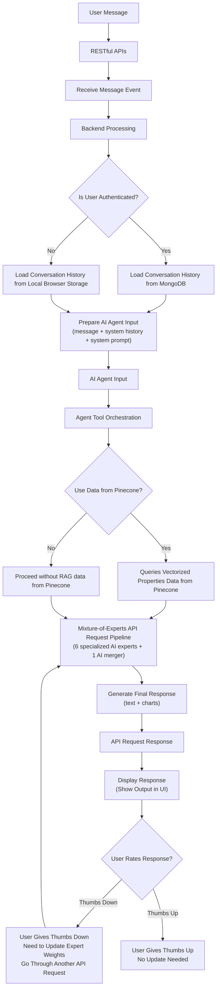
```mermaid
flowchart TD
    UM["User Message"]
    API["RESTful APIs"]
    RME["Receive Message Event"]
    BP["Backend Processing"]
    Auth{"Is User Authenticated?"}
    LMDB["Load Conversation History from MongoDB"]
    LBrowser["Load Conversation History from Local Browser Storage"]
    Prep["Prepare AI Agent Input\n(message + system history + system prompt)"]
    AInput["AI Agent Input"]
    Orchestration["Agent Tool Orchestration"]
    UsePinecone{"Use Data from Pinecone?"}
    QueryPinecone["Queries Vectorized Properties Data from Pinecone"]
    NoPinecone["Proceed without RAG data from Pinecone"]
    MOE["Mixture-of-Experts API Request Pipeline\n(6 specialized AI experts + 1 AI merger)"]
    Generate["Generate Final Response\n(text + charts)"]
    APIResp["API Request Response"]
    Display["Display Response\n(Show Output in UI)"]
    Rate{"User Rates Response?"}
    Update["User Gives Thumbs Down\nNeed to Update Expert Weights\nGo Through Another API Request"]
    End["User Gives Thumbs Up\nNo Update Needed"]

    UM --> API --> RME --> BP --> Auth
    Auth -- Yes --> LMDB
    Auth -- No  --> LBrowser
    LMDB --> Prep
    LBrowser --> Prep
    Prep --> AInput --> Orchestration --> UsePinecone
    UsePinecone -- Yes --> QueryPinecone
    UsePinecone -- No  --> NoPinecone
    QueryPinecone --> MOE
    NoPinecone   --> MOE
    MOE --> Generate --> APIResp --> Display --> Rate
    Rate -- Thumbs Down --> Update --> MOE
    Rate -- Thumbs Up   --> End
```

#### Overall App Architecture Flow Diagram

Below is a high-level diagram that illustrates the flow of the application, including user interactions, frontend and backend components, and data storage:

```plaintext
         ┌────────────────────────────────┐
         │      User Interaction          │
         │   (Chat, Signup, Login, etc.)  │
         └─────────────┬──────────────────┘
                       │
                       ▼
         ┌───────────────────────────────┐
         │    Frontend (Next.js, React)  │
         │ - Responsive UI, Animations   │
         │ - API calls to backend        │
         │ - User ratings for AI         │
         │   responses                   │
         └─────────────┬─────────────────┘
                       │
                       │ (REST APIs & gRPC & tRPC Calls)
                       │
                       ▼
         ┌─────────────────────────────┐
         │   Backend (Express + TS)    │
         │ - Auth (JWT, Signup/Login)  │
         │ - Conversation & Chat APIs  │
         │ - AI processing & RAG       │
         │ - MongoDB & Pinecone        │
         │ - Swagger API Docs          │
         │ - Dockerized for deployment │
         └─────────────┬───────────────┘
                       │
                       │
                       │
           ┌───────────┴────────────┐
           │                        │
           ▼                        ▼
┌─────────────────┐       ┌─────────────────┐       ┌─────────────────┐
│   MongoDB       │       │ Pinecone Vector │       │ Neo4j Graph DB  │
│ (User Data,     │◄─────►│   Database      │◄─────►│ (relationships, │
│  Convo History) │       │ (Knowledge Base)│       │ explainability) │
└─────────────────┘       └─────────────────┘       └─────────────────┘
           ▲                                            
           │
           │  (Utilizes stored data & docs)
           │
           ▼
         ┌─────────────────────────────┐
         │   Response Processing       │
         │ - Uses Google Gemini API    │
         │ - RAG (kNN) for retrieval   │
         │ - k-Means clustering for    │
         │   property recommendations  │
         │ - Agentic AI for            │
         │   orchestration             │
         │ - Expert models (Data       │
         │   Analyst,                  │
         │   Lifestyle Concierge,      │
         │   Financial Advisor,        │
         │   Neighborhood Expert,      │
         │   Cluster Analyst)          │
         │ - Expert selection process  │
         │   (Mixture of Experts)      │
         │ - Chain-of-Thought (CoT)    │
         │ - Combine responses from    │
         │   experts                   │
         │ - Feedback loop for rating  │
         │   AI responses              │
         │ - Reinforcement learning    │
         │   for expert weights        │
         │ - Caching with Redis        │
         │ - and more...               │
         └─────────────┬───────────────┘
                       │
                       ▼
         ┌─────────────────────────────┐
         │    Frontend Display         │
         │ - Show chat response        │
         │ - Update UI (conversation)  │
         │ - User authentication flows │
         │ - Save conversation history │
         │ - Search and manage         │
         │   conversations             │
         │ - User ratings for AI       │
         │   responses                 │
         │ - Visualizations of data    │
         └─────────────────────────────┘
```

#### Neo4j Graph Integration

The graph database layer is optional. If enabled, it adds explicit relationship modeling between properties, neighborhoods, and zip codes,

<p align="center">
  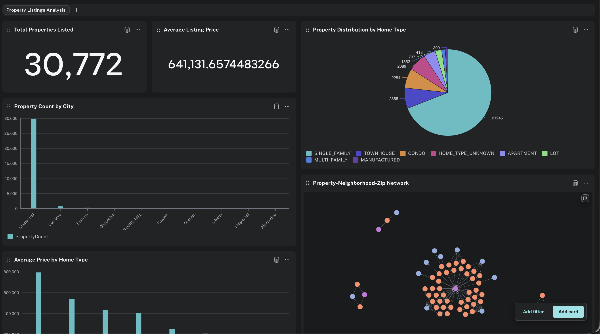
</p>

The graph layer enhances explainability by allowing the AI to reference relationships like "same neighborhood" or "similar properties" in its recommendations.

**Neo4j integration details:**

- What it adds
  - Explicit relationship modeling: `(Property)‑[:IN_ZIP|IN_NEIGHBORHOOD]->(...)` and optional `(:Property)‑[:SIMILAR_TO]->(:Property)`.
  - New API endpoints under `/api/graph` for explainable recommendations and path explanations.
  - Optional graph context appended to chat responses for better explainability when Neo4j is configured.

- Configure (env)
  - `NEO4J_ENABLE=true`
  - `NEO4J_URI=neo4j+s://<your-instance-id>.databases.neo4j.io`
  - `NEO4J_USERNAME=neo4j`
  - `NEO4J_PASSWORD=<paste-once-admin-password>`
  - `NEO4J_DATABASE=neo4j` (optional)

- Ingest data
  - `cd backend`
  - `npm run graph:ingest` (uses `INGEST_LIMIT` to cap batch)

- Endpoints
  - `GET /api/graph/similar/:zpid?limit=10` → graph‑based similar properties + reasons (same neighborhood/zip, similar edge).
  - `GET /api/graph/explain?from=<zpid>&to=<zpid>` → shortest path explanation between two properties.
  - `GET /api/graph/neighborhood/:name?limit=50` → stats + sample properties in a neighborhood.

Note: The graph layer is optional. If not configured, the API gracefully responds with 503 for graph routes and the chat pipeline skips graph context.

Example managed credentials
- Username: `neo4j`
- Password: paste your one‑time admin password from Neo4j Aura (e.g., the one you saved when provisioning)
- URI: from your Neo4j Aura instance (e.g., `neo4j+s://<id>.databases.neo4j.io`)

## Setup & Installation

### Backend Setup

1. **Clone the repository:**

   ```bash
   git clone https://github.com/hoangsonww/EstateWise-Chapel-Hill-Chatbot.git
   cd EstateWise-Chapel-Hill-Chatbot/backend
   ```

2. **Install dependencies:**

   ```bash
   npm install
   ```

3. **Environment Variables:**  
   Create a `.env` file in the `server` directory with the following variables (adjust as needed):

   ```env
    PORT=<your_port>
    MONGO_URI=<your_mongo_uri>
    JWT_SECRET=<your_jwt_secret>
    GOOGLE_AI_API_KEY=<your_google_ai_api_key>
    PINECONE_API_KEY=<your_pinecone_api_key>
    PINECONE_INDEX=estatewise-index
    NEO4J_ENABLE=false
    NEO4J_URI=neo4j+s://<your-instance-id>.databases.neo4j.io
    NEO4J_USERNAME=neo4j
    NEO4J_PASSWORD=<paste-once-admin-password>
    NEO4J_DATABASE=neo4j
    INGEST_LIMIT=30772
    
    # Speed & reliability tuning for Pinecone -> Neo4j ingest
    # Max IDs per page (serverless only). Range 1..1000
    PINECONE_PAGE_SIZE=1000
    # Auto-resume from checkpoint after failures
    INGEST_RESUME=true
    # Optional starting token to resume from a specific point (overrides checkpoint)
    PINECONE_START_TOKEN=
    # Checkpoint file path (optional). Default: .neo4j_ingest_checkpoint.json in backend/
    INGEST_CHECKPOINT_FILE=
    # Overwrite behavior for Neo4j before ingest:
    # - set to "all" to delete ALL nodes (destructive)
    # - set to any non-empty value (e.g., "true") to delete only Property/Zip/Neighborhood
    NEO4J_RESET=true
    # Increase write retries for transient disconnects
    NEO4J_WRITE_RETRIES=7
    # Namespace for Pinecone (leave blank for default)
    PINECONE_NAMESPACE=
   ```

   Important: Be sure that you created the Pinecone index with the name `estatewise-index` in your Pinecone account before proceeding. Then,
   add data to the index using the `pinecone` CLI or API. For security purposes, our properties data is not publicly available in the repository. Please use your own data.

4. **Upsert Properties Data to Pinecone:**  
   Use the `upsertProperties.ts` script to upsert your properties data into the Pinecone index. This script assumes that you place the 4 JSON files in the same directory as the script itself,
   under the names `Zillow-March2025-dataset_part0.json`, `Zillow-March2025-dataset_part1.json`, `Zillow-March2025-dataset_part2.json`, and `Zillow-March2025-dataset_part3.json`.

   ```bash
   ts-node-dev --respawn --transpile-only src/scripts/upsertProperties.ts
   ```

   Alternatively, and preferably, you can use the following NPM command from the `backend` directory to quickly upsert the properties data:

   ```bash
   npm run upsert
   ```

   Note that it may take quite long to upsert all the 30,772 properties data into the Pinecone index, so please be patient.

5. **Run the Backend in Development Mode:** After the properties data has been upserted into the Pinecone index, you can run the backend server in development mode:

   ```bash
   npm run dev
   ```

   This command starts the backend server with live reloading.

### Frontend Setup

1. **Navigate to the client folder:**

   ```bash
   cd ../frontend
   ```

2. **Install dependencies:**

   ```bash
   npm install --legacy-peer-deps
   ```

3. **Run the Frontend Development Server:**

   ```bash
   npm run dev
   ```

   The frontend should be running at [http://localhost:3000](http://localhost:3000).

4. **Change API URL:**  
   If your backend is running on a different port or domain, update the API URL in the frontend code (simply CTRL + F or CMD + F and search for our official backend API URL in all frontend files, then replace it with your backend URL - by default it is `http://localhost:3001`).

5. **View and Interact with the App:**  
   Open your browser and navigate to [http://localhost:3000](http://localhost:3000) to view the app. You can interact with the chatbot, sign up, log in, and explore the features.

> [!CAUTION]
> As you develop, before committing, we recommend running the linter and formatter to ensure code quality with `npm run format`. This will format your code according to the project's ESLint and Prettier configurations.

## Deployment

> Looking for a one-stop playbook? See [DEPLOYMENTS.md](DEPLOYMENTS.md) for platform-by-platform guides, environment matrices, Mermaid diagrams, and CI/CD instructions.

EstateWise is production-ready across the major clouds. Pick the path that suits your organisation, or mix and match:

- **AWS Fargate Stack** – [`aws/`](aws/README.md)  
  CloudFormation templates for VPC, ALB, IAM, ECS, plus CodePipeline/CodeBuild automation and a full `deploy.sh` helper that also provisions DocumentDB.  
  <sub>Observability via CloudWatch/Container Insights, secrets in AWS Secrets Manager.</sub>
- **Azure Container Apps Stack** – [`azure/`](azure/README.md)  
  Modular Bicep (network, Log Analytics + App Insights, ACR, Cosmos DB, Key Vault, Container Apps), `deploy.sh`, and Azure DevOps pipeline support.  
  <sub>Secrets managed by Key Vault, logs shipped to Log Analytics.</sub>
- **GCP Cloud Run Stack** – [`gcp/`](gcp/README.md)  
  Deployment Manager configs (VPC + NAT + Serverless connector, Cloud Run, IAM, Storage), Cloud Build pipeline, and `deploy.sh` wrapper.  
  <sub>Secrets from Secret Manager, instrumentation via Cloud Logging/Monitoring.</sub>
- **HashiCorp + Kubernetes Stack** – [`hashicorp/`](hashicorp/README.md) & [`kubernetes/`](kubernetes/README.md)  
  Terraform installs Consul + Nomad on any Kubernetes cluster, while curated Kustomize bases/overlays deploy backend & frontend workloads (with Consul sidecars, ingress, TLS).  
  <sub>Great for self-managed clusters, hybrid, or multi-cloud service mesh deployments.</sub>
- **Vercel Frontend/Edge** – [`frontend/`](frontend/)  
  Next.js app ready for Vercel (`vercel.json`), with optional backend edge routes or reverse proxy to the primary API.

CI/CD integration highlights:

- **Jenkins** (`jenkins/workflow.Jenkinsfile`) – toggles AWS/Azure/GCP/HashiCorp/Kubernetes/Vercel deploy stages via environment flags.  
- **GitHub Actions / GitLab CI** – reuse the same scripts, or trigger the native cloud pipelines.  
- **Azure Pipelines** – container build/update pipeline for Container Apps.  
- **GCP Cloud Build** – docker build + Cloud Run deploy in a single step.

Our infrastructure-as-code investments include Terraform modules (`terraform/` + HashiCorp stack), CloudFormation, Deployment Manager, Helm, and Kustomize to ensure reproducible, auditable releases.

- **Infrastructure as Code (IaC)**

  - **Terraform**: Provision VPC, subnets, Internet Gateway, ECS/Fargate cluster & service, ALB, IAM roles, and security groups via the `terraform/` modules.
  - **CloudFormation**: Modular templates under `aws/cloudformation/` for VPC, IAM roles, ECS cluster/task/service, and ALB if you prefer AWS’s native IaC.

- **CI/CD Pipelines**

  - **GitHub Actions**: Builds, tests, and pushes Docker images to AWS ECR or Google Artifact Registry, then triggers deployments.
  - **AWS CodePipeline**: (Optional) Fully AWS-native pipeline—CodeBuild builds & pushes your image, CodePipeline deploys to ECS via Fargate.
  - **GCP Cloud Build**: Builds and pushes containers to Artifact Registry and deploys the backend to Cloud Run using `gcp/cloudbuild.yaml`.

- **Backend**

  - **AWS ECS (Fargate)**: Containerized Node/TypeScript API hosted on ECS behind an Application Load Balancer, with autoscaling.
  - **GCP Cloud Run**: Serverless container deployment option via Cloud Build; autoscaling to zero when idle.
  - **Microsoft Azure**: Another option for hosting the backend with easy scaling.
  - **Vercel** (Backup): Node server largely stateless, can run on Vercel for smaller workloads.
  - **Docker**: Containerized backend for consistent environments across dev, test, and prod.
  - **Load Balancing & SSL**: ALB (AWS) or Cloud Load Balancing (GCP) with managed SSL certs for secure HTTPS.
  - **Secrets Management**: Vault (HashiCorp), AWS Secrets Manager, or GCP Secret Manager for sensitive config.

- **Frontend**

  - **Vercel**: Primary host for the Next.js/React UI with edge caching.
  - **Netlify** (Backup): Can also deploy static build artifacts with environment overrides for API endpoints.
  - **S3 + CloudFront**: (Optional) Host `out/` export of Next.js as static site, fronted by a CDN.

- **Data Stores**

  - **MongoDB Atlas**: Global, fully managed MongoDB for user data and chat histories.
  - **Pinecone**: Managed vector database for RAG-based property retrieval.
  - **MongoDB Atlas**: Fully managed, global MongoDB for user data and chat histories.
  - **Neo4j Aura**: Managed Neo4j graph database for relationship modeling and explainable recommendations.
  - **Redis**: Managed Redis (Elasticache on AWS, Memorystore on GCP) for caching and performance.

- **Monitoring & Logging**

  - **Prometheus + Grafana** on AWS ECS (or GKE) for metrics collection and dashboards.
  - **CloudWatch** (AWS) / **Cloud Logging** (GCP) for logs, alarms, and alerts.

### Azure Deployment

Infrastructure and deployment scripts for Microsoft Azure live in the [`azure/`](azure/) directory. Provision resources with Bicep and deploy the backend using the provided script or Azure Pipelines workflow.


## Usage

- **Landing Page:**  
  Learn about the app’s features and get started by signing in or continuing as a guest.
- **Authentication:**  
  Create an account, log in, and manage your user profile securely using JWT authentication.
- **Chat Interface:**  
  Interact with the AI assistant in real time. Authenticated users can save, rename, and delete conversations.
- **Theme Toggle:**  
  Switch between dark and light modes with smooth background transitions.
- **Search & Management:**  
  Easily search through your conversation history and manage your saved conversations from the sidebar.
- **Insights & Tools Page:**  
  Access graph-based tools and mortgage calculators to assist in your property search.
- **Map Page:**  
  View properties on an interactive map with markers, search functionality, and links to Zillow listings.
- **Visualizations Page:**  
  Explore aggregate charts and insights for all Chapel Hill properties.
- **Market Insights Page:**  
  Get the latest market trends and insights for Chapel Hill real estate and other markets across the US.
- **Expert View:**  
  Toggle between the combined AI response and individual expert responses (Data Analyst, Lifestyle Concierge, Financial Advisor, Neighborhood Expert, Cluster Analyst) to see different perspectives on your query.
- **Interactive Charts:**  
  View dynamic charts generated by the AI based on your queries, embedded directly in the chat interface.
- **Smooth Animations:**  
  Enjoy engaging transitions and micro-interactions powered by Framer Motion.
- **Responsive Design:**  
  The app is optimized for desktop, tablet, and mobile devices, ensuring a seamless experience across
- **Guest Mode:**  
  Use the app as a guest without creating an account. Conversations will still be saved locally in the browser.
- **Rating System:**  
  Rate the AI's responses to help improve its performance over time. If you are not satisfied with the AI's response, you can give a thumbs down rating, and the backend API will tweak the experts selection process (i.e. the weights of the experts) to improve the model's performance.
- **Expert Selection:**  
  The AI uses a mixture of experts to provide the best possible response based on user input. Users can also select a specific expert's response to view.
- **Chat History:**  
  View and manage your conversation history, including the ability to search for specific conversations (only available for authenticated users).
- **Full‑Text Search:**  
  Quickly search your conversation history for keywords, topics, or specific properties.
- **Visualizations:**  
  View interactive charts and graphs generated by the AI based on your queries. The visualizations page provides aggregate charts and insights for all Chapel Hill properties.
- and so much more...

> [!CAUTION]
> Note: The expert view feature is ONLY available for new messages. If you load a conversation from either the local storage or the database, the expert view feature will not be available, and only the combined response will be shown.

## User Interface

EstateWise features a modern, animated, and fully responsive user interface built with Next.js and Shadcn UI, with the help of Tailwind CSS for styling. The UI is designed to be intuitive and user-friendly, ensuring a seamless experience across devices.

### Landing Page

<p align="center">
  
</p>

### Chat Interface - Guest

<p align="center">
  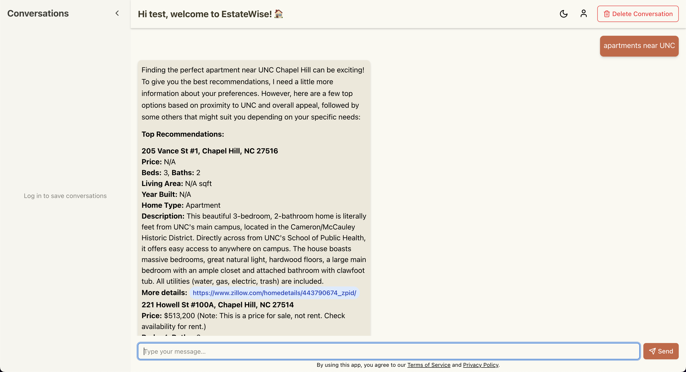
</p>

### Chat Interface - Authenticated

<p align="center">
  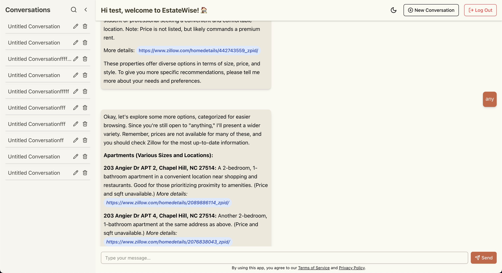
</p>

### Dark Mode: Chat Interface - Guest

<p align="center">
  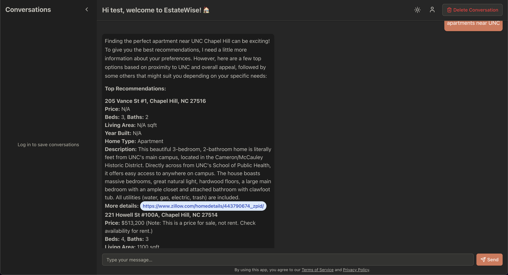
</p>

### Dark Mode: Chat Interface - Authenticated

<p align="center">
  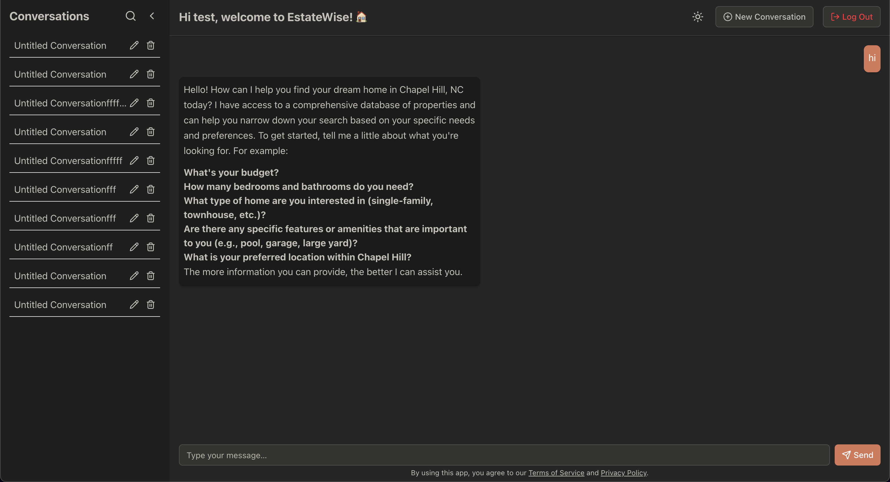
</p>

### Visualizations Page

<p align="center">
  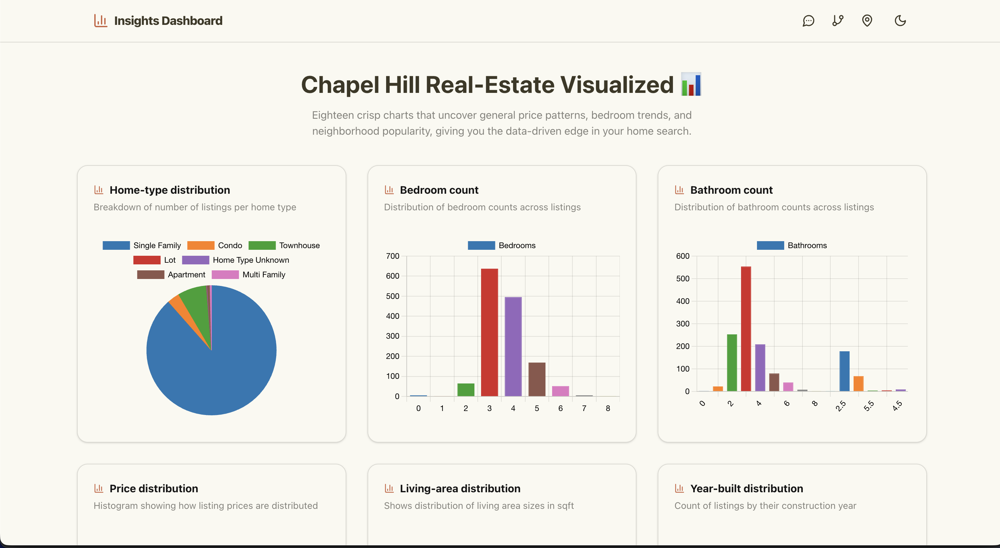
</p>

### Insights & Tools Page

<p align="center">
  
</p>

#### More Tools...

<p align="center">
  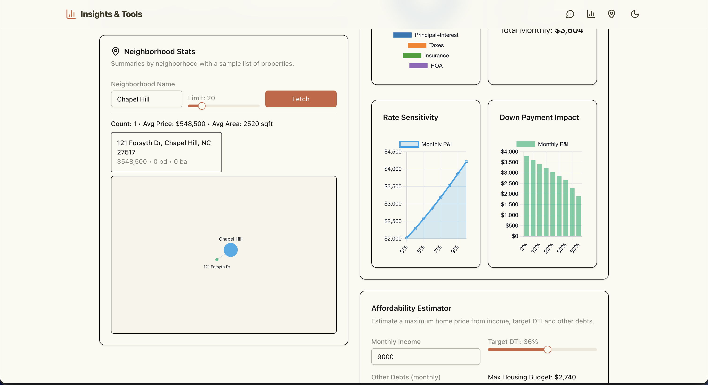
</p>

### Market Insights Page

<p align="center">
  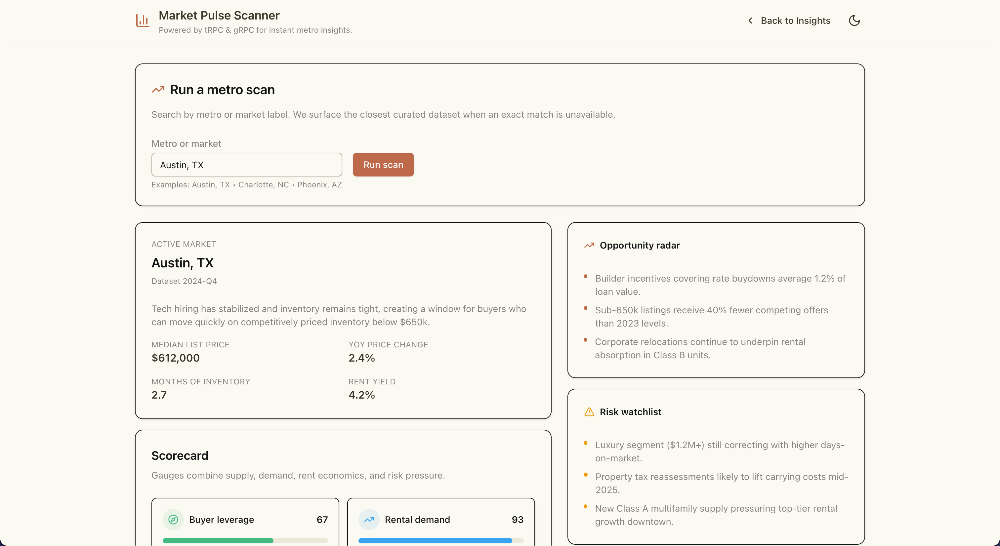
</p>

### Map Page

<p align="center">
  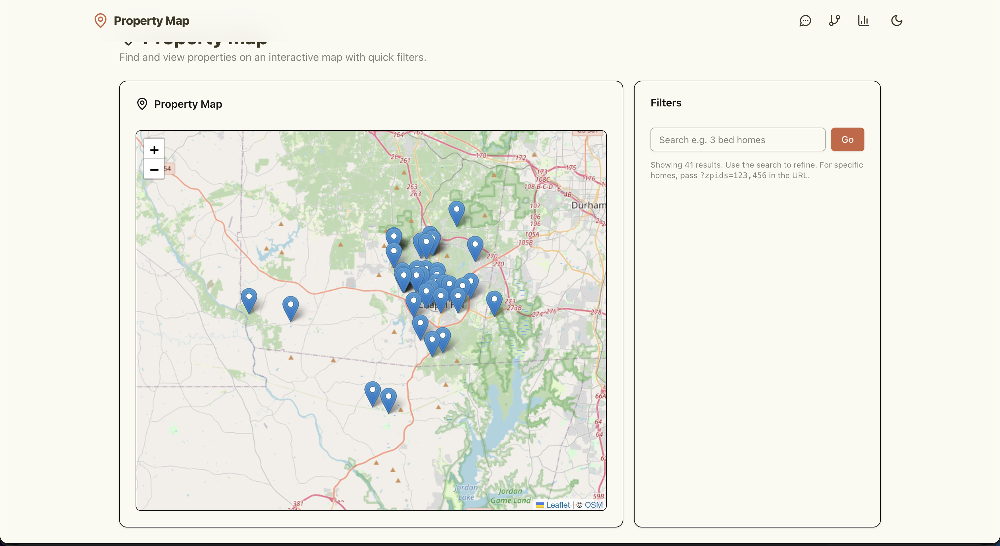
</p>

### Login Page

<p align="center">
  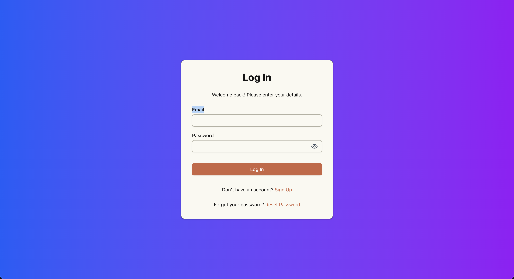
</p>

### Register Page

<p align="center">
  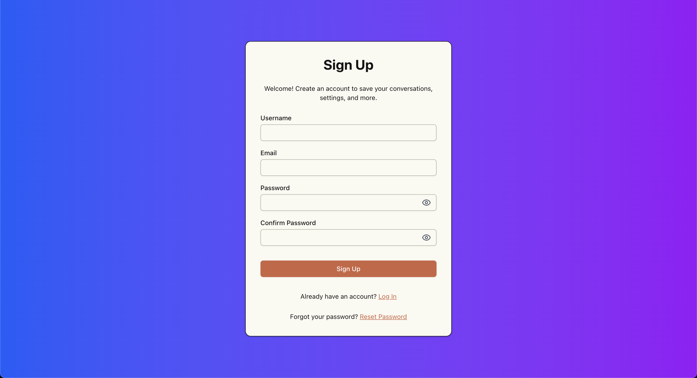
</p>

### Reset Password Page

<p align="center">
  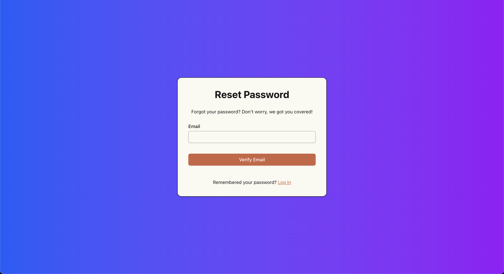
</p>

## API Endpoints

### Graph

- **GET** `/api/graph/similar/:zpid?limit=10` – Find similar properties via explicit relationships with reasons (same neighborhood/zip, vector similarity edge when present).
- **GET** `/api/graph/explain?from=<zpid>&to=<zpid>` – Return the shortest path (≤3 hops) between two homes over `IN_ZIP|IN_NEIGHBORHOOD|SIMILAR_TO`.
- **GET** `/api/graph/neighborhood/:name?limit=50` – Neighborhood stats and a sample list of properties.

Graph endpoints are available when Neo4j is configured; otherwise they respond with `503`.

### Properties (Map Helpers)

- **GET** `/api/properties` – Search Pinecone and return listings with lat/lon; accepts `q` and `topK`.
- **GET** `/api/properties/by-ids?ids=123,456` – Return listings by ZPIDs (enriches from Pinecone metadata, falls back to Mongo for lat/lon).

### Authentication

- **POST** `/api/auth/signup` – Create a new user.
- **POST** `/api/auth/login` – Log in a user and return a JWT.
- **GET** `/api/auth/verify-email` – Verify if an email exists.
- **POST** `/api/auth/reset-password` – Reset a user's password.

### Conversations

- **POST** `/api/conversations` – Create a new conversation.
- **GET** `/api/conversations` – Retrieve all conversations for a user.
- **GET** `/api/conversations/:id` – Retrieve a conversation by its ID.
- **PUT** `/api/conversations/:id` – Rename a conversation.
- **DELETE** `/api/conversations/:id` – Delete a conversation.
- **GET** `/api/conversations/search/:query` – Search conversations by title or content.

### Chat

- **POST** `/api/chat` – Send a chat message and receive an AI-generated response.
  - **Query Parameter:** `?stream=true` – Enable real-time streaming of AI responses using Server-Sent Events (SSE).
  - **Streaming Features:**
    - Real-time text generation as the AI model produces tokens
    - Automatic retry mechanism with exponential backoff (up to 3 retries)
    - Connection loss detection and recovery
    - Visual streaming indicators in the UI (animated cursor, loading states)
    - Graceful fallback to non-streaming mode on errors
- **POST** `/api/chat/rate` – Rate the AI's response (thumbs up or down).

More endpoints can be found in the Swagger API documentation. Endpoints may be added or modified as the project evolves, so this may not be an exhaustive list of all available endpoints.

### Swagger API Documentation

Access detailed API docs at the `/api-docs` endpoint on your deployed backend.

<p align="center">
  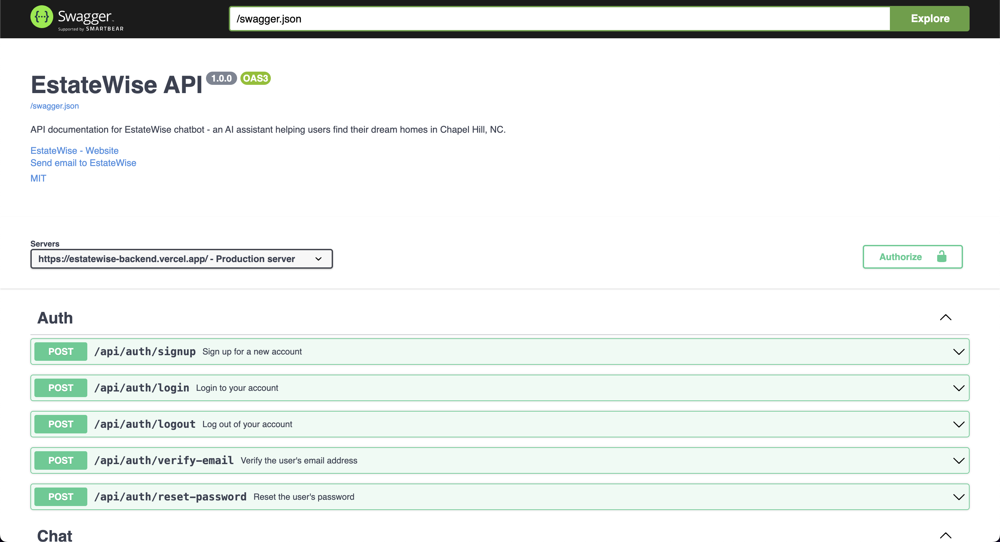
</p>

Live API documentation is available at: [https://estatewise-backend.vercel.app/api-docs](https://estatewise-backend.vercel.app/api-docs). You can visit it to explore and directly interact with the API endpoints, right in your web browser!

## Project Structure

```plaintext
EstateWise/
├── aws/                      # AWS deployment scripts
│   ├── deploy.sh             # Script to deploy the backend to AWS
│   └── ... (other AWS config files, Dockerfiles, etc.)
├── frontend/                 # Frontend Next.js application
│   ├── public/               # Static assets (images, icons, etc.)
│   ├── components/           # Reusable UI components
│   ├── pages/                # Next.js pages (Chat, Login, Signup, etc.)
│   ├── styles/               # CSS/SCSS files
│   ├── package.json
│   ├── tsconfig.json
│   └── ... (other config files, tests, etc.)
├── backend/                   # Backend Express application
│   ├── src/
│   │   ├── controllers/      # API controllers and endpoints
│   │   ├── models/           # Mongoose models
│   │   ├── routes/           # Express routes
│   │   ├── services/         # Business logic and integrations
│   │   └── middleware/       # Authentication, error handling, etc.
│   ├── package.json
│   ├── tsconfig.json
│   └── ... (other config files, tests, etc.)
├── data/                     # Additional data analytics scripts (Python and JS)
├── shell/                    # Shell scripts for deployment and setup
├── terraform/                # Terraform scripts for infrastructure as code
├── gcp/                      # GCP deployment scripts
├── mcp/                      # Model Context Protocol server (tools over stdio)
├── .env                      # Environment variables for development
├── README.md                 # This file
├── TECH_DOCS.md              # Detailed technical documentation (highly recommended to read)
├── docker-compose.yml        # Docker configuration for backend and frontend
├── Dockerfile                # Dockerfile for application
├── openapi.yaml              # OpenAPI specification for API documentation
├── EDA-CLI-Chatbot.ipynb        # Jupyter notebook for CLI chatbot
├── Initial-Data-Analysis.ipynb  # Jupyter notebook for initial data analysis
├── Makefile                  # Makefile for build and deployment tasks
└── ... (other config files, etc.)
```

## Dockerization

To run the application **(OPTIONAL)** using Docker:

1. Ensure you have [Docker](https://www.docker.com/) installed.
2. In the project root directory, run:

   ```bash
   docker-compose up --build
   ```

This command builds and starts both the backend and frontend services as defined in the `docker-compose.yml` file.

However, you don't need to run the app using Docker. You can run the backend and frontend separately as described in the **Setup & Installation** section.

## Prometheus Monitoring & Visualizations

Prometheus is used for monitoring the backend server. It collects metrics from the server and provides a web interface to visualize them.

Metrics collected & visualized include:

- CPU usage
- Memory usage
- Heap usage
- Load average
- Event loops
- Requests per second
- Status codes
- Response times

To view our live server metrics, go to [this link](https://estatewise-backend.vercel.app/metrics) in your browser. This will show you the raw metrics of our server collected by Prometheus. If you are running the app locally, you can go to `http://localhost:3001/metrics` in your browser.

To view our live server data, go to [this URL](https://estatewise-backend.vercel.app/status) in your browser. If you are running the app locally, you can go to `http://localhost:3001/status` in your browser.

<p align="center">
  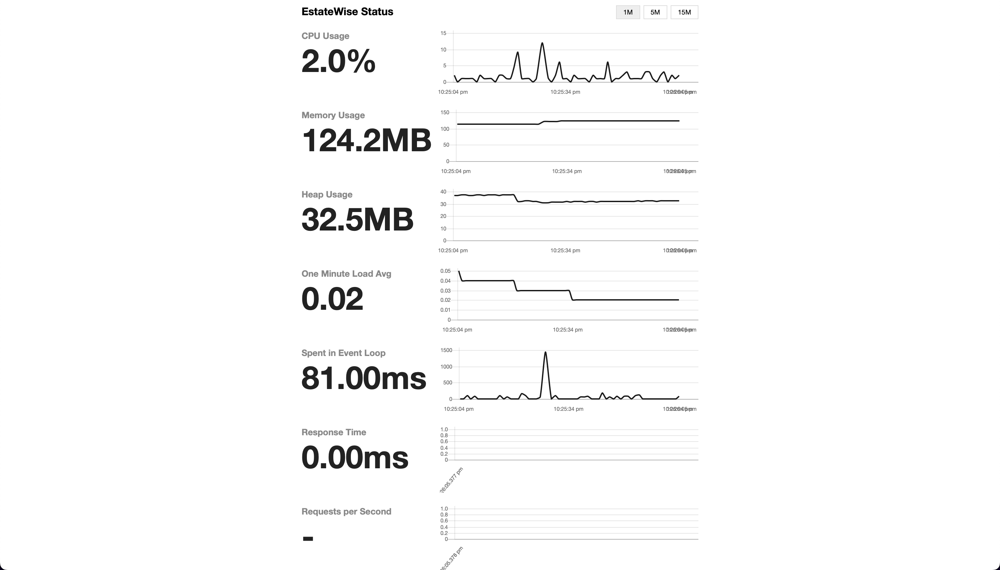
</p>

## GitHub Actions

GitHub Actions is used for continuous integration and deployment (CI/CD) of the application. It automatically runs tests, builds the Docker images, and deploys the application to Vercel or AWS whenever changes are pushed to the main branch or when pull requests are created.

To view the GitHub Actions workflow, go to the [Actions tab](https://github.com/hoangsonww/EstateWise-Chapel-Hill-Chatbot/actions) of this repository. You can see the status of the latest runs, view logs, and check for any errors.

Our pipeline is set up to run the following steps:

* **Linting:** Runs ESLint to check for code quality and style issues, enforcing consistent standards across the codebase.
* **Formatting:** Uses Prettier to automatically format code according to project style guidelines.
* **Testing:** Executes unit tests for both the backend (Jest) and frontend (Jest), ensuring that all functionality works as expected.
* **End-to-End Testing:** Runs Cypress and Selenium tests to validate user interactions in a real browser environment.
* **Security Scanning:** Includes CodeQL analysis, `npm audit`, Semgrep, and license checks to detect known vulnerabilities and license conflicts.
* **Build:** Compiles both the frontend and backend code, preparing optimized production artifacts.
* **Database Connectivity Check:** Validates that environment database credentials are correct and that the app can reach its database instances.
* **Performance Testing:** Runs Lighthouse for web performance metrics and Artillery for load testing of critical endpoints.
* **Docker Publishing:** Builds and pushes Docker images for both the frontend and backend to GitHub Container Registry (GHCR).
* **Vulnerability Scanning:** Uses Trivy to scan Docker images for security issues before deployment.
* **Documentation Generation:** Builds JSDoc and TypeDoc documentation and stores the results as build artifacts.
* **Deployment:** Automates infrastructure deployments to AWS and application deployments to Vercel.
* **Final Confirmation:** Marks the pipeline as successfully completed after all previous steps pass.

<p align="center">
  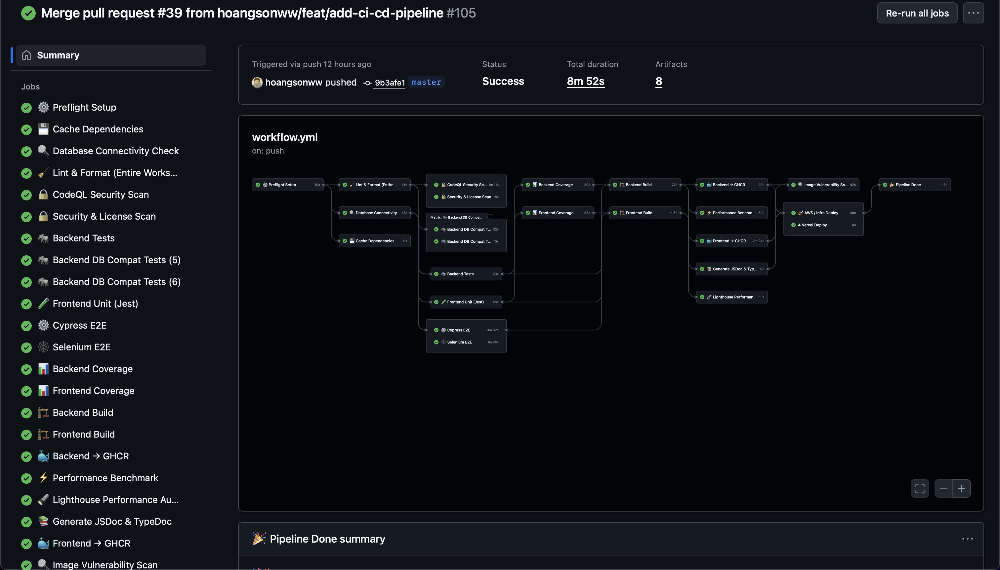
</p>

This ensures that the application is always in a deployable state and that any issues are caught early in the development process.

## MCP Server

Bring EstateWise data, graphs, analytics, and utilities to MCP‑compatible clients (IDEs/assistants) via the `mcp/` package.

   

- Location: `mcp/`
- Transport: stdio (works with typical MCP launchers)
- **Total Tools: 50+** spanning properties, graphs, analytics, market analysis, batch operations, monitoring, finance, and utilities

### Tool Categories

- **Properties**: `properties.search`, `properties.searchAdvanced`, `properties.lookup`, `properties.byIds`, `properties.sample`
- **Graph**: `graph.similar`, `graph.explain`, `graph.neighborhood`, `graph.similarityBatch`, `graph.comparePairs`, `graph.pathMatrix`
- **Charts & Analytics**: `charts.priceHistogram`, `analytics.summarizeSearch`, `analytics.groupByZip`, `analytics.distributions`, `analytics.pricePerSqft`
- **Market Analysis**: `market.pricetrends`, `market.inventory`, `market.competitiveAnalysis`, `market.affordabilityIndex`
- **Batch Operations**: `batch.compareProperties`, `batch.bulkSearch`, `batch.enrichProperties`, `batch.exportProperties`
- **Monitoring**: `monitoring.stats`, `monitoring.toolUsage`, `monitoring.health`, `monitoring.reset`
- **Map**: `map.linkForZpids`, `map.buildLinkByQuery`, `map.decodeLink`
- **Utilities & Finance**: `util.extractZpids`, `util.zillowLink`, `util.summarize`, `util.parseGoal`, `util.address.parse`, `util.geo.distance`, `util.geo.center`, `finance.mortgage`, `finance.affordability`, `finance.schedule`, `finance.capRate`, `finance.rentVsBuy`
- **Auth**: `auth.login`, `auth.signup`, `auth.verifyEmail`, `auth.resetPassword`
- **Commute**: `commute.create`, `commute.list`, `commute.get`, `commute.update`, `commute.delete`
- **System**: `system.config`, `system.time`, `system.health`, `system.tools`, `system.cache.clear`

### Key Features

✨ **Comprehensive Coverage**: 50+ tools covering every aspect of real estate research  
📊 **Market Intelligence**: Advanced market analysis, competitive analysis, and affordability metrics  
⚡ **Batch Processing**: Compare, enrich, and export multiple properties efficiently  
📈 **Monitoring**: Built-in usage tracking, health checks, and performance metrics  
🔒 **Type-Safe**: Full Zod validation on all tool inputs  
💾 **Smart Caching**: LRU cache for GET requests with configurable TTL

and more!

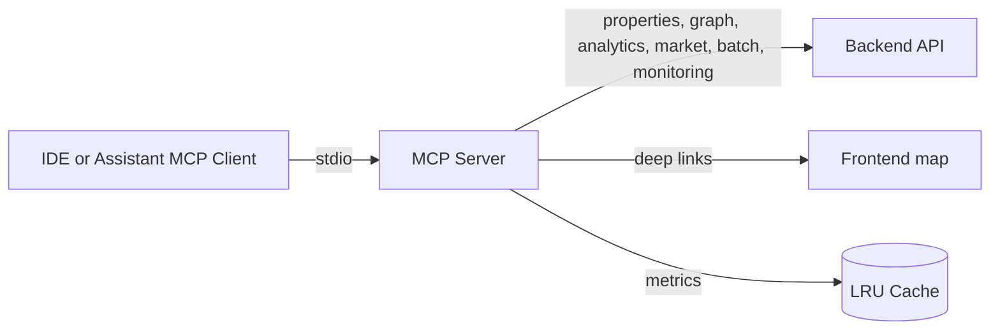
```mermaid
flowchart LR
  Client[IDE or Assistant MCP Client] -- stdio --> Server[MCP Server]
  Server -->|properties, graph, analytics, market, batch, monitoring| API[Backend API]
  Server -->|deep links| Frontend[Frontend map]
  Server -->|metrics| Cache[(LRU Cache)]
```

### Environment Variables

Configure in `mcp/.env` (copy from `.env.example`):
- `API_BASE_URL` (default: `https://estatewise-backend.vercel.app`)
- `FRONTEND_BASE_URL` (default: `https://estatewise.vercel.app`)
- `MCP_CACHE_TTL_MS` (default: `30000`) – Cache TTL in milliseconds
- `MCP_CACHE_MAX` (default: `200`) – Maximum cached GET responses
- `MCP_DEBUG` (default: `false`) – Enable verbose debug logs

### Quick Start

Local development
```bash
cd mcp
npm install
npm run dev
```

Build & run
```bash
cd mcp
npm run build
npm start
```

Test with example client
```bash
npm run client:dev  # List all tools
npm run client:call -- properties.search '{"q":"Chapel Hill 3 bed","topK":5}'
npm run client:call -- market.pricetrends '{"q":"Chapel Hill","topK":100}'
npm run client:call -- batch.compareProperties '{"zpids":[1234567,2345678,3456789]}'
npm run client:call -- monitoring.stats '{"detailed":true}'
```

### What's New

**v0.2.0 Enhancements** (December 2024)
- 🆕 **Market Analysis Tools**: Deep market insights with price trends, inventory analysis, competitive positioning, and affordability index
- 🆕 **Batch Operations**: Efficiently compare, search, enrich, and export multiple properties
- 🆕 **Monitoring Suite**: Comprehensive usage tracking, metrics, health checks, and performance monitoring
- ⚡ **Automatic Monitoring**: All tool calls are automatically tracked for usage analytics
- 📝 **Enhanced Documentation**: Detailed examples and use cases for all new tools
- 🎯 **Backward Compatible**: All existing tools work exactly as before

### Notes

- Returns are text content blocks; JSON payloads are stringified for portability across clients.
- Graph tools require the backend to have Neo4j configured; otherwise they may return 503 from the API.
- Monitoring automatically tracks all tool usage without requiring manual instrumentation.
- Cache can be cleared anytime via `system.cache.clear` or `monitoring.reset`.

> [!TIP]
> **For comprehensive documentation, tool examples, and deployment guides, see [mcp/README.md](mcp/README.md).**

## Agentic AI Pipeline

A production-ready, multi‑agent CLI with three runtimes to drive research and analysis with tools:

- Orchestrator (default): Round‑based, MCP‑first agents using a shared blackboard.
- LangChain + LangGraph: Tool‑calling ReAct agent with MCP, Pinecone, and Neo4j tools.
- CrewAI (Python): Sequential crew for planning, analysis, graph insights, finance, and reporting.

Location
- `agentic-ai/`

Agents (orchestrator runtime)
- Planner, Coordinator, ZpidFinder, PropertyAnalyst, AnalyticsAnalyst, GraphAnalyst, DedupeRanking, MapAnalyst, FinanceAnalyst, Compliance, Reporter
- Coordination: Shared blackboard (ZPIDs, parsed filters, analytics, links, finance) with retries and JSON normalization.

Quick start (Orchestrator)
```
cd mcp && npm run build
cd ../agentic-ai && npm run dev "Find 3-bed homes in Chapel Hill, NC; explain 123456 vs 654321; estimate $600k at 6.25%."
```

LangGraph runtime
```
cd agentic-ai
npm run dev -- --langgraph "Compare 123456 vs 654321 and show a map"
# or AGENT_RUNTIME=langgraph npm run dev -- "..."
```

CrewAI runtime
```
cd agentic-ai/crewai
python3 -m venv .venv && source .venv/bin/activate
pip install -r requirements.txt
export OPENAI_API_KEY=sk-...
cd ..
npm run dev -- --crewai "Find 3-bed homes in Chapel Hill; explain two ZPIDs and estimate mortgage"
```

Notes
- Orchestrator spawns `mcp/dist/server.js` over stdio; extend by adding MCP tools in `mcp/` and agents in `agentic-ai/src/agents/`.
- LangGraph adds Pinecone vector retrieval and Neo4j Cypher QA; see `agentic-ai/src/lang/`.
- CrewAI is optional and requires Python with the deps in `agentic-ai/crewai/requirements.txt`.

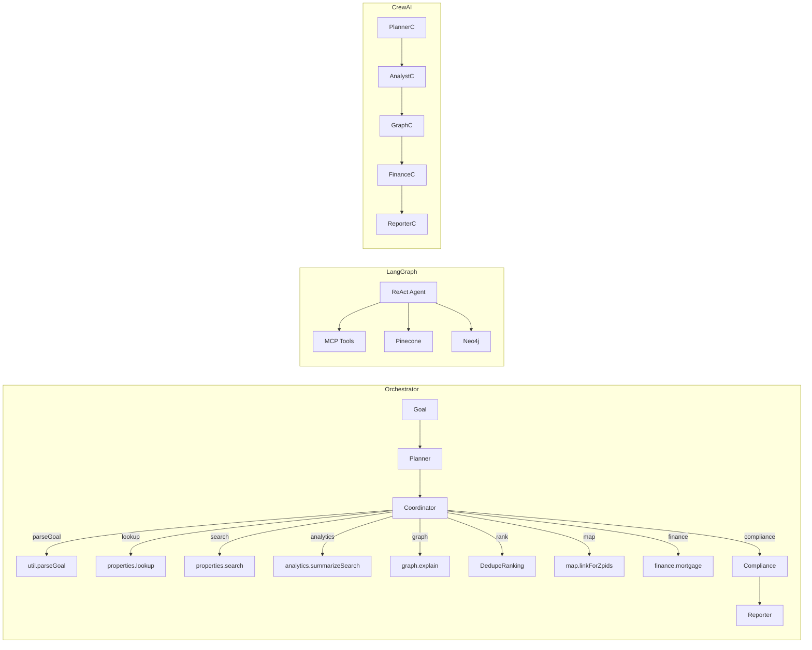
```mermaid
flowchart LR
    subgraph Orchestrator
    Goal --> Planner --> Coordinator
    Coordinator -->|parseGoal| UPG["util.parseGoal"]
    Coordinator -->|lookup| PL["properties.lookup"]
    Coordinator -->|search| PS["properties.search"]
    Coordinator -->|analytics| AS["analytics.summarizeSearch"]
    Coordinator -->|graph| GE["graph.explain"]
    Coordinator -->|rank| DR["DedupeRanking"]
    Coordinator -->|map| MLZ["map.linkForZpids"]
    Coordinator -->|finance| FM["finance.mortgage"]
    Coordinator -->|compliance| Compliance
    Compliance --> Reporter
    end

    subgraph LangGraph
    LG[ReAct Agent] --> MCP[MCP Tools]
    LG --> Pinecone
    LG --> Neo4j
    end

    subgraph CrewAI
    PlannerC --> AnalystC --> GraphC --> FinanceC --> ReporterC
    end
```

> [!IMPORTANT]
> **For details and examples, see [agentic-ai/README.md](agentic-ai/README.md).**

## API Architecture Overview

EstateWise provides three complementary API protocols, each optimized for different use cases:

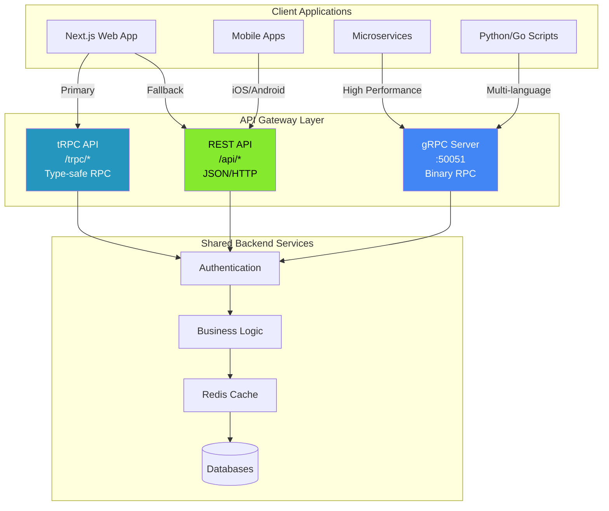
```mermaid
flowchart TB
    subgraph "Client Applications"
        WebApp[Next.js Web App]
        Mobile[Mobile Apps]
        Services[Microservices]
        Scripts[Python/Go Scripts]
    end

    subgraph "API Gateway Layer"
        REST[REST API<br/>/api/*<br/>JSON/HTTP]
        TRPC[tRPC API<br/>/trpc/*<br/>Type-safe RPC]
        GRPC[gRPC Server<br/>:50051<br/>Binary RPC]
    end

    subgraph "Shared Backend Services"
        Auth[Authentication]
        BL[Business Logic]
        Cache[Redis Cache]
        DB[(Databases)]
    end

    WebApp -->|Primary| TRPC
    WebApp -->|Fallback| REST
    Mobile -->|iOS/Android| REST
    Services -->|High Performance| GRPC
    Scripts -->|Multi-language| GRPC

    REST --> Auth
    TRPC --> Auth
    GRPC --> Auth

    Auth --> BL
    BL --> Cache
    Cache --> DB

    style REST fill:#85EA2D,color:#000
    style TRPC fill:#2596BE,color:#fff
    style GRPC fill:#4285F4,color:#fff
```

### When to Use Each API

| API | Best For | Protocol | Type Safety | Languages |
|-----|----------|----------|-------------|-----------|
| **REST** | Web standards, wide compatibility | JSON/HTTP/1.1 | OpenAPI/Swagger | Any |
| **tRPC** | TypeScript apps, React/Next.js | JSON/HTTP | End-to-end TS | TypeScript |
| **gRPC** | Microservices, high performance | Protobuf/HTTP/2 | Code generation | 10+ languages |

### tRPC API

EstateWise includes a **tRPC** (TypeScript Remote Procedure Call) API as an optional, type-safe alternative to the REST API. This provides end-to-end type safety between backend and frontend, automatic API client generation, and improved developer experience.

#### tRPC Features

- **End-to-End Type Safety**: Full TypeScript support from backend to frontend with automatic type inference
- **No Code Generation**: Unlike traditional API clients, tRPC infers types directly from your router
- **RPC-like DX**: Call backend functions as if they were local TypeScript functions
- **Built-in Validation**: Input/output validation using Zod schemas
- **Batching & Caching**: Automatic request batching and built-in caching support
- **WebSocket Support**: Real-time subscriptions (when configured)
- **Non-Breaking**: Runs alongside existing REST API at `/trpc` endpoint

#### tRPC Router Structure

The tRPC API is organized into logical routers:

```typescript
// Main app router combining all sub-routers
appRouter = {
  properties: propertiesRouter,  // Property CRUD and search
  analytics: analyticsRouter,    // Market trends, predictions, metrics
  // Additional routers can be added here
}
```

**Properties Router** (`/trpc/properties.*`):
- `list` - Get paginated properties with filters (type, price, bedrooms)
- `byId` - Get single property by ID
- `search` - Full-text search across properties
- `create` - Create new property (protected)
- `stats` - Get aggregate statistics

**Analytics Router** (`/trpc/analytics.*`):
- `marketTrends` - Historical price/volume data for a location
- `pricePrediction` - AI-powered price estimates
- `neighborhoodInsights` - Demographics, schools, amenities
- `investmentMetrics` - ROI, cap rate, cash flow calculations

#### tRPC Architecture

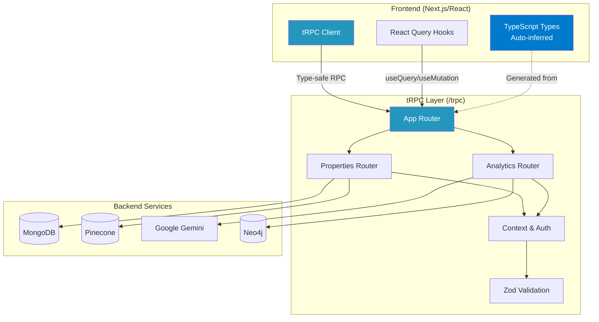
```mermaid
flowchart TB
    subgraph "Frontend (Next.js/React)"
        Client[tRPC Client]
        Types[TypeScript Types<br/>Auto-inferred]
        ReactHooks[React Query Hooks]
    end

    subgraph "tRPC Layer (/trpc)"
        Router[App Router]
        Props[Properties Router]
        Analytics[Analytics Router]
        Context[Context & Auth]
        Validation[Zod Validation]
    end

    subgraph "Backend Services"
        MongoDB[(MongoDB)]
        Pinecone[(Pinecone)]
        Gemini[Google Gemini]
        Neo4j[(Neo4j)]
    end

    Client -->|Type-safe RPC| Router
    ReactHooks -->|useQuery/useMutation| Router
    Types -.->|Generated from| Router

    Router --> Props
    Router --> Analytics

    Props --> Context
    Analytics --> Context
    Context --> Validation

    Props --> MongoDB
    Props --> Pinecone
    Analytics --> Gemini
    Analytics --> Neo4j

    style Client fill:#2596BE,color:#fff
    style Router fill:#2596BE,color:#fff
    style Types fill:#007ACC,color:#fff
```

#### tRPC Request Flow

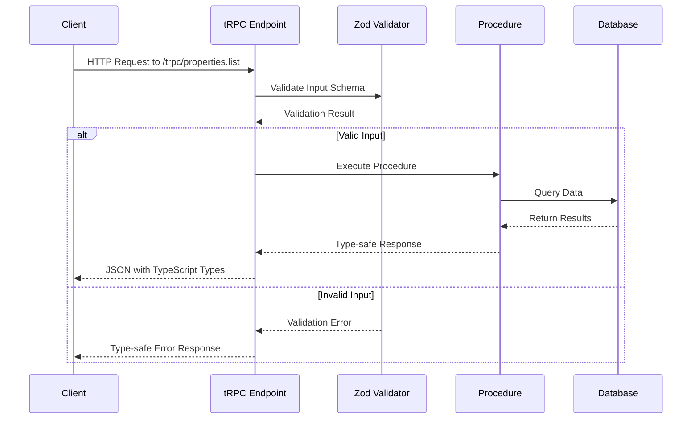
```mermaid
sequenceDiagram
    participant C as Client
    participant T as tRPC Endpoint
    participant V as Zod Validator
    participant P as Procedure
    participant DB as Database

    C->>T: HTTP Request to /trpc/properties.list
    T->>V: Validate Input Schema
    V-->>T: Validation Result

    alt Valid Input
        T->>P: Execute Procedure
        P->>DB: Query Data
        DB-->>P: Return Results
        P-->>T: Type-safe Response
        T-->>C: JSON with TypeScript Types
    else Invalid Input
        V-->>T: Validation Error
        T-->>C: Type-safe Error Response
    end
```

#### tRPC Type Safety

One of tRPC's main benefits is compile-time type safety:

```typescript
// ❌ TypeScript Error - 'apartament' is not a valid type
trpc.properties.list.query({ type: 'apartament' });

// ❌ TypeScript Error - 'bedroom' doesn't exist
trpc.properties.list.query({ bedroom: 3 });

// ✅ Correct - TypeScript knows all valid parameters
trpc.properties.list.query({
  type: 'apartment',
  bedrooms: 3,
  maxPrice: 750000,
});
```

**Environment Setup**:

The tRPC server requires no additional configuration beyond the standard backend `.env`. It automatically runs at `/trpc` when the backend starts.

**Testing the tRPC API**:

```bash
# Query properties
curl -G "http://localhost:3001/trpc/properties.list" \
  --data-urlencode 'input={"limit":5}'

# Get property statistics
curl "http://localhost:3001/trpc/properties.stats"

# Get market trends
curl -G "http://localhost:3001/trpc/analytics.marketTrends" \
  --data-urlencode 'input={"location":"Austin, TX","period":"month"}'
```

### gRPC Services

EstateWise also provides **gRPC** (Google Remote Procedure Call) services for high-performance, language-agnostic communication between services. This is particularly useful for microservices architectures and cross-language integrations.

#### Protocol Buffers

All gRPC services are defined using Protocol Buffers (protobuf), providing:
- **Strongly typed contracts** between services
- **Language-agnostic** service definitions
- **Efficient binary serialization** (smaller payloads than JSON)
- **Automatic client/server code generation** for multiple languages

#### Service Definitions

Our gRPC services are organized in the `grpc/` directory:

```protobuf
// grpc/protos/properties.proto
service PropertyService {
  rpc GetProperty(GetPropertyRequest) returns (Property);
  rpc ListProperties(ListPropertiesRequest) returns (PropertiesResponse);
  rpc SearchProperties(SearchRequest) returns (stream Property);
  rpc CreateProperty(CreatePropertyRequest) returns (Property);
}

// grpc/protos/analytics.proto
service AnalyticsService {
  rpc GetMarketTrends(MarketTrendsRequest) returns (MarketTrendsResponse);
  rpc PredictPrice(PricePredictionRequest) returns (PricePrediction);
  rpc StreamPriceUpdates(StreamRequest) returns (stream PriceUpdate);
}
```

#### gRPC Architecture

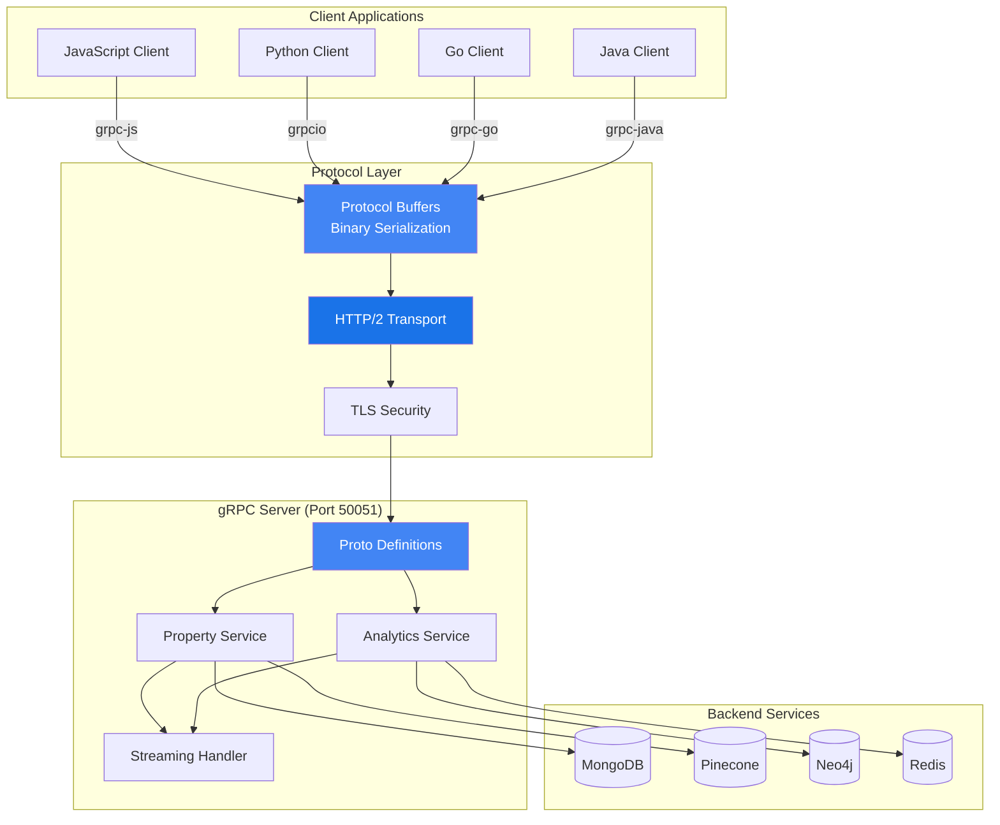
```mermaid
flowchart TB
    subgraph "Client Applications"
        JSClient[JavaScript Client]
        PyClient[Python Client]
        GoClient[Go Client]
        JavaClient[Java Client]
    end

    subgraph "gRPC Server (Port 50051)"
        Proto[Proto Definitions]
        PropertySvc[Property Service]
        AnalyticsSvc[Analytics Service]
        Stream[Streaming Handler]
    end

    subgraph "Protocol Layer"
        PB[Protocol Buffers<br/>Binary Serialization]
        HTTP2[HTTP/2 Transport]
        TLS[TLS Security]
    end

    subgraph "Backend Services"
        MongoDB[(MongoDB)]
        Pinecone[(Pinecone)]
        Neo4j[(Neo4j)]
        Redis[(Redis)]
    end

    JSClient -->|grpc-js| PB
    PyClient -->|grpcio| PB
    GoClient -->|grpc-go| PB
    JavaClient -->|grpc-java| PB

    PB --> HTTP2
    HTTP2 --> TLS
    TLS --> Proto

    Proto --> PropertySvc
    Proto --> AnalyticsSvc
    PropertySvc --> Stream
    AnalyticsSvc --> Stream

    PropertySvc --> MongoDB
    PropertySvc --> Pinecone
    AnalyticsSvc --> Neo4j
    AnalyticsSvc --> Redis

    style Proto fill:#4285F4,color:#fff
    style PB fill:#4285F4,color:#fff
    style HTTP2 fill:#1a73e8,color:#fff
```

#### gRPC Communication Flow

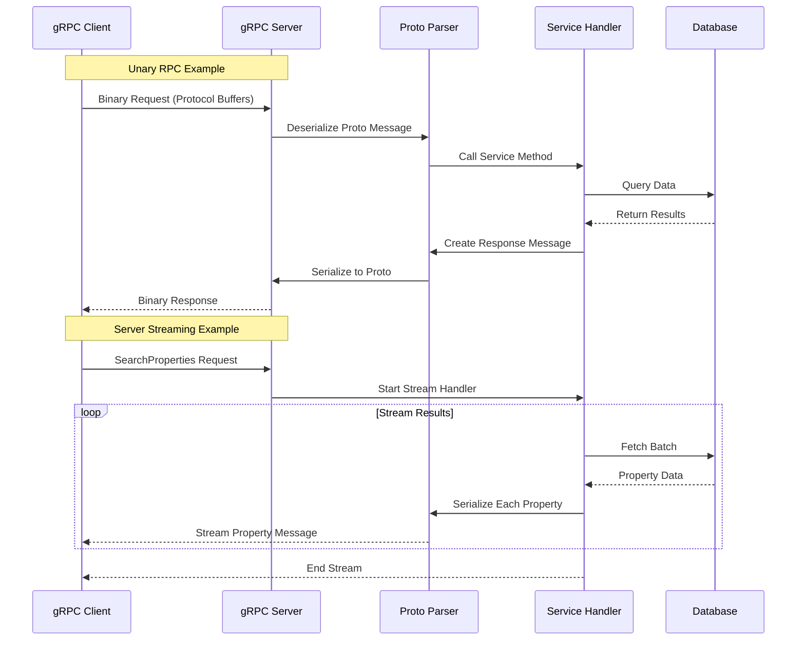
```mermaid
sequenceDiagram
    participant C as gRPC Client
    participant S as gRPC Server
    participant P as Proto Parser
    participant H as Service Handler
    participant DB as Database

    Note over C,S: Unary RPC Example
    C->>S: Binary Request (Protocol Buffers)
    S->>P: Deserialize Proto Message
    P->>H: Call Service Method
    H->>DB: Query Data
    DB-->>H: Return Results
    H->>P: Create Response Message
    P->>S: Serialize to Proto
    S-->>C: Binary Response

    Note over C,S: Server Streaming Example
    C->>S: SearchProperties Request
    S->>H: Start Stream Handler
    loop Stream Results
        H->>DB: Fetch Batch
        DB-->>H: Property Data
        H->>P: Serialize Each Property
        P-->>C: Stream Property Message
    end
    H-->>C: End Stream
```

#### gRPC vs REST vs tRPC Comparison

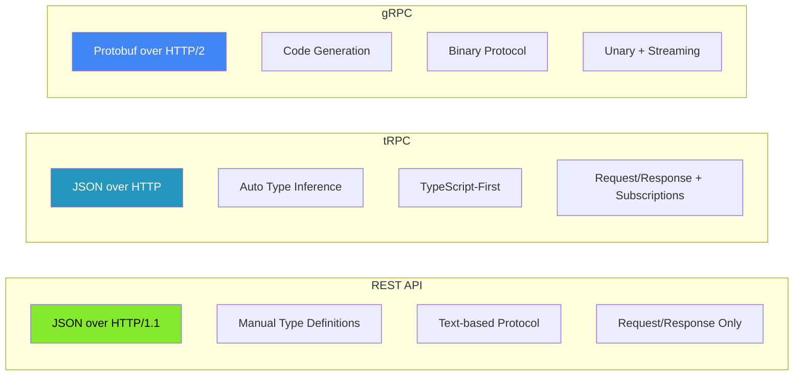
```mermaid
graph LR
    subgraph "REST API"
        REST[JSON over HTTP/1.1]
        REST1[Manual Type Definitions]
        REST2[Text-based Protocol]
        REST3[Request/Response Only]
    end

    subgraph "tRPC"
        TRPC[JSON over HTTP]
        TRPC1[Auto Type Inference]
        TRPC2[TypeScript-First]
        TRPC3[Request/Response + Subscriptions]
    end

    subgraph "gRPC"
        GRPC[Protobuf over HTTP/2]
        GRPC1[Code Generation]
        GRPC2[Binary Protocol]
        GRPC3[Unary + Streaming]
    end

    style REST fill:#85EA2D,color:#000
    style TRPC fill:#2596BE,color:#fff
    style GRPC fill:#4285F4,color:#fff
```

#### gRPC Performance Benefits

- **Binary Protocol**: 20-30% smaller payloads compared to JSON
- **HTTP/2**: Multiplexing, server push, header compression
- **Streaming**: Bidirectional streaming for real-time updates
- **Code Generation**: Type-safe clients in 10+ languages
- **Load Balancing**: Built-in support for client-side load balancing

**Running the gRPC Server**:

```bash
# Install dependencies
cd grpc
npm install

# Generate TypeScript types from proto files
npm run proto:generate

# Start gRPC server (runs on port 50051)
npm run server
```

**Environment Variables**:

```env
GRPC_SERVER_PORT=50051
GRPC_SERVER_HOST=0.0.0.0
GRPC_USE_TLS=false  # Set to true for production
GRPC_CERT_PATH=/path/to/server.crt
GRPC_KEY_PATH=/path/to/server.key
```

**Testing with grpcurl**:

```bash
# List available services
grpcurl -plaintext localhost:50051 list

# Get property by ID
grpcurl -plaintext -d '{"id": "123"}' \
  localhost:50051 properties.PropertyService/GetProperty

# Stream property search
grpcurl -plaintext -d '{"query": "3 bedrooms"}' \
  localhost:50051 properties.PropertyService/SearchProperties
```

**Language Support**:

The gRPC services can be consumed by clients written in:
- JavaScript/TypeScript (Node.js)
- Python
- Go
- Java
- C#/.NET
- Ruby
- PHP
- And many more...

This makes EstateWise's data and services accessible to a wide range of applications and microservices, regardless of their technology stack.

## Travis CI

Travis CI complements the existing GitHub Actions workflows by running the Node 20 pipeline defined in `.travis.yml`. Each build caches npm dependencies and executes backend and frontend jobs in isolation.

- **Backend stage:** Installs dependencies with `npm --prefix backend ci`, then runs the TypeScript build and Jest suite.
- **Frontend stage:** Installs dependencies with `npm --prefix frontend ci`, performs linting, builds the Next.js app, and runs Jest.
- **Secrets:** Configure the same environment variables used locally (database URIs, Pinecone, Google AI keys, etc.) through the Travis project settings.

> [!NOTE]
> **More details:** See [`TRAVIS_CI.md`](TRAVIS_CI.md) for enablement steps, local parity commands, and maintenance tips.

## Testing

The application includes unit tests for both the backend and frontend components. These tests ensure that the application functions correctly and that any changes made do not break existing functionality.

### Running Tests

To run the tests, follow these steps:

1. **Backend Unit & Integration Tests:**
  - Navigate to the `backend` directory.
  - Run the tests using the following command:

    ```bash
    npm run test
    
    # or run with watch mode (recommended for development - reruns tests on file changes)
    npm run test:watch
    
    # or run with coverage report (recommended for CI/CD - generates a coverage report)
    npm run test:coverage
    ```
  - This command runs the unit tests defined in the `src/tests` directory using Jest.

2. **Frontend Unit & Integration Tests:**
  - Navigate to the `frontend` directory.
  - Run the tests using the following command:

    ```bash
    npm run test
    
    # or run with watch mode (recommended for development - reruns tests on file changes)
    npm run test:watch
    
    # or run with coverage report (recommended for CI/CD - generates a coverage report)
    npm run test:coverage
    ```
  - This command runs the unit tests defined in the `__tests__` directory using Jest and React Testing Library.

3. **Frontend E2E Tests:**
  - For end-to-end tests, we use Cypress and Selenium WebDriver.
  - To run the Selenium E2E tests, navigate to the `frontend` directory and run:

    ```bash
    npm run test:selenium
    ```

  - To run the Cypress E2E tests, navigate to the `frontend` directory and run:

    ```bash
    npm run cypress:run
    
    # to open the Cypress Test Runner in interactive mode, run:
    npm run cypress:open
    ```

  - This command runs the end-to-end tests defined in the `cypress/integration` directory using Cypress.

These tests cover various aspects of the application, including:
- **Unit Tests:** Individual components and functions to ensure they behave as expected.
- **Integration Tests:** Multiple components working together to ensure they interact correctly.
- **End-to-End Tests:** Simulating user interactions to ensure the entire application flow works as intended.

## OpenAPI Specification

An OpenAPI specification file (`openapi.yaml`) is included in the root directory. You can use Swagger UI or Postman to explore and test the API endpoints.

> [!TIP]
> Note: It may not be the latest and most updated version of the API specification, so please refer to the [Swagger API Documentation](#swagger-api-documentation) for the most up-to-date information.

## JSDoc & TypeDoc

We use **JSDoc** and **TypeDoc** to generate developer-friendly documentation for the project.

### JSDoc (for JavaScript)

1. Install:

   ```bash
   npm install --save-dev jsdoc
   ```

2. Configure `jsdoc.json`:

   ```json
   {
     "source": {
       "include": ["backend", "frontend"],
       "includePattern": ".js$"
     },
     "opts": {
       "destination": "docs",
       "recurse": true
     }
   }
   ```

3. Run:

   ```bash
   npx jsdoc -c jsdoc.json
   ```

Open `docs/index.html` to view.

### TypeDoc (for TypeScript)

1. Install:

   ```bash
   npm install --save-dev typedoc
   ```

2. Generate backend docs:

   ```bash
   npm run typedoc:backend
   ```

3. Generate frontend docs:

   ```bash
   npm run typedoc:frontend
   ```

The generated HTML will be in `docs-backend/` and `docs-frontend/`. Open the respective `index.html` files to view.

For more details, see [jsdoc.app](https://jsdoc.app) and [typedoc.org](https://typedoc.org).

## Containerization

The application is containerized using Docker to ensure consistent, portable, and reproducible builds across different environments.

* **Backend and Frontend Dockerfiles:**
  The `backend/Dockerfile` and `frontend/Dockerfile` define how to build the container images for their respective services. They include steps to install dependencies, build the code, and configure the production servers.

* **GitHub Actions Integration:**
  As part of the CI/CD pipeline, the workflow automatically builds these Docker images after testing and linting have succeeded. It uses the `docker/build-push-action@v5` to build the images and then push them to GitHub Container Registry (GHCR).

* **Image Scanning:**
  Once the images are built and published, they are scanned for vulnerabilities using Trivy in the pipeline to catch any security issues before deployment.

* **docker-compose Usage (Local):**
  For local development or quick testing, a `docker-compose.yml` file is included. This file defines both the backend and frontend containers, along with their dependencies, allowing you to spin up the entire stack with a single command:

  ```bash
  docker-compose up --build
  ```

* **Deployment:**
  In production, the images are pulled directly from GHCR and deployed to AWS infrastructure or Vercel, enabling a consistent artifact to run from local to production.

This approach ensures faster onboarding for developers, simplifies deployments, and minimizes environment drift.

## VS Code Extension

We have developed a VSCode extension to enhance the development experience with **EstateWise**. This extension provides features such as:

- **Instant Chat Access**  
  Open the EstateWise chatbot directly in VS Code via the Command Palette (`Estatewise Chat: Open Chat`).

- **Persistent Webview Panel**  
  Keeps your conversation context alive even when the panel is hidden or you switch files.

- **Configurable Panel**  
  Customize the panel title, target editor column, iframe width/height, script permissions, and auto‑open behavior via VS Code settings.

- **Secure Embedding**  
  Loads the chatbot through a sandboxed iframe with a strict Content‑Security‑Policy, so all logic remains safely hosted on `https://estatewise.vercel.app/chat`.

- **Zero Backend Overhead**  
  No extra server or API keys required in VS Code—everything runs through the existing EstateWise web app.

- **Easy Installation**  
  Install the `.vsix` package locally or grab it from the VS Code Marketplace, then start chatting with EstateWise without leaving your editor.

<p align="center">
  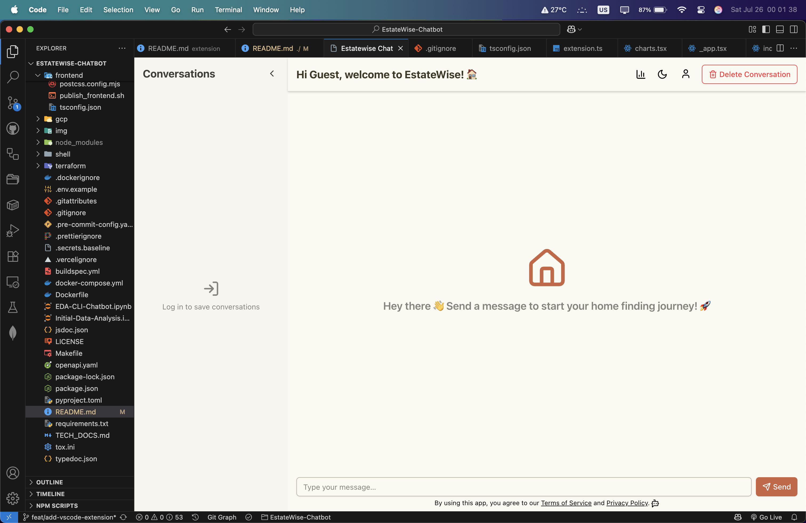
</p>

**For full installation, development, and configuration instructions, see the [VS Code Extension docs](extension/README.md).**

> [!TIP]
> VS Code Marketplace: [Estatewise Chat Extension](https://marketplace.visualstudio.com/items?itemName=hoangsonw.estatewise-chat).

## Contributing

Contributions are welcome! Follow these steps:

1. **Fork the repository.**
2. **Create a feature branch:**  
   `git checkout -b feature/your-feature-name`
3. **Commit your changes:**  
   `git commit -m 'Add new feature'`
4. **Push to the branch:**  
   `git push origin feature/your-feature-name`
5. **Open a Pull Request** with a clear description of your changes.
6. **Follow the project's coding standards:**  
   - Use ESLint and Prettier for code formatting.
   - Write tests for new features or bug fixes.
   - Update documentation as needed.
7. **Review and address feedback:**  
   - Be responsive to comments on your pull request.
   - Make necessary changes and push updates to the same branch.
8. **Celebrate your contribution!**  
   Once your pull request is merged, you will be recognized as a contributor to the project.

This project follows the [Contributor Covenant Code of Conduct](.github/CODE_OF_CONDUCT.md). By participating, you agree to abide by its terms.

## License

This project is licensed under the [MIT License](LICENSE).

> [!CAUTION]
> This project is provided for educational purposes only. Any use, including non-commercial or academic, must include proper attribution to the original creators. Unauthorized redistribution or commercial use without explicit permission is strictly prohibited.

**Copyright © 2025 EstateWise Team. All rights reserved.**

## Contact

For any questions or inquiries, please contact the [repository maintainer](https://github.com/hoangsonww) or open an issue in the repository [here](https://github.com/hoangsonww/EstateWise-Chapel-Hill-Chatbot/issues). You're also welcome to join our ongoing discussions [at this link](https://github.com/hoangsonww/EstateWise-Chapel-Hill-Chatbot/discussions).

---

Thank you for checking out **EstateWise**! We hope you find it useful in your real estate journey. If you have any questions or feedback, feel free to reach out or contribute to the project. 🏡🚀

[🔗 Visit the Live App](https://estatewise.vercel.app)

[📖 Read the Technical Documentation](TECH_DOCS.md)

[📝 Go to Technical Documentation](TECH_DOCS.md)

[⬆️ Back to Top](#table-of-contents)
