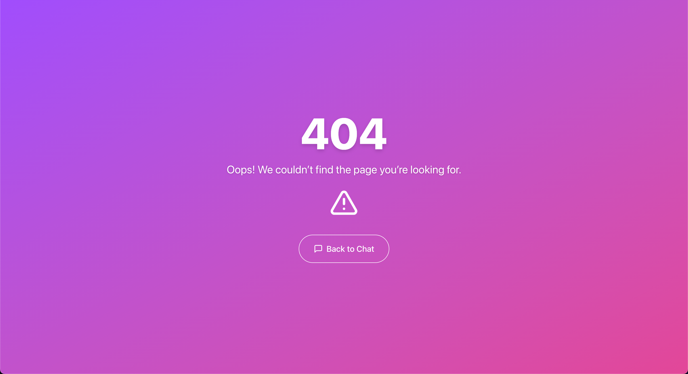

# EstateWise – Your Intelligent Estate Assistant 🏡

**EstateWise** is a full-stack chatbot application that helps users find their dream property in **Chapel Hill, NC** and surrounding areas. The app harnesses state‑of‑the‑art **AI technology and Retrieval-Augmented Generation (RAG)** techniques to deliver personalized property recommendations based on user preferences. Whether you sign in to save your conversation history or continue as a guest, EstateWise offers a sleek, responsive interface with smooth animations and a modern design.

## Table of Contents

- [Live App](#live-app)
  - [Key Technologies](#key-technologies-used)
- [Features](#features)
- [Architecture](#architecture)
  - [High-Level Architecture Flow Diagram](#high-level-architecture-flow-diagram)
- [Setup & Installation](#setup--installation)
  - [Backend Setup](#backend-setup)
  - [Frontend Setup](#frontend-setup)
- [Deployment](#deployment)
- [Usage](#usage)
- [User Interface](#user-interface)
- [API Endpoints](#api-endpoints)
  - [Authentication](#authentication)
  - [Conversations](#conversations)
  - [Chat](#chat)
  - [Swagger API Documentation](#swagger-api-documentation)
- [Project Structure](#project-structure)
- [Dockerization](#dockerization)
- [OpenAPI Specification](#openapi-specification)
- [Contributing](#contributing)
- [License](#license)

## Live App

Visit the live app on **Vercel** at [https://estatewise.vercel.app/](https://estatewise.vercel.app/) and explore the intelligent estate assistant!

The API is available at: [https://estatewise-backend.vercel.app/](https://estatewise-backend.vercel.app/).

Feel free to test the app as a guest or sign up for an account to save your conversations!

### Key Technologies Used


## Features

- **Intelligent Property Recommendations:** Receive personalized property suggestions powered by AI and RAG.
- **User Authentication:** Sign up, log in, and log out using secure JWT authentication.
- **Conversation History:** Authenticated users can view, rename, and delete past conversations.
- **Interactive Chat Interface:** Enjoy a smooth, animated chat experience with markdown-formatted responses.
- **Responsive Design:** Fully responsive UI optimized for desktop and mobile devices.
- **Dark/Light Mode:** Toggle between dark and light themes with user preferences saved locally.
- **Search and Management:** Easily search through your conversation history and manage your saved conversations.
- **Guest Mode:** Use the app as a guest (conversations are not saved).

## Architecture

EstateWise is built with a modern, full-stack architecture consisting of two major parts:

### Backend

- **Express.js & TypeScript:** A robust backend API that handles authentication, conversation management, and AI chat processing.
- **MongoDB:** Database for storing user data, conversation histories, and more.
- **JWT Authentication:** Secure user sessions using JSON Web Tokens.
- **Integration with AI & RAG:** Communicates with AI APIs and uses LangChain & Pinecone for advanced property recommendation logic.

### Frontend

- **Next.js & React:** A responsive, animation-rich web application.
- **Shadcn UI Components:** For a consistent design system across the app.
- **Framer Motion:** Provides smooth animations and transitions throughout the user experience.
- **Dark Mode/Light Mode:** Users can toggle themes with seamless background color transitions.

### High-Level Architecture Flow Diagram

```plaintext
         ┌────────────────────────────────┐
         │      User Interaction          │
         │   (Chat, Signup, Login, etc.)  │
         └─────────────┬──────────────────┘
                       │
                       ▼
         ┌───────────────────────────────┐
         │    Frontend (Next.js, React)  │
         │ - Responsive UI, Animations   │
         │ - API calls to backend        │
         └─────────────┬─────────────────┘
                       │
                       │ (REST API Calls)
                       │
                       ▼
         ┌─────────────────────────────┐
         │   Backend (Express+TS)      │
         │ - Auth (JWT, Signup/Login)  │
         │ - Conversation & Chat APIs  │
         └─────────────┬───────────────┘
                       │
                       │
           ┌───────────┴────────────┬─────────────┐
           │                        │             │
           ▼                        ▼             ▼
┌─────────────────┐       ┌─────────────────┐  ┌─────────────────────────┐
│   MongoDB       │       │ Pinecone Vector │  │  (Additional Data:      │
│ (User Data,     │◄─────►│   Database      │  │  Analytics, Logs, etc.) │
│  Convo History) │       │ (Knowledge Base)│  └────────────┬────────────┘
└─────────────────┘       └─────────────────┘               │
       ▲                                             ┌──────▼───────────┐
       │                                             │  AI/ML Component │
       │         (Utilizes stored data & docs)       │ (RAG, LangChain) │
       ▼                                             └──────────────────┘
         ┌─────────────────────────────┐
         │   Response Processing       │
         │ - Compile AI answer         │
         │ - Use NLP & ML models       │
         │ - Update conversation data  │
         └─────────────┬───────────────┘
                       │
                       ▼
         ┌─────────────────────────────┐
         │    Frontend Display         │
         │ - Show chat response        │
         │ - Update UI (conversation)  │
         │ - User authentication flows │
         └─────────────────────────────┘
```

## Setup & Installation

### Backend Setup

1. **Clone the repository:**

   ```bash
   git clone https://github.com/hoangsonww/EstateWise-Chapel-Hill-Estate.git
   cd estatewise/backend
   ```

2. **Install dependencies:**

   ```bash
   npm install
   ```

3. **Environment Variables:**  
   Create a `.env` file in the `server` directory with the following variables (adjust as needed):

   ```env
   PORT=<your_port>
   MONGO_URI=<your_mongo_uri>
   JWT_SECRET=<your_jwt_secret>
   GOOGLE_AI_API_KEY=<your_google_ai_api_key>
   PINECONE_API_KEY=<your_pinecone_api_key>
   PINECONE_INDEX=estatewise-index
   ```

   Important: Be sure that you created the Pinecone index with the name `estatewise-index` in your Pinecone account before proceeding. Then,
   add data to the index using the `pinecone` CLI or API. For security purposes, our properties data is not publicly available in the repository. Please use your own data.

4. **Run the Backend in Development Mode:**

   ```bash
   npm run dev
   ```

   This command starts the backend server with live reloading.

### Frontend Setup

1. **Navigate to the client folder:**

   ```bash
   cd ../frontend
   ```

2. **Install dependencies:**

   ```bash
   npm install
   ```

3. **Run the Frontend Development Server:**

   ```bash
   npm run dev
   ```

   The frontend should be running at [http://localhost:3000](http://localhost:3000).

## Deployment

- **Backend:** Deploy your backend on your chosen platform (Heroku, Vercel, AWS, etc.) and ensure environment variables are properly set.
- **Frontend:** Deploy the React/Next.js frontend using services like Vercel or Netlify. Update any API endpoints if necessary.

## Usage

- **Landing Page:**  
  Learn about the app’s features and get started by signing in or continuing as a guest.
- **Authentication:**  
  Create an account, log in, and manage your user profile securely using JWT authentication.
- **Chat Interface:**  
  Interact with the AI assistant in real time. Authenticated users can save, rename, and delete conversations.
- **Theme Toggle:**  
  Switch between dark and light modes with smooth background transitions.
- **Search & Management:**  
  Easily search through your conversation history and manage your saved conversations from the sidebar.

## User Interface

EstateWise features a modern, animated, and fully responsive user interface built with Next.js and Shadcn UI, with the help of Tailwind CSS for styling. The UI is designed to be intuitive and user-friendly, ensuring a seamless experience across devices.

### Landing Page

<p align="center">
  
</p>

### Chat Interface - Guest

<p align="center">
  
</p>

### Chat Interface - Authenticated

<p align="center">
  
</p>

### Dark Mode: Chat Interface - Guest

<p align="center">
  
</p>

### Dark Mode: Chat Interface - Authenticated

<p align="center">
  
</p>

### Login Page

<p align="center">
  
</p>

### Register Page

<p align="center">
  
</p>

### Reset Password Page

<p align="center">
  
</p>

### 400 Not Found Page

<p align="center">
  
</p>

## API Endpoints

### Authentication

- **POST** `/api/auth/signup` – Create a new user.
- **POST** `/api/auth/login` – Log in a user and return a JWT.
- **GET** `/api/auth/verify-email` – Verify if an email exists.
- **POST** `/api/auth/reset-password` – Reset a user's password.

### Conversations

- **POST** `/api/conversations` – Create a new conversation.
- **GET** `/api/conversations` – Retrieve all conversations for a user.
- **GET** `/api/conversations/:id` – Retrieve a conversation by its ID.
- **PUT** `/api/conversations/:id` – Rename a conversation.
- **DELETE** `/api/conversations/:id` – Delete a conversation.
- **GET** `/api/conversations/search/:query` – Search conversations by title or content.

### Chat

- **POST** `/api/chat` – Send a chat message and receive an AI-generated response.

More endpoints can be found in the Swagger API documentation. Endpoints may be added or modified as the project evolves.

### Swagger API Documentation

Access detailed API docs at the `/api-docs` endpoint on your deployed backend.

<p align="center">
  
</p>

Live API documentation is available at: [https://estatewise-backend.vercel.app/api-docs](https://estatewise-backend.vercel.app/api-docs)

## Project Structure

```plaintext
EstateWise/
├── frontend/                 # Frontend Next.js application
│   ├── public/               # Static assets (images, icons, etc.)
│   ├── components/           # Reusable UI components
│   ├── pages/                # Next.js pages (Chat, Login, Signup, etc.)
│   ├── styles/               # CSS/SCSS files
│   ├── package.json
│   ├── tsconfig.json
│   └── ... (other config files, etc.)
├── server/                   # Backend Express application
│   ├── src/
│   │   ├── controllers/      # API controllers and endpoints
│   │   ├── models/           # Mongoose models
│   │   ├── routes/           # Express routes
│   │   ├── services/         # Business logic and integrations
│   │   └── middleware/       # Authentication, error handling, etc.
│   ├── package.json
│   ├── tsconfig.json
│   └── ... (other config files, etc.)
├── .env                      # Environment variables for development
├── README.md                 # This file
├── docker-compose.yml        # Docker configuration for backend and frontend
└── ... (other config files, etc.)
```

## Dockerization

To run the application using Docker:

1. Ensure you have [Docker](https://www.docker.com/) installed.
2. In the project root directory, run:

   ```bash
   docker-compose up --build
   ```

This command builds and starts both the backend and frontend services as defined in the `docker-compose.yml` file.

## OpenAPI Specification

An OpenAPI specification file (`openapi.yaml`) is included in the root directory. You can use Swagger UI or Postman to explore and test the API endpoints.

## Contributing

Contributions are welcome! Follow these steps:

1. **Fork the repository.**
2. **Create a feature branch:**  
   `git checkout -b feature/your-feature-name`
3. **Commit your changes:**  
   `git commit -m 'Add new feature'`
4. **Push to the branch:**  
   `git push origin feature/your-feature-name`
5. **Open a Pull Request** with a clear description of your changes.

## License

This project is licensed under the [MIT License](LICENSE).

---

[⬆️ Back to Top](#table-of-contents)
