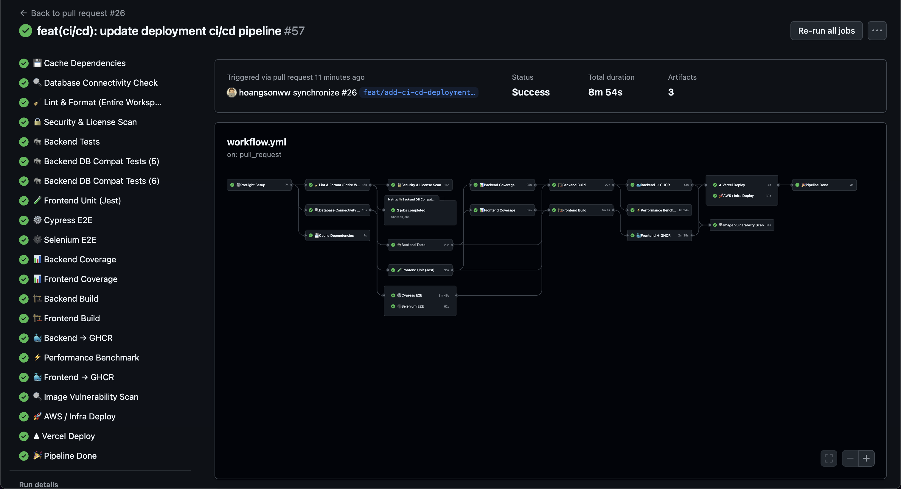
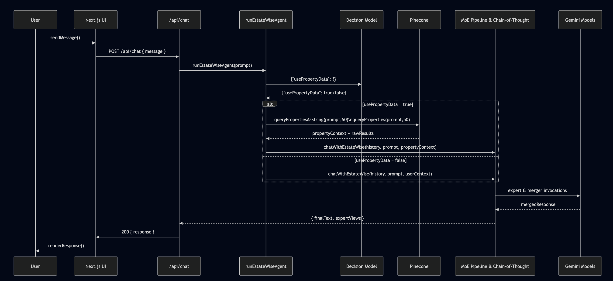
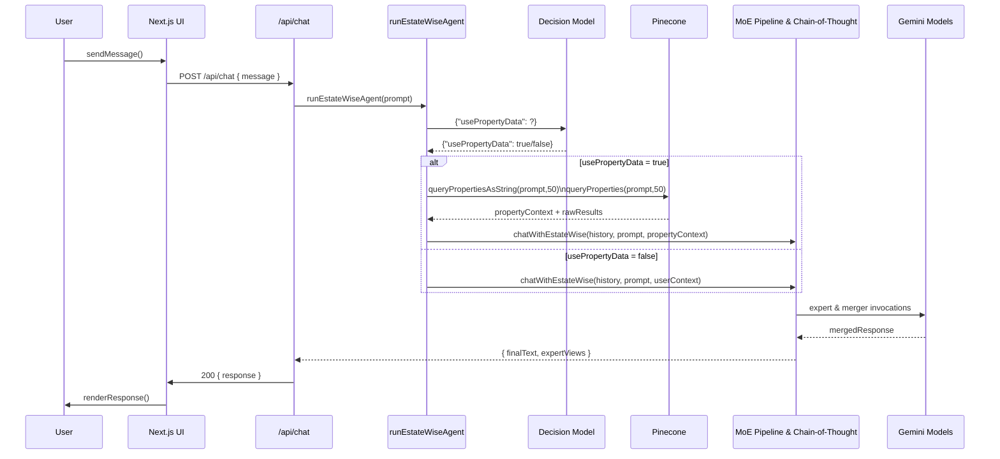

# EstateWise: AI‑Powered Real Estate Assistant for Chapel Hill, NC - AI/ML/Infrastructure Technical Documentation

**EstateWise** is an AI‑powered real estate assistant focused on Chapel Hill, NC and surrounding areas. This document provides a deep dive into every component—from raw data ingestion to AI orchestration, delivery via a React/Next.js front‑end, and end‑to‑end deployment.

Below, we outline the architecture, key components, and challenges faced during development. This is intended for developers and data scientists interested in understanding the inner workings of **EstateWise**. We also provide a flowchart and various diagrams to visualize the architecture and data flow throughout the system.


> [!IMPORTANT]
> For a CLI version of the chatbot, as well as the EDA (Exploratory Data Analysis) of the properties data and interactive geospatial visualizations, check out the Jupyter notebooks in the root directory: [EDA-CLI-Chatbot.ipynb](EDA-CLI-Chatbot.ipynb). Alternatively, feel free to go to this [Colaboratory Notebook](https://colab.research.google.com/drive/1-Z3h0LUHl0v-e0RaZgwruL8q180Uk4Z-?usp=sharing) to directly view and run the code in this notebook & see the results in real time.

---

## Table of Contents

- [1. Data Ingestion & Validation](#1-data-ingestion--validation)
  - [1.1 Streaming Parser Setup](#11-streaming-parser-setup)
  - [1.2 Schema & Field Selection](#12-schema--field-selection)
  - [1.3 Cleaning & Sanitization Utilities](#13-cleaning--sanitization-utilities)
  - [1.4 Error Handling & Logging](#14-error-handling--logging)
- [2. Embedding Generation & Vector Store](#2-embedding-generation--vector-store)
  - [2.1 Prompt Engineering for Embeddings](#21-prompt-engineering-for-embeddings)
  - [2.2 Google Embedding API Integration](#22-google-embedding-api-integration)
  - [2.3 Pinecone Batch Upsert Strategy](#23-pinecone-batch-upsert-strategy)
  - [2.4 Monitoring & Retry Logic](#24-monitoring--retry-logic)
- [3. Retrieval‑Augmented Generation (RAG)](#3-retrievalaugmented-generation-rag)
  - [3.1 KNN Query Implementation](#31-knn-query-implementation)
  - [3.2 Assembling Retrieval Context](#32-assembling-retrieval-context)
  - [3.3 Caching Frequent Queries](#33-caching-frequent-queries)
- [4. RAG‑Decision Orchestration Layer](#4-ragdecision-orchestration-layer)
  - [4.1 JSON‑Only Decision Protocol](#41-jsononly-decision-protocol)
  - [4.2 Simplified Control Flow](#42-simplified-control-flow)
  - [4.3 Implementation Highlights](#43-implementation-highlights)
- [5. Clustering & Similarity Analysis](#5-clustering--similarity-analysis)
  - [5.1 Numeric Feature Extraction & Normalization](#51-numeric-feature-extraction--normalization)
  - [5.2 Plain‑JS K‑Means Implementation](#52-plainjs-kmeans-implementation)
  - [5.3 Cluster Context Injection](#53-cluster-context-injection)
- [6. Mixture‑of‑Experts (MoE) Ensemble](#6-mixtureofexperts-moe-ensemble)
  - [6.1 Expert Definitions & System Prompts](#61-expert-definitions--system-prompts)
  - [6.2 Parallel Expert Invocations](#62-parallel-expert-invocations)
  - [6.3 Weight Normalization & Feedback Loop](#63-weight-normalization--feedback-loop)
  - [6.4 Master Merger Model](#64-master-merger-model)
  - [6.5 Prompt Engineering](#65-prompt-engineering)
- [7. Chain-of-Thought Reasoning](#7-chain-of-thought-reasoning)
  - [7.1 Implementation](#71-implementation)
  - [7.2 Example](#72-example)
  - [7.3 Benefits](#73-benefits)
- [8. Backend API & Data Layer](#8-backend-api--data-layer)
  - [7.1 Express.js Routes & Controllers](#81-expressjs-routes--controllers)
  - [7.2 MongoDB Models & Conversations](#82-mongodb-models--conversations)
  - [7.3 Authentication & JWT Workflow](#83-authentication--jwt-workflow)
  - [7.4 OpenAPI / Swagger Integration](#84-openapi--swagger-integration)
- [9. Frontend Integration](#9-frontend-integration)
- [10. Infrastructure & Deployment](#10-infrastructure--deployment)
  - [10.1 Docker Compose & Services](#101-docker-compose--services)
  - [10.2 Environment Configuration](#102-environment-configuration)
  - [10.3 CI/CD Pipeline (GitHub Actions)](#103-cicd-pipeline-github-actions)
  - [10.4 Monitoring & Logging](#104-monitoring--logging)
- [11. Challenges](#11-challenges)
  - [11.1 Large‑Scale Data Ingestion](#111-largescale-data-ingestion)
  - [11.2 Embedding Generation & Rate Limits](#112-embedding-generation--rate-limits)
  - [11.3 Vector Store Scaling](#113-vector-store-scaling)
  - [11.4 RAG & Context Assembly](#114-rag--context-assembly)
  - [11.5 Mixture‑of‑Experts Complexity](#115-mixtureofexperts-complexity)
  - [11.6 Deployment & Infrastructure](#116-deployment--infrastructure)
- [12. Logging & Monitoring](#12-logging--monitoring)
  - [12.1 Logging](#121-logging)
  - [12.2 Monitoring](#122-monitoring)
  - [12.3 Visualization](#123-visualization)
- [13. GitHub Actions CI/CD Pipeline](#13-github-actions-cicd-pipeline)
  - [13.1 Workflow Configuration](#131-workflow-configuration)
  - [13.2 Configuring Secrets](#132-configuring-secrets)
  - [13.3 Monitoring & Troubleshooting](#133-monitoring-and-troubleshooting)
  - [13.4 Deployment Rollback](#134-deployment-rollback)
- [14. Appendices](#14-appendices)
  - [A. Environment Variables Reference](#a-environment-variables-reference)
  - [B. AI/ML Flow Chart](#b-aiml-flow-chart)
  - [C. Overall App’s Flow Diagram](#c-overall-apps-flow-diagram)
  - [D. Mermaid Sequence Diagram](#d-mermaid-sequence-diagram)
  - [E. Vector Schema & Metadata Example](#e-vector-schema--metadata-example)

---

## 1. Data Ingestion & Validation

**What it is:**  
The pipeline stage that reads raw Zillow JSON files, selects only the relevant fields, cleans and sanitizes each record, and enforces data quality rules.

**Why we use it:**  
To ensure we only store accurate, complete, and well‑formed property data—avoiding garbage in, garbage out—so that downstream embeddings, similarity searches, and AI reasoning work reliably.

### 1.1 Streaming Parser Setup

We avoid loading multi‑GB JSON files into memory by using [`stream-json`](https://github.com/uhop/stream-json) and its array streamer:

```tsx
import { parser } from "stream-json";
import { streamArray } from "stream-json/streamers/StreamArray";
import { createReadStream } from "fs";

function processFileStreaming(filePath: string) {
  const jsonStream = createReadStream(filePath, { encoding: "utf8" })
    .pipe(parser())
    .pipe(streamArray());

  jsonStream.on("data", async ({ value }) => {
    jsonStream.pause();
    try {
      await handleRecord(value);
    } finally {
      jsonStream.resume();
    }
  });

  jsonStream.on("end", () => {
    console.log(`Finished processing ${filePath}`);
  });
}
```

- **Back‑pressure**: We call `pause()` and `resume()` around each async record to keep the event loop responsive.
- **Streaming**: Each record is handled in isolation.

### 1.2 Schema & Field Selection

We explicitly keep only the fields necessary for chat and search on Pinecone:

| Category               | Kept Fields                                                    |
| ---------------------- | -------------------------------------------------------------- |
| Identifiers & Location | `zpid`, `address.streetAddress`, `city`, `state`, `zipcode`    |
| Physical Attributes    | `bedrooms`, `bathrooms`, `livingArea`, `yearBuilt`, `homeType` |
| Price & Status         | `price`, `homeStatus`, `listingDataSource`                     |
| Geocoordinates         | `latitude`, `longitude`                                        |
| Description            | `description` (free‑text)                                      |

> **Dropped**: incomplete records missing critical fields, unrealistic `yearBuilt` (<1800 or >2100), non‑numeric/invalid ranges, and dozens of extraneous Zillow-only flags.

### 1.3 Cleaning & Sanitization Utilities

```tsx
function safeStr(val: any, fallback = "Unknown"): string {
  /* … */
}
function safeNum(val: any, fallback = 0, min?: number, max?: number): number {
  /* … */
}

interface CleanedProperty {
  zpid: number;
  address: {
    streetAddress: string;
    city: string;
    state: string;
    zipcode: string;
  };
  bedrooms: number;
  bathrooms: number;
  livingArea: number;
  yearBuilt: number;
  latitude: number;
  longitude: number;
  homeType: string;
  price: number;
  homeStatus: string;
  listingDataSource: string;
  description: string;
}

function cleanDocument(raw: any): CleanedProperty {
  // apply safeStr, safeNum, range checks, defaults…
}
```

- **`safeStr`**: trims, rejects empty, returns `"Unknown"`
- **`safeNum`**: enforces numeric ranges (e.g. `0 ≤ bedrooms ≤ 20`, `0 < price ≤ 10 000 000`)
- **Addresses** are flattened into a single JSON field for metadata.

### 1.4 Error Handling & Logging

Every step logs warnings and errors:

```tsx
try {
  const clean = cleanDocument(raw);
  if (shouldSkip(clean)) {
    console.warn(`Skipping invalid: zpid=${clean.zpid}`);
    return;
  }
  // …
} catch (e) {
  console.error("Record processing error:", e, raw);
}
```

- **Malformed JSON**: Caught at stream level
- **Validation Failures**: Logged and skipped
- **Upsert Errors**: Caught & retried in next batch

---

## 2. Embedding Generation & Vector Store

**What it is:**  
Transforms each cleaned property record into a fixed‑length numeric vector (via Google’s text‑embedding model) and upserts those vectors into a Pinecone index in batches.

**Why we use it:**  
Embeddings capture semantic meaning of property descriptions and metadata; storing them in a vector database enables lightning‑fast kNN lookups for retrieval‑augmented generation (RAG).

### 2.1 Prompt Engineering for Embeddings

Each record is transformed into a concise single‑sentence prompt:

```tsx
function buildPrompt(prop: CleanedProperty): string {
  return (
    `Property at ${prop.address.streetAddress}, ${prop.address.city}, ${prop.address.state} ${prop.address.zipcode}. ` +
    `Price: $${prop.price}. Beds: ${prop.bedrooms}, Baths: ${prop.bathrooms}, ` +
    `Area: ${prop.livingArea} sqft, Built in ${prop.yearBuilt}. ${prop.description}`
  );
}
```

- **Uniform structure** ensures embedding consistency.

### 2.2 Google Embedding API Integration

```tsx
import { GoogleGenerativeAI } from "@google/generative-ai";

const genAI = new GoogleGenerativeAI(process.env.GOOGLE_AI_API_KEY);
const embedModel = genAI.getGenerativeModel({
  model: "models/text-embedding-004",
});

async function generateEmbedding(text: string): Promise<number[]> {
  const resp = await embedModel.embedContent(text);
  if (!resp.embedding?.values) throw new Error("Invalid embedding");
  return resp.embedding.values;
}
```

- **1,536‑dimensional** vectors
- **Retry** on `5xx` error codes with exponential backoff

### 2.3 Pinecone Batch Upsert Strategy

```tsx
import { index } from "../pineconeClient";
const BATCH_SIZE = 50;
let batch: PineconeVector[] = [];

async function maybeUpsert() {
  if (batch.length < BATCH_SIZE) return;
  const toSend = batch.splice(0, BATCH_SIZE);
  await index.upsert({ vectors: toSend });
  console.log(`Upserted ${toSend.length} vectors`);
}
```

- **Atomic batches** of 50 vectors to avoid Pinecone’s payload limit
- **Final flush** on stream end

### 2.4 Monitoring & Retry Logic

- **Metrics**: track embedding latency, upsert success/failure rates (via Prometheus + Grafana)
- **Retries**: 3× with jitter on network/API errors

---

## 3. Retrieval‑Augmented Generation (RAG)

**What it is:**  
The process of taking a user’s query, converting it into an embedding, fetching the top‑K most similar property vectors from Pinecone, and assembling their details into context for the LLM.

**Why we use it:**  
RAG grounds the AI’s responses in real data—ensuring recommendations are factually based on actual listings rather than hallucinations.

### 3.1 KNN Query Implementation

```tsx
async function queryProperties(
  query: string,
  topK = 10,
): Promise<RawQueryResult[]> {
  const qEmb = await generateEmbedding(query);
  const resp = await index.query({
    vector: qEmb,
    topK,
    includeMetadata: true,
  });
  return resp.matches.map((m) => ({
    id: m.id,
    score: m.score,
    metadata: m.metadata,
  }));
}
```

- **Pinecone** returns top‑K similar vectors by cosine similarity and kNN.

### 3.2 Assembling Retrieval Context

```tsx
function propertiesToContext(results: RawQueryResult[]): string {
  return results
    .map(
      (r) =>
        `• ${r.metadata.address} — $${r.metadata.price}, ${r.metadata.bedrooms}bd/${r.metadata.bathrooms}ba`,
    )
    .join("\n");
}
```

This string is inserted into the LLM system prompt.

### 3.3 Caching Frequent Queries

- In‑memory LRU cache (`node-lru-cache`) for embeddings & responses
- TTL of 30 minutes to balance freshness

---

## 4. RAG‑Decision Orchestration Layer

**What it is:**  
A lightweight “decision” layer that runs a single LLM call to determine whether property data (RAG from Pinecone) is needed. It emits a simple JSON flag, and—based on that—either fetches the data or skips straight to the Mixture‑of‑Experts pipeline.

**Why we use it:**

- To minimize latency and complexity. Instead of full agentic tool‑calling loops, we do one quick check: “Do I need external property data to answer this?”
- If we can bypass RAG for simpler queries (e.g. greetings or basic questions), the chatbot saves significant time and compute by skipping the database lookup entirely.
- When RAG is needed, it still allows us to pull in rich context on demand.

### 4.1 JSON‑Only Decision Protocol

The model must respond **only** with:

```json
{ "usePropertyData": true }
```

or

```json
{ "usePropertyData": false }
```

- No extra text, just the exact JSON object in a single code block.

### 4.2 Simplified Control Flow

1. **User →** Send prompt to the decision agent
2. **Agent →** Emits JSON `{"usePropertyData": …}`
3. **Backend →**
   - If `true`, fetch `queryPropertiesAsString` + `queryProperties` from Pinecone
   - If `false`, skip data retrieval (fast path)
4. **Backend →** Append fetched context (if any) to `userContext`
5. **Backend →** Invoke the full Mixture‑of‑Experts pipeline with or without RAG context
6. **Experts →** Produce specialized outputs → **Merger →** Final answer

> **Note:** Skipping RAG for simple requests (greetings, clarifications, etc.) lets the bot respond almost instantly, saving both time and resources.

### 4.3 Implementation Highlights

- **Single LLM call:** No repeated tool loops needed—just one decision step.
- **Deterministic output:** Use temperature = 0, topP = 1, topK = 1 to force strict JSON responses.
- **Context injection:** When `usePropertyData` is `true`, we prepend the text summary of property listings into the system/user context for the experts.
- **Fast‑path fallback:** If JSON parsing fails or the model misbehaves, default to `usePropertyData: false` to avoid blocking the pipeline.
- **Efficiency gains:** By bypassing RAG for queries that don’t need it, we cut out database latency and reduce overall compute, making the chatbot far more responsive.

---

## 5. Clustering & Similarity Analysis

**What it is:**  
Extracts numeric features (price, beds, baths, area, year built), normalizes them, and runs k‑Means to group similar properties into clusters. Those cluster labels augment the AI context.

**Why we use it:**  
Clustering surfaces market segments (e.g. luxury vs starter homes) and helps the AI explain patterns or suggest diverse options, enhancing recommendation depth.

### 5.1 Numeric Feature Extraction & Normalization

```tsx
function extractFeatures(results: RawQueryResult[]): number[][] {
  return results.map((r) => [
    r.metadata.price,
    r.metadata.bedrooms,
    r.metadata.bathrooms,
    r.metadata.livingArea,
    r.metadata.yearBuilt,
  ]);
}

function normalize(vectors: number[][]): number[][] {
  /* min-max normalize each dimension */
}
```

### 5.2 Plain‑JS K‑Means Implementation

```tsx
function kmeans(data: number[][], k: number, maxIter = 50): number[] {
  const n = data.length,
    dims = data[0].length;
  let centroids = initializeCentroids(data, k);
  let assignments = new Array(n).fill(0);
  for (let iter = 0; iter < maxIter; iter++) {
    let changed = assignClusters(data, centroids, assignments);
    if (!changed) break;
    updateCentroids(data, assignments, centroids, k, dims);
  }
  return assignments;
}
```

### 5.3 Cluster Context Injection

We append cluster labels to the RAG context:

```
Cluster assignments:
- ID 12345: cluster 2
- ID 67890: cluster 0
```

---

## 6. Mixture‑of‑Experts (MoE) Ensemble

**What it is:**  
Five specialized “expert” models (Data Analyst, Lifestyle Concierge, Financial Advisor, Neighborhood Expert, Cluster Analyst) each generate their own perspective in parallel; a master model then merges them into one cohesive answer.

**Why we use it:**  
To combine multiple domain‑focused viewpoints—statistics, lifestyle, finance, community, cluster insights—into a richer, more trustworthy recommendation than a single monolithic AI call.

### 6.1 Expert Definitions & System Prompts

```tsx
const experts = [
  {
    name: "Data Analyst",
    instructions: "Extract distributions, avg/median prices…",
  },
  {
    name: "Lifestyle Concierge",
    instructions: "Focus on schools, parks, commute…",
  },
  // Financial Advisor, Neighborhood Expert, Cluster Analyst are added similarly
];
```

### 6.2 Parallel Expert Invocations

```tsx
const expertResults = await Promise.all(
  experts.map(async (e) => {
    const model = genAI.getGenerativeModel({
      systemInstruction: base + e.instructions,
    });
    const chat = model.startChat({ history, generationConfig, safetySettings });
    const res = await chat.sendMessage(userMessage);
    return { name: e.name, text: res.response.text() };
  }),
);
```

### 6.3 Weight Normalization & Feedback Loop

- Initial weights default to `1` each → normalized to sum = 1
- On **thumbs‑down**, multiply selected experts by 0.8, others by 1.2, renormalize → persist
- We cap weights (no expert drops below 0.1) to maintain diversity

### 6.4 Master Merger Model

```tsx
const mergerInstruction = `
You are the Master Merger. Combine these expert views (with weights):
${expertResults
  .map(
    (r) => `**${r.name}** (${weights[r.name]}):
${r.text}`,
  )
  .join("\n\n")}
Now synthesize a single concise recommendation…
`;
```

### 6.5 Prompt Engineering

All expert prompts are carefully crafted to elicit the most relevant information:

- **Data Analyst**: “Analyze the price distribution, average/median prices, and any outliers.”
- **Lifestyle Concierge**: “Focus on schools, parks, commute times, and local amenities.”
- **Financial Advisor**: “Evaluate the investment potential, ROI, and financing options.”
- **Neighborhood Expert**: “Provide insights on the neighborhood’s safety, culture, and community.”
- **Cluster Analyst**: “Analyze the cluster of similar properties and their market trends.”

The master merger model also receives a prompt that combines all expert outputs and their respective weights:

- **Master Merger**: “You are the Master Merger. Combine these expert views (with weights): [expert outputs]. Now synthesize a single concise recommendation…”

Also, all models, including the master model, share a common system prompt, carefully crafted so that they work together seamlessly:

- **System Prompt**: “You are an AI model that specializes in real estate analysis. Your task is to provide insights based on the data and context provided.”

Additionally, the AI Agent also receives a carefully-crafted system prompt to ensure it understands its role in the process:

- **Agentic AI**: “You are an AI agent that orchestrates the entire process. You will decide whether to use property data, invoke experts, and merge their responses into a final recommendation.”

**Takeaways**: All prompts, especially system prompts, are designed to be clear, concise, and focused on the specific task at hand. This ensures that the AI can generate the most relevant and accurate responses.
They are ultra-specific and tailored to the task at hand, ensuring that the AI can generate the most relevant and accurate responses.

---

## 7. Chain-of-Thought Reasoning

**What it is:**
A mechanism that allows the AI to break down complex tasks into smaller, manageable steps, providing a more structured and logical approach to problem-solving.

**Why we use it:**
To enhance the AI's reasoning capabilities, allowing it to tackle intricate queries and provide more coherent and comprehensive responses.

### 7.1 Implementation

```tsx
const chainOfThoughtPrompt = `<chain-of-thought-instructions>`; // such as: "Think step-by-step and provide a detailed breakdown of your reasoning process before you attempt to answer the question."
const fullSystemPrompt = `${baseSystemPrompt} ${chainOfThoughtPrompt}`;
const model = genAI.getGenerativeModel({
  systemInstruction: fullSystemPrompt,
});
```

### 7.2 Example

**User Query:**
"Can you analyze the price trends of properties in Chapel Hill over the last year?"

**AI Response:**

1. **Data Collection**: Gather property data from the last year.
2. **Data Analysis**: Analyze the price trends, including average, median, and outliers.
3. **Conclusion**: Summarize the findings and provide insights on the overall market trends.
4. **Recommendation**: Suggest potential investment opportunities based on the analysis.

> Note: Each expert also receives a chain-of-thought prompt to ensure they follow the same structured approach. The master merger model also receives a chain-of-thought prompt to ensure it can effectively combine the expert outputs into a coherent final recommendation.

### 7.3 Benefits

- **Improved Clarity**: By breaking down complex tasks, the AI can provide clearer and more structured responses.
- **Enhanced Reasoning**: The AI can tackle intricate queries more effectively, leading to better insights and recommendations.
- **User Engagement**: Users can follow the AI's thought process, making the interaction more transparent and engaging.
- **Consistency**: All experts and the master model follow the same structured approach, ensuring coherent and comprehensive responses.
- **Flexibility**: The chain-of-thought reasoning can be adapted to various tasks, making it a versatile tool in the AI's toolkit.

---

## 8. Backend API & Data Layer

**What it is:**  
An Express.js + TypeScript server with REST endpoints for chat, rating, conversation CRUD, authentication (JWT), and integrated Swagger/OpenAPI docs; MongoDB persists users, conversations, and expert weights.

**Why we use it:**  
Provides a secure, scalable interface for the frontend to interact with the AI pipeline, store history, and capture feedback for continuous improvement.

### 8.1 Express.js Routes & Controllers

```tsx
// routes/chat.ts
router.post("/chat", chatController);
router.post("/chat/rate", ratingController);
// More endpoints follow similarly…
```

### 8.2 MongoDB Models & Conversations

```tsx
import mongoose from "mongoose";

const ConversationSchema = new mongoose.Schema(
  {
    userId: String,
    title: String,
    messages: [{ role: String, text: String, expertViews: Object }],
    expertWeights: Object,
  },
  { timestamps: true },
);

export const Conversation = mongoose.model("Conversation", ConversationSchema);
```

### 8.3 Authentication & JWT Workflow

- **Signup/Login** endpoints issue JWT with 1h expiry
- **Middleware** verifies `Authorization: Bearer <token>`

### 8.4 OpenAPI / Swagger Integration

```yaml
openapi: 3.0.1
paths:
  /api/chat:
    post:
      summary: Send chat message
      requestBody: { /* … */ }
      responses:
        "200":
          {
            content:
              {
                "application/json":
                  { schema: { $ref: "#/components/schemas/ChatResponse" } },
              },
          }
```

---

## 9. Frontend Integration

**What it is:**  
A Next.js + React + TailwindCSS app using Shadcn UI components, Framer Motion animations, React‑Markdown custom components, `localStorage` for guest mode, and more.

**Why we use it:**  
Delivers a smooth, responsive chat experience—complete with inline charts, expert‑view toggles, theme switching, and conversation management—so users can focus on real estate insights.

Also, using Next.js's SSR (Server-Side Rendering) capabilities, we can pre-render pages for better performance and SEO and improve the overall user experience.

**Live Frontend URL:**  
https://estatewise-backend.vercel.app/

---

## 10. Infrastructure & Deployment

Currently, both the frontend and backend of the app are deployed on **Vercel** to ensure fast response times and high availability, combined with great cost effectiveness.

### 10.1 Docker Compose & Services

```yaml
version: "3.8"
services:
  backend:
    build: ./server
    env_file: .env
    ports: ["3001:3001"]
  frontend:
    build: ./frontend
    env_file: .env
    ports: ["3000:3000"]
```

### 10.2 Environment Configuration

**`.env`**

```
PORT=3001
MONGO_URI=...
GOOGLE_AI_API_KEY=...
PINECONE_API_KEY=...
PINECONE_ENVIRONMENT=us‑west1‑gcp
PINECONE_INDEX=estatewise-index
JWT_SECRET=...
```

### 10.3 CI/CD Pipeline (GitHub Actions)

```yaml
name: CI
on: [push]
jobs:
  build:
    runs-on: ubuntu-latest
    steps:
      - uses: actions/checkout@v3
      - name: Setup Node
        uses: actions/setup-node@v3
        with: { node-version: "18" }
      - name: Install & Test Backend
        run: |
          cd server
          npm ci
          npm run lint
          npm run test
      - name: Install & Test Frontend
        run: |
          cd frontend
          npm ci
          npm run lint
          npm run test
```

### 10.4 Monitoring & Logging

- **Prometheus** + **Grafana** for embedding/upsert/query metrics
- **Sentry** for error tracking
- Structured JSON logs via **Winston**

---

## 11. Challenges

Throughout the development of **EstateWise**, we encountered several technical and operational hurdles. Below is a breakdown of the most significant challenges and how we addressed them:

### 11.1 Large‑Scale Data Ingestion

- **Memory Constraints:** Ingesting four multi‑gigabyte JSON files without overwhelming Node.js required a streaming parser and explicit back‑pressure (`pause()`/`resume()`).
- **Data Quality & Completeness:** Many raw records had missing or malformed fields (e.g. `yearBuilt` outside realistic ranges, non‑numeric beds/baths). We iterated on our `cleanDocument()` logic, adding strict range checks and defaulting to `"Unknown"` where appropriate.

### 11.2 Embedding Generation & Rate Limits

- **API Throughput:** Generating 30,000+ embeddings against Google’s `text-embedding-004` model risked hitting per‑minute or per‑day quotas. We implemented exponential backoff, jittered retries, and an in‑flight counter to throttle concurrent requests.
- **Latency Variability:** Embedding calls occasionally spiked to hundreds of milliseconds each; batching and parallelizing up to a safe concurrency limit (5–10 simultaneous requests) was critical.

### 11.3 Vector Store Scaling

- **Pinecone Payload Limits:** Pinecone imposes size caps on each upsert call. We experimented to find a reliable batch size (50 vectors) that balanced throughput and success rate.
- **Index Cold Starts:** Query latency spiked when the index was idle. To mitigate, we schedule a small “ping” query every 5 minutes to keep the index warm.

### 11.4 RAG & Context Assembly

- **Context Window Management:** Feeding too many retrieved records into Gemini could exceed its context limits. We settled on a top‑50 retrieval, then truncated or summarized lower‑relevance entries to stay within token budgets.
- **Cache Invalidation:** Simple in‑memory caches risked serving stale data after new upserts. We scoped our caches with short TTLs (30 minutes) and clear entries on data‑loading events.

### 11.5 Mixture‑of‑Experts Complexity

- **Latency Accumulation:** Invoking six separate Gemini calls (5 experts + merger) often pushed total response time close to Vercel’s 60 second limit. We fine‑tuned temperatures, `maxOutputTokens`, and reduced expert instructions’ verbosity to shave off precious seconds.
- **Weight Convergence:** Naïve feedback adjustments could drive one expert’s weight to near zero, starving the system of diversity. We capped weight updates (no expert drops below 0.1) and renormalize to maintain a healthy ensemble.
- Also, implementing a MoE pipeline also means we need 2 separate calls to the LLM: 5 parallel calls to the experts and 1 call to the master model. This means that we need to ensure that the LLM can handle multiple concurrent requests without crashing or slowing down.

### 11.6 Deployment & Infrastructure

- **Vercel Timeouts:** The free‑tier 60 second function limit forced us to split some heavy operations (e.g. clustering) into background tasks or pre‑compute nightly.
  - However, many heavy queries can still cause timeouts. This is unavoidable, and we have to ensure that the user is informed about the timeout and that they should retry the query.
- **Secret Management:** Ensuring that Google AI keys, Pinecone credentials, and JWT secrets remained secure yet available to both frontend (only public‑safe tokens) and backend required careful `.env` scoping and GitHub Actions secrets configuration.
- **Payload Size Limits:** Vercel enforces a 1024 \* 100 KB payload limit on API responses. We had to ensure that our responses were concise and efficient, especially when dealing with large datasets or multiple expert outputs.
  - This can be problematic for guest users since we have to transmit the entire conversation history to the backend. We had to implement a mechanism to limit the size of the conversation history sent to guest users, ensuring that it fits within the payload size limits while still providing meaningful context.

---

## 12. Logging & Monitoring

**What it is:**
A comprehensive logging and monitoring system that tracks the performance, errors, and usage of the EstateWise application.

**Why we use it:**
To ensure the application runs smoothly, identify issues quickly, and gather insights into user behavior and system performance.

### 12.1 Logging

We use Winston for logging in the backend. The logging system is configured to log messages at different levels (info, warn, error) and to output logs in JSON format for easy parsing and analysis:

- Logs are written to both the console and a file.
- The log file is rotated daily to prevent it from growing too large.
- We log important events such as:

  - Incoming requests
  - Responses sent to clients
  - Errors encountered during processing
  - Embedding generation times
  - Database query times
  - Expert model invocations
  - User ratings for AI responses
  - and more...

- Each log entry includes:
  - Timestamp
  - Log level (info, warn, error)
  - Message
  - Additional metadata (e.g., request ID, user ID, etc.)

### 12.2 Monitoring

- We use Prometheus to collect metrics from the application, including:

  - Request counts and latencies
  - Error rates
  - Embedding generation times
  - Database query times
  - And more…

- Prometheus is configured to scrape metrics from the application at regular intervals.
- The app exposes a `/metrics` endpoint that Prometheus can scrape.
  - This endpoint provides a summary of the application’s performance metrics in a format that Prometheus can understand.
  - It includes metrics such as:
    - `http_requests_total`: Total number of HTTP requests received
    - `http_request_duration_seconds`: Duration of HTTP requests in seconds
    - `embedding_generation_duration_seconds`: Duration of embedding generation in seconds
    - `database_query_duration_seconds`: Duration of database queries in seconds
    - And more…

### 12.3 Visualization

- We use `express-status-monitor` to expose a `/status` endpoint to visualize the application’s health and performance metrics.
- We also use Grafana to create dashboards for monitoring key metrics over time.
- Grafana is configured to pull data from Prometheus and display it in a user-friendly format.
- Dashboards include:
  - Request rates and latencies
  - Error rates
  - Embedding generation times
  - Database query times
  - And more…

---

## 13. GitHub Actions CI/CD Pipeline

**What it is:**
A continuous integration and deployment (CI/CD) pipeline that automates the testing, building, and deployment of the EstateWise application.

**Why we use it:**
To ensure that every change to the codebase is tested, built, and deployed automatically, reducing the risk of introducing bugs and ensuring a smooth deployment process.

<p align="center">
  
</p>

### 13.1 Workflow Configuration

The GitHub Actions workflow is defined in `.github/workflows/ci.yml` and includes the following steps:

1. **Checkout Code**
   Uses the `actions/checkout@v4` action to pull the repository code to the runner.

2. **Set Up Node.js**
   Uses `actions/setup-node@v4` to configure Node.js (version 18), along with caching of npm dependencies for faster runs.

3. **Preflight Setup**
   Performs environment verification, printing Node.js and npm versions, and showing the workspace structure.

4. **Cache Dependencies**
   Caches root, backend, and frontend `node_modules` using the `actions/cache@v3` action.

5. **Database Connectivity Check**
   Runs a preflight database connectivity check using a decoded shell script, verifying DB credentials and availability.

6. **Lint & Format**
   Runs Prettier and ESLint to enforce code style and lint the entire workspace.

7. **CodeQL Security Scan**
   Initializes CodeQL for JavaScript and TypeScript, performs an autobuild, and then runs a static analysis scan to identify vulnerabilities.

8. **Security & License Scan**
   Performs `npm audit`, license checking, and static analysis with ESLint and Semgrep to catch vulnerabilities and license issues.

9. **Backend Tests**
   Executes backend unit tests using Jest, with support for matrix testing across MongoDB versions.

10. **Frontend Tests**
    Runs frontend unit tests with Jest, and executes E2E tests via Cypress and Selenium across multiple browsers.

11. **Test Coverage Reports**
    Generates and uploads code coverage reports for both backend and frontend components.

12. **Build Stage**
    Builds both the backend and frontend artifacts, storing them for later deployment steps.

13. **Lighthouse Performance Audit**
    Runs Lighthouse against the deployed preview to capture a performance report.

14. **Documentation Generation**
    Generates JSDoc and TypeDoc documentation for both backend and frontend codebases, and uploads them as artifacts.

15. **Docker Publishing**
    Builds and pushes Docker images for the backend and frontend to GitHub Container Registry (GHCR).

16. **Image Vulnerability Scan**
    Runs Trivy vulnerability scans on built Docker images before deployment.

17. **Performance Benchmark**
    Executes quick load tests using Artillery to validate application health endpoints.

18. **Deployment**
    Deploys to AWS infrastructure and Vercel, handling both static and dynamic deployments.

19. **Pipeline Done**
    Marks the CI/CD pipeline as complete with a final confirmation step.

### 13.2 Configuring Secrets

To ensure the CI/CD pipeline runs smoothly, you need to configure the following secrets in your GitHub repository:

| Name                                                                | Purpose                            |
|---------------------------------------------------------------------|------------------------------------|
| `MONGO_URI`                                                         | MongoDB connection string          |
| `GOOGLE_AI_API_KEY`                                                 | Google Gemini & Embedding API key  |
| `PINECONE_API_KEY`                                                  | Pinecone service key               |
| `PINECONE_ENVIRONMENT`                                              | Pinecone environment identifier    |
| `PINECONE_INDEX`                                                    | Name of your Pinecone vector index |
| `JWT_SECRET`                                                        | Secret key for signing JWTs        |
| additional secrets for Docker, AWS, and Vercel deployment as needed | ...                                | 

### 13.3 Monitoring and Troubleshooting

**What it is:**
This section describes how to monitor, debug, and troubleshoot the GitHub Actions CI/CD pipeline for the EstateWise application.

**Monitoring the pipeline:**

* **GitHub Actions Dashboard**
  Navigate to the **Actions** tab in your GitHub repository to view real-time build and deployment progress, logs, and job status.

* **Code Scanning Alerts**
  Security issues identified by CodeQL or Trivy will appear under the repository’s **Security > Code scanning alerts** section.

* **Artifacts**
  Coverage reports, documentation, and build artifacts are uploaded at various pipeline stages and are accessible from the workflow run summary in the Actions dashboard.

**Troubleshooting tips:**

* **Workflow Failures**

  * Inspect the job logs in the Actions tab for stack traces or error messages.
  * Ensure environment variables and required secrets are correctly set up under **Settings > Secrets and variables**.
  * Check that the correct Node.js version and package dependencies are defined in `package.json` and `package-lock.json`.

* **Database or connectivity issues**

  * Confirm that the `DB_*` secrets are valid and that the database is reachable from the GitHub runner.
  * Validate that firewalls or network rules allow connections from GitHub-hosted runners.

* **Docker and Deployment**

  * If Docker pushes fail, verify that `GHCR` credentials are correct and that the user has permission to push packages.
  * For AWS or Vercel deploy steps, confirm that deployment secrets are valid and permissions are correct.

**Common troubleshooting commands:**

* Re-run failed jobs from the GitHub Actions dashboard with the **Re-run jobs** button
* Use `npm ci` locally to replicate dependency issues
* Use `npm test`, `npm run lint`, or `npx typedoc` locally to reproduce test or documentation build failures

### 13.4 Deployment Rollback

**What it is:**
A strategy to revert the application to a previous stable version if a deployment introduces critical bugs or downtime.

**Why it matters:**
Rolling back quickly ensures minimal disruption for users and reduces operational risk.

**How to roll back:**

* **Vercel Rollback**

  * Visit the Vercel dashboard for the `estatewise` project.
  * Navigate to **Deployments**, identify a previous successful build, and promote it to production by clicking **Restore**.

* **AWS Infrastructure Rollback**

  * Use your infrastructure-as-code (IaC) tools (e.g., CloudFormation, Terraform) to redeploy the previous working stack definition.
  * If using Docker images, redeploy the prior known working tag (e.g., `ghcr.io/owner/estatewise-app-frontend:previous`).

* **Docker Images Rollback**

  * If the latest pushed image is broken, redeploy an earlier image tagged as `latest` or use a SHA-tagged release:

    ```bash
    docker pull ghcr.io/your-org/estatewise-app-frontend:<previous-sha>
    docker run ...
    ```
  * For Kubernetes or similar orchestrators, update the deployment to use the previous container image tag.

**Checklist before rollback:**

✅ Confirm the production issue is critical enough to warrant a rollback
✅ Notify the team and stakeholders about the rollback
✅ Review logs, alerts, and monitoring dashboards to confirm the nature of the failure
✅ Validate that the prior deployment is healthy before promoting it

**Post-rollback:**

* Perform a root cause analysis (RCA)
* Document lessons learned in your incident reports
* Create issues or tasks to prevent similar failures in future releases

---

## 14. Appendices

Additional resources, diagrams, and references for developers and data scientists who are interested working on EstateWise.

### A. Environment Variables Reference

The following environment variables are required for the application to function correctly. Ensure they are set in your `.env` file.

| Name                   | Purpose                            |
| ---------------------- | ---------------------------------- |
| `MONGO_URI`            | MongoDB connection string          |
| `GOOGLE_AI_API_KEY`    | Google Gemini & Embedding API key  |
| `PINECONE_API_KEY`     | Pinecone service key               |
| `PINECONE_ENVIRONMENT` | Pinecone environment identifier    |
| `PINECONE_INDEX`       | Name of your Pinecone vector index |
| `JWT_SECRET`           | Secret key for signing JWTs        |

### B. AI/ML Flow Chart

This flowchart illustrates the AI/ML pipeline, from data ingestion to embedding generation, RAG, and expert model invocation.


### C. Overall App’s Flow Diagram

Below is a simplified flow diagram of the entire application architecture, from user interaction to backend processing and data storage.

```plaintext
         ┌────────────────────────────────┐
         │      User Interaction          │
         │   (Chat, Signup, Login, etc.)  │
         └─────────────┬──────────────────┘
                       │
                       ▼
         ┌───────────────────────────────┐
         │    Frontend (Next.js, React)  │
         │ - Responsive UI, Animations   │
         │ - API calls to backend        │
         │ - User ratings for AI         │
         │   responses                   │
         └─────────────┬─────────────────┘
                       │
                       │ (REST API Calls)
                       │
                       ▼
         ┌─────────────────────────────┐
         │   Backend (Express + TS)    │
         │ - Auth (JWT, Signup/Login)  │
         │ - Conversation & Chat APIs  │
         │ - AI processing & RAG       │
         │ - MongoDB & Pinecone        │
         │ - Swagger API Docs          │
         │ - Dockerized for deployment │
         └─────────────┬───────────────┘
                       │
                       │
                       │
           ┌───────────┴────────────┐
           │                        │
           ▼                        ▼
┌─────────────────┐       ┌─────────────────┐
│   MongoDB       │       │ Pinecone Vector │
│ (User Data,     │◄─────►│   Database      │
│  Convo History) │       │ (Knowledge Base)│
└─────────────────┘       └─────────────────┘
           ▲
           │
           │  (Utilizes stored data & docs)
           │
           ▼
         ┌─────────────────────────────┐
         │   Response Processing       │
         │ - Uses Google Gemini API    │
         │ - RAG (kNN) for retrieval   │
         │ - k-Means clustering for    │
         │   property recommendations  │
         │ - Agentic AI for            │
         │   orchestration             │
         │ - Expert models (Data       │
         │   Analyst,                  │
         │   Lifestyle Concierge,      │
         │   Financial Advisor,        │
         │   Neighborhood Expert,      │
         │   Cluster Analyst)          │
         │ - Expert selection process  │
         │   (Mixture of Experts)      │
         │ - Combine responses from    │
         │   experts                   │
         │ - Feedback loop for rating  │
         │   AI responses              │
         │ - Reinforcement learning    │
         │   for expert weights        │
         └─────────────┬───────────────┘
                       │
                       ▼
         ┌─────────────────────────────┐
         │    Frontend Display         │
         │ - Show chat response        │
         │ - Update UI (conversation)  │
         │ - User authentication flows │
         │ - Save conversation history │
         │ - Search and manage         │
         │   conversations             │
         │ - User ratings for AI       │
         │   responses                 │
         │ - Visualizations of data    │
         └─────────────────────────────┘
```

### D. Mermaid Sequence Diagram

This UML sequence diagram illustrates the flow of data and interactions between the user, UI, API, agent, decision model, Pinecone, experts, and Gemini models:

<p align="center">
  
</p>



> Diagram not working? Paste the code into a compatible Mermaid editor, like [Mermaid Live Editor](https://mermaid.live/edit#pako:eNqlVF1v2jAU_SuWHybQAk2B8mFpnVBbTX3ohtZ2laa8WMkl8UbszHZWGOK_79pxCgPelgeEfc895_rkOFuaqgwoowZ-1SBTuBU817xMJMGn4tqKVFRcWvJsQJ_ZvSfckM-wtv0fBleniPnCQy54JS7SgtsziBzwFzG6lnfGcgsvwoDfPQXfQiqMUHLuWdsVecBTrE7RCyEhVRJOK3frCrQ1juRB3SGwghWCyTtyU3Ahe2rZeypUnRdnZvgEpZDCtYZ_Xt0ksoE6p3rX18_3jBiQ2QMYw3PodEP1HmtoCiOLL49Pe1_IlpQNkuwaJIIc1PnAznjTqbQqK9ttZf0mNuwdYmSb0NrAQit32M0ttzyhjHwMAntkby90vsXqGi6WfGVg1-rxlSVHSPLBA5v64Uzte2AEU6Y3oUeAmZtHq4XMw2Giq7ibJPIIdFh8o24pD0avwig3SlpMJHlPNH_9CqZeWXM6U0gAI879F2GLvb-dQhir9CYiQfmYOsyBLx3OeOB9-k9BZNVHYjJrrQ9MyNkEkBHwO5jeEnQOmgj5W6Xc4ssNJ2-AvcMxPDRDfypEwTF3m9ItWQrJV084SBRkvgl4Nf-m1IV9EMeI1oGvrfu8uyuBGcYjgG4FO10a0VyLjDIXmojiPCV3S7p1rQm1BZTg0pfQjOufCU3kDnvwDn5XqmzbtLullHnTI1pXGXoavmJvu43yjaqlpWw09hyUbemasumoPx5OLi9nV8PpZDiLZxHdUHY5GvYH01k8mAwn8XgQT8e7iP7xqnF_OhnN8JnEw9l0MBoNdn8BkuDDBQ) or [Mermaid Preview](https://marketplace.visualstudio.com/items?itemName=vstirbu.vscode-mermaid-preview) to visualize it.

### E. Vector Schema & Metadata Example

Below is an example of the vector schema and metadata stored in Pinecone:

```json
{
  "id": "123456",
  "values": [0.0123, -0.0456 /* 1536 dimensions */],
  "metadata": {
    "zpid": 123456,
    "address": "{\"streetAddress\":\"123 Main St\",\"city\":\"Chapel Hill\",\"state\":\"NC\",\"zipcode\":\"27514\"}",
    "price": 350000,
    "bedrooms": 3,
    "bathrooms": 2,
    "livingArea": 1450,
    "yearBuilt": 1995,
    "homeType": "SingleFamily",
    "listingDataSource": "Legacy",
    "description": "Charming 3-bed home near UNC campus..."
  }
}
```

---

Thank you for reading through the technical documentation of EstateWise! If you have any questions or need further clarification, feel free to reach out to us! 🏠

[🔝 Back to Top](#estatewise-aipowered-real-estate-assistant-for-chapel-hill-nc)

[🏠 Back to README](README.md)
