# EstateWise: AI‑Powered Real Estate Assistant for Chapel Hill, NC

EstateWise is an AI‑powered real estate assistant focused on Chapel Hill, NC and surrounding areas. This document provides a deep dive into every component—from raw data ingestion to AI orchestration, delivery via a React/Next.js front‑end, and end‑to‑end deployment.

                     

---

## Table of Contents

- [1. Data Ingestion & Validation](#1-data-ingestion--validation)
  - [1.1 Streaming Parser Setup](#11-streaming-parser-setup)
  - [1.2 Schema & Field Selection](#12-schema--field-selection)
  - [1.3 Cleaning & Sanitization Utilities](#13-cleaning--sanitization-utilities)
  - [1.4 Error Handling & Logging](#14-error-handling--logging)
- [2. Embedding Generation & Vector Store](#2-embedding-generation--vector-store)
  - [2.1 Prompt Engineering for Embeddings](#21-prompt-engineering-for-embeddings)
  - [2.2 Google Embedding API Integration](#22-google-embedding-api-integration)
  - [2.3 Pinecone Batch Upsert Strategy](#23-pinecone-batch-upsert-strategy)
  - [2.4 Monitoring & Retry Logic](#24-monitoring--retry-logic)
- [3. Retrieval‑Augmented Generation (RAG)](#3-retrievalaugmented-generation-rag)
  - [3.1 KNN Query Implementation](#31-knn-query-implementation)
  - [3.2 Assembling Retrieval Context](#32-assembling-retrieval-context)
  - [3.3 Caching Frequent Queries](#33-caching-frequent-queries)
- [4. Agentic AI Orchestration Layer](#4-agentic-ai-orchestration-layer)
  - [4.1 Radix‑Style Tool Calls](#41-radixstyle-tool-calls)
  - [4.2 Looping JSON Protocol](#42-looping-json-protocol)
  - [4.3 Tool Implementations](#43-tool-implementations)
- [5. Clustering & Similarity Analysis](#5-clustering--similarity-analysis)
  - [5.1 Numeric Feature Extraction & Normalization](#51-numeric-feature-extraction--normalization)
  - [5.2 Plain‑JS K‑Means Implementation](#52-plainjs-kmeans-implementation)
  - [5.3 Cluster Context Injection](#53-cluster-context-injection)
- [6. Mixture‑of‑Experts (MoE) Ensemble](#6-mixtureofexperts-moe-ensemble)
  - [6.1 Expert Definitions & System Prompts](#61-expert-definitions--system-prompts)
  - [6.2 Parallel Expert Invocations](#62-parallel-expert-invocations)
  - [6.3 Weight Normalization & Feedback Loop](#63-weight-normalization--feedback-loop)
  - [6.4 Master Merger Model](#64-master-merger-model)
- [7. Backend API & Data Layer](#7-backend-api--data-layer)
  - [7.1 Express.js Routes & Controllers](#71-expressjs-routes--controllers)
  - [7.2 MongoDB Models & Conversations](#72-mongodb-models--conversations)
  - [7.3 Authentication & JWT Workflow](#73-authentication--jwt-workflow)
  - [7.4 OpenAPI / Swagger Integration](#74-openapi--swagger-integration)
- [8. Frontend Integration](#8-frontend-integration)
- [9. Infrastructure & Deployment](#9-infrastructure--deployment)
  - [9.1 Docker Compose & Services](#91-docker-compose--services)
  - [9.2 Environment Configuration](#92-environment-configuration)
  - [9.3 CI/CD Pipeline (GitHub Actions)](#93-cicd-pipeline-github-actions)
  - [9.4 Monitoring & Logging](#94-monitoring--logging)
- [10. Challenges](#10-challenges)
  - [10.1 Large‑Scale Data Ingestion](#101-largescale-data-ingestion)
  - [10.2 Embedding Generation & Rate Limits](#102-embedding-generation--rate-limits)
  - [10.3 Vector Store Scaling](#103-vector-store-scaling)
  - [10.4 RAG & Context Assembly](#104-rag--context-assembly)
  - [10.5 Mixture‑of‑Experts Complexity](#105-mixtureofexperts-complexity)
  - [10.6 Deployment & Infrastructure](#106-deployment--infrastructure)
- [11. Appendices](#11-appendices)
  - [A. Environment Variables Reference](#a-environment-variables-reference)
  - [B. AI/ML Flow Chart](#b-aiml-flow-chart)
  - [C. Overall App’s Flow Diagram](#c-overall-apps-flow-diagram)
  - [D. Mermaid Sequence Diagram](#d-mermaid-sequence-diagram)
  - [E. Vector Schema & Metadata Example](#e-vector-schema--metadata-example)

---

## 1. Data Ingestion & Validation

**What it is:**  
The pipeline stage that reads raw Zillow JSON files, selects only the relevant fields, cleans and sanitizes each record, and enforces data quality rules.

**Why we use it:**  
To ensure we only store accurate, complete, and well‑formed property data—avoiding garbage in, garbage out—so that downstream embeddings, similarity searches, and AI reasoning work reliably.

### 1.1 Streaming Parser Setup

We avoid loading multi‑GB JSON files into memory by using [`stream-json`](https://github.com/uhop/stream-json) and its array streamer:

```tsx
import { parser } from "stream-json";
import { streamArray } from "stream-json/streamers/StreamArray";
import { createReadStream } from "fs";

function processFileStreaming(filePath: string) {
  const jsonStream = createReadStream(filePath, { encoding: "utf8" })
    .pipe(parser())
    .pipe(streamArray());

  jsonStream.on("data", async ({ value }) => {
    jsonStream.pause();
    try {
      await handleRecord(value);
    } finally {
      jsonStream.resume();
    }
  });

  jsonStream.on("end", () => {
    console.log(`Finished processing ${filePath}`);
  });
}
```

- **Back‑pressure**: We call `pause()` and `resume()` around each async record to keep the event loop responsive.
- **Streaming**: Each record is handled in isolation.

### 1.2 Schema & Field Selection

We explicitly keep only the fields necessary for chat and search on Pinecone:

| Category               | Kept Fields                                                    |
| ---------------------- | -------------------------------------------------------------- |
| Identifiers & Location | `zpid`, `address.streetAddress`, `city`, `state`, `zipcode`    |
| Physical Attributes    | `bedrooms`, `bathrooms`, `livingArea`, `yearBuilt`, `homeType` |
| Price & Status         | `price`, `homeStatus`, `listingDataSource`                     |
| Geocoordinates         | `latitude`, `longitude`                                        |
| Description            | `description` (free‑text)                                      |

> **Dropped**: incomplete records missing critical fields, unrealistic `yearBuilt` (<1800 or >2100), non‑numeric/invalid ranges, and dozens of extraneous Zillow-only flags.

### 1.3 Cleaning & Sanitization Utilities

```tsx
function safeStr(val: any, fallback = "Unknown"): string {
  /* … */
}
function safeNum(val: any, fallback = 0, min?: number, max?: number): number {
  /* … */
}

interface CleanedProperty {
  zpid: number;
  address: {
    streetAddress: string;
    city: string;
    state: string;
    zipcode: string;
  };
  bedrooms: number;
  bathrooms: number;
  livingArea: number;
  yearBuilt: number;
  latitude: number;
  longitude: number;
  homeType: string;
  price: number;
  homeStatus: string;
  listingDataSource: string;
  description: string;
}

function cleanDocument(raw: any): CleanedProperty {
  // apply safeStr, safeNum, range checks, defaults…
}
```

- **`safeStr`**: trims, rejects empty, returns `"Unknown"`
- **`safeNum`**: enforces numeric ranges (e.g. `0 ≤ bedrooms ≤ 20`, `0 < price ≤ 10 000 000`)
- **Addresses** are flattened into a single JSON field for metadata.

### 1.4 Error Handling & Logging

Every step logs warnings and errors:

```tsx
try {
  const clean = cleanDocument(raw);
  if (shouldSkip(clean)) {
    console.warn(`Skipping invalid: zpid=${clean.zpid}`);
    return;
  }
  // …
} catch (e) {
  console.error("Record processing error:", e, raw);
}
```

- **Malformed JSON**: Caught at stream level
- **Validation Failures**: Logged and skipped
- **Upsert Errors**: Caught & retried in next batch

---

## 2. Embedding Generation & Vector Store

**What it is:**  
Transforms each cleaned property record into a fixed‑length numeric vector (via Google’s text‑embedding model) and upserts those vectors into a Pinecone index in batches.

**Why we use it:**  
Embeddings capture semantic meaning of property descriptions and metadata; storing them in a vector database enables lightning‑fast kNN lookups for retrieval‑augmented generation (RAG).

### 2.1 Prompt Engineering for Embeddings

Each record is transformed into a concise single‑sentence prompt:

```tsx
function buildPrompt(prop: CleanedProperty): string {
  return (
    `Property at ${prop.address.streetAddress}, ${prop.address.city}, ${prop.address.state} ${prop.address.zipcode}. ` +
    `Price: $${prop.price}. Beds: ${prop.bedrooms}, Baths: ${prop.bathrooms}, ` +
    `Area: ${prop.livingArea} sqft, Built in ${prop.yearBuilt}. ${prop.description}`
  );
}
```

- **Uniform structure** ensures embedding consistency.

### 2.2 Google Embedding API Integration

```tsx
import { GoogleGenerativeAI } from "@google/generative-ai";

const genAI = new GoogleGenerativeAI(process.env.GOOGLE_AI_API_KEY);
const embedModel = genAI.getGenerativeModel({
  model: "models/text-embedding-004",
});

async function generateEmbedding(text: string): Promise<number[]> {
  const resp = await embedModel.embedContent(text);
  if (!resp.embedding?.values) throw new Error("Invalid embedding");
  return resp.embedding.values;
}
```

- **1,536‑dimensional** vectors
- **Retry** on `5xx` error codes with exponential backoff

### 2.3 Pinecone Batch Upsert Strategy

```tsx
import { index } from "../pineconeClient";
const BATCH_SIZE = 50;
let batch: PineconeVector[] = [];

async function maybeUpsert() {
  if (batch.length < BATCH_SIZE) return;
  const toSend = batch.splice(0, BATCH_SIZE);
  await index.upsert({ vectors: toSend });
  console.log(`Upserted ${toSend.length} vectors`);
}
```

- **Atomic batches** of 50 vectors to avoid Pinecone’s payload limit
- **Final flush** on stream end

### 2.4 Monitoring & Retry Logic

- **Metrics**: track embedding latency, upsert success/failure rates (via Prometheus + Grafana)
- **Retries**: 3× with jitter on network/API errors

---

## 3. Retrieval‑Augmented Generation (RAG)

**What it is:**  
The process of taking a user’s query, converting it into an embedding, fetching the top‑K most similar property vectors from Pinecone, and assembling their details into context for the LLM.

**Why we use it:**  
RAG grounds the AI’s responses in real data—ensuring recommendations are factually based on actual listings rather than hallucinations.

### 3.1 KNN Query Implementation

```tsx
async function queryProperties(
  query: string,
  topK = 10,
): Promise<RawQueryResult[]> {
  const qEmb = await generateEmbedding(query);
  const resp = await index.query({
    vector: qEmb,
    topK,
    includeMetadata: true,
  });
  return resp.matches.map((m) => ({
    id: m.id,
    score: m.score,
    metadata: m.metadata,
  }));
}
```

- **Pinecone** returns top‑K similar vectors by cosine similarity and kNN.

### 3.2 Assembling Retrieval Context

```tsx
function propertiesToContext(results: RawQueryResult[]): string {
  return results
    .map(
      (r) =>
        `• ${r.metadata.address} — $${r.metadata.price}, ${r.metadata.bedrooms}bd/${r.metadata.bathrooms}ba`,
    )
    .join("\n");
}
```

This string is inserted into the LLM system prompt.

### 3.3 Caching Frequent Queries

- In‑memory LRU cache (`node-lru-cache`) for embeddings & responses
- TTL of 30 minutes to balance freshness

---

## 4. Agentic AI Orchestration Layer

**What it is:**  
A “brain” layer that lets the model emit structured JSON tool calls (e.g. `searchProperties`, `clusterProperties`), executes them in code, feeds results back, and loops until a final answer is produced.

**Why we use it:**  
To give the LLM the ability to autonomously fetch, cluster, and reason over data before generating a response—mimicking a programmer‑in‑the‑loop but fully automated.

### 4.1 Radix‑Style Tool Calls

We use a **JSON‑only** protocol:

```json
{
  "tool": "searchProperties",
  "args": { "query": "3 bed under 500k", "topK": 5 }
}
```

- Must output **exact JSON** within a single code block.

### 4.2 Looping JSON Protocol

1. **User →** System prompt with tool definitions
2. **Assistant →** JSON tool call
3. **Backend →** Execute tool, append `{"role":"tool","content":...}`
4. **Assistant →** either new tool call or final answer

### 4.3 Tool Implementations

```tsx
async function searchPropertiesTool(args: { query: string; topK?: number }) {
  return await queryProperties(args.query, args.topK ?? 10);
}

async function clusterPropertiesTool(args: { query: string; topK?: number }) {
  const results = await queryProperties(args.query, args.topK ?? 10);
  const assignments = runKMeans(results, 4);
  return { results, clusters: assignments };
}
```

---

## 5. Clustering & Similarity Analysis

**What it is:**  
Extracts numeric features (price, beds, baths, area, year built), normalizes them, and runs k‑Means to group similar properties into clusters. Those cluster labels augment the AI context.

**Why we use it:**  
Clustering surfaces market segments (e.g. luxury vs starter homes) and helps the AI explain patterns or suggest diverse options, enhancing recommendation depth.

### 5.1 Numeric Feature Extraction & Normalization

```tsx
function extractFeatures(results: RawQueryResult[]): number[][] {
  return results.map((r) => [
    r.metadata.price,
    r.metadata.bedrooms,
    r.metadata.bathrooms,
    r.metadata.livingArea,
    r.metadata.yearBuilt,
  ]);
}

function normalize(vectors: number[][]): number[][] {
  /* min-max normalize each dimension */
}
```

### 5.2 Plain‑JS K‑Means Implementation

```tsx
function kmeans(data: number[][], k: number, maxIter = 50): number[] {
  const n = data.length,
    dims = data[0].length;
  let centroids = initializeCentroids(data, k);
  let assignments = new Array(n).fill(0);
  for (let iter = 0; iter < maxIter; iter++) {
    let changed = assignClusters(data, centroids, assignments);
    if (!changed) break;
    updateCentroids(data, assignments, centroids, k, dims);
  }
  return assignments;
}
```

### 5.3 Cluster Context Injection

We append cluster labels to the RAG context:

```
Cluster assignments:
- ID 12345: cluster 2
- ID 67890: cluster 0
```

---

## 6. Mixture‑of‑Experts (MoE) Ensemble

**What it is:**  
Five specialized “expert” models (Data Analyst, Lifestyle Concierge, Financial Advisor, Neighborhood Expert, Cluster Analyst) each generate their own perspective in parallel; a master model then merges them into one cohesive answer.

**Why we use it:**  
To combine multiple domain‑focused viewpoints—statistics, lifestyle, finance, community, cluster insights—into a richer, more trustworthy recommendation than a single monolithic AI call.

### 6.1 Expert Definitions & System Prompts

```tsx
const experts = [
  {
    name: "Data Analyst",
    instructions: "Extract distributions, avg/median prices…",
  },
  {
    name: "Lifestyle Concierge",
    instructions: "Focus on schools, parks, commute…",
  },
  // Financial Advisor, Neighborhood Expert, Cluster Analyst are added similarly
];
```

### 6.2 Parallel Expert Invocations

```tsx
const expertResults = await Promise.all(
  experts.map(async (e) => {
    const model = genAI.getGenerativeModel({
      systemInstruction: base + e.instructions,
    });
    const chat = model.startChat({ history, generationConfig, safetySettings });
    const res = await chat.sendMessage(userMessage);
    return { name: e.name, text: res.response.text() };
  }),
);
```

### 6.3 Weight Normalization & Feedback Loop

- Initial weights default to `1` each → normalized to sum = 1
- On **thumbs‑down**, multiply selected experts by 0.8, others by 1.2, renormalize → persist
- We cap weights (no expert drops below 0.1) to maintain diversity

### 6.4 Master Merger Model

```tsx
const mergerInstruction = `
You are the Master Merger. Combine these expert views (with weights):
${expertResults
  .map(
    (r) => `**${r.name}** (${weights[r.name]}):
${r.text}`,
  )
  .join("\n\n")}
Now synthesize a single concise recommendation…
`;
```

---

## 7. Backend API & Data Layer

**What it is:**  
An Express.js + TypeScript server with REST endpoints for chat, rating, conversation CRUD, authentication (JWT), and integrated Swagger/OpenAPI docs; MongoDB persists users, conversations, and expert weights.

**Why we use it:**  
Provides a secure, scalable interface for the frontend to interact with the AI pipeline, store history, and capture feedback for continuous improvement.

### 7.1 Express.js Routes & Controllers

```tsx
// routes/chat.ts
router.post("/chat", chatController);
router.post("/chat/rate", ratingController);
// More endpoints follow similarly…
```

### 7.2 MongoDB Models & Conversations

```tsx
import mongoose from "mongoose";

const ConversationSchema = new mongoose.Schema(
  {
    userId: String,
    title: String,
    messages: [{ role: String, text: String, expertViews: Object }],
    expertWeights: Object,
  },
  { timestamps: true },
);

export const Conversation = mongoose.model("Conversation", ConversationSchema);
```

### 7.3 Authentication & JWT Workflow

- **Signup/Login** endpoints issue JWT with 1h expiry
- **Middleware** verifies `Authorization: Bearer <token>`

### 7.4 OpenAPI / Swagger Integration

```yaml
openapi: 3.0.1
paths:
  /api/chat:
    post:
      summary: Send chat message
      requestBody: { /* … */ }
      responses:
        "200":
          {
            content:
              {
                "application/json":
                  { schema: { $ref: "#/components/schemas/ChatResponse" } },
              },
          }
```

---

## 8. Frontend Integration

**What it is:**  
A Next.js + React + TailwindCSS app using Shadcn UI components, Framer Motion animations, React‑Markdown custom components, `localStorage` for guest mode, and more.

**Why we use it:**  
Delivers a smooth, responsive chat experience—complete with inline charts, expert‑view toggles, theme switching, and conversation management—so users can focus on real estate insights.

**Live Frontend URL:**  
https://estatewise-backend.vercel.app/

---

## 9. Infrastructure & Deployment

Currently, both the frontend and backend of the app are deployed on **Vercel** to ensure fast response times and high availability, combined with great cost effectiveness.

### 9.1 Docker Compose & Services

```yaml
version: "3.8"
services:
  backend:
    build: ./server
    env_file: .env
    ports: ["3001:3001"]
  frontend:
    build: ./frontend
    env_file: .env
    ports: ["3000:3000"]
```

### 9.2 Environment Configuration

**`.env`**

```
PORT=3001
MONGO_URI=...
GOOGLE_AI_API_KEY=...
PINECONE_API_KEY=...
PINECONE_ENVIRONMENT=us‑west1‑gcp
PINECONE_INDEX=estatewise-index
JWT_SECRET=...
```

### 9.3 CI/CD Pipeline (GitHub Actions)

```yaml
name: CI
on: [push]
jobs:
  build:
    runs-on: ubuntu-latest
    steps:
      - uses: actions/checkout@v3
      - name: Setup Node
        uses: actions/setup-node@v3
        with: { node-version: "18" }
      - name: Install & Test Backend
        run: |
          cd server
          npm ci
          npm run lint
          npm run test
      - name: Install & Test Frontend
        run: |
          cd frontend
          npm ci
          npm run lint
          npm run test
```

### 9.4 Monitoring & Logging

- **Prometheus** + **Grafana** for embedding/upsert/query metrics
- **Sentry** for error tracking
- Structured JSON logs via **Winston**

---

## 10. Challenges

Throughout the development of **EstateWise**, we encountered several technical and operational hurdles. Below is a breakdown of the most significant challenges and how we addressed them:

### 10.1 Large‑Scale Data Ingestion

- **Memory Constraints:** Ingesting four multi‑gigabyte JSON files without overwhelming Node.js required a streaming parser and explicit back‑pressure (`pause()`/`resume()`).
- **Data Quality & Completeness:** Many raw records had missing or malformed fields (e.g. `yearBuilt` outside realistic ranges, non‑numeric beds/baths). We iterated on our `cleanDocument()` logic, adding strict range checks and defaulting to `"Unknown"` where appropriate.

### 10.2 Embedding Generation & Rate Limits

- **API Throughput:** Generating 30,000+ embeddings against Google’s `text-embedding-004` model risked hitting per‑minute or per‑day quotas. We implemented exponential backoff, jittered retries, and an in‑flight counter to throttle concurrent requests.
- **Latency Variability:** Embedding calls occasionally spiked to hundreds of milliseconds each; batching and parallelizing up to a safe concurrency limit (5–10 simultaneous requests) was critical.

### 10.3 Vector Store Scaling

- **Pinecone Payload Limits:** Pinecone imposes size caps on each upsert call. We experimented to find a reliable batch size (50 vectors) that balanced throughput and success rate.
- **Index Cold Starts:** Query latency spiked when the index was idle. To mitigate, we schedule a small “ping” query every 5 minutes to keep the index warm.

### 10.4 RAG & Context Assembly

- **Context Window Management:** Feeding too many retrieved records into Gemini could exceed its context limits. We settled on a top‑50 retrieval, then truncated or summarized lower‑relevance entries to stay within token budgets.
- **Cache Invalidation:** Simple in‑memory caches risked serving stale data after new upserts. We scoped our caches with short TTLs (30 minutes) and clear entries on data‑loading events.

### 10.5 Mixture‑of‑Experts Complexity

- **Latency Accumulation:** Invoking six separate Gemini calls (5 experts + merger) often pushed total response time close to Vercel’s 60 second limit. We fine‑tuned temperatures, `maxOutputTokens`, and reduced expert instructions’ verbosity to shave off precious seconds.
- **Weight Convergence:** Naïve feedback adjustments could drive one expert’s weight to near zero, starving the system of diversity. We capped weight updates (no expert drops below 0.1) and renormalize to maintain a healthy ensemble.

### 10.6 Deployment & Infrastructure

- **Vercel Timeouts:** The free‑tier 60 second function limit forced us to split some heavy operations (e.g. clustering) into background tasks or pre‑compute nightly.
- **Secret Management:** Ensuring that Google AI keys, Pinecone credentials, and JWT secrets remained secure yet available to both frontend (only public‑safe tokens) and backend required careful `.env` scoping and GitHub Actions secrets configuration.

---

## 11. Appendices

Additional resources, diagrams, and references for developers and data scientists working on EstateWise.

### A. Environment Variables Reference

| Name                   | Purpose                            |
| ---------------------- | ---------------------------------- |
| `MONGO_URI`            | MongoDB connection string          |
| `GOOGLE_AI_API_KEY`    | Google Gemini & Embedding API key  |
| `PINECONE_API_KEY`     | Pinecone service key               |
| `PINECONE_ENVIRONMENT` | Pinecone environment identifier    |
| `PINECONE_INDEX`       | Name of your Pinecone vector index |
| `JWT_SECRET`           | Secret key for signing JWTs        |

### B. AI/ML Flow Chart


### C. Overall App’s Flow Diagram

```plaintext
         ┌────────────────────────────────┐
         │      User Interaction          │
         │   (Chat, Signup, Login, etc.)  │
         └─────────────┬──────────────────┘
                       │
                       ▼
         ┌───────────────────────────────┐
         │    Frontend (Next.js, React)  │
         │ - Responsive UI, Animations   │
         │ - API calls to backend        │
         │ - User ratings for AI         │
         │   responses                   │
         └─────────────┬─────────────────┘
                       │
                       │ (REST API Calls)
                       │
                       ▼
         ┌─────────────────────────────┐
         │   Backend (Express + TS)    │
         │ - Auth (JWT, Signup/Login)  │
         │ - Conversation & Chat APIs  │
         │ - AI processing & RAG       │
         │ - MongoDB & Pinecone        │
         │ - Swagger API Docs          │
         │ - Dockerized for deployment │
         └─────────────┬───────────────┘
                       │
                       │
                       │
           ┌───────────┴────────────┐
           │                        │
           ▼                        ▼
┌─────────────────┐       ┌─────────────────┐
│   MongoDB       │       │ Pinecone Vector │
│ (User Data,     │◄─────►│   Database      │
│  Convo History) │       │ (Knowledge Base)│
└─────────────────┘       └─────────────────┘
           ▲
           │
           │  (Utilizes stored data & docs)
           │
           ▼
         ┌─────────────────────────────┐
         │   Response Processing       │
         │ - Uses Google Gemini API    │
         │ - RAG (kNN) for retrieval   │
         │ - k-Means clustering for    │
         │   property recommendations  │
         │ - Agentic AI for            │
         │   orchestration             │
         │ - Expert models (Data       │
         │   Analyst,                  │
         │   Lifestyle Concierge,      │
         │   Financial Advisor,        │
         │   Neighborhood Expert,      │
         │   Cluster Analyst)          │
         │ - Expert selection process  │
         │   (Mixture of Experts)      │
         │ - Combine responses from    │
         │   experts                   │
         │ - Feedback loop for rating  │
         │   AI responses              │
         │ - Reinforcement learning    │
         │   for expert weights        │
         └─────────────┬───────────────┘
                       │
                       ▼
         ┌─────────────────────────────┐
         │    Frontend Display         │
         │ - Show chat response        │
         │ - Update UI (conversation)  │
         │ - User authentication flows │
         │ - Save conversation history │
         │ - Search and manage         │
         │   conversations             │
         │ - User ratings for AI       │
         │   responses                 │
         │ - Visualizations of data    │
         └─────────────────────────────┘
```

### D. Mermaid Sequence Diagram

This is a `Mermaid` sequence diagram. Paste it into a compatible editor to visualize.

```mermaid
sequenceDiagram
    participant User
    participant UI as Next.js UI
    participant API as /api/chat
    participant Agent as AgentService
    participant Gemini
    participant Pinecone

    User->>UI: sendMessage()
    UI->>API: POST /api/chat { message }
    API->>Agent: runEstateWiseAgent()
    Agent->>Gemini: system + user context
    Gemini-->>Agent: JSON tool call
    Agent->>Pinecone: queryProperties(args)
    Pinecone-->>Agent: top‑K results
    Agent->>Gemini: final merge prompt
    Gemini-->>API: mergedResponse
    API->>UI: 200 { response }
    UI->>User: renderResponse()
```



### E. Vector Schema & Metadata Example

```json
{
  "id": "123456",
  "values": [0.0123, -0.0456 /* 1536 dims */],
  "metadata": {
    "zpid": 123456,
    "address": "{\"streetAddress\":\"123 Main St\",\"city\":\"Chapel Hill\",\"state\":\"NC\",\"zipcode\":\"27514\"}",
    "price": 350000,
    "bedrooms": 3,
    "bathrooms": 2,
    "livingArea": 1450,
    "yearBuilt": 1995,
    "homeType": "SingleFamily",
    "listingDataSource": "Legacy",
    "description": "Charming 3-bed home near UNC campus..."
  }
}
```

---

[🔝 Back to Top](#estatewise-aipowered-real-estate-assistant-for-chapel-hill-nc)
