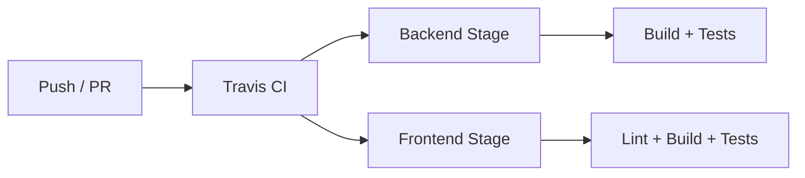
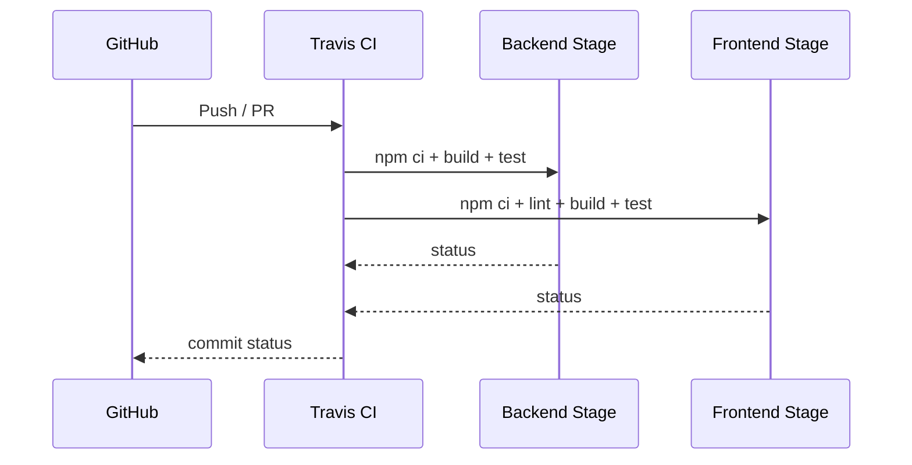
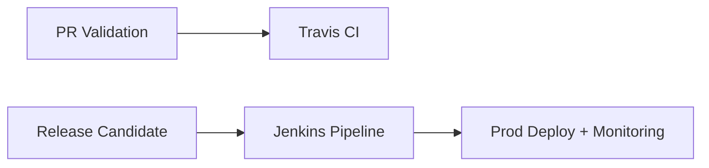

# Travis CI

This repository includes a Travis CI pipeline that keeps the backend and frontend healthy by installing dependencies, building the code, and running automated tests in separate stages. The configuration lives in `.travis.yml` at the repository root.

> [!NOTE]
> Travis CI is supported for CI validation, but EstateWise uses **Jenkins** as the primary CI/CD platform for production deployments (blue/green + canary + multi‑cloud). See `jenkins/README.md` and `DEVOPS.md` for production CI/CD.

## Table of Contents

- [Pipeline at a Glance](#pipeline-at-a-glance)
  - [Current Travis Configuration](#current-travis-configuration)
  - [Stages](#stages)
- [How It Runs](#how-it-runs)
- [Enabling Travis CI](#enabling-travis-ci)
- [Local Reproduction](#local-reproduction)
- [Maintenance Tips](#maintenance-tips)
- [Extending the Pipeline](#extending-the-pipeline)
  - [Add a matrix for Node versions](#add-a-matrix-for-node-versions)
  - [Add a new stage (example: unit-only)](#add-a-new-stage-example-unit-only)
  - [Add environment variables](#add-environment-variables)
- [Troubleshooting](#troubleshooting)
- [Travis CI vs Jenkins (EstateWise)](#travis-ci-vs-jenkins-estatewise)
- [Migration Path](#migration-path)

## Pipeline at a Glance



### Current Travis Configuration

From `.travis.yml`:

- **OS image**: Ubuntu Focal
- **Node.js**: 20
- **Caching**: npm cache
- **Global env**:
  - `CI=true`
  - `NEXT_TELEMETRY_DISABLED=1`
  - `npm_config_loglevel=warn`

### Stages

| Stage | Install | Script |
|------|---------|--------|
| Backend | `npm --prefix backend ci` | `npm --prefix backend run build` + `npm --prefix backend test` |
| Frontend | `npm --prefix frontend ci` | `npm --prefix frontend run lint` + `npm --prefix frontend run build` + `npm --prefix frontend test` |

## How It Runs



## Enabling Travis CI

1. Sign in to Travis CI with GitHub.
2. Enable the repository from the Travis dashboard.
3. Configure environment variables in Travis settings if required by tests:
   - `MONGO_URI`
   - `NEO4J_URI`, `NEO4J_USERNAME`, `NEO4J_PASSWORD`
   - `GOOGLE_AI_API_KEY`
   - `PINECONE_API_KEY`
4. Ensure secrets are scoped to CI and do not grant production access.

## Local Reproduction

Run the same commands as Travis:

```bash
# Backend
npm --prefix backend ci
npm --prefix backend run build
npm --prefix backend test

# Frontend
npm --prefix frontend ci
npm --prefix frontend run lint
npm --prefix frontend run build
npm --prefix frontend test
```

Keep Node.js aligned with the CI version (Node 20) to avoid subtle mismatches.

## Maintenance Tips

- Update `.travis.yml` when scripts change in `backend/package.json` or `frontend/package.json`.
- Keep tests deterministic and isolated; avoid external network dependencies where possible.
- Add caching only for deterministic artifacts (npm is already cached).
- If additional stages are needed (e.g., Cypress), keep them in separate jobs to isolate failures.

## Extending the Pipeline

### Add a matrix for Node versions

```yaml
node_js:
  - '18'
  - '20'
```

### Add a new stage (example: unit-only)

```yaml
jobs:
  include:
    - stage: unit
      name: 'Backend unit tests'
      install:
        - npm --prefix backend ci
      script:
        - npm --prefix backend test -- --runInBand
```

### Add environment variables

```yaml
env:
  global:
    - CI=true
    - NEXT_TELEMETRY_DISABLED=1
    - SOME_FLAG=1
```

## Troubleshooting

- **`npm ci` fails**: ensure `package-lock.json` is committed and matches `package.json`.
- **Frontend lint errors**: run `npm --prefix frontend run lint` locally.
- **Backend tests failing in CI only**: verify env vars are present in Travis settings.
- **Out-of-memory errors**: reduce parallelism or split tests into smaller suites.

## Travis CI vs Jenkins (EstateWise)

| Feature | Travis CI | Jenkins (EstateWise) |
|---------|-----------|----------------------|
| Build/Test/Lint | ✅ | ✅ |
| Security Scanning | ❌ (manual) | ✅ (multi-layer) |
| Deployments | ❌ | ✅ Blue/Green + Canary |
| Multi-cloud | ❌ | ✅ AWS/Azure/GCP/K8s |
| Rollback | ❌ | ✅ Automated |
| Production-ready | ⚠️ Basic CI | ✅ Enterprise-grade |



## Migration Path

Recommended approach:

1. Keep Travis CI for PR validation.
2. Use Jenkins for production deployments, security scanning, and blue/green/canary rollouts.
3. Align test suites so Travis and Jenkins validate the same baseline.
