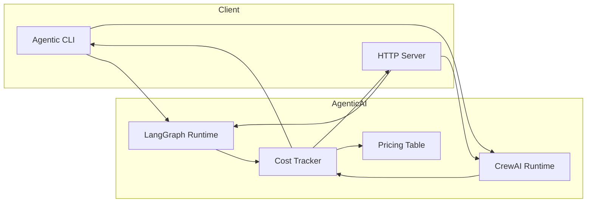
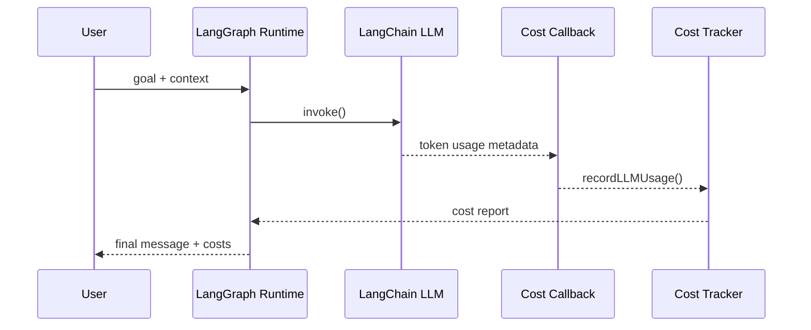
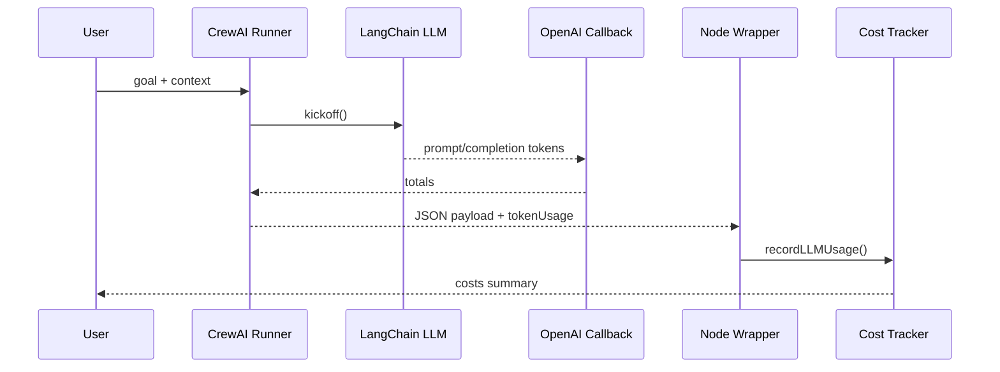

# Cost & Token Tracking

This document describes the production-ready cost and token tracking system used by the
Agentic AI runtime (non-backend components). It covers how usage is captured, how costs
are calculated, and how to interpret outputs.

## Scope

Tracked runtimes:
- LangGraph (LangChain + LangGraph ReAct runtime)
- CrewAI (Python runner with LangChain callbacks, best-effort)

Not tracked here:
- Backend API usage
- External billing (Pinecone, Neo4j, hosted services)

## High-Level Architecture



## Data Flow (LangGraph)



## Data Flow (CrewAI)



## Pricing Coverage

Pricing is loaded from `agentic-ai/src/costs/pricing.ts` and includes:
- OpenAI: gpt-5* family, gpt-4.1, gpt-4o, realtime, audio, o1/o3/o4, codex
- Anthropic: Claude Opus/Sonnet/Haiku tiers (cache write + refresh)
- Google: Gemini 2.0/2.5/3 previews, flash/lite, TTS, image models

Each entry uses USD per 1,000,000 tokens for:
- input
- cached input
- output
- optional cache write / refresh tiers (Anthropic)
- optional audio/image/video token rates

Tiered models (e.g. Gemini) select based on input prompt size when available.

## How Costs Are Calculated

Cost = (uncached_input * input_rate
      + cached_input * cached_input_rate
      + output * output_rate
      + cache_write * cache_write_rate
      + cache_refresh * cache_refresh_rate) / 1,000,000

Notes:
- cached_input is clamped to inputTokens
- if only cached input is reported, inputTokens defaults to cached input
- missing rates mark the event as unpriced
- all costs are USD

## Token Sources

LangGraph:
- Uses LangChain callback metadata from model responses.
- The tracker inspects multiple metadata shapes and falls back to totals
  when only total tokens are provided.

CrewAI:
- Uses LangChain OpenAI callback (`get_openai_callback`) when available.
- Returns prompt/completion totals in the Python payload metadata.
- If callbacks are unavailable, costs are omitted (recorded as unpriced).

Embeddings:
- Input text length is recorded for observability.
- Provider token usage is not always available for embeddings, so costs may
  be unpriced unless the SDK returns usage metadata.

## Output Schema

Each run returns a `costs` payload.

Summary fields:
- totalUsd
- totalInputTokens
- totalOutputTokens
- totalCachedInputTokens
- totalEvents / pricedEvents / unpricedEvents
- byModel / byProvider aggregates
- unpriced[] with reasons

Example (truncated):

```json
{
  "summary": {
    "totalUsd": 0.023481,
    "totalInputTokens": 12345,
    "totalOutputTokens": 4567,
    "totalCachedInputTokens": 500,
    "totalEvents": 4,
    "pricedEvents": 3,
    "unpricedEvents": 1,
    "byModel": {
      "gpt-4o-mini": {
        "inputTokens": 12000,
        "outputTokens": 4200,
        "cachedInputTokens": 500,
        "costUsd": 0.019321
      }
    },
    "unpriced": [
      {
        "model": "text-embedding-004",
        "operation": "embedding",
        "reason": "Model not in pricing table"
      }
    ]
  }
}
```

## Dashboard UI

A standalone HTML dashboard is available at:
- `agentic-ai/public/costs-dashboard.html`
- Served by the Agentic AI HTTP server at `GET /costs/dashboard`
- Latest cost report (in-memory, resets on restart) is available at `GET /costs/latest`

The dashboard can:
- Fetch the latest cost report from the running server
- Accept pasted JSON or uploaded JSON files
- Visualize cost, tokens, and unpriced events

## Key Files

- `agentic-ai/src/costs/pricing.ts` pricing table and resolution logic
- `agentic-ai/src/costs/tracker.ts` cost events, aggregation, reporting
- `agentic-ai/src/costs/langchain.ts` LangChain callback handler
- `agentic-ai/src/lang/llm.ts` callback registration
- `agentic-ai/src/lang/graph.ts` LangGraph run cost report wiring
- `agentic-ai/crewai/runner.py` CrewAI token usage capture
- `agentic-ai/src/crewai/CrewRunner.ts` CrewAI cost reporting

## Operational Guidance

Checklist for production readiness:
- Keep pricing table up to date as vendors change rates.
- Ensure model names match the provider naming in `pricing.ts`.
- Monitor unpriced events; update pricing or usage extraction as needed.
- For embeddings cost accuracy, prefer providers that return usage metadata.
- Treat costs as estimates when metadata was inferred from totals.

## Troubleshooting

Common issues:
- No costs for a run: model did not return usage metadata.
- Unpriced events: model missing in pricing table or rate category missing.
- Tiered pricing mismatch: input tokens missing, lower tier assumed.
- "Missing token usage" reason: providers returned no token metadata for the call.

To improve accuracy:
- Ensure provider SDK returns `usage` metadata.
- Add missing model entries to `pricing.ts`.
- Pass prompt token counts explicitly when available.
