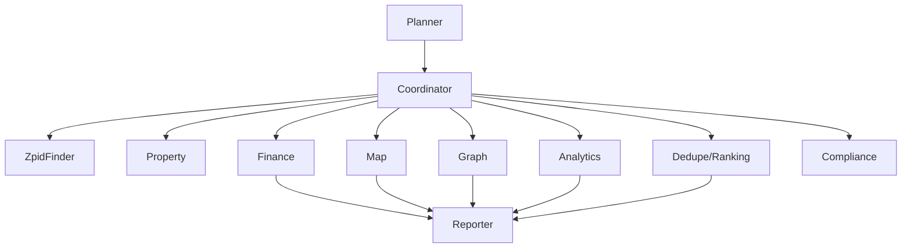
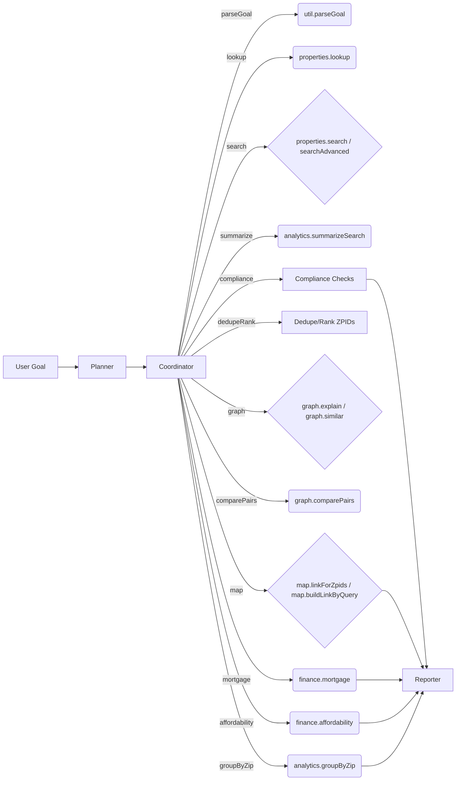
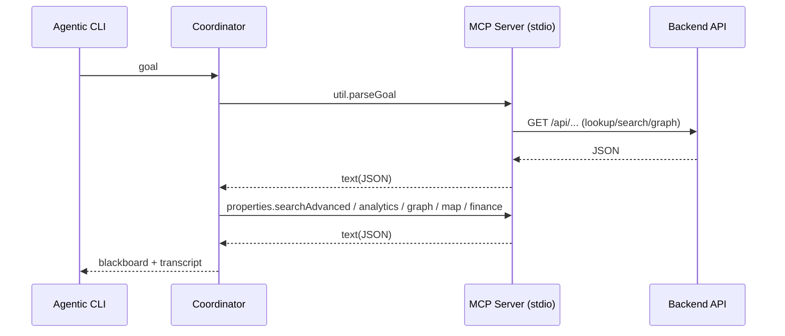

# Agentic AI Pipeline for EstateWise

Welcome to the Agentic AI CLI for EstateWise, a standalone multi-agent orchestration tool designed to assist with real estate market research and analysis. This CLI leverages multiple specialized agents to break down complex goals into manageable tasks, utilizing the Model Context Protocol (MCP) tools for data retrieval and processing.

## Overview

This project implements a multi-agent system where each agent has a specific role, such as planning, data lookup, analysis, and reporting. The agents communicate through a shared blackboard memory, allowing for coordinated execution of tasks. The orchestrator manages the workflow, ensuring that each step is executed in the correct order and that results are aggregated for final reporting.
- Standalone multi‑agent orchestration CLI for EstateWise. Runs independently to iterate on agent roles, planning, and MCP tool usage. Output is a readable transcript in the terminal.
- Uses a round‑based orchestrator to let agents plan and execute steps (parse → lookup → search → analytics → graph → map → finance → compliance → report).
- Spawns the local MCP server build over stdio and uses `@modelcontextprotocol/sdk` to list/call tools.
- Pure TypeScript/Node.js with no cross‑package imports. Keep prompts small and explicit; prefer tools over LLM guessing.

## What’s New

This version introduces several enhancements to improve real estate market research capabilities:

- Stronger real‑estate focus with more MCP tools (lookup, analytics, finance, ZIP groupings).
- New agents for ZPID lookups and analytics.
- Coordinator‑driven pipeline for clearer hand‑offs and deterministic execution.



## Quick Start
```bash
# Build MCP tools once
cd mcp && npm install && npm run build

# Run Agentic AI with your goal
cd ../agentic-ai
npm install
npm run dev "Find 3-bed homes in Chapel Hill, NC; compare 123456 and 654321; estimate $600k at 6.25%."

# Production run
npm run build
npm start "Lookup ZPID for 123 Main St, Chapel Hill, NC and show similar homes nearby."
```

## Example Goals
- "Find 3‑bed homes in Chapel Hill, NC; compare 123456 and 654321; estimate $600k at 6.25%."
- "Lookup ZPID for 123 Main St, Chapel Hill, NC and show similar homes nearby."

## Pipeline
- Coordinator‑guided steps: parseGoal → lookup → search → summarize → groupByZip → dedupeRank → graph → comparePairs → map → mortgage → affordability → compliance.
- Default rounds: 5 (enough to complete the plan and summarize).
- File: `src/pipelines/marketResearch.ts`



## Agents
- PlannerAgent – drafts a high‑level plan from the goal.
- CoordinatorAgent – drives step execution using a shared blackboard plan (parse → lookup → search → analytics → graph → map → finance), marks steps running/done, and triggers the right tools at the right time.
- ZpidFinderAgent – extracts address/city/state/ZIP/beds/baths and calls `properties.lookup`.
- PropertyAnalystAgent – refines queries and calls `properties.search`/`properties.searchAdvanced`.
- AnalyticsAnalystAgent – runs `analytics.summarizeSearch` (and `analytics.groupByZip`) for market medians and groupings.
- GraphAnalystAgent – calls `graph.explain`/`graph.similar` when ZPIDs are present.
- MapAnalystAgent – builds deep links via `map.linkForZpids` or `map.buildLinkByQuery`.
- FinanceAnalystAgent – computes mortgage via `finance.mortgage` and checks `finance.affordability` as needed.
- DedupeRankingAgent – deduplicates and caps ZPID lists, writing `rankedZpids` to the blackboard.
- ComplianceAgent – runs sanity checks (medians, APR, payment totals, ZPID counts) and writes a compliance report.
- ReporterAgent – composes a concise summary citing tool outputs.

## Inter‑Agent Coordination
- Shared blackboard memory aggregates: ZPIDs, parsed filters, analytics, map links, finance results, and the step plan.
- CoordinatorAgent advances steps, sets in‑flight tool calls, and marks them done once results arrive.
- The orchestrator retries failed tool calls once and normalizes JSON text where possible.

## MCP Integration
- Spawns `../mcp/dist/server.js` over stdio and uses `@modelcontextprotocol/sdk` to list/call tools.
- Tool outputs are text blocks; the orchestrator stores both the raw result and an extracted text for the Reporter.

## Extending
- Create a new Agent with a `think(ctx)` method returning a message or a tool call: `{ data: { tool: { name, args } } }`.
- Register the agent in `AgentOrchestrator`. Keep roles focused and stateless where possible.
- Prefer composing existing MCP tools. If missing, add tools in `mcp/` and update docs.

## Structure
```
agentic-ai/
└─ src/
   ├─ core/           # agent interfaces, types, blackboard
   ├─ mcp/            # MCP client wrapper
   ├─ agents/         # Planner, Coordinator, ZpidFinder, Property, Analytics, Graph, Map, Finance, Reporter
   ├─ orchestrator/   # round-based planner/executor
   ├─ pipelines/      # marketResearch
   └─ index.ts        # demo entrypoint
```

## Notes

This project is designed for iterative development and experimentation with multi-agent systems in real estate analysis. Key points to remember:

- Pure TS/Node CLI. Spawns the local MCP server dist build to avoid cross‑package imports.
- Keep prompts small and explicit; prefer tools over LLM guessing.
- Output is a readable terminal transcript showing agents' reasoning and actions.
- Default 5 rounds should be enough to complete the plan and summarize.
- CoordinatorAgent drives the pipeline, ensuring clear hand-offs and deterministic execution.



This setup allows iterative development of agent roles, planning logic, and MCP tool usage. The output is a clear terminal transcript showing the agents' reasoning and actions, making it easy to refine and extend the pipeline over time.
