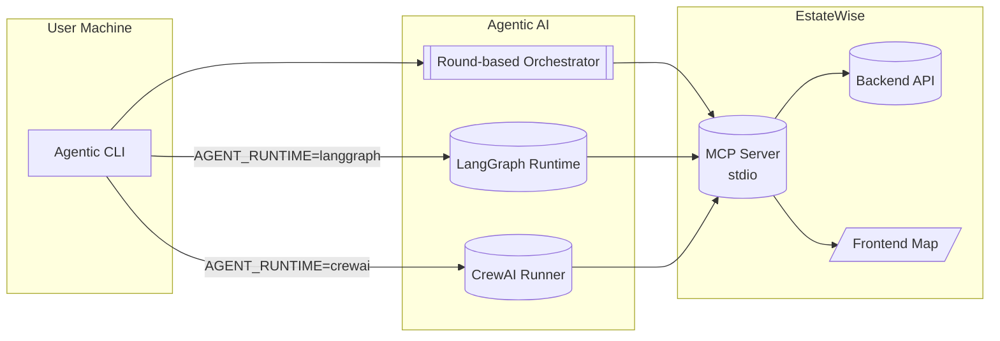
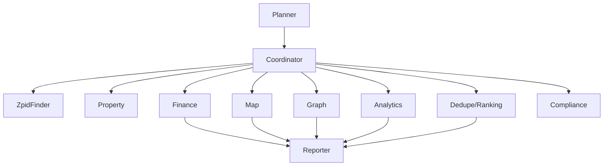
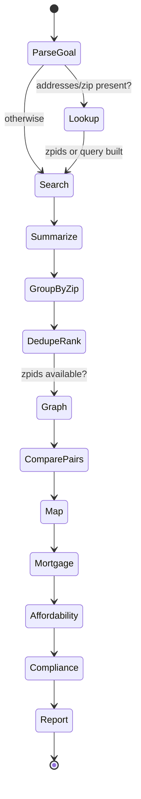
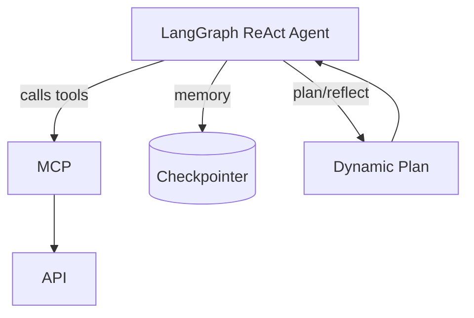
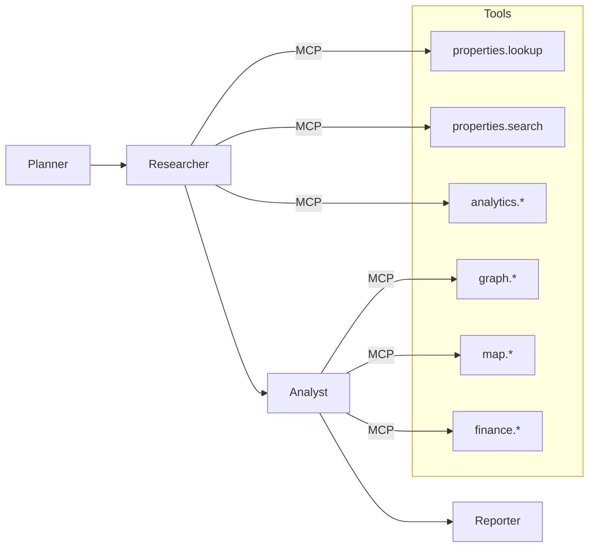
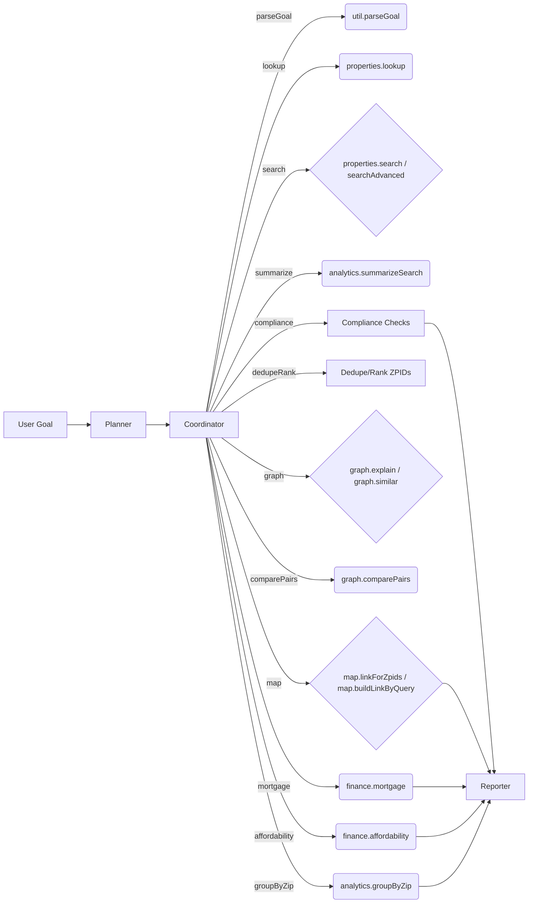
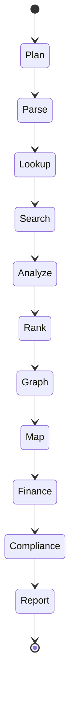
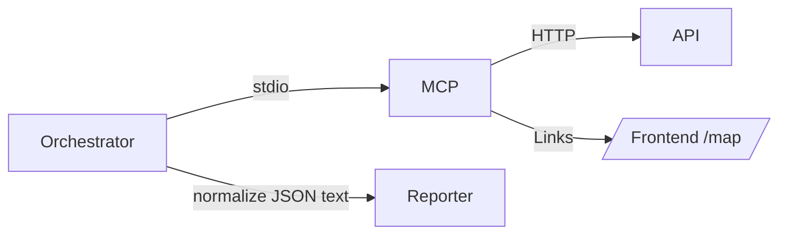
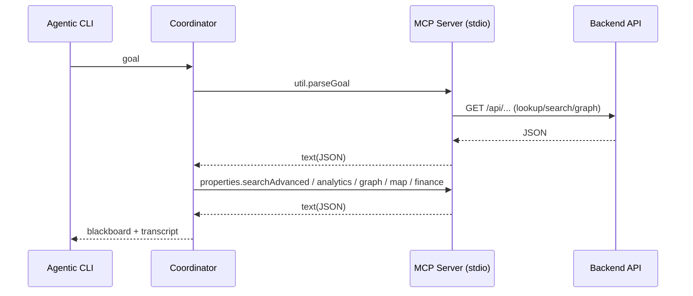

# Agentic AI Pipeline for EstateWise

Welcome to the Agentic AI CLI for EstateWise, a standalone multi-agent orchestration tool designed to assist with real estate market research and analysis. This CLI leverages multiple specialized agents to break down complex goals into manageable tasks, utilizing the Model Context Protocol (MCP) tools for data retrieval and processing.

In addition to being the CLI, this agentic pipeline is also being used in our main EstateWise backend API and frontend UI! Feel free to use, adapt, and extend it as needed and use it in your own projects.

<p align="left">
  
  
  
  
  
  
  
  
  
  
  
  
  
</p>

## Table of Contents

- [Overview](#overview)
- [What's New](#whats-new)
- [Quick Start](#quick-start)
- [Deployment](#deployment)
- [Use With Your Own Clients](#use-with-your-own-clients)
  - [LangChain + LangGraph Runtime](#langchain--langgraph-runtime)
  - [CrewAI Runtime](#crewai-runtime)
- [Enterprise Pipeline System](#enterprise-pipeline-system) ⭐ NEW
  - [Overview](#pipeline-overview)
  - [Quick Start](#pipeline-quick-start)
  - [Core Features](#core-pipeline-features)
  - [9 Major Feature Sets](#9-major-feature-sets)
  - [Integration with Agentic AI](#integration-with-agentic-ai)
  - [Complete API Reference](#complete-pipeline-api)
- [Example Goals](#example-goals)
- [Pipeline](#pipeline)
- [Agents](#agents)
- [Inter-Agent Coordination](#interagent-coordination)
- [MCP Integration](#mcp-integration)
- [Structure](#structure)
- [Configuration](#configuration)
- [Error Handling & Retries](#error-handling--retries)
- [Extensibility](#extensibility)
- [Notes](#notes)
- [License](#license)

## Overview

Agentic AI is a standalone, multi‑agent CLI that orchestrates real‑estate research using a tool‑first approach. Agents coordinate over a shared blackboard to parse a user goal, pull data via MCP tools, analyze results, and deliver a concise report. You can run the default round‑based orchestrator, switch to a LangChain + LangGraph ReAct agent, or launch a Python CrewAI flow — all from this package.

- Standalone multi‑agent orchestration CLI purpose‑built for EstateWise research.
- Orchestrator coordinates clear, deterministic step execution over MCP tools.
- Optional LangGraph runtime (ReAct agent with tool calling and memory).
- Optional CrewAI runtime (Python crew of planner/researcher/analyst/reporter).
- Output is a clean terminal transcript with a final summary and links.



## What's New

### 🎉 Major Enhancement: Enterprise-Grade Pipeline System

The agentic AI system has been significantly enhanced with a **world-class assembly line pipeline architecture** that transforms it into an enterprise orchestration platform. This adds **~11,300 lines of production-ready code** with capabilities that rival commercial solutions.

**New Core Features:**
- **Assembly Line Design Pattern** - Sequential stage processing with composable, reusable stages
- **Enterprise Middleware** - 10+ built-in middleware (logging, metrics, caching, validation, circuit breakers, etc.)
- **Advanced Orchestration** - Parallel execution, conditional branching, error recovery, pipeline composition
- **Rich Observability** - Monitoring, metrics, dashboards, DAG visualization, execution tracing

**9 Major Feature Sets Added:**
1. **State Persistence & Checkpointing** - Save/restore pipeline state, resume interrupted pipelines
2. **Distributed Execution** - Worker pools, load balancing, horizontal scaling
3. **Advanced Scheduling** - Cron scheduling, dependencies, delayed/recurring execution
4. **Testing Framework** - Mocks, spies, assertions, comprehensive test runner
5. **Auto-Optimization** - Performance profiling, bottleneck detection, AI-powered recommendations
6. **Plugin Architecture** - Extensible plugin system with lifecycle hooks
7. **Visualization & DAG** - Export to Mermaid/Graphviz, dashboards, timelines
8. **Multi-Level Caching** - L1/L2/L3 cache hierarchy with intelligent promotion
9. **Human-in-the-Loop** - Approval workflows, user input, interactive pipelines

**Previous Features:**
- Expanded agent roles and clearer hand‑offs via a coordinator plan.
- LangGraph runtime: ReAct agent, tool calling, in-memory checkpointer.
- EstateWiseLangGraphRuntime class: contextual system prompts, thread-aware memory, and instrumented tool telemetry you can consume programmatically.
- CrewAI runtime: Python crew with planner/analyst/reporter sequence.
- CrewRuntime helper: structured timeline/sections JSON so Node/TS clients can reason about plan, analysis, graph, and finance outputs.
- More MCP tools (lookup, analytics, finance, groupings, graph pairs, map).

See [Enterprise Pipeline System](#enterprise-pipeline-system) section below for complete documentation.

## Deployment

- **Container Image** – Production Dockerfile is provided; see [DEPLOYMENT.md](DEPLOYMENT.md) for build/push instructions.
- **Docker Compose** – `docker-compose.yaml` launches the orchestrator with all dependencies.
- **Kubernetes** – Manifests under [`k8s/`](k8s) deploy the CLI (with embedded MCP server) to a cluster.

> Refer to [DEPLOYMENT.md](DEPLOYMENT.md) for end-to-end instructions, environment variables, and integration tips.



## Quick Start
```bash
# Build MCP tools once
cd mcp && npm install && npm run build

# Run Agentic AI with your goal
cd ../agentic-ai
npm install
npm run dev "Find 3-bed homes in Chapel Hill, NC; compare 123456 and 654321; estimate $600k at 6.25%."

# Production run
npm run build
npm start "Lookup ZPID for 123 Main St, Chapel Hill, NC and show similar homes nearby."
```

## Use With Your Own Clients

You can integrate Agentic AI in multiple ways depending on your stack and requirements.

1) **HTTP (recommended for web/mobile)**
- **Bring up the server:** `npm run serve` (dev) or `npm run start:server` (prod)
- Call `POST /run` from your app with a `goal` and optional `runtime`/`rounds`/`threadId`.

Browser (vanilla JS)
```html
<script>
async function run(goal){
  const res = await fetch('http://localhost:4318/run',{
    method:'POST',headers:{'Content-Type':'application/json'},
    body: JSON.stringify({ goal, runtime: 'default' })
  });
  const json = await res.json();
  console.log(json);
}
</script>
```

Node (fetch)
```js
import fetch from 'node-fetch';
const res = await fetch('http://localhost:4318/run', {
  method: 'POST', headers: { 'Content-Type': 'application/json' },
  body: JSON.stringify({ goal: 'Find 3 bed homes; map + mortgage', runtime: 'langgraph', threadId: 'demo-1' })
});
const json = await res.json();
console.log(json);
```

Python (requests)
```python
import requests
r = requests.post('http://localhost:4318/run', json={
  'goal': 'Compare 123456 vs 654321 and estimate payments',
  'runtime': 'default', 'rounds': 5
})
print(r.json())
```

2) **Spawn the CLI (simple servers/services)**
- Use Node’s child_process to run the CLI and capture stdout.
```js
import { spawn } from 'node:child_process';
const p = spawn('node', ['dist/index.js', 'Find 3-bed in Chapel Hill; map + mortgage'], { cwd: 'agentic-ai' });
p.stdout.on('data', (d)=> process.stdout.write(d));
p.stderr.on('data', (d)=> process.stderr.write(d));
```

3) **Programmatic (monorepo / library usage)**
- Inside this repo (or if you publish it), you can instantiate the orchestrator directly.
```ts
import { AgentOrchestrator } from 'agentic-ai/dist/orchestrator/AgentOrchestrator.js';
import { PlannerAgent } from 'agentic-ai/dist/agents/PlannerAgent.js';
import { CoordinatorAgent } from 'agentic-ai/dist/agents/CoordinatorAgent.js';
// ... import other agents

const orchestrator = new AgentOrchestrator().register(
  new PlannerAgent(), new CoordinatorAgent(), /* ...other agents... */
);
const messages = await orchestrator.run('Find 3 beds near Chapel Hill', 5);
```

4) **LangGraph or CrewAI directly**
- **LangGraph:** set `runtime: 'langgraph'` in `/run` (HTTP), or run `npm run dev -- --langgraph`.
- **CrewAI:** set `runtime: 'crewai'` in `/run`, or run `npm run dev -- --crewai`.

Tips
- Choose `default` runtime for deterministic, stepwise orchestration, `langgraph` for autonomous tool-calling, or `crewai` for CrewAI-style flows.
- Use `threadId` with LangGraph to resume/continue runs with a memory checkpointer.

### LangChain + LangGraph Runtime
```bash
# Ensure env is configured
# Required: one of GOOGLE_AI_API_KEY or OPENAI_API_KEY
# Optional: PINECONE_API_KEY + PINECONE_INDEX, Neo4j NEO4J_URI/NEO4J_USERNAME/NEO4J_PASSWORD

# Run with the LangGraph agent
npm run dev -- --langgraph "Find 3-bed homes in Chapel Hill; show a map and explain two ZPIDs"

# Or via env flag
AGENT_RUNTIME=langgraph npm run dev -- "Compare 123456 vs 654321 and compute mortgage"
```

What it adds:
- Tool-calling agent built with `@langchain/langgraph` prebuilt ReAct agent.
- Tools include MCP tools (search/lookup/analytics/graph/map/finance), Pinecone vector retrieval, and Neo4j Cypher QA.
- Lightweight in-memory checkpointer; easy to swap for Redis/Postgres in production.
- Structured telemetry via `toolExecutions` (duration, status, JSON/text output) so you can surface traces in your UI.
- Programmatic `EstateWiseLangGraphRuntime` class to inject custom context, instructions, or additional tools per thread.

**Programmatic usage**
```ts
import { EstateWiseLangGraphRuntime } from './lang/graph.js';

const runtime = new EstateWiseLangGraphRuntime({
  defaultContext: { portfolio: 'Triangle relocation', mustHave: ['3+ beds'] },
  defaultInstructions: 'Highlight walkability and school quality.',
});

const run = await runtime.run({
  goal: 'Compare Chapel Hill listings with similar graph neighbors',
  context: { budget: 850000, focus: 'Briar Chapel' },
});

console.log(run.finalMessage);
console.table(run.toolExecutions.map(({ name, status, durationMs }) => ({ name, status, durationMs })));
```

**LangGraph orchestration:**





### CrewAI Runtime
CrewAI integration is provided via a small Python runner. This is great for teams standardizing on CrewAI’s Agent/Task/Crew abstractions.

Setup
```bash
cd agentic-ai/crewai
python3 -m venv .venv && source .venv/bin/activate
pip install -r requirements.txt

# Ensure OPENAI_API_KEY is set (CrewAI runner uses OpenAI via langchain-openai)
export OPENAI_API_KEY=sk-...
```

Run from the Node CLI
```bash
# Dev
cd agentic-ai
npm run dev -- --crewai "Find 3-bed homes in Chapel Hill; show a map and explain two ZPIDs"

# Or production
npm run start:crewai -- "Compare 123456 vs 654321 and compute mortgage"

# Optional: customize python binary
PYTHON_BIN=python3.11 npm run dev -- --crewai "..."
```

Notes
- Python runner path: `agentic-ai/crewai/runner.py`. It reads a JSON payload `{goal}` on stdin and returns JSON.
- Model: uses `OPENAI_MODEL` env (default `gpt-4o-mini`).
- Output: structured JSON with `summary`, `sections` (plan/analysis/graph/finance/report), and a `timeline` of agent/task outputs.
- Programmatic: import `CrewRuntime` from `src/crewai/CrewRunner.ts` to drive the Python crew with custom context or include flags.

Programmatic usage
```ts
import { CrewRuntime } from './crewai/CrewRunner.js';

const runtime = new CrewRuntime({ timeoutMs: 240_000 });
const result = await runtime.run('Scout Chapel Hill new construction under $900k', {
  includeFinance: true,
  hints: ['prefer energy-efficient builds'],
  context: { mustHave: ['3 beds', 'home office'], timeframeMonths: 6 },
});

if (result.ok && result.structured) {
  console.log(result.structured.summary);
  for (const step of result.structured.timeline) {
    console.log(`- ${step.agent}: ${step.output}`);
  }
}
```

CrewAI flow:



## Example Goals
- "Find 3‑bed homes in Chapel Hill, NC; compare 123456 and 654321; estimate $600k at 6.25%."
- "Lookup ZPID for 123 Main St, Chapel Hill, NC and show similar homes nearby."

## Pipeline

The pipeline is driven by the CoordinatorAgent over a shared blackboard. The high-level plan is:
1. Parse the user goal to extract addresses, cities, states, ZIPs, beds, baths, price, and ZPIDs.
2. Lookup ZPIDs for any addresses found.
3. Search for properties matching the parsed filters.
4. Analyze search results for market medians and groupings.
5. Dedupe and rank ZPIDs to a manageable list.
6. If ZPIDs are present, run graph analyses (explanations, similar homes).
7. Build map links for the ZPIDs or search query.
8. Compute mortgage and affordability if price and interest rate are given.
9. Run compliance checks on medians, APR, payments, and ZPID counts.
10. Compile a final report citing all tool outputs.

Below is a flowchart of the agents and their interactions, followed by the coordinator state diagram:

- Default rounds: 5 (enough to complete the plan and summarize).



Coordinator state:



## Agents

There are several specialized agents:

- PlannerAgent – drafts a high‑level plan from the goal.
- CoordinatorAgent – drives step execution using a shared blackboard plan (parse → lookup → search → analytics → graph → map → finance), marks steps running/done, and triggers the right tools at the right time.
- ZpidFinderAgent – extracts address/city/state/ZIP/beds/baths and calls `properties.lookup`.
- PropertyAnalystAgent – refines queries and calls `properties.search`/`properties.searchAdvanced`.
- AnalyticsAnalystAgent – runs `analytics.summarizeSearch` (and `analytics.groupByZip`) for market medians and groupings.
- GraphAnalystAgent – calls `graph.explain`/`graph.similar` when ZPIDs are present.
- MapAnalystAgent – builds deep links via `map.linkForZpids` or `map.buildLinkByQuery`.
- FinanceAnalystAgent – computes mortgage via `finance.mortgage` and checks `finance.affordability` as needed.
- DedupeRankingAgent – deduplicates and caps ZPID lists, writing `rankedZpids` to the blackboard.
- ComplianceAgent – runs sanity checks (medians, APR, payment totals, ZPID counts) and writes a compliance report.
- ReporterAgent – composes a concise summary citing tool outputs.

Example Goal & Output

<p align="center">
  
</p>

## Inter‑Agent Coordination

The agents coordinate via the CoordinatorAgent over a shared blackboard:

- PlannerAgent writes the initial plan and parsed goal.
- Shared blackboard memory aggregates: ZPIDs, parsed filters, analytics, map links, finance results, and the step plan.
- CoordinatorAgent advances steps, sets in‑flight tool calls, and marks them done once results arrive.
- The orchestrator retries failed tool calls once and normalizes JSON text where possible.

## MCP Integration

The CLI integrates with the local MCP server to access EstateWise backend tools:

- Spawns `../mcp/dist/server.js` over stdio and uses `@modelcontextprotocol/sdk` to list/call tools.
- Tool outputs are text blocks; the orchestrator stores both the raw result and an extracted text for the Reporter.



## Structure
```
agentic-ai/
└─ src/
   ├─ core/           # agent interfaces, types, blackboard
   ├─ mcp/            # MCP client wrapper
   ├─ agents/         # Planner, Coordinator, ZpidFinder, Property, Analytics, Graph, Map, Finance, Reporter
   ├─ orchestrator/   # round-based planner/executor
   ├─ lang/           # LangChain + LangGraph runtime
   │  ├─ llm.ts       # Chat/embedding model selection (Google/OpenAI)
   │  ├─ tools.ts     # MCP wrappers, Pinecone retrieval, Neo4j Cypher tools
   │  ├─ memory.ts    # Checkpointer (MemorySaver by default)
   │  └─ graph.ts     # createReactAgent + runner
   ├─ crewai/         # Python CrewAI runner (invoked from Node)
   │  ├─ runner.py    # stdin JSON -> crew -> stdout JSON
   │  └─ requirements.txt
   ├─ pipelines/      # marketResearch
   └─ index.ts        # demo entrypoint
```

## Configuration

Set the following environment variables as needed:

- LLMs
  - `GOOGLE_AI_API_KEY` (preferred) and optional `GOOGLE_AI_MODEL` (default `gemini-1.5-pro-002`).
  - Or `OPENAI_API_KEY` and optional `OPENAI_MODEL` (default `gpt-4o-mini`).
- Embeddings
  - `GOOGLE_EMBED_MODEL` (default `text-embedding-004`) or `OPENAI_EMBED_MODEL` (default `text-embedding-3-large`).
- Pinecone (optional)
  - `PINECONE_API_KEY`, `PINECONE_INDEX` (and optionally `PINECONE_ENV` if needed by your account).
- Neo4j (optional)
  - `NEO4J_URI`, `NEO4J_USERNAME`, `NEO4J_PASSWORD`.
- Runtime
  - `AGENT_RUNTIME=langgraph` to enable the LangGraph runtime by default.
  - Optional `THREAD_ID` for conversation continuity when using the LangGraph checkpointer.
  - `AGENT_RUNTIME=crewai` or `--crewai` to enable the CrewAI runtime; requires Python + crewai deps and `OPENAI_API_KEY`.

Please make sure to have upserted properties to Pinecone and ingested the graph to Neo4j if you plan to use those tools - they will return empty results otherwise!

## Error Handling & Retries

The CLI includes robust error handling:
- Uncaught exceptions in agents or the orchestrator are caught and logged; the run exits gracefully
- The orchestrator retries failed MCP calls once with a short backoff.
- Tool JSON text is parsed defensively; malformed responses are surfaced but do not crash the run.
- LangGraph runtime persists state to the in‑memory checkpointer by default; set `THREAD_ID` to continue a run.

## Extensibility

Feel free to extend the pipeline with new agents, tools, or runtimes:
- Add new tools in the MCP backend under `backend/src/controllers/property.controller.ts` and expose
- Add agents under `src/agents/` and extend the coordinator plan in `src/pipelines/marketResearch.ts`.
- Add MCP wrappers to `src/lang/tools.ts` and expose new tools in the set.
- For LangGraph, register additional tools via `mcpTool(...)` in `src/lang/tools.ts` and update `src/lang/graph.ts`.

## Notes

This project is designed for iterative development and experimentation with multi-agent systems in real estate analysis. Key points to remember:

- Pure TS/Node CLI. Spawns the local MCP server dist build to avoid cross‑package imports.
- Keep prompts small and explicit; prefer tools over LLM guessing.
- Output is a readable terminal transcript showing agents' reasoning and actions.
- Default 5 rounds should be enough to complete the plan and summarize.
- CoordinatorAgent drives the pipeline, ensuring clear hand-offs and deterministic execution.



This setup allows iterative development of agent roles, planning logic, and MCP tool usage. The output is a clear terminal transcript showing the agents' reasoning and actions, making it easy to refine and extend the pipeline over time.

## License

This project is licensed under the MIT License. See the [LICENSE](../LICENSE) file for details.
