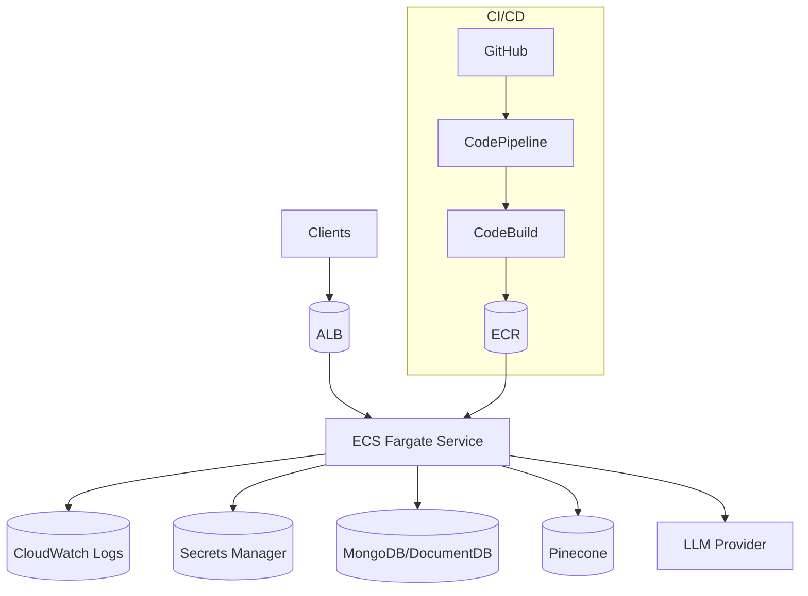
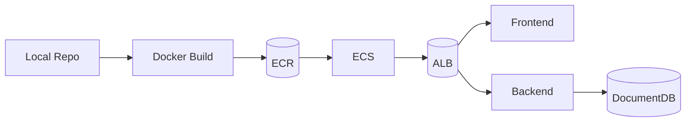

# AWS Deployment Stack

  

AWS deployment options for EstateWise. This folder includes:

- **CloudFormation templates** for a production backend service on ECS Fargate.
- **CodePipeline** definition for CI/CD (backend image build + deploy).
- **deploy.sh** for a full-stack monorepo deployment (frontend + backend + DocumentDB).
- **docker-compose.yml** for local DocumentDB-backed testing.

## Architecture (CloudFormation + ECS)



## Architecture (`deploy.sh` full-stack)



## What’s Provisioned (CloudFormation)

| Template | Purpose |
|----------|---------|
| `cloudformation/vpc.yaml` | Multi-AZ VPC with public + private subnets, optional flow logs. |
| `cloudformation/alb.yaml` | Internet-facing ALB, listeners, SGs, target group. |
| `cloudformation/iam-roles.yaml` | ECS execution + task roles. |
| `cloudformation/ecs-cluster.yaml` | ECS Fargate cluster with Container Insights. |
| `cloudformation/ecs-service.yaml` | Backend service with secrets + autoscaling. |
| `codepipeline.yaml` | CI/CD pipeline for backend image builds + deploys. |

## Deploy Order (CloudFormation)

```bash
cd aws
make deploy-vpc
make deploy-iam
make deploy-alb
make deploy-ecs-cluster

# Fill env vars below with outputs from previous stacks / Secrets Manager ARNs
make deploy-ecs-service \
  CLUSTER_NAME=estatewise-ecs-cluster \
  EXECUTION_ROLE_ARN=arn:aws:iam::123:role/estatewise-ecs-execution-role \
  CONTAINER_IMAGE=123.dkr.ecr.us-east-1.amazonaws.com/estatewise-backend:latest \
  SUBNET_IDS=subnet-aaa,subnet-bbb \
  SECURITY_GROUP_IDS=sg-abc123 \
  TARGET_GROUP_ARN=arn:aws:elasticloadbalancing:...:targetgroup/estatewise-tg/abcd \
  MONGO_SECRET_ARN=arn:aws:secretsmanager:...:secret:estatewise/mongo \
  JWT_SECRET_ARN=arn:aws:secretsmanager:...:secret:estatewise/jwt \
  GOOGLE_SECRET_ARN=arn:aws:secretsmanager:...:secret:estatewise/google \
  PINECONE_SECRET_ARN=arn:aws:secretsmanager:...:secret:estatewise/pinecone
```

Outputs (subnet IDs, target group ARNs, IAM role ARNs) can be retrieved via:

```bash
aws cloudformation describe-stacks --stack-name estatewise-vpc
```

## CI/CD Pipeline (CodePipeline)

1. Create a CodeStar connection to GitHub and capture the ARN.
2. Deploy `codepipeline.yaml` with:
   - `GitHubOwner`, `GitHubRepo`, `GitHubBranch`
   - `CodeStarConnectionArn`
   - `EcrRepositoryUri`
   - `ClusterName`, `ServiceName`
3. The pipeline builds the backend image, pushes to ECR, and updates the ECS service.

## Full-Stack Deploy (deploy.sh)

`deploy.sh` is a monorepo-focused script that:

- Builds and pushes frontend/backend images to ECR.
- Provisions a DocumentDB cluster.
- Creates ECS services and ALB routing for `/` and `/api`.

Environment variables required by the script:
- `AWS_REGION`
- `DOCDB_MASTER_USERNAME`, `DOCDB_MASTER_PASSWORD`
- `JWT_SECRET`, `GOOGLE_AI_API_KEY`, `PINECONE_API_KEY`
- Optional: `PINECONE_INDEX`, `MONGO_INITDB_DATABASE`

## Local Dev (docker-compose)

`docker-compose.yml` provides DocumentDB-local plus frontend/backend containers:

```bash
cd aws
docker compose up --build
```

Set `MONGO_URI`, `JWT_SECRET`, `GOOGLE_AI_API_KEY`, `PINECONE_API_KEY`, and `PINECONE_INDEX` in the compose file first.

## Observability

- CloudWatch log group: `/aws/ecs/<env>/backend`
- ECS Container Insights: enabled by default
- ALB access logs: optional (S3 bucket + policy)

## Rollback Strategy

- ECS can roll back to the previous task definition revision.
- Keep a previous image tag in ECR for fast rollback.
- For CodePipeline, redeploy a prior image tag.

## Cleanup

```bash
make delete-stack STACK=estatewise-ecs-service
make delete-stack STACK=estatewise-ecs-cluster
make delete-stack STACK=estatewise-alb
make delete-stack STACK=estatewise-iam
make delete-stack STACK=estatewise-vpc
```

Also remove ECR images, NAT gateways, and DocumentDB clusters to avoid lingering charges.

## Troubleshooting

- ECS tasks stuck in `PENDING`: check subnets, SGs, and ECR permissions.
- `502` from ALB: verify health check path and container port (default 3001).
- Secrets not found: validate ARN region/account and task role permissions.
