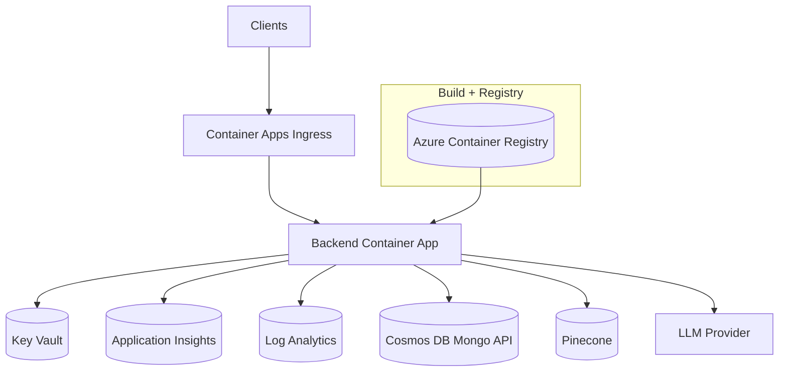

# Azure Deployment (Container Apps)

  

Azure deployment for EstateWise using Azure Container Apps, modular Bicep, and Key Vault-backed secrets. This stack provisions a managed runtime with secure networking and observability. For the multi-cloud comparison table see `DEPLOYMENTS.md`.

## Architecture



## Directory Layout

```
azure/
  deploy.sh                 # Wrapper around az + bicep
  azure-pipelines.yml       # Azure DevOps pipeline
  infra/
    main.bicep              # Orchestrates all modules
    modules/
      network.bicep
      logAnalytics.bicep
      data.bicep            # ACR + Storage + Cosmos
      security.bicep        # Key Vault
      container-app.bicep
```

## Deploy

```bash
# from repo root
az group create -g estatewise-rg -l eastus
./azure/deploy.sh \
  --resource-group estatewise-rg \
  --location eastus \
  --env estatewise \
  --image-tag $(git rev-parse --short HEAD) \
  --jwt-secret <jwt> \
  --google-ai-api-key <gemini> \
  --pinecone-api-key <pinecone>
```

The script:
1. Deploys `infra/main.bicep`.
2. Builds/pushes the backend container to the newly created ACR.
3. Updates the Container App revision with the latest image and environment variables.

## Parameters

| Parameter | Description |
|-----------|-------------|
| `environmentName` | Resource name prefix (default: `estatewise`). |
| `imageName` / `imageTag` | Container name + tag to deploy. |
| `jwtSecret`, `googleAiApiKey`, `pineconeApiKey`, `openAiApiKey` | Optional secrets stored in Key Vault. |
| `pineconeIndex` | Pinecone index name. |
| `minReplicas` / `maxReplicas` | Autoscaling limits. |

## Identity and Secrets

- Container App uses system-assigned managed identity.
- Identity gets `AcrPull` and `Key Vault Secrets User` roles.
- Secrets are stored in Key Vault and mapped to env vars via `secretMappings`.

## Observability

- Logs and traces flow into Log Analytics and Application Insights.
- Query logs with KQL in the Log Analytics workspace.
- App Insights connection string is injected into the container.

## CI/CD (Azure DevOps)

`azure/azure-pipelines.yml` runs two stages:
1. `az acr build` to build and push.
2. `az containerapp update` to roll out the new image.

Required variables: `AZURE_SUBSCRIPTION`, `RESOURCE_GROUP`, `ENVIRONMENT_NAME`, `ACR_NAME`.

## Scaling and Rollback

- Container Apps revisions are immutable; `az containerapp update` creates a new revision.
- Rollback by switching traffic to a previous revision via `az containerapp revision set`.
- Use `minReplicas` for steady-state warm capacity.

## Troubleshooting

- Container app not pulling: verify ACR permissions and identity role assignments.
- Secrets missing: ensure `optionalSecrets` and `secretMappings` contain entries.
- Cold starts: keep `minReplicas` >= 1 for production.
