# EstateWise Backend

Backend API for the EstateWise real-estate assistant. This service exposes REST and tRPC endpoints for chat, auth, property search, graph insights, commute profiles, and community forums. It also runs background scripts for Pinecone upserts and Neo4j ingest.

## What This Service Does

- Chat: MoE-style responses with optional streaming and expert views
- Auth: JWT-based signup/login/me/password flows
- Properties: vector search + chart spec generation for visualizations
- Graph: Neo4j-powered “why/related” property insights
- Commute profiles: multi-destination commute preferences
- Forums: posts + comments with voting
- Observability: logs, Prometheus metrics, and status dashboard

## Architecture


## Quickstart

### Requirements

- Node.js 18+ (recommended)
- MongoDB connection string
- Pinecone API key (for vector search)
- Google AI API key (for embeddings + chat)
- Optional: Neo4j for graph enrichment

### Setup

1. Copy the root `.env.example` to `backend/.env` (or repo root) and fill in values.
2. Install dependencies and run the dev server:

```bash
cd backend
npm install
npm start
```

The API runs on `PORT` (default 3001). The root path redirects to `/api-docs`.

## Environment Variables

The backend uses `dotenv` and reads from `.env`. Common settings:

Required for core features:
- `PORT`
- `MONGO_URI`
- `JWT_SECRET`
- `GOOGLE_AI_API_KEY`
- `PINECONE_API_KEY`, `PINECONE_INDEX`

Optional features:
- `OPENAI_API_KEY`, `OPENAI_MODEL` (optional LLM fallback)
- `PINECONE_NAMESPACE`
- `NEO4J_ENABLE`, `NEO4J_URI`, `NEO4J_USERNAME`, `NEO4J_PASSWORD`, `NEO4J_DATABASE`
- Ingest tuning: `INGEST_LIMIT`, `PINECONE_PAGE_SIZE`, `INGEST_RESUME`, `INGEST_CHECKPOINT_FILE`, `PINECONE_START_TOKEN`, `NEO4J_RESET`, `NEO4J_WRITE_RETRIES`

## Data Model (MongoDB)


## Core Flows

### Chat request lifecycle


### Property search + chart generation


### Graph enrichment (Neo4j)

```mermaid
flowchart LR
  Query[Graph API Request] --> Neo4j[Neo4j Service]
  Neo4j --> Path[Explain Paths]
  Neo4j --> Similar[Similar Properties]
  Neo4j --> Stats[Neighborhood Stats]
```



## API Surface (Grouped)

System:
- `GET /api-docs`, `GET /swagger.json`
- `GET /metrics`, `GET /status`

Auth:
- `POST /api/auth/signup`
- `POST /api/auth/login`
- `POST /api/auth/logout`
- `POST /api/auth/verify-email`
- `POST /api/auth/reset-password`
- `GET /api/auth/me`
- `PUT /api/auth/me`
- `PUT /api/auth/password`

Chat:
- `POST /api/chat` (supports `?stream=true`)
- `POST /api/chat/rate`
- `POST /api/chat/generate-title`

Conversations:
- `GET /api/conversations`
- `POST /api/conversations`
- `PUT /api/conversations/:id`
- `DELETE /api/conversations/:id`
- `GET /api/conversations/search`

Properties:
- `GET /api/properties` (vector search + charts)
- `GET /api/properties/by-ids`
- `GET /api/properties/lookup`

Graph (Neo4j):
- `GET /api/graph/similar/:zpid`
- `GET /api/graph/explain?from=...&to=...`
- `GET /api/graph/neighborhood/:name`

Commute Profiles:
- `GET /api/commute-profiles`
- `POST /api/commute-profiles`
- `PUT /api/commute-profiles/:id`
- `DELETE /api/commute-profiles/:id`

Forums:
- `GET /api/posts`
- `POST /api/posts`
- `GET /api/posts/:id`
- `PUT /api/posts/:id`
- `POST /api/posts/:id/upvote`
- `POST /api/posts/:id/downvote`
- `GET /api/comments/post/:postId`
- `POST /api/comments`
- `PUT /api/comments/:id`
- `POST /api/comments/:id/upvote`
- `POST /api/comments/:id/downvote`

tRPC:
- `POST /trpc/*` (optional, type-safe routes)

## Code Organization

```
backend/
  src/
    controllers/       # Request handlers
    models/            # Mongoose schemas
    routes/            # Express routes
    services/          # LLM + data services
    graph/             # Neo4j client + graph services
    scripts/           # Ingest and data utilities
    middleware/        # Auth + error handling
    trpc/              # tRPC router + context
    utils/             # Swagger, helpers
    server.ts          # App bootstrap
  tests/               # Jest tests
```

## Scripts

From `backend/package.json`:

- `npm start` - run API with ts-node-dev
- `npm run build` - compile TypeScript
- `npm test` - Jest in-band
- `npm run test:watch`
- `npm run test:coverage`
- `npm run upsert` - embed + upsert properties to Pinecone
- `npm run clean` - clean properties data
- `npm run graph:ingest` - ingest Pinecone results into Neo4j
- `npm run format` - Prettier

## Observability

- `GET /metrics` exposes Prometheus-compatible metrics.
- `GET /status` shows an express-status-monitor dashboard.
- Winston logs include request timing and errors.

## Local Development Notes

- The chat endpoint accepts both authenticated and guest sessions.
- `authMiddleware` reads JWTs from `Authorization: Bearer <token>` or a `token` cookie.
- For local graph testing, set `NEO4J_ENABLE=true` and provide Neo4j credentials.
- Swagger docs are generated from JSDoc annotations in routes/controllers.

## Troubleshooting

- Mongo connection retries are automatic; check logs for `ECONNRESET` or reconnect messages.
- If `/api/properties` fails, validate Pinecone keys and `GOOGLE_AI_API_KEY`.
- If graph endpoints return `503`, verify Neo4j is enabled and reachable.
