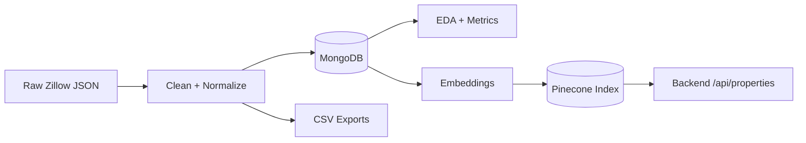
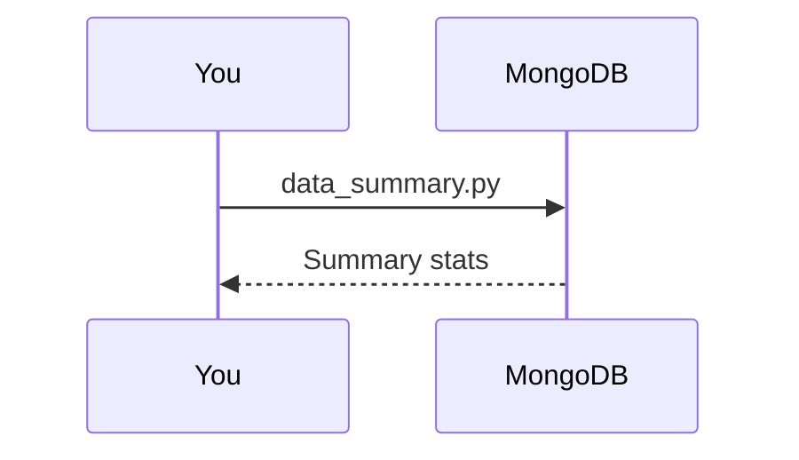
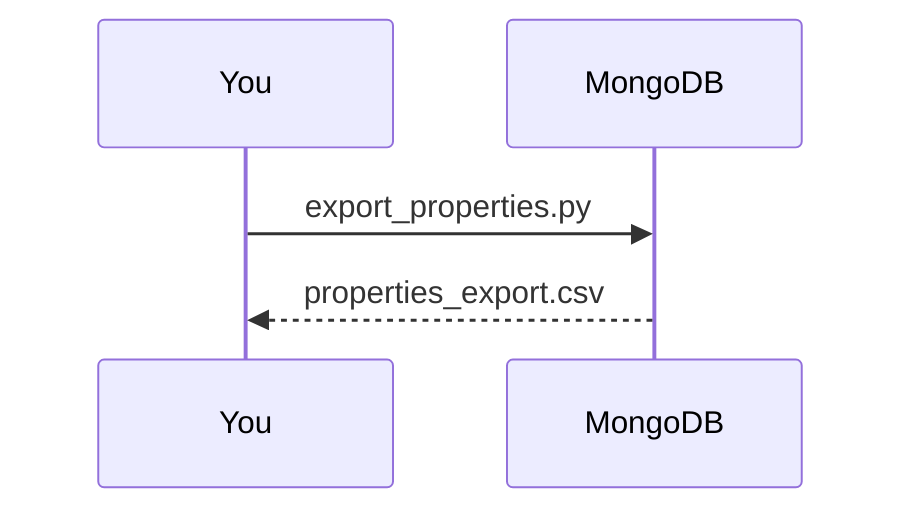
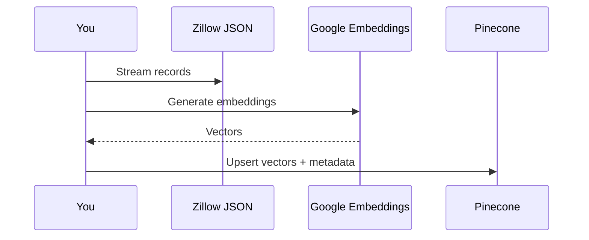

# Data Directory - EstateWise App

This directory contains exploratory data analysis (EDA), cleaning, export, and vectorization scripts used during dataset exploration and model prototyping. It is **not required** for running the production app, but it is useful if you want to understand the data pipeline and reproduce the experiments.

## High-Level Pipeline



## Directory Layout

```
data/
  js/        # JS utilities for ML metrics + quick scripts
  python/    # Python EDA + cleaning + Pinecone upsert helpers
  README.md
```

## Quickstart

### Python (recommended for EDA + vector pipeline)

```bash
cd data/python
python -m venv .venv
source .venv/bin/activate
pip install -r requirements.txt
```

### JavaScript (optional utilities)

These scripts are standalone and are not wired to the monorepo build. Run with Node.js from the repo root:

```bash
node data/js/exportProperties.js
```

Some files use ESM-style imports (e.g., `pricePrediction.js`). If Node complains, run them with an ESM-compatible setup or convert to CJS for local use.

## Data Inputs & Assumptions

- The scripts expect Zillow JSON files (e.g., `Zillow-March2025-dataset_part0.json`).
- These files are **not** checked into the repo. Place them next to the script that references them.
- Some scripts read directly from MongoDB; ensure `MONGO_URI` points to the right DB.

## Environment Variables

Most scripts read from `.env` (root) using `python-dotenv` or `dotenv`:

Required for MongoDB workflows:
- `MONGO_URI`

Required for embedding/upsert:
- `GOOGLE_AI_API_KEY`
- `PINECONE_API_KEY`, `PINECONE_ENVIRONMENT`, `PINECONE_INDEX`

## Script Catalog (Python)

Located under `data/python/`:

| Script | Purpose | Notes |
|--------|---------|-------|
| `analyze_properties.py` | Aggregate stats by city | Prints avg/min/max + counts |
| `data_summary.py` | Overall and per-city price distribution | Uses numpy for summaries |
| `clean_properties.py` | Clean + normalize MongoDB documents | **Mutates data in place** |
| `export_properties.py` | Export MongoDB collection to CSV | Output: `properties_export.csv` |
| `sync_properties.py` | Full collection sync to CSV | Output: `properties_sync.csv` |
| `upsert_properties.py` | Stream JSON, embed, and upsert to Pinecone | Uses ijson streaming |
| `pinecone_client.py` | Pinecone client config | Reads env vars |
| `utils.py` | Cleaning + metadata helpers | Shared by scripts |
| `estatewise_cli_chatbot.py` | Colab notebook export | Large, exploratory notebook |

### Example: Run a summary

```bash
cd data/python
python data_summary.py
```

### Example: Clean MongoDB data

```bash
cd data/python
python clean_properties.py
```

### Example: Embed and upsert to Pinecone

Place the Zillow JSON files next to `upsert_properties.py` (paths are hardcoded), then run:

```bash
cd data/python
python upsert_properties.py
```

## Script Catalog (JavaScript)

Located under `data/js/`:

| Script | Purpose | Notes |
|--------|---------|-------|
| `anomalyDetection.js` | z-score + IQR outlier detection | Utility functions |
| `clusteringMetrics.js` | Silhouette + Davies-Bouldin | Utility functions |
| `featureEngineering.js` | Derived features for modeling | Used by price model |
| `pricePrediction.js` | TensorFlow.js regression model | Requires tfjs-node |
| `modelEvaluation.js` | Regression metrics (MSE/MAE/R2) | Utility functions |
| `exportProperties.js` | Export MongoDB to CSV | Output: `properties_export.csv` |
| `updatePropertyStatus.js` | Update `homeStatus` by price | **Mutates data in place** |

## Common Workflows

### 1) Build a quick EDA report



### 2) Produce a CSV export



### 3) Embed + upsert to Pinecone



## Performance Tips

- Large JSON files can be heavy; `upsert_properties.py` uses streaming to avoid loading all data into memory.
- Use smaller subsets when testing to avoid long embed times and Pinecone costs.
- For MongoDB cleaning scripts, run against a dev database or a backup.

## Safety Notes

- Scripts like `clean_properties.py` and `updatePropertyStatus.js` **modify** MongoDB documents. Use them only against dev data or with backups.
- Embedding generation incurs API costs; batch and rate-limit responsibly.
- Pinecone upserts can create/replace vectors; confirm index + namespace settings before running.

## Troubleshooting

- `MONGO_URI is not set`: ensure `.env` exists at the repo root or set env vars.
- `Invalid embedding response`: verify `GOOGLE_AI_API_KEY` and network access.
- `Pinecone environment variables missing`: set `PINECONE_API_KEY`, `PINECONE_ENVIRONMENT`, `PINECONE_INDEX`.
- `Module not found (tfjs-node)`: install the dependency before running JS model scripts.

## TL;DR

Use this directory if you want to explore the dataset, generate embeddings, or reproduce the early analysis work. Otherwise, it can be ignored without impacting the application.
