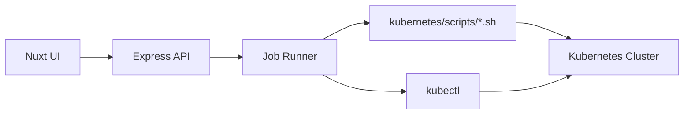
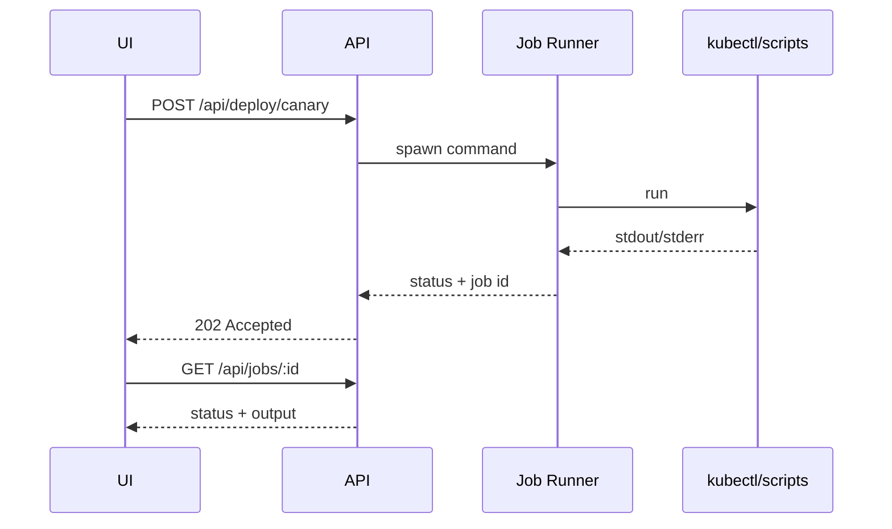

# Deployment Control Dashboard

Modern UI and API to run EstateWise blue/green, canary, rolling, and scaling operations without the CLI. Built with Nuxt 3, Vue 3, TypeScript, and Tailwind CSS.

## What It Is

- A lightweight API that shells out to `kubectl` and deployment scripts.
- A Nuxt UI for triggering deploys, inspecting job logs, and scaling variants.
- A job runner that captures output, exit codes, and status transitions.

## Architecture



### Job Lifecycle



## Quick Start

```bash
cd deployment-control
npm run install:all

# Terminal 1: API server
npm run dev     # http://localhost:4100

# Terminal 2: UI
npm run dev:ui  # http://localhost:3000
```

## Prerequisites

- Node.js 18+
- `kubectl` installed and configured
- `kubernetes/scripts/blue-green-deploy.sh` and `kubernetes/scripts/canary-deploy.sh` available
- Access to the target Kubernetes cluster

## Configuration

UI connects to the API via `.env` in `deployment-control/ui`:

```bash
cd deployment-control/ui
cp .env.example .env
```

Example:
```
API_BASE=http://localhost:4100
```

API server defaults:
- Port: `4100` (override with `PORT`)
- Namespace: `estatewise` (override per request)
- kubectl binary: `kubectl` (override with `KUBECTL=/path/to/kubectl`)

## API Endpoints

- `GET /api/health` - health probe
- `GET /api/jobs` - list recent jobs
- `GET /api/jobs/:id` - job detail and output
- `POST /api/deploy/blue-green` - blue/green deploy
- `POST /api/deploy/canary` - canary deploy
- `POST /api/deploy/rolling` - rollout restart
- `POST /api/ops/scale` - scale deployment
- `GET /api/cluster/summary?namespace=estatewise` - deployment/service snapshot

### Example: Canary Deploy

```bash
curl -X POST http://localhost:4100/api/deploy/canary \
  -H 'Content-Type: application/json' \
  -d '{
    "serviceName": "backend",
    "image": "ghcr.io/you/estatewise-backend:sha-123",
    "namespace": "estatewise",
    "canaryStages": "10,25,50,100",
    "stageDuration": 120,
    "autoPromote": false
  }'
```

### Example: Scale Variant

```bash
curl -X POST http://localhost:4100/api/ops/scale \
  -H 'Content-Type: application/json' \
  -d '{
    "serviceName": "backend",
    "namespace": "estatewise",
    "variant": "canary",
    "replicas": 1
  }'
```

## How Deploys Work

- **Blue/Green** calls `kubernetes/scripts/blue-green-deploy.sh` and passes env flags (`AUTO_SWITCH`, `SMOKE_TEST`, `SCALE_DOWN_OLD`).
- **Canary** calls `kubernetes/scripts/canary-deploy.sh` and passes stage config via env (`CANARY_STAGES`, `STAGE_DURATION`, etc.).
- **Rolling** uses `kubectl rollout restart` and waits for rollout status.
- **Scale** uses `kubectl scale` for a deployment name derived from `serviceName` and `variant`.

## Security Model

The dashboard does not include authentication or RBAC. Run it only on trusted networks or behind an authenticated reverse proxy.

## Project Structure

```
deployment-control/
├── src/              # API server (Express + TypeScript)
│   ├── server.ts     # API routes
│   ├── kubectl.ts    # Kubernetes utilities
│   └── jobRunner.ts  # Job execution
└── ui/               # Nuxt UI
    ├── components/
    ├── pages/
    ├── stores/
    ├── types/
    └── assets/
```

## Notes and Limits

- Job output is capped to the last 500 lines.
- Long-running jobs stream output into the job feed; refresh to update.
- Commands execute from the repo root so relative paths resolve correctly.

## Troubleshooting

- `kubectl` not found: set `KUBECTL=/path/to/kubectl`.
- `Job failed` with stderr: inspect `/api/jobs/:id` output.
- `Cluster summary fails`: ensure the namespace exists and `kubectl` has access.
