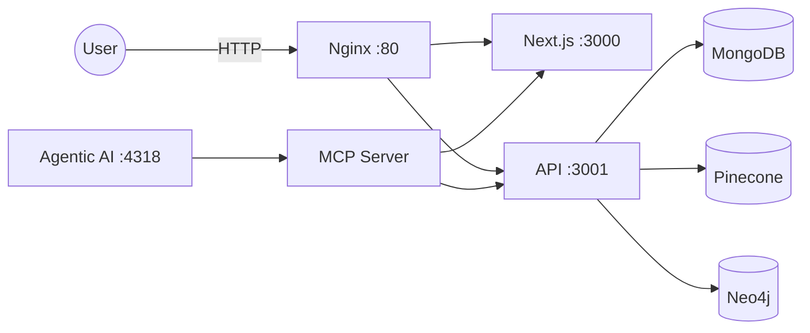
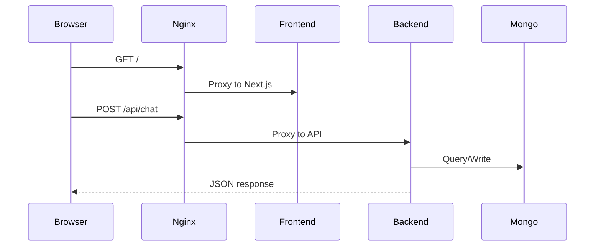
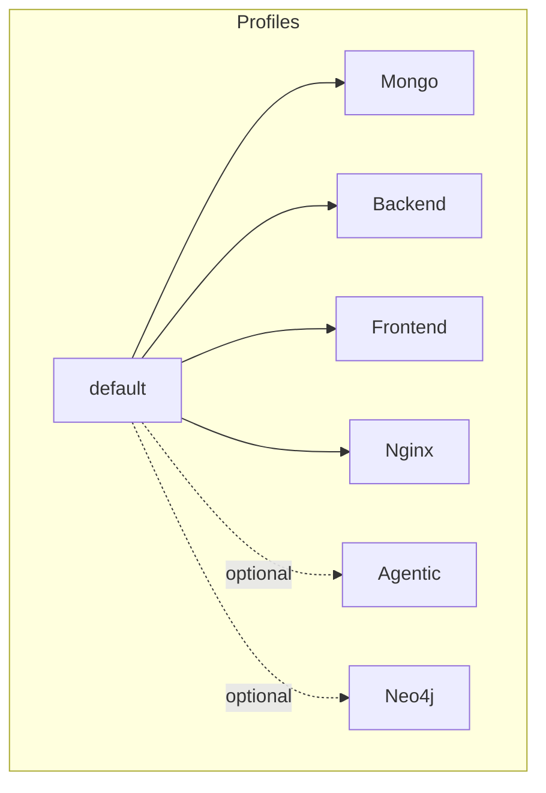
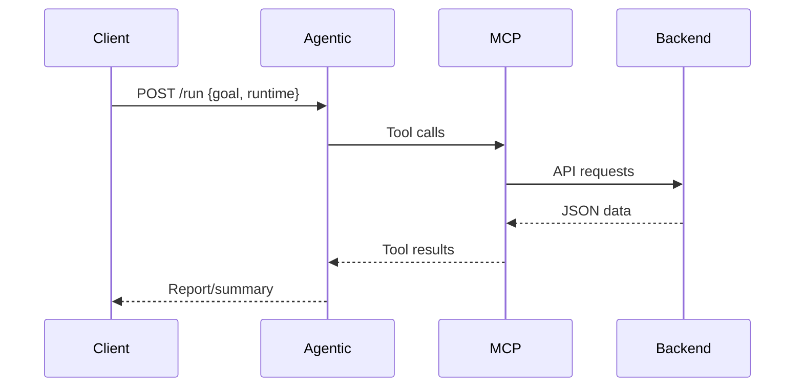

# EstateWise Docker Stack

This directory contains production-grade Docker assets for the EstateWise monorepo.



## What's Included
- `compose.prod.yml`: Full-stack production compose (frontend, backend, nginx, mongo; optional neo4j).
- `backend.Dockerfile`: Multi-stage backend image with healthcheck.
- `frontend.Dockerfile`: Multi-stage Next.js image with healthcheck.
- `agentic-ai.Dockerfile`: Multi-stage Agentic AI + MCP image with healthcheck.
- `nginx/`: Reverse proxy that routes `/api` + `/trpc` to the backend and all other traffic to the frontend.

## Prerequisites
- Docker + Docker Compose (v2+).
- A root `.env` file based on `/.env.example`.

## Quick Start
1) Create and edit your root `.env`:
   - Copy `/.env.example` to `/.env` and fill in real values.
   - At minimum, set `MONGO_URI`, `JWT_SECRET`, `GOOGLE_AI_API_KEY`, `PINECONE_API_KEY`, `PINECONE_INDEX`.

2) Build and run:
   ```bash
   docker compose -f docker/compose.prod.yml --env-file .env up --build -d
   ```

3) Access:
   - App: `http://localhost`
   - API docs: `http://localhost/api-docs`
   - Metrics: `http://localhost/metrics`



## Ports & Endpoints
| Service | Port | Internal | Healthcheck |
| --- | --- | --- | --- |
| Nginx | `80` | `80` | N/A |
| Frontend | N/A | `3000` | `GET /` |
| Backend | N/A | `3001` | `GET /metrics` |
| Agentic AI | `4318` (optional) | `4318` | `GET /health` |
| Mongo | N/A | `27017` | `mongosh ping` |
| Neo4j | `7474/7687` (optional) | `7474/7687` | N/A |

## Environment Configuration
Minimum variables for core stack (in `.env`):
- `MONGO_URI`, `JWT_SECRET`, `GOOGLE_AI_API_KEY`, `PINECONE_API_KEY`, `PINECONE_INDEX`

Optional variables:
- `OPENAI_API_KEY`, `NEO4J_*`, `GOOGLE_AI_MODEL`, `OPENAI_MODEL`
- `NEXT_PUBLIC_API_BASE_URL` (frontend build-time)
- `API_BASE_URL`, `FRONTEND_BASE_URL` (MCP defaults for agentic)
- `NGINX_PORT`, `AGENTIC_PORT`, `NEO4J_HTTP_PORT`, `NEO4J_BOLT_PORT`



## Neo4j (optional)
Enable the Neo4j container via profile and update the `.env` values:
```bash
docker compose -f docker/compose.prod.yml --profile graph --env-file .env up -d
```

## Agentic AI (optional)
Enable the Agentic AI HTTP server via profile:
```bash
docker compose -f docker/compose.prod.yml --profile agentic --env-file .env up -d
```

Then call `POST /run` on `http://localhost:4318` with `{ goal, runtime?, rounds?, threadId? }`.
Ensure your `.env` provides at least one of `GOOGLE_AI_API_KEY` or `OPENAI_API_KEY`, plus
any Pinecone/Neo4j settings you plan to use in tools.



## Notes
- `mongo` runs locally by default and backs the backend via `mongodb://mongo:27017/estatewise`.
- If you use an external MongoDB, set `MONGO_URI` accordingly and remove/disable the `mongo` service.
- The frontend currently hardcodes the backend URL in `frontend/lib/api.ts` and `frontend/pages/chat.tsx`.
  For a fully self-contained Docker deployment, update those to read from
  `process.env.NEXT_PUBLIC_API_BASE_URL` (or use relative `/api` paths) so
  `NEXT_PUBLIC_API_BASE_URL=http://localhost` can be injected at build time.

## Operational Guidance
- Healthchecks are baked into backend, frontend, and agentic images.
- Use `docker compose logs -f backend` to inspect API startup and Mongo connectivity.
- For production TLS, terminate HTTPS in front of Nginx (load balancer or managed ingress).
- Scale backend/agentic with replicas behind Nginx if needed (external orchestrator required).

## Stopping
```bash
docker compose -f docker/compose.prod.yml down
```

## Cleanup
To remove all containers, networks, and volumes created by the compose file:
```bash
docker compose -f docker/compose.prod.yml down -v
```

For more advanced setups (e.g., Kubernetes, cloud deployments), refer to the respective
documentation in the repository.
