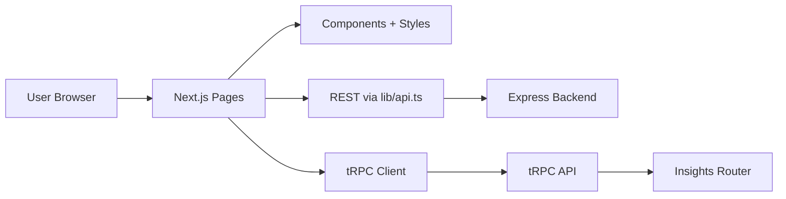
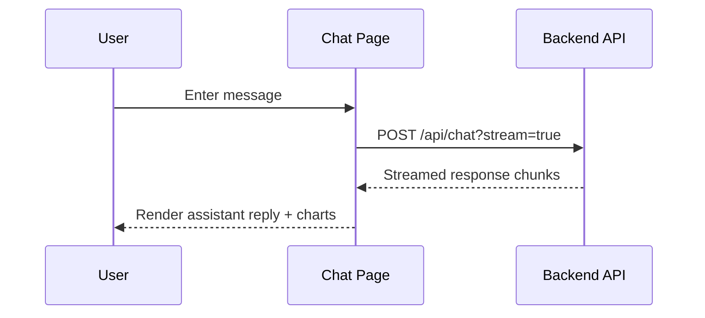
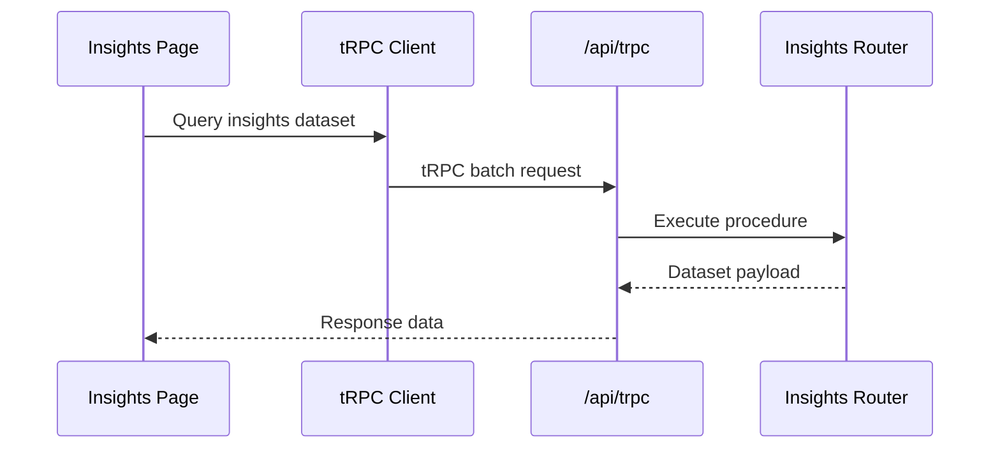

# EstateWise Frontend

Next.js + React frontend for the EstateWise real-estate assistant. It provides chat, insights, map, market pulse, and community forums, and integrates with the backend REST API plus a small tRPC surface for local insights data.

## Highlights

- Real-time chat UI with streaming responses and expert views
- Property insights with Chart.js + D3 visualizations
- Interactive map experience powered by Leaflet
- Community forums with posts, comments, and voting
- Auth flows (login/signup/reset), profile management

## Tech Stack

- Next.js (Pages Router) + React
- Tailwind CSS + Radix UI components
- Framer Motion for animations
- Chart.js + D3 for visualizations
- Leaflet for maps
- tRPC + React Query for typed insights data

## Architecture



## Quickstart

### Requirements

- Node.js 18+ (recommended)

### Setup

```bash
cd frontend
npm install
npm run dev
```

By default, Next runs on port 3000. The frontend currently targets a production backend URL in `frontend/lib/api.ts` and some page-level constants.

### Run with the backend locally

```bash
# Terminal A
cd backend
npm start

# Terminal B
cd frontend
npm run dev
```

## Backend API Base URL

The frontend uses a hardcoded API base:

- `frontend/lib/api.ts` (`API_BASE_URL`)
- `frontend/pages/chat.tsx` (local constant)
- `frontend/pages/charts.tsx` (local constant)
- `frontend/pages/login.tsx`, `frontend/pages/signup.tsx`, `frontend/pages/reset-password.tsx` (direct URLs)

For local development, change those constants to your local backend (e.g., `http://localhost:3001`).

## Key UX Flows

### Streaming chat



### Insights (tRPC)



## Pages & Routes

Key routes under `frontend/pages`:

- `/` - landing page
- `/chat` - chat UI with streaming support
- `/insights` - market analytics + calculators (tRPC)
- `/map` - Leaflet property map
- `/market-pulse` - market pulse dashboard
- `/forums` + `/forums/*` - community posts
- `/charts` - chart visualizations
- `/login`, `/signup`, `/profile`, `/reset-password`
- `/terms`, `/privacy`

## Data Access Patterns

- REST API wrappers live in `frontend/lib/api.ts`.
- Some pages call the backend directly (login/signup/reset + charts + chat).
- tRPC endpoints are hosted by Next at `/api/trpc` and do not require the backend service.

## State, Caching, and Rendering

- React Query powers the tRPC client cache (`frontend/lib/trpc.tsx`).
- Chat state lives in page-level React state (streamed updates).
- Most pages render on the client; SEO-critical pages use Next head metadata.

## Auth Handling (Client)

- Login stores a JWT in the `estatewise_token` cookie.
- Username/email are stored in localStorage for display.
- Authenticated requests attach `Authorization: Bearer <token>`.

## Code Organization

```
frontend/
  components/          # Reusable UI components
  lib/                 # API helpers + utilities
  pages/               # Next.js routes
  public/              # Static assets
  server/api/          # tRPC context + routers
  styles/              # Global styles
  __tests__/           # Jest tests
  cypress/             # Cypress tests
  selenium/            # Selenium tests
```

Notable modules:

- `frontend/lib/api.ts` - REST API wrapper functions
- `frontend/lib/trpc.tsx` - tRPC client + React Query provider
- `frontend/server/api/routers/insights.ts` - static datasets for market insights
- `frontend/pages/chat.tsx` - chat orchestration + streaming handling

## Scripts

From `frontend/package.json`:

- `npm run dev` - Next dev server
- `npm run build` - production build
- `npm run start` - production server
- `npm run lint` - ESLint
- `npm run format` - Prettier
- `npm test` - Jest
- `npm run test:watch` - Jest watch
- `npm run test:coverage` - Jest coverage
- `npm run cypress:open` / `npm run cypress:run`
- `npm run test:selenium`

## Build and Deploy

```bash
cd frontend
npm run build
npm run start
```

The production build expects the same backend base URLs (see the Base URL section above).

## Testing Notes

- Jest tests live in `frontend/__tests__/`.
- Cypress E2E tests live in `frontend/cypress/`.
- Selenium specs live in `frontend/selenium/`.

## Troubleshooting

- If API calls fail locally, verify the backend base URL constants point to your local server.
- If chat streaming fails, confirm the backend is reachable and supports `?stream=true`.
- If charts or map data are empty, confirm the backend `GET /api/properties` works.
