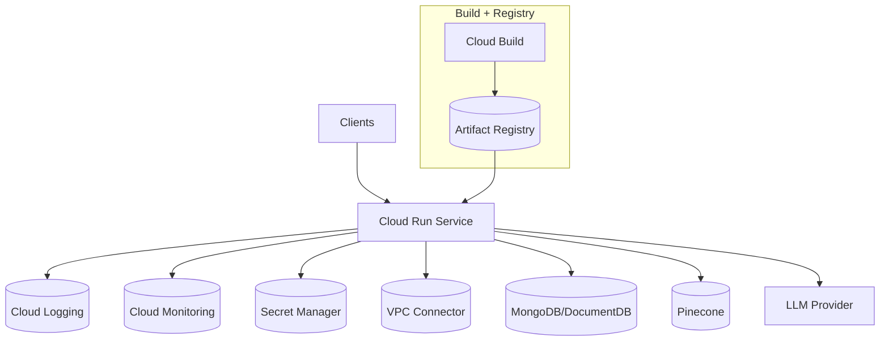

# GCP Deployment Stack

   

Opinionated Google Cloud deployment using Cloud Run, Artifact Registry, Cloud Build, and declarative infrastructure templates. For the multi-cloud comparison table see `DEPLOYMENTS.md`.

## Architecture



## Directory Layout

```
gcp/
  cloudbuild.yaml           # CI/CD pipeline
  deploy.sh                 # Wrapper script
  deployment/
    networking.yaml         # VPC + NAT + VPC connector
    service-account.yaml    # Cloud Run service account
    cloudrun.yaml           # Cloud Run service definition
    storage-bucket.yaml     # Static asset bucket
```

## Provisioning Workflow

1. **Create infra** (Deployment Manager):
   ```bash
   gcloud deployment-manager deployments create estatewise-network --config deployment/networking.yaml
   gcloud deployment-manager deployments create estatewise-service-account --config deployment/service-account.yaml
   gcloud deployment-manager deployments create estatewise-cloudrun --config deployment/cloudrun.yaml
   gcloud deployment-manager deployments create estatewise-bucket --config deployment/storage-bucket.yaml
   ```

2. **Configure secrets**:
   ```bash
   gcloud secrets create MONGO_URI --data-file=-
   gcloud secrets versions add MONGO_URI --data-file=mongo-uri.txt
   # repeat for PINECONE_API_KEY, GOOGLE_AI_API_KEY, JWT_SECRET
   ```

3. **Run Cloud Build**:
   ```bash
   gcloud builds submit --config cloudbuild.yaml \
     --substitutions=_REGION=us-east1,_SERVICE_ACCOUNT=estatewise-run@$GOOGLE_CLOUD_PROJECT.iam.gserviceaccount.com
   ```

Prefer a single command? Use the helper script:

```bash
./deploy.sh --project $GOOGLE_CLOUD_PROJECT --region us-east1 --service-account estatewise-run@$GOOGLE_CLOUD_PROJECT.iam.gserviceaccount.com
```

## Cloud Build Variables

`cloudbuild.yaml` supports substitutions:
- `_REGION` (e.g., `us-east1`)
- `_SERVICE_ACCOUNT` (Cloud Run identity)

## Runtime Configuration

- Gen2 Cloud Run runtime
- CPU throttling disabled for low-latency requests
- Min/max instances: 1 to 20
- VPC connector for outbound access
- Secrets injected at runtime via Secret Manager

## Observability

- Cloud Run emits logs to Cloud Logging by default.
- Service account includes `roles/logging.logWriter` and `roles/monitoring.metricWriter`.
- Add Trace/Profiler agents if needed.

## Frontend and CDN

The `storage-bucket.yaml` bucket is suitable for static assets or map tiles. Add Cloud CDN or Firebase Hosting if serving the frontend on GCP.

## Troubleshooting

- Cloud Run cannot pull image: check Artifact Registry IAM and service account binding.
- Secrets not available: verify Secret Manager permissions and secret names.
- VPC access failures: ensure connector range does not overlap existing subnets.
