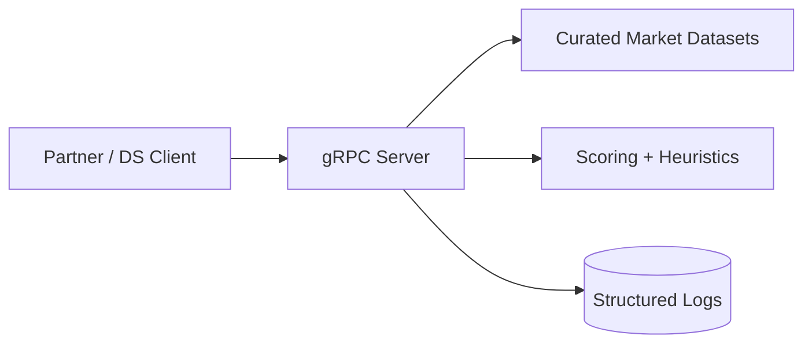

# EstateWise gRPC Market Pulse Service

High-performance gRPC service exposing EstateWise market intelligence for partner integrations and data science workflows. It mirrors the Market Pulse logic from the web UI but runs independently.

## Architecture



## Core RPCs

- **GetSnapshot** (unary): Returns market summary, metrics, and recommendations.
- **StreamHotZips** (server streaming): Emits ZIP opportunities filtered by yield.
- **ListMarkets** (unary): Lists available metros and known aliases.

## Project Structure

```
grpc/
├── proto/market_pulse.proto      # gRPC contract
├── src/
│   ├── config/                   # Env loading + defaults
│   ├── data/                     # Curated datasets
│   ├── services/                 # Business logic + handlers
│   └── utils/                    # Helpers
├── aws | azure | gcp             # Cloud deployment templates
├── Dockerfile
├── docker-compose.yml
└── README.md
```

## Quickstart

```bash
cd grpc
npm install
npm run dev        # Starts the service on :50051

# In another terminal
grpcurl -plaintext -d '{"query":"Austin, TX"}' \
  localhost:50051 estatewise.marketpulse.MarketPulseService/GetSnapshot
```

## Configuration

| Variable | Default | Description |
|----------|---------|-------------|
| `GRPC_HOST` | `0.0.0.0` | Bind address. |
| `GRPC_PORT` | `50051` | Listen port. |
| `LOG_LEVEL` | `info` | Log level. |

Create a `.env` file in `grpc/` to override defaults.

## Deployment

- **Docker**:
  ```bash
  docker build -t estatewise/market-pulse-grpc .
  docker run -p 50051:50051 estatewise/market-pulse-grpc
  ```
- **AWS ECS**: see `grpc/aws/README.md`.
- **Azure Container Apps**: see `grpc/azure/README.md`.
- **Google Cloud Run**: see `grpc/gcp/README.md`.

## Contract Notes

- The canonical contract is `proto/market_pulse.proto`.
- Regenerate client stubs when the proto changes.
- Keep backward compatibility for partner integrations (avoid breaking field changes).

## Testing and CI

- `npm test` runs unit tests (dataset resolution, scoring rules).
- `npm run lint` runs ESLint.
- `npm run proto:check` runs `buf lint` over the proto.

## Roadmap Ideas

- SDK generation via `buf` plugins (TypeScript, Go, Python).
- Publish snapshots to analytics storage (S3 or BigQuery).
- Add auth interceptors (mTLS / API keys) for partner traffic.
