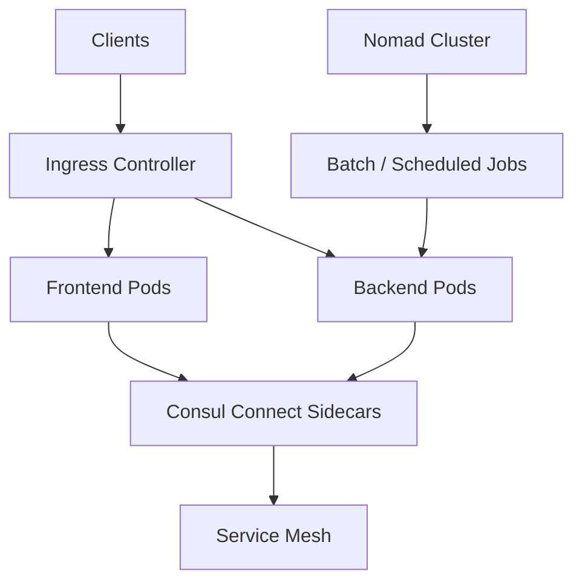

# HashiCorp Deployment Stack

Deploy EstateWise on any Kubernetes cluster with HashiCorp Consul for service discovery/service mesh and Nomad for batch or scheduled workloads. This stack layers on top of a standard Kubernetes deployment and is ideal for teams already invested in HashiCorp tooling. For a cloud-by-cloud comparison see `DEPLOYMENTS.md`.

## Architecture



## Layout

```
hashicorp/
├─ deploy.sh                # Wrapper for terraform init/plan/apply
└─ terraform/
   ├─ main.tf               # Installs Consul + Nomad via Helm
   ├─ providers.tf          # Kubernetes, Helm, optional Consul providers
   ├─ variables.tf          # kubeconfig / namespace settings
   ├─ outputs.tf            # Consul UI / Nomad UI / mesh endpoints
   └─ values/
      ├─ consul-values.yaml # Connect + sidecar defaults
      └─ nomad-values.yaml  # Nomad cluster tuning
```

## Prerequisites

- Existing Kubernetes cluster (EKS, AKS, GKE, k3s, or on-prem).
- `kubectl` configured to target the cluster.
- Terraform >= 1.6
- `helm`, `consul`, and `nomad` CLIs (for day-to-day operations).

## Deploy

```bash
cd hashicorp
./deploy.sh \
  --kubeconfig ~/.kube/config \
  --context estatewise-prod \
  --namespace estatewise \
  --mesh-namespace estatewise-mesh \
  --do-apply

# Deploy workloads once Consul injector is online
kubectl apply -k ../kubernetes/base
```

By default, Terraform state is stored locally under `hashicorp/terraform/.terraform/terraform.tfstate`. For production, configure a remote state backend.

## Consul Connect Integration

- Deployments in `kubernetes/base` include Consul Connect annotations.
- To disable injection, remove pod annotations or set `consul.hashicorp.com/connect-inject: "false"` at the namespace level.
- Mesh gateways are created for north-south traffic; integrate them with your ingress controller.

## Nomad Integration

Nomad is deployed for scheduled/batch jobs (e.g., data ingest, nightly analytics). It does not replace Kubernetes for the web stack, but can complement it for workflows that fit Nomad’s scheduler model.

## Outputs

- Consul UI URL + bootstrap token
- Nomad UI URL
- Mesh gateway service address
- Suggested DNS entries for services registered via Consul Connect

## Operations

- Scale Consul/Nomad via Terraform or Helm values.
- Rotate ACL tokens using Consul ACL policies.
- Monitor service health in the Consul UI.

## Troubleshooting

- Sidecars not injected: ensure injector is running and namespace has correct annotations.
- Mesh traffic blocked: check NetworkPolicies and mesh gateway configuration.
- Nomad jobs failing: inspect Nomad UI and verify ACL policies.
