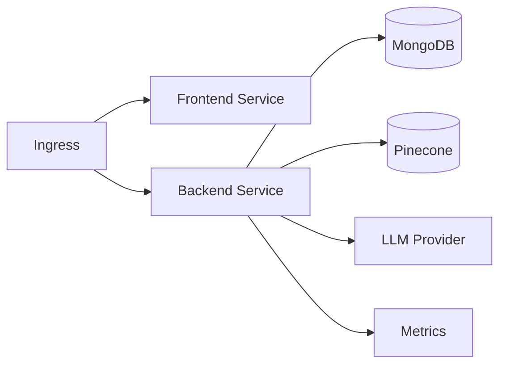

# EstateWise Helm Chart

This Helm chart mirrors the Kubernetes manifests under `kubernetes/` while providing a configurable, CI-friendly installation path for multi-cloud clusters.

## Architecture



## Install

```bash
helm install estatewise ./helm/estatewise \
  --namespace estatewise --create-namespace
```

## Upgrade

```bash
helm upgrade --install estatewise ./helm/estatewise \
  --namespace estatewise \
  --set global.registry=ghcr.io/your-org \
  --set backend.image.tag=sha-<gitsha> \
  --set frontend.image.tag=sha-<gitsha>
```

## Chart Structure

```
helm/estatewise/
  Chart.yaml
  values.yaml
  templates/
    backend-*.yaml
    frontend-*.yaml
    grpc-*.yaml
    ingress.yaml
    networkpolicy.yaml
    servicemonitor.yaml
    secret.yaml
    serviceaccount.yaml
```

## Values Overview

Key sections in `values.yaml`:

- `global`: registry, namespaces, cloud annotations
- `configMap`: shared non-secret env vars
- `secrets`: secret creation or reference
- `backend`: image, service, env, autoscaling, probes
- `frontend`: image, service, autoscaling
- `grpc`, `mcp`: optional services

## Secrets

By default the chart expects a pre-created secret named `estatewise-secrets`.

```bash
kubectl create secret generic estatewise-secrets \
  --namespace estatewise \
  --from-literal=mongoUri=... \
  --from-literal=googleAiApiKey=... \
  --from-literal=pineconeApiKey=... \
  --from-literal=pineconeIndex=... \
  --from-literal=jwtSecret=...
```

You can also let Helm create the secret:

```yaml
secrets:
  create: true
  data:
    mongoUri: "mongodb+srv://..."
    googleAiApiKey: "..."
    pineconeApiKey: "..."
    pineconeIndex: "estatewise-index"
    jwtSecret: "super-secret"
```

## Configuration Examples

### Override backend resources

```yaml
backend:
  resources:
    requests:
      cpu: 500m
      memory: 1Gi
    limits:
      cpu: 1
      memory: 2Gi
```

### Enable gRPC service

```yaml
grpc:
  enabled: true
  service:
    type: LoadBalancer
```

### Enable MCP server

```yaml
mcp:
  enabled: true
```

## Cloud-Specific Annotations

Use `global.cloud.ingress.annotations` and `global.cloud.service.annotations` to match your provider.

Example (AWS ALB):

```yaml
global:
  cloud:
    provider: aws
    ingress:
      annotations:
        kubernetes.io/ingress.class: alb
        alb.ingress.kubernetes.io/scheme: internet-facing
```

Example (GCP):

```yaml
global:
  cloud:
    provider: gcp
    ingress:
      annotations:
        kubernetes.io/ingress.class: gce
```

Example (Azure):

```yaml
global:
  cloud:
    provider: azure
    service:
      annotations:
        service.beta.kubernetes.io/azure-load-balancer-internal: "true"
```

Example (Oracle):

```yaml
global:
  cloud:
    provider: oracle
    service:
      annotations:
        service.beta.kubernetes.io/oci-load-balancer-internal: "true"
```

## Observability

- `servicemonitor.yaml` and `prometheusrules.yaml` integrate with Prometheus.
- `backend` exposes `/metrics` for scraping.

## Notes

- HPA, PDB, and NetworkPolicy templates align with `kubernetes/base` defaults.
- Consul annotations can be toggled via pod annotations in values.
