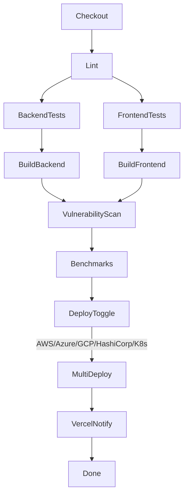

# Jenkins Pipeline Reference


This directory contains reusable Jenkinsfiles that power EstateWise’s multi-cloud CI/CD pipeline. The entrypoint is [`workflow.Jenkinsfile`](workflow.Jenkinsfile), which orchestrates builds, tests, artifact publishing, and optional deployments to AWS, Azure, GCP, HashiCorp/Kubernetes, and Vercel.

## Jenkinsfiles

| File | Purpose |
|------|---------|
| `workflow.Jenkinsfile` | Main pipeline: checkout → lint/tests → Docker builds → security scans → multi-cloud deploy toggles → Vercel notify. |
| `ci.Jenkinsfile` | Lightweight CI pipeline used in branches to run unit/integration suites without deployment stages. |
| `analyze-code.Jenkinsfile` | Static analysis at scale (CodeQL, linting, dependency audits). |
| `analyze-repo.Jenkinsfile` | Repository hygiene tasks (license checks, dependency freshness). |

## Multibranch Pipeline Setup

1. Create a Jenkins job of type **Multibranch Pipeline**.
2. Point it to your Git repo and set the scan interval (e.g., every 5 minutes).
3. Ensure credentials exist for:
   - GitHub/Source control checkout
   - GHCR (or target registry) `usernamePassword` credential with ID `ghcr`
4. Optional: define environment variables at the job level to control deployments (see below).

## Environment Variables & Secrets

### Multi-Cloud Deployment Variables

| Variable | Description |
|----------|-------------|
| `DEPLOY_AWS` | `1` to run `aws/deploy.sh` (requires `AWS_DEPLOY_ARGS` or default config). |
| `DEPLOY_AZURE` | `1` to run `azure/deploy.sh`. |
| `DEPLOY_GCP` | `1` to run `gcp/deploy.sh`. |
| `DEPLOY_HASHICORP` | `1` to run `hashicorp/deploy.sh`. |
| `DEPLOY_K8S_MANIFESTS` | `1` to apply `kubectl apply -k` (defaults to `kubernetes/base`; override with `K8S_APPLY_PATH`). |
| `DEPLOY_AGENTIC` | `1` to run `agentic-ai/deploy.sh`. |
| `DEPLOY_MCP` | `1` to run `mcp/deploy.sh`. |
| `DEPLOY_B64` | Base64 encoded bash script executed in the "Infra Deploy" stage (legacy hook). |
| `AWS_DEPLOY_ARGS` | Extra CLI parameters for `aws/deploy.sh` (e.g., `"--region us-east-1"`). |
| `AZURE_DEPLOY_ARGS` | Additional arguments for `azure/deploy.sh`. |
| `GCP_DEPLOY_ARGS` | Additional arguments for `gcp/deploy.sh`. |
| `HASHICORP_DEPLOY_ARGS` | Additional arguments for `hashicorp/deploy.sh`. |
| `K8S_APPLY_PATH` | Custom path for `kubectl apply -k` during the Kubernetes stage. |
| `AGENTIC_DEPLOY_ARGS` | Arguments forwarded to `agentic-ai/deploy.sh` (e.g., `--target aws`). |
| `MCP_DEPLOY_ARGS` | Arguments forwarded to `mcp/deploy.sh`. |
| `DB_CHECK` | Optional base64 script run prior to tests for smoke-checking database connectivity. |

### Advanced Deployment Strategy Variables

| Variable | Default | Description |
|----------|---------|-------------|
| `DEPLOY_BLUE_GREEN` | `0` | `1` to enable Blue-Green deployment strategy. |
| `DEPLOY_CANARY` | `0` | `1` to enable Canary deployment strategy. |
| `BLUE_GREEN_SERVICE` | `backend` | Service to deploy with Blue-Green (`backend` or `frontend`). |
| `CANARY_SERVICE` | `backend` | Service to deploy with Canary (`backend` or `frontend`). |
| `CANARY_STAGES` | `10,25,50,75,100` | Comma-separated list of traffic percentage stages for canary rollout. |
| `CANARY_STAGE_DURATION` | `120` | Seconds to wait between each canary stage. |
| `AUTO_SWITCH_BLUE_GREEN` | `false` | `true` to automatically switch Blue-Green traffic without manual approval. |
| `AUTO_PROMOTE_CANARY` | `false` | `true` to automatically promote canary through stages without manual approval. |
| `SCALE_DOWN_OLD_DEPLOYMENT` | `false` | `true` to automatically scale down old deployment after Blue-Green switch. |
| `K8S_NAMESPACE` | `estatewise` | Kubernetes namespace for all deployments. |

Secrets such as cloud credentials are managed via Jenkins credentials (e.g., AWS `withAWS`, Azure service principals, GCP JSON key files), or by injecting environment variables stored in credential bindings.

## Pipeline Stages Overview



Key stage notes:
- **Cache Dependencies**: uses `npm ci` with `--legacy-peer-deps` for reproducible installs.
- **Build & Push Backend/Frontend Image**: tags both commit SHA and `latest` before pushing to GHCR (swap registry via `REGISTRY` env).
- **Image Vulnerability Scan**: runs Trivy in non-blocking mode (adjust `--exit-code` to enforce gating).
- **Performance Benchmark**: simple Artillery smoke test; extend or disable as needed.
- **Multi-Cloud Deploy**: executes requested platform scripts in parallel.
- **Vercel Deploy**: placeholder stage to trigger Vercel deployments/notifications.

## Running Locally (Jenkinsfile Runner)

You can validate pipeline changes before pushing using Jenkinsfile Runner:

```bash
docker run --rm -v "$PWD":/workspace jenkins/jenkinsfile-runner \
  -w /workspace -p workflow.Jenkinsfile
```

## Deployment Strategy Examples

### Blue-Green Deployment (Production)

```groovy
pipeline {
  environment {
    // Enable Blue-Green deployment
    DEPLOY_BLUE_GREEN = '1'
    BLUE_GREEN_SERVICE = 'backend'
    K8S_NAMESPACE = 'estatewise-prod'

    // Require manual approval before traffic switch
    AUTO_SWITCH_BLUE_GREEN = 'false'

    // Cleanup old deployment after successful switch
    SCALE_DOWN_OLD_DEPLOYMENT = 'true'
  }
}
```

**Use Case**: Major releases where you want full testing before traffic switch with instant rollback capability.

### Canary Deployment (Production)

```groovy
pipeline {
  environment {
    // Enable Canary deployment
    DEPLOY_CANARY = '1'
    CANARY_SERVICE = 'backend'
    K8S_NAMESPACE = 'estatewise-prod'

    // Gradual rollout stages
    CANARY_STAGES = '10,25,50,75,100'

    // Wait 3 minutes between stages
    CANARY_STAGE_DURATION = '180'

    // Require manual approval at each stage
    AUTO_PROMOTE_CANARY = 'false'
  }
}
```

**Use Case**: Progressive rollout of new features with real user testing and low risk.

### Fast Canary (Staging/Development)

```groovy
pipeline {
  environment {
    DEPLOY_CANARY = '1'
    CANARY_SERVICE = 'backend'
    K8S_NAMESPACE = 'estatewise-staging'

    // Fewer stages, faster progression
    CANARY_STAGES = '20,50,100'
    CANARY_STAGE_DURATION = '60'

    // Automatic progression in staging
    AUTO_PROMOTE_CANARY = 'true'
  }
}
```

**Use Case**: Rapid testing in non-production environments with automated progression.

## Tips

- Keep environment-specific secrets/project IDs outside of the repo; inject them via Jenkins credentials.
- For Terraform/HashiCorp deploys, provide kubeconfig paths using `HASHICORP_DEPLOY_ARGS="--kubeconfig /var/lib/jenkins/.kube/config --do-apply"`.
- Use Blue-Green deployments for major releases where instant rollback is critical.
- Use Canary deployments for new features where gradual rollout and real-world testing is preferred.
- In production, always set `AUTO_SWITCH_BLUE_GREEN=false` and `AUTO_PROMOTE_CANARY=false` for manual approval gates.
- Monitor Prometheus metrics during canary deployments to catch issues early.
- Combine with Jenkins shared libraries if you want to re-use stages across repositories.
- Monitor job results via Jenkins Blue Ocean or the classic UI; failing stages surface the command output from the shell steps.

For comprehensive deployment strategy guides, see [DEVOPS.md](../DEVOPS.md).

With the provided scripts and Jenkinsfiles, you can deliver EstateWise to production across AWS, Azure, GCP, Kubernetes, or Vercel with a single pipeline using industry-standard deployment strategies.
