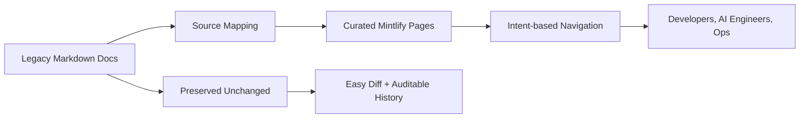

# EstateWise Mintlify Documentation Site

This directory contains a standalone, AI-native Mintlify documentation site for the EstateWise monorepo.

It is intentionally additive and does not modify any existing documentation sources at repository root.

## Purpose

This site provides a production-focused documentation experience that is:

- Easier to navigate than large monolithic markdown files
- Structured by user intent (onboarding, AI, architecture, operations, reference)
- Grounded in actual code and commands from this repository
- Safe to evolve independently from legacy markdown docs

## What This Site Covers

The site consolidates and modernizes key content previously spread across:

- `README.md`
- `ARCHITECTURE.md`
- `DEVOPS.md`
- `DEPLOYMENTS.md`
- `RAG_SYSTEM.md`
- `TECH_DOCS.md`

## Design Principles

- **AI-native**: explain decision gates, retrieval behavior, expert orchestration, and runtime/tool boundaries.
- **Operationally useful**: prioritize deploy/runbook/SLO/rollback clarity.
- **Reference-first**: keep commands, endpoints, and env variables explicit.
- **Non-destructive migration**: preserve original docs while introducing a cleaner IA.

## Information Architecture

```mermaid
flowchart TB
  Root[EstateWise AI-Native Docs]

  Root --> Start[Start]
  Root --> AI[AI Platform]
  Root --> Arch[Architecture]
  Root --> Ops[Operations]
  Root --> Ref[Reference]

  Start --> S1[Quickstart]
  Start --> S2[Local Stack]
  Start --> S3[Configuration]

  AI --> A1[AI System]
  AI --> A2[Hybrid RAG]
  AI --> A3[Decision + MoE]
  AI --> A4[Agentic + MCP]

  Arch --> P1[System Architecture]
  Arch --> P2[API Protocols]
  Arch --> P3[Data Models]
  Arch --> P4[Repository Map]

  Ops --> O1[DevOps Playbook]
  Ops --> O2[Deployment Targets]
  Ops --> O3[Runbooks]
  Ops --> O4[SLOs + DR]

  Ref --> R1[Commands]
  Ref --> R2[Endpoints]
  Ref --> R3[Environment Variables]
  Ref --> R4[Legacy Source Map]
```



## Migration Model



## Directory Layout

```txt
mintlify-ai-docs/
  docs.json
  index.mdx
  README.md
  start/
    quickstart.mdx
    local-stack.mdx
    configuration.mdx
  ai/
    system.mdx
    rag.mdx
    moe.mdx
    agentic-mcp.mdx
  platform/
    architecture.mdx
    apis.mdx
    data-models.mdx
    repository.mdx
  ops/
    devops.mdx
    deployments.mdx
    runbooks.mdx
    slo-dr.mdx
  reference/
    commands.mdx
    endpoints.mdx
    env-vars.mdx
  migration/
    source-map.mdx
```

## Local Development

## Prerequisites

- Node.js `20.17.0+`
- Mintlify CLI

```bash
npm i -g mint
```

## Run locally

```bash
cd mintlify-ai-docs
mint dev
```

Open `http://localhost:3000`.

Note: if your frontend app is already using port `3000`, stop it first.

## Editing Workflow

1. Update the relevant `.mdx` page in this directory.
2. Keep changes scoped and avoid unrelated rewrites.
3. If adding pages, also register them in `docs.json` navigation.
4. Run local preview with `mint dev` and verify navigation.
5. Confirm links, code blocks, and Mermaid diagrams render correctly.

## Content Standards

- Keep explanations concrete and implementation-aware.
- Prefer exact commands over pseudocode where possible.
- Separate strategy content from reference content.
- Avoid duplicating large blocks across pages.
- Preserve backward compatibility in operational guidance.

## Recommended Update Triggers

Update this docs site when any of the following change:

- Backend route contracts or auth behavior
- tRPC router surface
- gRPC protobuf/service contracts
- AI pipeline logic (decision gate, RAG, MoE, synthesis)
- MCP tool naming/input/output behavior
- deployment strategy scripts, CI/CD stages, or runbooks
- required environment variables

## Quality Checklist

Before considering docs updates complete:

- `docs.json` is valid JSON
- All pages referenced in navigation exist
- New pages contain frontmatter (`title`, `description`)
- Mermaid blocks render in local preview
- Command snippets match current `package.json` scripts
- Endpoint references match current route registration

## Relationship to Existing Docs

This site does not replace existing root-level docs immediately.

It acts as a maintained, structured docs layer while legacy markdown remains available as source material and historical context.

## Future Enhancements

- Add OpenAPI-driven endpoint pages per route group
- Add architecture decision records (ADRs)
- Add incident timeline templates and postmortem schema
- Add release note pages tied to CI/CD deployments

## Ownership

Primary maintainers should include engineers responsible for:

- backend API contracts
- AI pipeline behavior
- deployment/operations workflows
- MCP and agentic runtime integration

When in doubt, keep changes small, verifiable, and tied to code truth.
