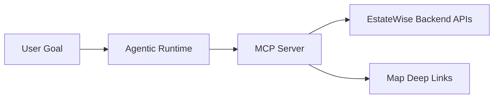

EstateWise includes two key extension layers:

- `agentic-ai/`: orchestration runtime for multi-step goals
- `mcp/`: 60+ tools exposed over MCP stdio

## Agentic runtimes

<Tabs>
  <Tab title="Default orchestrator">
    Deterministic round-based execution over specialized agents.

    ```bash
    cd agentic-ai
    npm run dev "find 3-bed homes in chapel hill under 600k"
    ```
  </Tab>
  <Tab title="LangGraph runtime">
    ReAct-style tool-calling workflow.

    ```bash
    cd agentic-ai
    npm run dev:langgraph -- "compare two zpids and explain graph paths"
    ```
  </Tab>
  <Tab title="CrewAI runtime">
    Crew-based orchestration option.

    ```bash
    cd agentic-ai
    npm run dev:crewai -- "rank properties by affordability and commute"
    ```
  </Tab>
</Tabs>

## MCP tool surface (selected categories)

- Properties: search, lookup, byIds
- Graph: similar, explain, neighborhood, path matrix
- Analytics/Market: trends, distributions, affordability
- Batch: compare/export/enrich
- Finance: mortgage, cap rate, rent-vs-buy
- Monitoring/System: health, usage, cache control
- Token management: issue, validate, refresh, revoke

## End-to-end interaction



## Important operational notes

- MCP dev server appears idle until a client connects.
- Graph tools depend on Neo4j-enabled backend.
- Token workflows require `MCP_TOKEN_SECRET` and TTL configuration.
