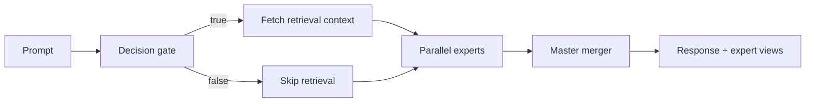
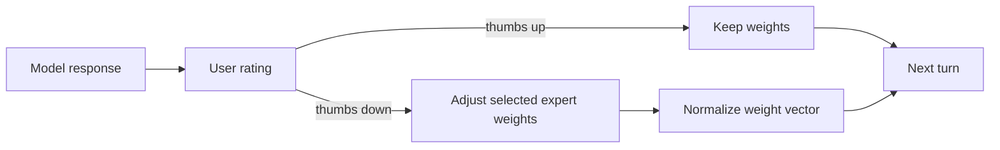
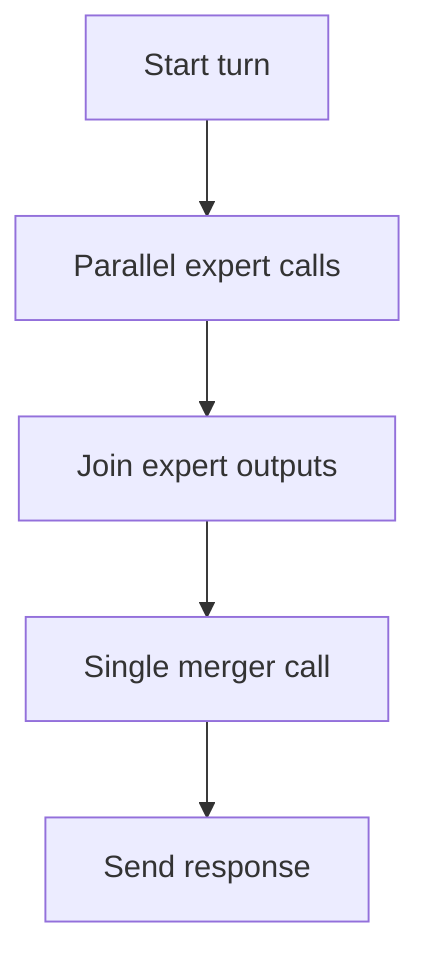

## Decision gate

The first AI step determines whether property retrieval is needed.
It emits a strict JSON response:

```json
{ "usePropertyData": true }
```

or

```json
{ "usePropertyData": false }
```

This avoids expensive retrieval for prompts that do not benefit from RAG.

## Execution flow



## Expert ensemble

EstateWise runs specialized expert views in parallel:

- Data Analyst
- Lifestyle Concierge
- Financial Advisor
- Neighborhood Expert
- Cluster Analyst


## Weight adjustment loop



## Latency profile



## Why this architecture works

- Improves answer quality through specialization.
- Preserves coherence with a single merger output.
- Balances speed, explainability, and personalization.

<Warning>
  Expert pipelines are powerful but can increase latency if context grows too
  large. Keep retrieval context bounded.
</Warning>
