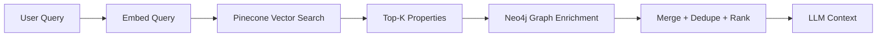

## Why Hybrid RAG

Vector-only retrieval is fast but weak on structural explanations.
Hybrid RAG adds graph relationships so recommendations are both relevant and explainable.

## Pipeline



## What the system gains

- Better locality/coherence (same neighborhood/zip patterns).
- Relationship explanations for recommendations.
- Context rich enough for finance/lifestyle/market expert reasoning.

## Graph-driven reasoning examples

- "Recommended because it shares neighborhood and zipcode with your liked property."
- "Related by similarity and local market cluster characteristics."

## Graceful degradation

If Neo4j is disabled or unavailable:
- graph routes return `503`
- chat flow still works with vector-only retrieval

<AccordionGroup>
  <Accordion title="When to favor vector-only mode">
    - Very latency-sensitive interactions
    - No graph infrastructure available
    - Early prototyping where explainability is not yet required
  </Accordion>
  <Accordion title="When to require Hybrid RAG">
    - Production recommendation quality work
    - Explainability requirements for users or stakeholders
    - Neighborhood and structural context are core to UX
  </Accordion>
</AccordionGroup>

## Operational commands

```bash
cd backend
npm run upsert        # Pinecone ingestion
npm run graph:ingest  # Neo4j ingestion
```
