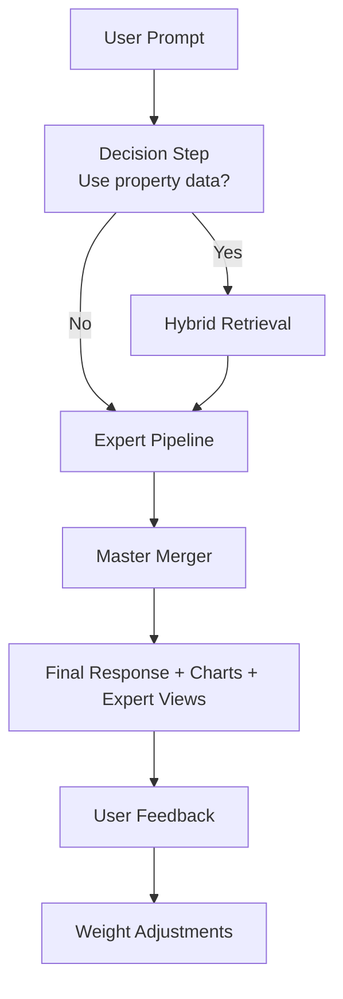
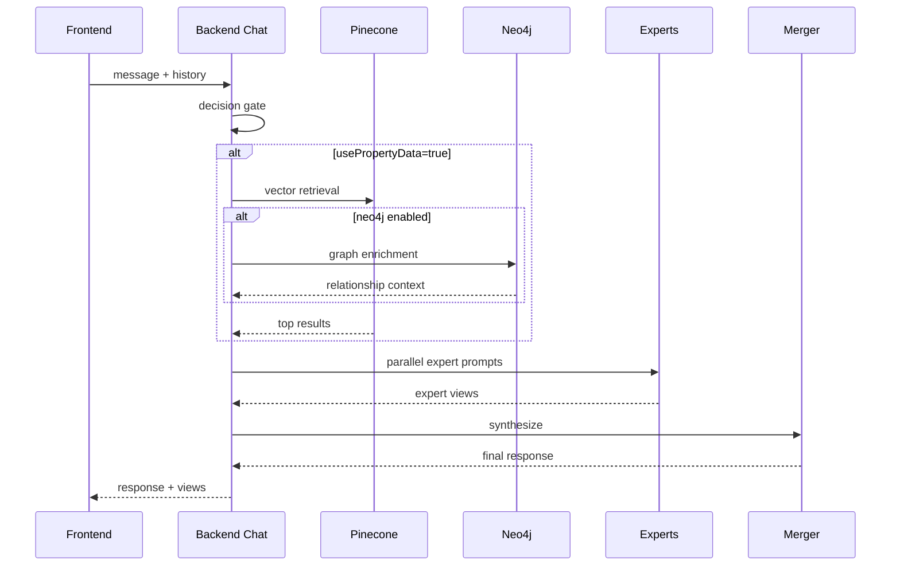
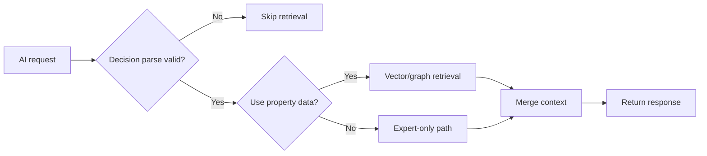

EstateWise uses a layered AI system rather than a single model call.

## End-to-end AI lifecycle

## Runtime interaction sequence

## Control points

- Decision gate controls cost and latency profile.
- Retrieval context window controls token and quality tradeoff.
- Expert parallelism controls depth without linear latency growth.
- Feedback loop controls per-conversation personalization.

## AI model responsibilities

| Layer           | Main responsibility                              |
| --------------- | ------------------------------------------------ |
| Decision layer  | Decide whether RAG context is needed             |
| Retrieval layer | Fetch relevant property context (vector + graph) |
| Expert layer    | Generate specialized analyses in parallel        |
| Merger layer    | Produce one actionable user-facing response      |

## Failure and fallback behavior

## Where this runs

- Primary chat path: backend chat service (`/api/chat`)
- Expert feedback path: `/api/chat/rate`
- Supporting systems: Pinecone, optional Neo4j, MongoDB

<Tip>
  For implementation details of Hybrid RAG and MoE behavior, continue to
  `/ai/rag` and `/ai/moe`.
</Tip>
