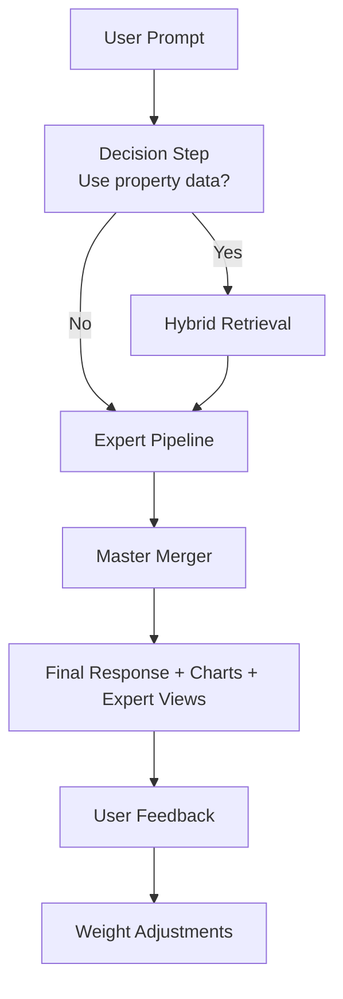

EstateWise uses a layered AI system rather than a single model call.

## Core design principles

- Retrieval is conditional to reduce latency and cost on simple prompts.
- Expert analysis is parallelized to keep response quality high.
- The final response is synthesized by a merger model for coherence.
- Feedback influences future expert weighting per conversation.

## AI model responsibilities

| Layer | Main responsibility |
| --- | --- |
| Decision layer | Decide whether RAG context is needed |
| Retrieval layer | Fetch relevant property context (vector + graph) |
| Expert layer | Generate specialized analyses in parallel |
| Merger layer | Produce one actionable user-facing response |

## Where this runs

- Primary chat path: backend chat service (`/api/chat`)
- Expert feedback path: `/api/chat/rate`
- Supporting systems: Pinecone, optional Neo4j, MongoDB

<Tip>
For implementation details of Hybrid RAG and MoE behavior, continue to `/ai/rag` and `/ai/moe`.
</Tip>
