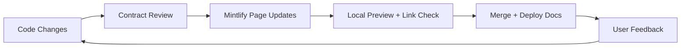

This site is a modern, action-oriented documentation layer for EstateWise.

It consolidates and improves the content currently spread across:

- `README.md`
- `ARCHITECTURE.md`
- `DEVOPS.md`
- `DEPLOYMENTS.md`
- `RAG_SYSTEM.md`
- `TECH_DOCS.md`

<CardGroup cols={2}>
  <Card title="Build and run" icon="rocket" href="/start/quickstart">
    Get from clone to local stack quickly with exact commands.
  </Card>
  <Card title="Understand the AI" icon="brain" href="/ai/system">
    Learn the decision engine, Hybrid RAG, MoE, and agentic runtimes.
  </Card>
  <Card title="Ship safely" icon="shield-check" href="/ops/devops">
    Blue-green, canary, CI/CD, monitoring, rollback, and runbooks.
  </Card>
  <Card title="Use references" icon="book-open" href="/reference/commands">
    Direct command, endpoint, and environment variable references.
  </Card>
</CardGroup>

## Documentation Topology

```mermaid
flowchart TB
  Root[EstateWise AI Docs]

  Root --> Start[Start]
  Root --> AI[AI Platform]
  Root --> Arch[Architecture]
  Root --> Ops[Operations]
  Root --> Ref[Reference]

  Start --> S1[Quickstart]
  Start --> S2[Local Stack]
  Start --> S3[Configuration]

  AI --> A1[AI System]
  AI --> A2[Hybrid RAG]
  AI --> A3[Decision + MoE]
  AI --> A4[Agentic + MCP]

  Arch --> P1[System Architecture]
  Arch --> P2[API Protocols]
  Arch --> P3[Data Models]
  Arch --> P4[Repository Map]

  Ops --> O1[DevOps Playbook]
  Ops --> O2[Deployment Targets]
  Ops --> O3[Runbooks]
  Ops --> O4[SLOs + DR]

  Ref --> R1[Commands]
  Ref --> R2[Endpoints]
  Ref --> R3[Environment Variables]
  Ref --> R4[Legacy Source Map]
```

## Why This Version Is Better

- Source-of-truth commands are pulled from actual `package.json` scripts.
- API references reflect real route registration from backend code.
- AI docs explain not just what exists, but when to use each pathway.
- Operations docs prioritize incident response and delivery safety.

## Docs Lifecycle

<Tip>
  The original documentation files remain unchanged. This site is an additive,
  Mintlify-native layer.
</Tip>

## Read by Intent

<Tabs>
  <Tab title="I am onboarding">
    Start with:
    - `/start/quickstart`
    - `/platform/repository`
    - `/reference/commands`

    Then verify your environment at `/start/configuration`.

  </Tab>
  <Tab title="I am building AI features">
    Start with:
    - `/ai/system`
    - `/ai/rag`
    - `/ai/moe`
    - `/ai/agentic-mcp`

    Then validate protocol boundaries at `/platform/apis`.

  </Tab>
  <Tab title="I run production">
    Start with:
    - `/ops/devops`
    - `/ops/deployments`
    - `/ops/runbooks`
    - `/ops/slo-dr`

    Keep `/reference/endpoints` and `/reference/env-vars` open during incidents.

  </Tab>
</Tabs>
