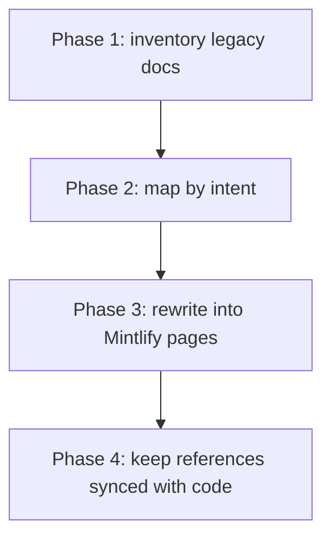

This page maps legacy source files to their new documentation homes.

## Migration graph

```mermaid
flowchart LR
  README[README.md] --> Start[/start + /reference]
  ARCH[ARCHITECTURE.md] --> Platform[/platform]
  RAG[RAG_SYSTEM.md] --> AI[/ai]
  TECH[TECH_DOCS.md] --> Cross[/ai + /platform + /ops + /reference]
  DEVOPS[DEVOPS.md] --> Ops[/ops]
  DEPLOY[DEPLOYMENTS.md] --> Deploy[/ops/deployments]
```

## Source-to-site mapping

| Legacy source     | Primary new pages                                                                           |
| ----------------- | ------------------------------------------------------------------------------------------- |
| `README.md`       | `/index`, `/start/*`, `/reference/commands`, `/reference/endpoints`                         |
| `ARCHITECTURE.md` | `/platform/architecture`, `/platform/apis`, `/platform/data-models`, `/platform/repository` |
| `RAG_SYSTEM.md`   | `/ai/rag`, `/ai/system`, `/ai/moe`                                                          |
| `TECH_DOCS.md`    | `/ai/*`, `/platform/*`, `/ops/*`, `/reference/*`                                            |
| `DEVOPS.md`       | `/ops/devops`, `/ops/runbooks`, `/ops/slo-dr`                                               |
| `DEPLOYMENTS.md`  | `/ops/deployments`                                                                          |

## Migration phases



## What this migration improves

- Consolidates duplicated material into one navigable IA.
- Prioritizes operationally actionable content over long narrative sections.
- Separates AI system behavior from platform and ops concerns.
- Keeps command, endpoint, and config references in dedicated pages.

## Non-destructive guarantee

- Existing markdown docs are not modified.
- This Mintlify site is additive and isolated in `mintlify-ai-docs/`.

<Tip>
  If needed, this site can be maintained as a long-term canonical docs layer
  while legacy markdown remains as archival source material.
</Tip>
