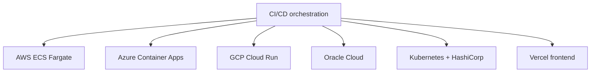
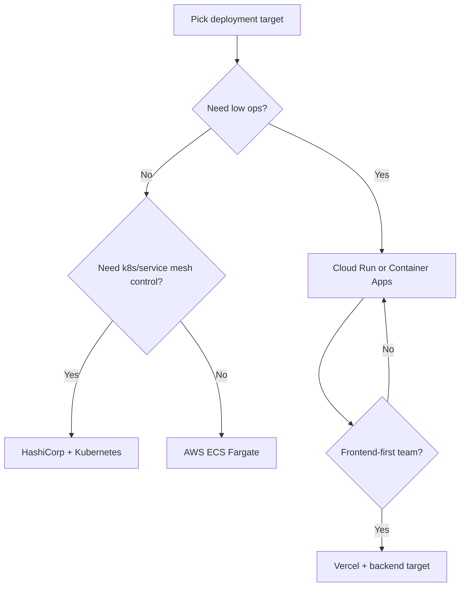

EstateWise supports multiple deployment tracks with a shared application core.

## Multi-cloud deployment map

## Target options

| Target        | Primary stack                                     |
| ------------- | ------------------------------------------------- |
| AWS           | ECS Fargate + ALB + CodePipeline/CodeBuild        |
| Azure         | Container Apps + Key Vault + Bicep                |
| GCP           | Cloud Run + Cloud Build + Artifact Registry       |
| OCI           | Terraform VCN + Compute + optional LB + OCIR      |
| HashiCorp/K8s | Terraform + Consul + Nomad + Kubernetes manifests |
| Vercel        | Frontend and optional edge/backend workflows      |

## Deployment target decision flow

## How to choose

- Choose Cloud Run or Container Apps for low-ops managed container hosting.
- Choose ECS Fargate for deep AWS ecosystem integration.
- Choose Kubernetes/HashiCorp when you need mesh, custom policies, or strong portability.
- Choose Vercel for frontend-first release velocity and edge distribution.

## Mixed deployment examples

- Frontend on Vercel, backend on AWS ECS
- Public APIs on Cloud Run, internal jobs on Kubernetes/Nomad
- Multi-cloud active deployment with Jenkins strategy flags

## CI/CD controls

Jenkins strategy toggles include:

- `DEPLOY_BLUE_GREEN`
- `DEPLOY_CANARY`
- `AUTO_SWITCH_BLUE_GREEN`
- `AUTO_PROMOTE_CANARY`
- cloud toggles like `DEPLOY_AWS`, `DEPLOY_AZURE`, `DEPLOY_GCP`, `DEPLOY_OCI`, `DEPLOY_K8S_MANIFESTS`

<Tip>
  For strategy details and rollback procedures, use `/ops/devops` and
  `/ops/runbooks`.
</Tip>
