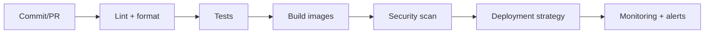
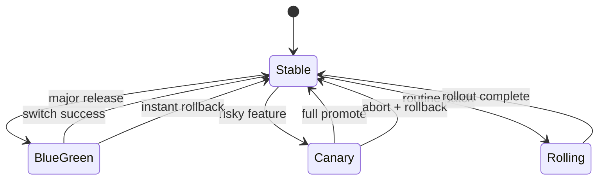

## CI/CD model

EstateWise supports multiple CI/CD entry points:

- Jenkins (primary production orchestrator)
- GitHub Actions workflows
- GitLab CI pipelines

## Pipeline structure



## Strategy matrix

| Strategy   | Rollback speed | Resource overhead  | Best use                              |
| ---------- | -------------- | ------------------ | ------------------------------------- |
| Blue-Green | Instant        | High during switch | Major releases                        |
| Canary     | Progressive    | Moderate           | New features and risk-managed rollout |
| Rolling    | Standard       | Low                | Routine updates                       |

## Strategy transition model



## Blue-Green operational pattern

```bash
export NAMESPACE=estatewise
export AUTO_SWITCH=false
export SCALE_DOWN_OLD=false
./kubernetes/scripts/blue-green-deploy.sh backend ghcr.io/your-org/estatewise-app-backend:v1.2.3
```

## Canary operational pattern

```bash
export NAMESPACE=estatewise
export CANARY_STAGES=10,25,50,75,100
export STAGE_DURATION=120
export AUTO_PROMOTE=false
./kubernetes/scripts/canary-deploy.sh backend ghcr.io/your-org/estatewise-app-backend:v1.2.3
```

## Core Kubernetes operations

```bash
kubectl apply -k kubernetes/base -n estatewise
kubectl apply -k kubernetes/overlays/prod -n estatewise
kubectl get deployments,pods,services -n estatewise
kubectl logs -f deployment/estatewise-backend -n estatewise
```

## Monitoring and observability

```mermaid
flowchart LR
  App[backend services] --> Metrics[/metrics]
  App --> Status[/status]
  Metrics --> Prom[Prometheus]
  Prom --> Graf[Grafana]
  Prom --> Alerts[Alerting]
```

Key backend observability endpoints:

- `/metrics` (Prometheus)
- `/status` (status monitor UI)

Primary operational signals:

- request latency and error rates
- memory and CPU pressure
- rollout health
- canary and blue/green slot health

<Warning>
  Keep deployment checks and rollback commands scripted and rehearsed. Manual,
  undocumented rollback steps increase MTTR.
</Warning>
