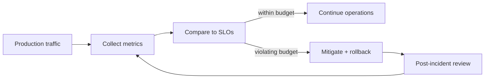
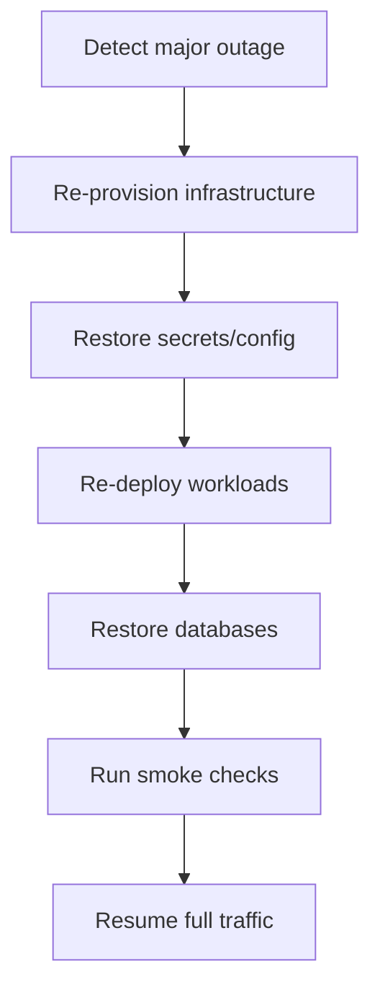

## Suggested reliability objectives

| Metric             | Target       |
| ------------------ | ------------ |
| API latency (P50)  | < 200ms      |
| API latency (P95)  | < 800ms      |
| API latency (P99)  | < 1500ms     |
| Availability       | 99.9%+       |
| Error rate         | < 0.1%       |
| Chat response time | < 3s typical |

## SLO monitoring loop



## Recovery goals

- MTTR target: under 5 minutes for known rollback paths
- RTO target: under 4 hours for full service recovery
- RPO target: under 24 hours with daily backups

## Backup strategy

- Automated database backups with retention policy
- Configuration state in git and IaC
- Deployable immutable container images tagged by commit/release

## Recovery playbook

```bash
# Application rollback
kubectl rollout undo deployment/estatewise-backend -n estatewise

# Rollback to known revision
kubectl rollout undo deployment/estatewise-backend --to-revision=5 -n estatewise

# Verify recovered state
kubectl get pods -n estatewise
kubectl get deployments -n estatewise
```

## Disaster recovery sequence



## Full-cluster recovery sequence

1. Re-provision infra (Terraform/cloud templates).
2. Restore secrets and runtime config.
3. Re-deploy workloads.
4. Restore databases.
5. Run smoke checks and traffic validation.

<Warning>
  Disaster recovery is only reliable when regularly tested. Schedule rehearsal
  windows and record outcomes.
</Warning>
