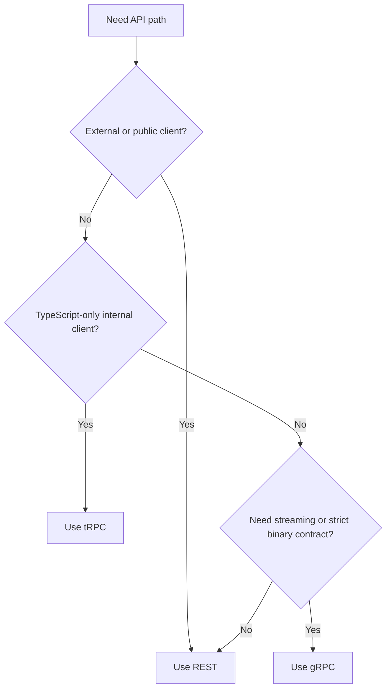
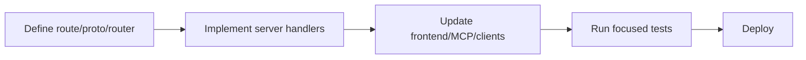

## Protocol selection

| Protocol | Best for                                          | Current implementation               |
| -------- | ------------------------------------------------- | ------------------------------------ |
| REST     | Public API, broad client compatibility            | Express routes under `/api/*`        |
| tRPC     | Type-safe TS clients                              | App router mounted at `/trpc`        |
| gRPC     | Service-to-service binary contracts and streaming | `MarketPulseService` on port `50051` |

## Protocol decision guide



## REST highlights

Mounted from `backend/src/server.ts`:

- `/api/auth`
- `/api/chat`
- `/api/conversations`
- `/api/properties`
- `/api/commute-profiles`
- `/api/graph`
- `/api/posts`
- `/api/comments`

## tRPC highlights

`backend/src/trpc/routers/index.ts` currently composes:

- `properties`
- `analytics`

Endpoint:

```txt
/trpc
```

## gRPC highlights

`grpc/proto/market_pulse.proto` defines:

- `GetSnapshot`
- `StreamHotZips`
- `ListMarkets`

Service package:

```txt
estatewise.marketpulse.MarketPulseService
```

## Contract lifecycle



## Quick protocol guidance

- Use REST for UI and external integrations.
- Use tRPC where end-to-end TypeScript types matter.
- Use gRPC for high-throughput internal service paths.
