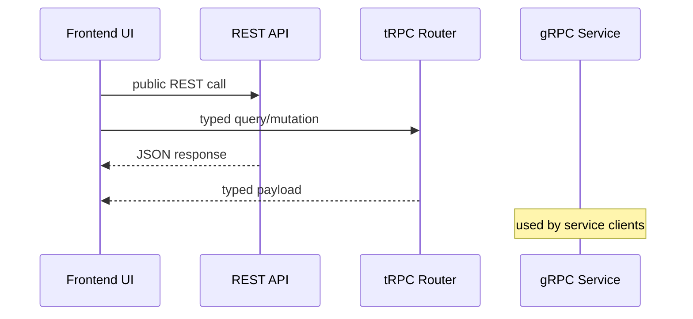
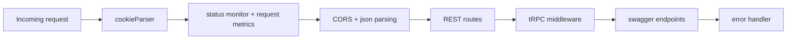

## High-level layout

## Request flow across protocols

## Middleware and route ordering model

## Architectural intent

- REST remains the broadest integration surface.
- tRPC provides type-safe internal integration for TypeScript clients.
- gRPC provides efficient contract-based service communication.
- AI and retrieval remain in backend service boundaries.

## Route and middleware realities

Backend route registration and middleware ordering are operationally important.
At runtime, key surfaces include:

- `/api/*` REST routes
- `/trpc` router
- `/swagger.json` and `/api-docs`
- `/metrics` and `/status`

<Tip>
  The root route redirects to `/api-docs` in the current backend server
  implementation.
</Tip>
