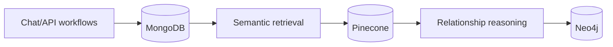
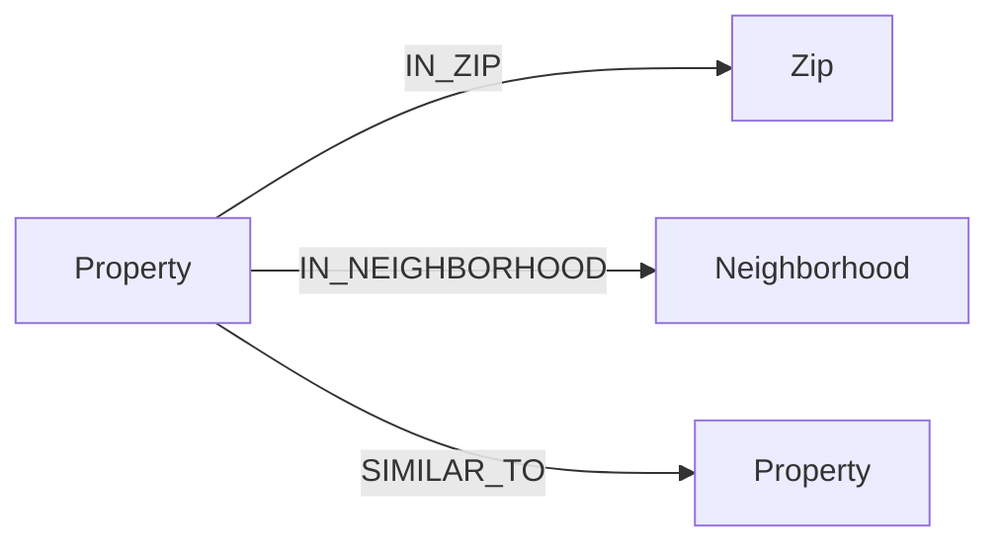

## Data plane overview

## MongoDB (operational records)

Primary concerns:

- Users and authentication state
- Conversations and messages
- Feedback and expert-weight context
- Forum posts/comments and commute profiles

## Pinecone (semantic retrieval)

Primary concerns:

- Embedded listing vectors
- Metadata used for retrieval and charting
- Similarity ranking for RAG context

Typical metadata fields:

- `zpid`
- `price`, `bedrooms`, `bathrooms`, `livingArea`, `yearBuilt`
- `address` object/string data
- listing descriptions and categorical attributes

## Neo4j (structural relationships)

Used when graph mode is enabled.

Node types:

- `Property`
- `Zip`
- `Neighborhood`

Relationships:

- `(:Property)-[:IN_ZIP]->(:Zip)`
- `(:Property)-[:IN_NEIGHBORHOOD]->(:Neighborhood)`
- optional similarity edges (`SIMILAR_TO`) depending on ingest and modeling strategy

## Graph schema visualization

## Why this split is effective

- MongoDB handles transactional and user-centric state.
- Pinecone handles semantic nearest-neighbor retrieval.
- Neo4j provides explainability and locality structure.

Together they support fast retrieval plus interpretable recommendation logic.
