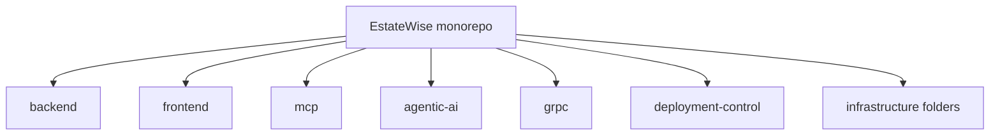
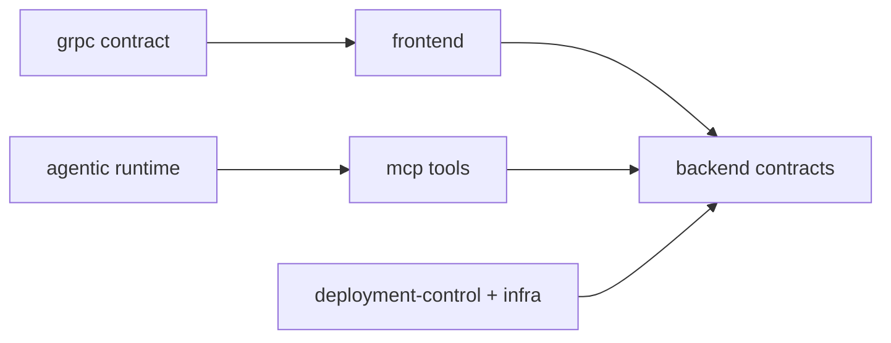

## Workspace topology

## Core workspaces

<CardGroup cols={2}>
  <Card title="backend/" icon="server">
    Express + TypeScript API, chat pipeline, graph integration, and scripts.
  </Card>
  <Card title="frontend/" icon="monitor">
    Next.js pages app and API client surface.
  </Card>
  <Card title="mcp/" icon="terminal-square">
    MCP stdio server with 60+ tools and token workflows.
  </Card>
  <Card title="agentic-ai/" icon="cpu">
    Multi-runtime orchestrator (default, LangGraph, CrewAI).
  </Card>
  <Card title="grpc/" icon="network">
    Market pulse gRPC service and protobuf contracts.
  </Card>
  <Card title="deployment-control/" icon="panel-top">
    Ops API + Nuxt UI for deployment workflows.
  </Card>
</CardGroup>

## Ownership interaction model

## Important entry points

- Backend: `backend/src/server.ts`
- Frontend client wrapper: `frontend/lib/api.ts`
- MCP server: `mcp/src/server.ts`
- Agentic CLI: `agentic-ai/src/index.ts`
- gRPC server: `grpc/src/server.ts`
- Deployment control API: `deployment-control/src/server.ts`

## Infrastructure and operations directories

- `kubernetes/`, `helm/`, `terraform/`
- `aws/`, `azure/`, `gcp/`, `oracle-cloud/`, `hashicorp/`
- `jenkins/`, `.github/workflows/`, `gitlab/`

<Tip>For command-level workflows by workspace, see `/reference/commands`.</Tip>
