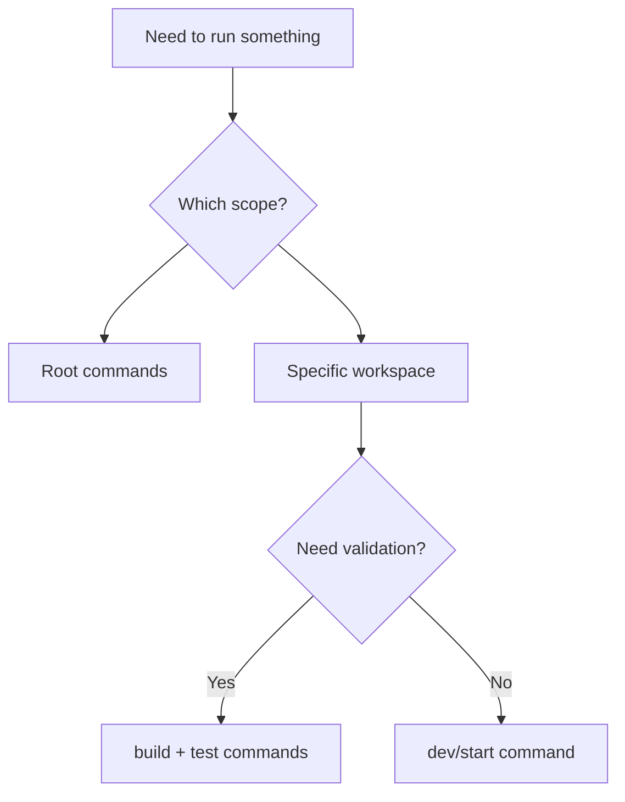
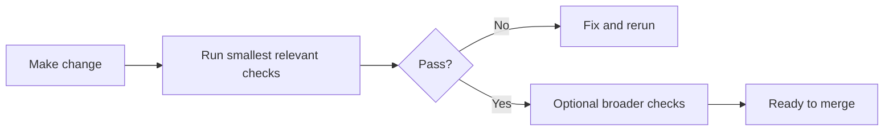

## Command selection flow



## Monorepo root

```bash
npm run dev        # frontend + backend
npm run frontend   # frontend only
npm run backend    # backend only
npm run format     # prettier write
npm run lint       # prettier check
```

## Backend (`backend/`)

```bash
npm start              # dev server (ts-node-dev)
npm run build          # compile TypeScript
npm run test           # jest in-band
npm run upsert         # upsert properties to Pinecone
npm run graph:ingest   # ingest graph data into Neo4j
npm run clean          # data cleanup script
```

## Frontend (`frontend/`)

```bash
npm run dev            # next dev --turbopack
npm run build
npm run start
npm run lint
npm run test
npm run cypress:run
npm run test:selenium
```

## MCP (`mcp/`)

```bash
npm run dev
npm run build
npm run start
npm run client:dev
npm run client:call -- properties.search '{"q":"Chapel Hill 3 bed","topK":5}'
```

## Agentic AI (`agentic-ai/`)

```bash
npm run dev "goal"
npm run dev:langgraph -- "goal"
npm run dev:crewai -- "goal"
npm run serve
npm run build
npm run start -- "goal"
```

## gRPC (`grpc/`)

```bash
npm run dev
npm run build
npm run start
npm run test
npm run proto:check
```

## Deployment control (`deployment-control/`)

```bash
npm run install:all
npm run dev
npm run dev:ui
npm run build
npm run build:api
npm run build:ui
```

## Validation cadence



<Tip>
  Use the smallest possible validation set for your change scope before
  expanding test coverage.
</Tip>
