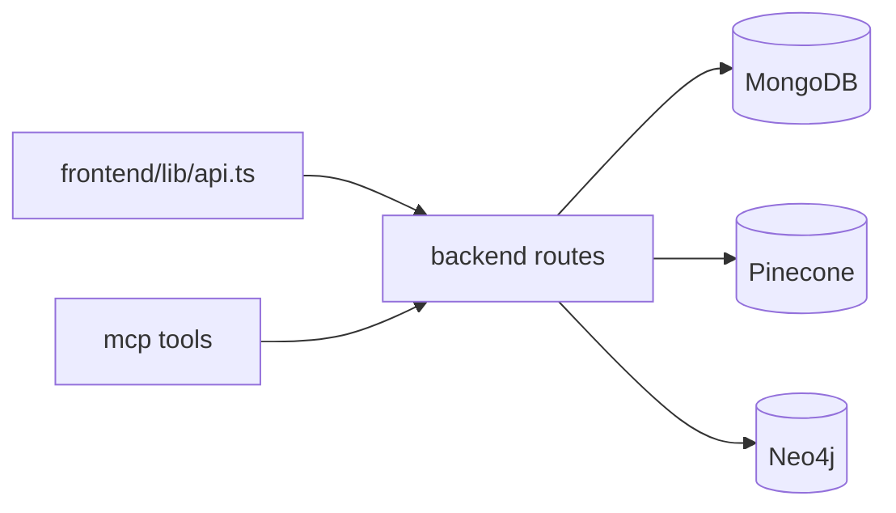

## Endpoint landscape

```mermaid
flowchart TB
  Client[Clients] --> REST[/api routes]
  Client --> TRPC[/trpc]
  Client --> GRPC[gRPC :50051]
  REST --> Ops[/metrics /status /api-docs]
```

## Backend operational endpoints

- `GET /metrics`
- `GET /status`
- `GET /swagger.json`
- `GET /api-docs`
- `GET /` (redirects to `/api-docs`)

## REST route inventory

### Auth (`/api/auth`)

- `POST /signup`
- `POST /login`
- `POST /logout`
- `POST /verify-email`
- `POST /reset-password`
- `GET /me`
- `PUT /me`
- `PUT /password`

### Chat (`/api/chat`)

- `POST /` (authenticated route)
- `POST /rate`
- `POST /generate-title`

### Conversations (`/api/conversations`)

- `POST /`
- `GET /`
- `GET /search?q=<query>`
- `PUT /:id`
- `DELETE /:id`
- `POST /:id/generate-name`

### Properties (`/api/properties`)

- `GET /?q=<query>&topK=<n>`
- `GET /by-ids?ids=123,456`
- `GET /lookup?...`

### Graph (`/api/graph`)

- `GET /similar/:zpid`
- `GET /explain?from=<zpid>&to=<zpid>`
- `GET /neighborhood/:name`

### Commute profiles (`/api/commute-profiles`)

- `POST /`
- `GET /`
- `GET /:id`
- `PUT /:id`
- `DELETE /:id`

### Forum posts (`/api/posts`)

- `POST /`
- `GET /`
- `GET /search`
- `GET /:id`
- `PUT /:id`
- `DELETE /:id`
- `POST /:id/upvote`
- `POST /:id/downvote`

### Comments (`/api/comments`)

- `POST /`
- `GET /post/:postId`
- `PUT /:id`
- `DELETE /:id`
- `POST /:id/upvote`
- `POST /:id/downvote`

## Request routing sketch



## tRPC endpoint

- `/trpc` (app router includes `properties` and `analytics` routers)

## gRPC service

Service: `estatewise.marketpulse.MarketPulseService`

- `GetSnapshot`
- `StreamHotZips`
- `ListMarkets`

<Warning>
  If Neo4j is disabled, graph endpoints can return `503` by design.
</Warning>
