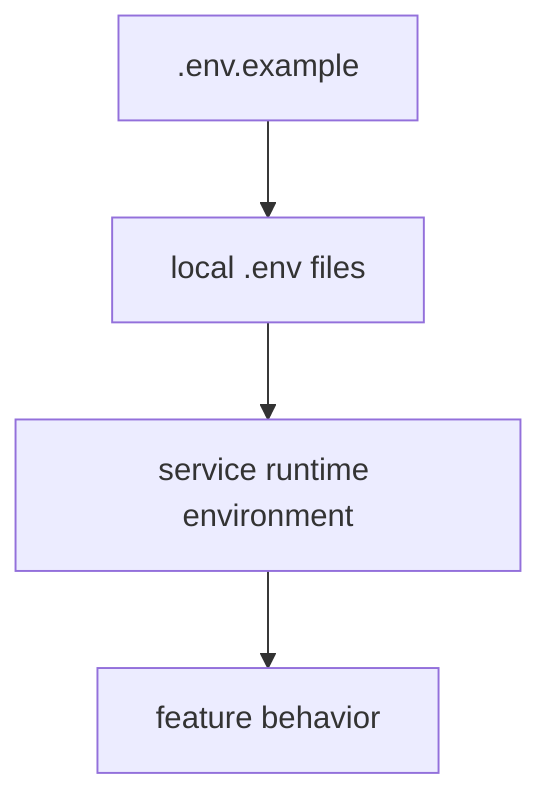
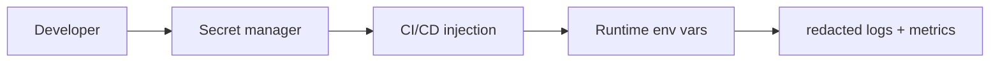

## Config precedence model

## Backend core

| Variable            | Required | Notes                          |
| ------------------- | -------- | ------------------------------ |
| `MONGO_URI`         | Yes      | MongoDB connection string      |
| `JWT_SECRET`        | Yes      | Auth token signing secret      |
| `GOOGLE_AI_API_KEY` | Yes      | Gemini and embedding workloads |
| `PINECONE_API_KEY`  | Yes      | Vector DB API key              |
| `PINECONE_INDEX`    | Yes      | Pinecone index name            |
| `PORT`              | Optional | Backend port                   |

## Graph and ingest

| Variable                 | Required | Notes                               |
| ------------------------ | -------- | ----------------------------------- |
| `NEO4J_ENABLE`           | Optional | Set `true` to enable graph features |
| `NEO4J_URI`              | Optional | Neo4j connection URI                |
| `NEO4J_USERNAME`         | Optional | Neo4j username                      |
| `NEO4J_PASSWORD`         | Optional | Neo4j password                      |
| `NEO4J_DATABASE`         | Optional | Neo4j DB name                       |
| `INGEST_LIMIT`           | Optional | Max records to ingest               |
| `PINECONE_PAGE_SIZE`     | Optional | Page size for ingest                |
| `INGEST_RESUME`          | Optional | Resume from checkpoint              |
| `INGEST_CHECKPOINT_FILE` | Optional | Checkpoint path override            |
| `NEO4J_RESET`            | Optional | Graph reset behavior                |
| `NEO4J_WRITE_RETRIES`    | Optional | Retry count                         |
| `PINECONE_NAMESPACE`     | Optional | Namespace selector                  |

## MCP

| Variable                   | Required                 | Notes                            |
| -------------------------- | ------------------------ | -------------------------------- |
| `API_BASE_URL`             | Yes                      | Backend API base URL             |
| `FRONTEND_BASE_URL`        | Optional                 | Frontend base URL for link tools |
| `MCP_CACHE_TTL_MS`         | Optional                 | Cache TTL                        |
| `MCP_CACHE_MAX`            | Optional                 | Max cache entries                |
| `MCP_DEBUG`                | Optional                 | Verbose logs                     |
| `MCP_TOKEN_SECRET`         | Required for token flows | Token signing secret             |
| `MCP_TOKEN_TTL_MS`         | Optional                 | Access token TTL                 |
| `MCP_REFRESH_TOKEN_TTL_MS` | Optional                 | Refresh token TTL                |

## Agentic AI runtime

| Variable                                | Required     | Notes                                    |
| --------------------------------------- | ------------ | ---------------------------------------- |
| `GOOGLE_AI_API_KEY` or `OPENAI_API_KEY` | One required | Model provider key                       |
| `AGENT_RUNTIME`                         | Optional     | `orchestrator`, `langgraph`, or `crewai` |
| `THREAD_ID`                             | Optional     | Runtime/session continuity               |

## Secret-management pathway

<Warning>
  Never store real production secrets in repository files or pull requests.
</Warning>
