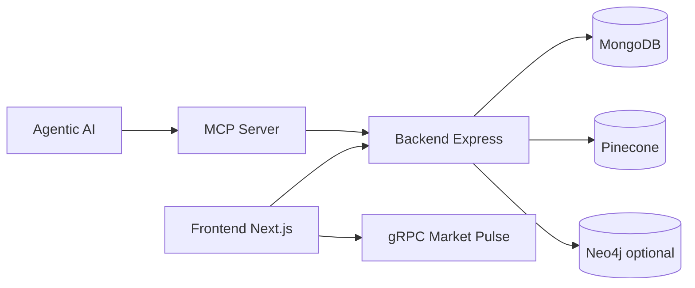
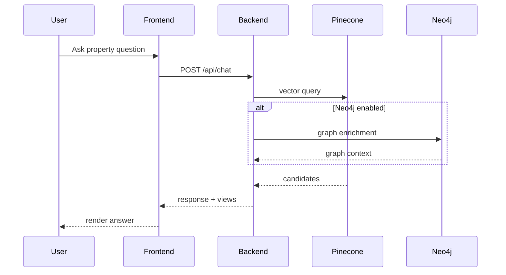
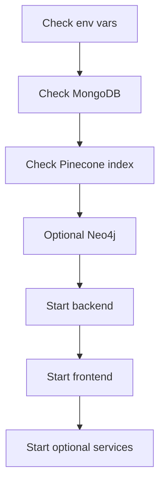

## Local topology



## Request lifecycle in local mode



## Service-by-service start commands

```bash
# root convenience
npm run dev

# backend only
npm run backend

# frontend only
npm run frontend
```

```bash
# MCP
cd mcp && npm run dev

# Agentic AI
cd agentic-ai && npm run dev "find 3-bed homes under 600k"

# gRPC
cd grpc && npm run dev

# Deployment control API and UI
cd deployment-control && npm run dev
cd deployment-control && npm run dev:ui
```

## Practical startup order

1. Database and vector/graph dependencies (MongoDB, Pinecone, optional Neo4j)
2. Backend API
3. Frontend
4. Optional services (MCP, Agentic AI, gRPC, deployment-control)

## Dependency check order



<Tip>
  For graph routes (`/api/graph/*`) to return meaningful data, Neo4j must be
  enabled and ingested.
</Tip>
