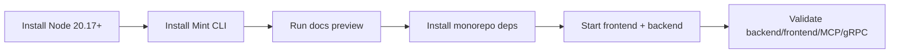
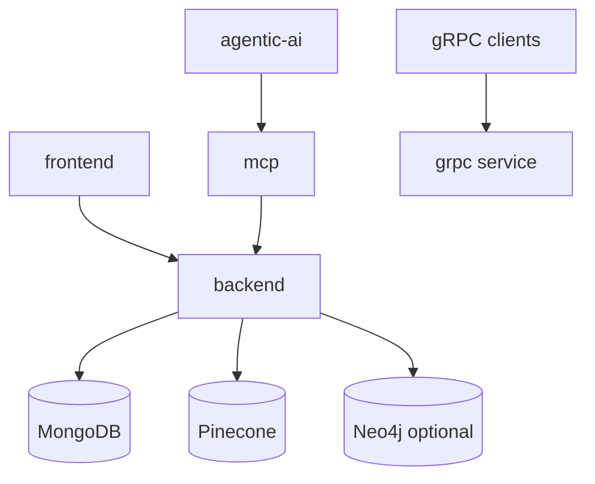

## End-to-end bootstrap flow



## 1) Run this Mintlify docs site

Mintlify requires Node.js 20.17.0+.

<Steps>
  <Step title="Install Mintlify CLI">
    <CodeGroup>

    ```bash npm theme={null}
    npm i -g mint
    ```

    ```bash pnpm theme={null}
    pnpm add -g mint
    ```

    </CodeGroup>

  </Step>

  <Step title="Preview docs locally">

```bash
cd mintlify-ai-docs
mint dev
```

Open `http://localhost:3000`.
If your frontend is already running on port `3000`, stop it before previewing docs.

  </Step>
</Steps>

## 2) Run EstateWise locally

<Steps>
  <Step title="Install monorepo dependencies">

```bash
npm install
cd backend && npm install
cd ../frontend && npm install
cd ../mcp && npm install
cd ../agentic-ai && npm install
cd ../grpc && npm install
cd ../deployment-control && npm run install:all
```

  </Step>

  <Step title="Start frontend and backend together">

```bash
cd /Users/davidnguyen/WebstormProjects/EstateWise-Chatbot
npm run dev
```

This runs:

<ul>
  <li>
    frontend on <code>http://localhost:3000</code>
  </li>
  <li>
    backend on <code>http://localhost:3001</code>
  </li>
</ul>

  </Step>
</Steps>

## 3) Validate the most important surfaces

```bash
# Backend
cd backend && npm run build && npm run test

# Frontend
cd ../frontend && npm run build && npm run test

# MCP
cd ../mcp && npm run build && npm run client:dev

# gRPC
cd ../grpc && npm run build && npm run test
```

## Runtime dependencies



<Warning>
  `cd mcp && npm run dev` appears idle until a client connects. That is expected
  behavior.
</Warning>
