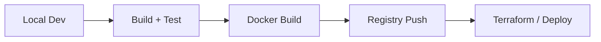

# Shell Utilities

Production-oriented helper scripts for development, CI, Docker builds, and Terraform workflows. These scripts are thin wrappers around npm, Docker, AWS CLI, and Terraform with consistent logging and safety checks.

## Workflow Overview



## Prerequisites

- Node.js + npm
- Docker (image build/push)
- Terraform (IaC workflows)
- AWS CLI v2 (ECR login/deploy)
- `concurrently` (optional; `run_local.sh` falls back to `npx`)

## Tooling Container (shell/Dockerfile)

Build a portable dev/CI toolbox image with Node, Terraform, AWS CLI, git, curl, jq, and build essentials:

```bash
docker build -t estatewise-tools -f shell/Dockerfile .

docker run --rm -it \
  -v "$(pwd)":/workspace \
  -w /workspace \
  -p 3000:3000 \
  -p 3001:3001 \
  estatewise-tools
```

## Script Catalog

Core:
- `doctor.sh` - validate local toolchain and repo layout.
- `bootstrap.sh` - install backend + frontend dependencies.
- `setup_backend.sh` - install/build/start backend in dev mode.
- `setup_frontend.sh` - install/build/start frontend in dev mode.
- `run_local.sh` - run backend + frontend concurrently.

Build/test/lint/format:
- `build_backend.sh`, `build_frontend.sh`, `build_all.sh`
- `test_backend.sh`, `test_frontend.sh`, `test_all.sh`
- `lint_frontend.sh`, `lint_all.sh`
- `format_backend.sh`, `format_frontend.sh`, `format_all.sh`

Docker:
- `docker_build_backend.sh`, `docker_build_frontend.sh`
- `docker_push_backend.sh`, `docker_push_frontend.sh`
- `docker_login.sh` (supports `REGISTRY_PROVIDER=ghcr|ecr|custom`)
- `build_images.sh`, `push_images.sh`

Terraform:
- `terraform_plan.sh`
- `terraform_apply.sh`
- `terraform_destroy.sh`

Utilities:
- `health_check.sh` - HTTP health probe against a URL.
- `Makefile` - convenience targets for common tasks.

## Environment Variables

Build and run:
- `SKIP_INSTALL=1`, `SKIP_BUILD=1` (setup scripts)
- `BACKEND_IMAGE`, `FRONTEND_IMAGE`
- `BACKEND_DOCKERFILE`, `FRONTEND_DOCKERFILE`
- `BACKEND_CONTEXT`, `FRONTEND_CONTEXT`

Docker auth:
- `REGISTRY_PROVIDER=ghcr|ecr|custom`
- `GITHUB_ACTOR`, `GH_TOKEN` (for GHCR)
- `AWS_REGION` (for ECR)
- `REGISTRY`, `REGISTRY_USER`, `REGISTRY_PASSWORD` (custom)
- `SKIP_DOCKER_LOGIN=1`

Terraform:
- `CONTAINER_IMAGE`
- `TF_VARS_FILE`
- `AUTO_APPROVE=1`

Health check:
- `HEALTHCHECK_URL`

## Common Workflows

Local dev:
```bash
bash shell/doctor.sh
bash shell/bootstrap.sh
bash shell/run_local.sh
```

Build/test:
```bash
bash shell/build_all.sh
bash shell/test_all.sh
```

Docker build/push:
```bash
BACKEND_IMAGE=ghcr.io/you/estatewise-backend:latest \
FRONTEND_IMAGE=ghcr.io/you/estatewise-frontend:latest \
  bash shell/build_images.sh

REGISTRY_PROVIDER=ghcr \
GITHUB_ACTOR=you \
GH_TOKEN=... \
BACKEND_IMAGE=ghcr.io/you/estatewise-backend:latest \
FRONTEND_IMAGE=ghcr.io/you/estatewise-frontend:latest \
  bash shell/push_images.sh
```

Terraform:
```bash
CONTAINER_IMAGE=123456789012.dkr.ecr.us-east-1.amazonaws.com/estatewise-backend:latest \
  bash shell/terraform_plan.sh
```

Health check:
```bash
HEALTHCHECK_URL=https://example.com/health bash shell/health_check.sh
```

## Notes

- `setup_backend.sh` and `setup_frontend.sh` support `SKIP_INSTALL=1` and `SKIP_BUILD=1`.
- `docker_login.sh` skips login when `REGISTRY_PROVIDER` is unset.
- `health_check.sh` expects a 200 response code.
- `deploy.sh` is a legacy all-in-one AWS script. Prefer Terraform + CI/CD for production.
