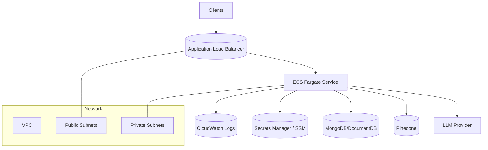

# Terraform (AWS ECS/Fargate Backend)

Production-grade AWS infrastructure for the EstateWise backend. This module provisions a VPC, ALB, ECS/Fargate, IAM roles, and optional ECR. It is designed for a single backend service with secure networking and autoscaling.

## Architecture



## Directory Layout

- `providers.tf` - Terraform and AWS provider configuration
- `variables.tf` - Input variables and defaults
- `locals.tf` - Derived values and env/secret mapping
- `data.tf` - AWS data sources
- `networking.tf` - VPC, subnets, IGW, NAT, routing
- `security.tf` - Security groups for ALB and ECS tasks
- `alb.tf` - ALB, listener, target group
- `logging.tf` - CloudWatch log group
- `iam.tf` - IAM roles and attachments
- `ecs-cluster-service.tf` - ECS cluster, task definition, service
- `autoscaling.tf` - ECS autoscaling policies
- `ecr.tf` - Optional ECR repo and lifecycle policy
- `outputs.tf` - Useful outputs

## Prerequisites

- Terraform >= 1.2
- AWS credentials configured (`aws configure` or env vars)
- Backend container image exposing port 3001 and `/health`

## Quick Start

```bash
cd terraform
terraform init
terraform plan -var 'container_image=123456789012.dkr.ecr.us-east-1.amazonaws.com/estatewise-backend:latest'
terraform apply -var 'container_image=123456789012.dkr.ecr.us-east-1.amazonaws.com/estatewise-backend:latest'
```

Destroy:

```bash
terraform destroy -var 'container_image=...'
```

## Run Terraform in Docker

```bash
docker build -t estatewise-terraform -f terraform/Dockerfile .

docker run --rm -it \
  -v "$(pwd)":/workspace \
  -v "$HOME/.aws":/home/terraform/.aws:ro \
  -w /workspace/terraform \
  estatewise-terraform init
```

## Key Variables

Core:
- `name_prefix` (default: `estatewise`)
- `aws_region` (default: `us-east-1`)
- `container_image` (required)
- `container_port` (default: `3001`)
- `health_check_path` (default: `/health`)
- `desired_count` (default: `2`)

Networking:
- `vpc_cidr` (default: `10.0.0.0/16`)
- `public_subnet_cidrs` / `private_subnet_cidrs`
- `enable_nat_gateway` / `single_nat_gateway`

ECS and scaling:
- `task_cpu` (default: `512`)
- `task_memory` (default: `1024`)
- `min_capacity` / `max_capacity`
- `cpu_target_utilization` / `memory_target_utilization`
- `enable_execute_command`

Logging and ALB:
- `log_retention_in_days` (default: `30`)
- `alb_idle_timeout` (default: `60`)
- `acm_certificate_arn` (set to enable HTTPS)

Runtime config:
- `environment` (map of env vars)
- `secrets` (map of env name to Secrets Manager or SSM ARN)

## Example terraform.tfvars

```hcl
name_prefix     = "estatewise"
aws_region      = "us-east-1"
container_image = "123456789012.dkr.ecr.us-east-1.amazonaws.com/estatewise-backend:latest"
min_capacity    = 2
max_capacity    = 6

environment = {
  NODE_ENV = "production"
}

# secrets = {
#   JWT_SECRET = "arn:aws:ssm:us-east-1:123456789012:parameter/estatewise/jwt"
# }
```

## Outputs

- VPC IDs and subnet IDs
- ECS cluster/service names
- Task definition ARN
- ALB DNS name and ARN
- ECR repo URL (optional)

## Operational Guidance

- **Remote state:** use S3 + DynamoDB for production teams.
- **HTTPS:** set `acm_certificate_arn` and configure DNS in Route53.
- **Secrets:** use Secrets Manager/SSM and scope IAM task role policies tightly.
- **Scaling:** tune `min_capacity`/`max_capacity` and CPU/memory targets.

## Limitations

- This module deploys the backend only (no frontend or database).
- Database provisioning and backups are out of scope.
